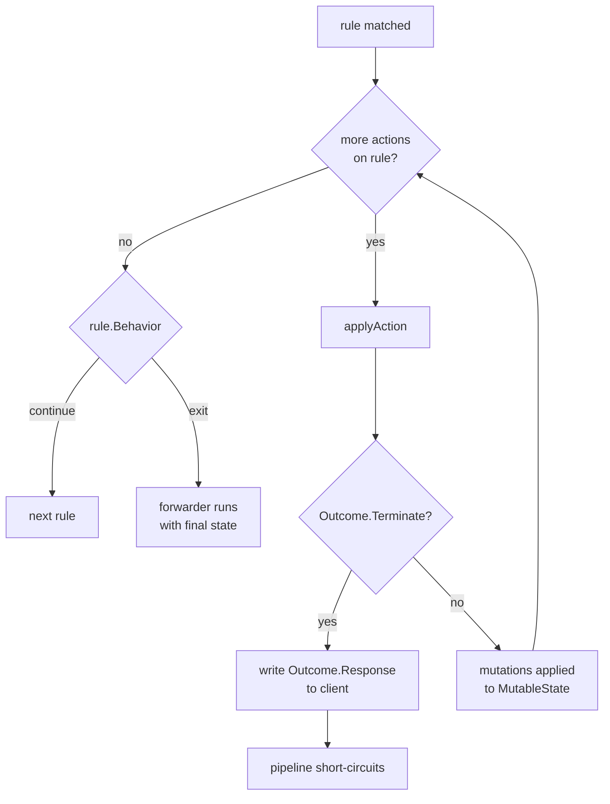
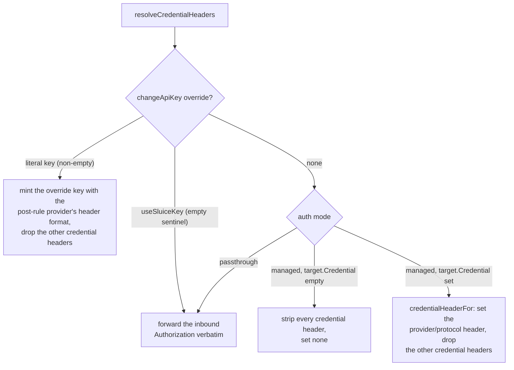
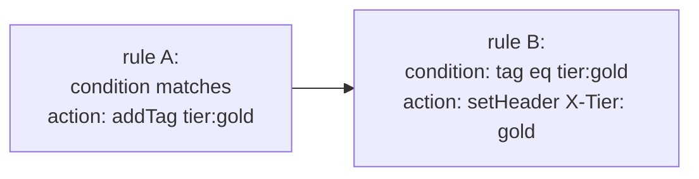

# Rule Actions

Conditions decide *which* rule fires. Actions decide *what happens* when one does. This page is the operator's reference for every action type the rules engine ships — what it mutates, when it short-circuits, and the gotchas that bite in production.

For the predicate side of the engine, see [`docs/rules.md`](rules.md). For the resilience orchestrator that consumes the `useResiliencePolicy` action, see [`docs/resilience.md`](resilience.md).

---

## Table of contents

1. [The action contract](#the-action-contract)
2. [Terminating vs non-terminating](#terminating-vs-non-terminating)
3. [What an action can mutate](#what-an-action-can-mutate)
4. [`changeProvider`](#changeprovider)
5. [`translate`](#translate)
6. [`changeModelName`](#changemodelname)
6. [`changeUrl`](#changeurl)
7. [`changeApiKey`](#changeapikey)
8. [`setHeader`](#setheader)
9. [`appendQueryString`](#appendquerystring)
10. [`addTag`](#addtag)
11. [`useResiliencePolicy`](#useresiliencepolicy)
12. [`rewriteField` / `removeField` / `appendField`](#rewritefield--removefield--appendfield)
13. [`returnStatusCode`](#returnstatuscode)
14. [`llmImpersonation`](#llmimpersonation)
15. [Unknown action discriminators](#unknown-action-discriminators)
16. [Cross-references](#cross-references)

---

## The action contract

Every action implements the `rules.Action` interface in [`contracts/rules/action.go`](../contracts/rules/action.go):

```go
type Action interface {
    ActionType() string
    isAction()
}
```

`ActionType()` returns the polymorphic discriminator carried on the wire — the `type:` key the YAML loader and JSON unmarshaller dispatch on. The unexported `isAction()` is a sealing method: only types declared in `contracts/rules` can satisfy the interface, which keeps third-party packages from accidentally introducing wire-incompatible action types.

Every concrete action embeds `models.DynamicProperties` and routes its `UnmarshalJSON` through `models.UnmarshalDynamic`, so unknown wire fields round-trip via `DynamicProperties.Extra`. Combined with the `UnknownAction` fallback (see [Unknown action discriminators](#unknown-action-discriminators)), an action authored against a future control-plane build round-trips through the loader without truncation even if this gateway version doesn't model the new shape.

### Polymorphic dispatch

The action registry lives at the bottom of `action.go`:

```go
var actionRegistry = models.PolymorphicRegistry[Action]{
    DiscriminatorField: "type",
    Factories: map[string]func() Action{
        "changeProvider":      ...,
        "changeModelName":     ...,
        "changeUrl":           ...,
        "changeApiKey":        ...,
        "setHeader":           ...,
        "appendQueryString":   ...,
        "returnStatusCode":    ...,
        "llmImpersonation":    ...,
        "addTag":              ...,
        "useResiliencePolicy": ...,
    },
    Fallback: func(disc string) Action { return &UnknownAction{Type: disc} },
}
```

Both `UnmarshalAction` (JSON) and `DecodeActionYAMLNode` (YAML) dispatch through this registry. The YAML path is exported because [`contracts/resilience`](../contracts/resilience) reuses it to decode `targets[*].actions` without duplicating the type switch.

### Apply dispatch

The runtime side lives in [`internal/middleware/rules/actions.go`](../internal/middleware/rules/actions.go). `ApplyAction` is the public entry point; both the rules middleware and the v1.2 resilience orchestrator call it. It dispatches on the concrete pointer type via a type switch and returns an `Outcome`:

```go
type Outcome struct {
    Terminate bool
    Response  *Response
}
```

`Terminate=true` short-circuits the pipeline. `Response`, when non-nil, is the synthetic response the rules middleware writes to the client in lieu of forwarding upstream. Non-terminating actions return a zero `Outcome`.

---

## Terminating vs non-terminating

| Action | Terminating? | Discriminator |
|---|---|---|
| `changeProvider` | no | `changeProvider` |
| `translate` | no | `translate` |
| `changeModelName` | no | `changeModelName` |
| `changeUrl` | no | `changeUrl` |
| `changeApiKey` | no | `changeApiKey` |
| `setHeader` | no | `setHeader` |
| `appendQueryString` | no | `appendQueryString` |
| `addTag` | no | `addTag` |
| `useResiliencePolicy` | no | `useResiliencePolicy` |
| `rewriteField` | no | `rewriteField` |
| `removeField` | no | `removeField` |
| `appendField` | no | `appendField` |
| `returnStatusCode` | **yes** | `returnStatusCode` |
| `llmImpersonation` | **yes** | `llmImpersonation` |

A terminating action returns an `Outcome` with `Terminate=true` and a populated `Response`. The rules evaluator drops the synthetic response into the per-request context, breaks out of the per-rule action loop, breaks out of the per-configuration rule loop, and the middleware writes the response to the client. The forwarder never runs.

Non-terminating actions accumulate mutations into `MutableState`. Multiple non-terminating actions in the same rule chain compose: a `changeProvider` followed by a `setHeader` followed by an `addTag` all land on the same `MutableState`, in declaration order.



`rule.Behavior` only governs whether *the next rule* runs; it does not override termination. A terminating action always short-circuits, regardless of `Behavior: continue` or `Behavior: exit` on its owning rule.

---

## What an action can mutate

Actions write through a [`rules.MutableState`](../internal/middleware/rules/state.go) handle. This is the entire surface — anything not on `MutableState` cannot be reached from an action.

| Field | Type | Written by | Consumed by the v2 data plane? |
|---|---|---|---|
| `Provider` | `string` | `changeProvider` | **No (overwritten).** Read at [`handler.go`](../cmd/gateway/handler.go) line 102, but the resilience orchestrator rewrites it per attempt after rules run — see [`changeProvider`](#changeprovider). |
| `Protocol` | `string` | `translate` | **Yes (wired).** Overwritten with the target protocol; the final handler resolves the upstream endpoint on it — see [`translate`](#translate). |
| `SourceProtocol` | `string` | `translate` | **Yes (wired).** Records the inbound protocol so the response leg translates back — see [`translate`](#translate). |
| `UpstreamURL` | `*url.URL` | `changeUrl` | **No (inert).** `buildDestination` sets `dest.UpstreamURL` from the resolved target; `applyStateOverlays` never reads this field — see [`changeUrl`](#changeurl). |
| `UpstreamCredentialOverride` | `*string` | `changeApiKey` | **Yes (wired).** Read by `resolveCredentialHeaders` ([`cmd/gateway/destination.go`](../cmd/gateway/destination.go) line 169), the single credential mint site, which honours it over the auth mode: a literal key is minted with the post-rule provider's header format, the `useSluiceKey` sentinel (empty string) forwards the inbound `Authorization` verbatim — see [`changeApiKey`](#changeapikey). |
| `OutgoingHeaders` | `http.Header` | `setHeader` | Yes — layered onto the destination by `applyStateOverlays` ([`cmd/gateway/pipeline.go`](../cmd/gateway/pipeline.go) lines 278-283). |
| `QueryAdditions` | `[]QueryAddition` | `appendQueryString` | Yes — layered onto `dest.UpstreamURL` by `applyStateOverlays` (pipeline.go lines 271-277). |
| `PathParams` | `map[string]string` | `changeModelName` (writes `"model"` key) | Yes — drives Gemini `{model}` path substitution and the outbound-model telemetry label. |
| `BodyMutated` | `bool` | `changeModelName` (signals re-marshal) | Yes — read by `BodyRemarshalHandler`. |
| `Tags` | `[]string` | `addTag` | Yes — drained onto the connector `Record`, the live-feed `Entry`, and `gateway.tags.applied.total`. |
| `PolicyRef` | `string` | `useResiliencePolicy` | **No (inert).** The v2 selection middleware seeds `PolicyRef` from the chosen binding's synthesised policy and stashes the `ResilienceConfig` on context; the orchestrator reads that, the data plane wires the name lookup to `nil`, and the reported `PolicyRef` comes from the binding's policy name, not `state.PolicyRef`. A rule-authored write is ignored — see [`useResiliencePolicy`](#useresiliencepolicy). |
| `BodyRewrites` / `ResponseRewrites` | `[]bodypatch.Op` | `rewriteField`, `removeField`, `appendField` | Yes — request ops applied post-rule by `BodyRewriteHandler`, response ops by the proxy's `ModifyResponse` hook. |

> **v2 routing note (load-bearing).** Under v2 the *destination* — provider, upstream URL, and credential header — is resolved from the configuration's **bindings** by `selectionMiddleware` *before* rules run, and finalised by `buildDestination` in [`cmd/gateway/destination.go`](../cmd/gateway/destination.go) from the selected `selection.Target`. There is no provider/endpoint lookup table; routing stays in bindings. Three state-mutating actions still parse, validate, and round-trip — they are authorable and registered in [`contracts/rules/action.go`](../contracts/rules/action.go) — but the v2 data plane does not consult the state fields they write, so they are **inert**: `changeUrl` is written-but-never-read; `useResiliencePolicy` is ignored in favour of the binding-derived policy on context (and the data plane wires the name lookup to `nil`); `changeProvider` is **overwritten** per attempt by the orchestrator's binding-derived provider switch before the final handler reads `state.Provider`. The remaining actions (`changeApiKey`, `setHeader`, `appendQueryString`, `changeModelName`, `addTag`, the body-rewrite trio, and the two terminating actions) are fully wired — `changeApiKey`'s `state.UpstreamCredentialOverride` is now honoured at the single credential mint site (`resolveCredentialHeaders`, destination.go line 169), and `changeModelName` survives as the orchestrator's internal alias-rewrite primitive, so a binding/group `alias` is the last writer of the body model. Each affected section below carries the specifics. The remaining inert writes are tracked as code follow-ups; the route to a different provider/URL/policy in v2 is a binding edit, not a rule (the upstream credential, by contrast, *can* now be overridden by `changeApiKey`).

Two complementary side channels exist:

- **The typed request body** lives on `bodycapture.Captured.Body`, not on `MutableState` directly. `changeModelName` reaches it via the second argument to `ApplyAction`. When the action mutates the typed body, it also sets `state.BodyMutated = true`; the `BodyRemarshalHandler` middleware (next in the chain) re-encodes the typed body to bytes and replaces `r.Body` before the forwarder runs.

- **The synthetic response** flows through `Outcome.Response`, not through `MutableState`. Terminating actions return it; the middleware turns it into a real HTTP response.

---

## `changeProvider`

Writes `state.Provider`. Non-terminating.

> **v2 status — superseded by bindings; the rule-authored write is overwritten.** Provider selection moved to the binding/selection layer in v2. `selectionMiddleware` ([`cmd/gateway/pipeline.go`](../cmd/gateway/pipeline.go)) walks the configuration's bindings to pick the provider (or resilience group) *before* rules run, then synthesises a resilience config whose per-attempt `Actions` switch `state.Provider` to the chosen provider. That synthesis runs through the orchestrator's `buildAttemptState` ([`internal/middleware/resilience/middleware.go`](../internal/middleware/resilience/middleware.go) line 683), which clones the post-rule state and applies the binding's provider switch onto the clone — *after* rule evaluation. The final handler then reads `state.Provider` from that clone ([`cmd/gateway/handler.go`](../cmd/gateway/handler.go) line 102). So a rule-authored `changeProvider` write is overwritten by the orchestrator before it reaches the destination builder, and the action does not change where the request lands. It still parses, validates, and round-trips (registered in [`contracts/rules/action.go`](../contracts/rules/action.go)). To route a model to a different provider in v2, author a binding — see [`docs/providers.md`](providers.md).

### YAML

```yaml
- type: changeProvider
  newProvider: anthropic
```

### Fields

| Field | YAML | JSON | Required | Notes |
|---|---|---|---|---|
| `Type` | `type` | `type` | yes | Discriminator; must be `changeProvider`. |
| `NewProvider` | `newProvider` | `new_provider` | yes | Provider name. Trimmed; empty rejected at evaluate time. |

### What it mutates

- `state.Provider` = trimmed `NewProvider` (see `applyChangeProvider` in [`internal/middleware/rules/actions.go`](../internal/middleware/rules/actions.go) line 91). In the v2 data plane this write is overwritten per attempt by the orchestrator's binding-derived provider switch, as described above.

### How v2 resolves the destination instead

The destination builder is the single credential and transport mint site in v2 ([`buildDestination` in `cmd/gateway/destination.go`](../cmd/gateway/destination.go)). It reads the provider's base URL, protocol path, per-protocol auth convention, default query, and the configuration's credential straight off the resolved `selection.Target` — there is no provider/endpoint lookup table and no `changeProvider`/`changeUrl` override applied at this stage. The post-rule `changeApiKey` override *is* applied here when set: `resolveCredentialHeaders` (destination.go line 169) honours `state.UpstreamCredentialOverride` over the auth mode, and `credentialHeaderFor` (destination.go line 220) formats the header once — both at this single mint site, honouring [`CLAUDE.md`](../CLAUDE.md) invariant 6 (one mint site per provider/protocol).

The model-keyed redirect pattern (a `claude-*` model posted to an OpenAI-compat path landing on Anthropic) is therefore expressed as a binding from the OpenAI `chat` protocol to the `anthropic` provider, not as a rule. The internal `changeProvider`/`changeModelName` pair survives only as the orchestrator's selection primitive (`providerSwitchActions` in destination.go line 71) — "no longer authorable in rules" for routing purposes, in the words of that function's godoc.

> **⚠️ Invariant #7 tension (tracked as a code follow-up).** [`CLAUDE.md`](../CLAUDE.md) invariant #7 states "`changeProvider` re-resolves the endpoint on the new provider … The destination builder reads `state.Provider` post-rule and looks up the endpoint map on that provider." That contract no longer holds for a **rule-authored** `changeProvider` in v2: (a) `buildDestination` does not read `state.Provider` at all — the *final handler* does, then resolves via `selection.ResolveTarget`; and (b) the orchestrator overwrites `state.Provider` from the binding-derived target before the final handler runs, so a rule's write is discarded. The invariant's mechanism survives only for the orchestrator's *internal* `providerSwitchActions`, not for rule authors. The invariant text and/or the action's authorability should be reconciled — see the code follow-ups accompanying this doc.

### Gotchas

- Do not reach for `changeProvider` to redirect a request — it is inert for routing in v2. Use a binding.
- Cross-provider failover is configured as a resilience **group** binding (multiple targets), not as a rule pairing `changeProvider` with `changeModelName`. See [resilience.md](resilience.md) for the per-target form.

---

## `translate`

Marks the request for **cross-provider protocol translation**. Non-terminating. Writes `state.SourceProtocol` (the inbound protocol, recorded once) and overwrites `state.Protocol` with the target. Implemented in `internal/translate/`; see the "Cross-Provider Translation" design note.

An inbound request in one protocol (e.g. Anthropic Messages on `/v1/messages`) is rewritten to `targetProtocol` on the way upstream and the upstream response is translated back on the way out. Orthogonal to and composable with `changeProvider`: `translate` alone re-dialects on the same provider (a multi-protocol backend), `changeProvider` alone moves provider at the same dialect, and the two together move *and* translate.

Shipped pair (v1.2): `messages` → `chat` (Anthropic Messages ↔ OpenAI Chat), non-streaming, streaming, tool calls, and error responses. Other pairs are registry-ready but unimplemented; an undeclared/unsupported pair **fails closed** (501), never silently forwarded.

### YAML

```yaml
- type: translate
  targetProtocol: chat
```

### Fields

| Field | YAML | JSON | Required | Notes |
|---|---|---|---|---|
| `Type` | `type` | `type` | yes | Discriminator; must be `translate`. |
| `TargetProtocol` | `targetProtocol` | `target_protocol` | yes | Upstream wire protocol to translate into (e.g. `chat`). Trimmed; empty rejected at config load. Provider-serves-protocol + translator-registered are validated fail-closed at destination resolution. |

### What it mutates

- `state.SourceProtocol` = the inbound protocol, recorded the first time `translate` runs (so the response leg knows what to translate back into).
- `state.Protocol` = `TargetProtocol`, so the destination builder resolves the upstream endpoint on the target protocol (invariant #7's spirit — re-resolve on post-rule state). See `applyTranslate` in [`internal/middleware/rules/actions.go`](../internal/middleware/rules/actions.go).

### How the data plane translates

The final handler resolves the endpoint on `state.Protocol`, fails closed (501) if no translator is registered for the `(source, target)` pair, then translates the outgoing request body (per resilience attempt). The forwarder's `ModifyResponse` hook translates the response — non-streaming bodies buffered, streaming bodies wrapped in a pull-based translating reader, and error responses (`>= 400`) mapped to the source protocol's error shape. Features with no target equivalent (e.g. `top_k`, `thinking`) are dropped, counted on `gateway.translation.field_drops.total`, and — when `SLUICE_TRANSLATE_LOSSY_HEADER` is on — listed on the `X-Sluice-Translation-Lossy` response header.

### Gotchas

- Translation is never inferred — a multi-protocol backend makes inference ambiguous, so it must be declared with this action. A protocol mismatch with no `translate` fails closed.
- Streaming translation requires a stream-capable translator; non-stream-capable pairs reject a streaming request with 501.
- Deferred (post-MVP): Gemini, mixed-protocol resilience groups, base-config auto-mapping.

---

## `changeModelName`

Rewrites the model name in the typed request body. Non-terminating.

### YAML

```yaml
- type: changeModelName
  newModelName: gpt-4o-mini
```

### Fields

| Field | YAML | JSON | Required | Notes |
|---|---|---|---|---|
| `Type` | `type` | `type` | yes | Discriminator; must be `changeModelName`. |
| `NewModelName` | `newModelName` | `new_model_name` | yes | Replacement model identifier. Trimmed; empty rejected at evaluate time. |

### What it mutates

The action type-switches on the typed body and writes the `Model` field directly:

| Body type | Write target |
|---|---|
| `openai/chat.ChatCompletionRequest` | `b.Model = newName` |
| `openai/responses.ResponsesRequest` | `b.Model = newName` |
| `anthropic/messages.MessagesRequest` | `b.Model = newName` |
| `gemini/content.GenerateContentRequest` | body has no `model` field; mutation is path-only |
| `nil` (passthrough route, no typed body captured) | no body write; path-only |
| any other concrete type | returns `ErrUnknownModelField` |

In every case it also writes `state.PathParams["model"] = newName` (creating the map if nil) so the path template re-renders consistently — this is how Gemini's `{model}` path placeholder gets the new value.

After mutating the body it sets `state.BodyMutated = true`. The `BodyRemarshalHandler` middleware reads this flag, calls `bodycapture.RemarshalTyped` to re-encode the typed body via its `MarshalJSON` (which preserves `DynamicProperties.Extra`), and replaces `r.Body` and `Content-Length` on the outgoing request before the forwarder runs.

### Special behaviour

- **Gemini has no body-level `Model`.** The mutation is purely a `PathParams` update; the destination builder substitutes `{model}` in the path template at URL-render time.
- **Passthrough routes have no typed body.** `body=nil` is tolerated — the action updates `PathParams` and `BodyMutated` (the latter is harmless: the re-marshal handler skips when `RemarshalTyped` returns `nil`).
- **Body restoration across attempts is currently leaky.** In multi-attempt resilience scenarios, attempt 1's body mutation persists into attempt 2 because the typed body is shared. See [resilience.md — Known limitations](resilience.md#known-limitations) item 1.

### Worked example — collapse model variants onto a single upstream model

```yaml
rules:
  - name: collapse-gpt4-variants
    condition:
      type: modelName
      operator: StartsWith
      expectedModelName: gpt-4-turbo
    actions:
      - type: changeModelName
        newModelName: gpt-4o
```

Every inbound `gpt-4-turbo*` model name is rewritten to `gpt-4o` before the request leaves the gateway. The client's tracking is unaffected (correlation IDs are unchanged); the upstream sees a single canonical model.

### Gotchas

- An empty `newModelName` after trimming returns `errEmptyValue` at evaluate time — the rule's `events.RuleMatched` payload carries the error message and `gateway.rule.errors.total{error_kind="action_apply"}` increments.
- For body types this build doesn't model (control-plane-minted future shapes), the action returns `ErrUnknownModelField` rather than silently no-op'ing — operators see the failure in the rule-error metric instead of debugging a "why didn't my rule fire" mystery.

---

## `changeUrl`

Writes `state.UpstreamURL`. Non-terminating.

> **v2 status — currently inert.** `applyChangeUrl` ([`internal/middleware/rules/actions.go`](../internal/middleware/rules/actions.go) line 141) parses `newUrl` and stores it on `state.UpstreamURL`, but **nothing in the v2 data plane reads that field.** `buildDestination` builds `dest.UpstreamURL` from the resolved `selection.Target` ([`cmd/gateway/destination.go`](../cmd/gateway/destination.go) lines 107-114), and the only post-rule overlay step — `applyStateOverlays` ([`cmd/gateway/pipeline.go`](../cmd/gateway/pipeline.go) lines 270-284) — touches only `QueryAdditions` and `OutgoingHeaders`. `state.UpstreamURL` is written, cloned, and never consulted. The action still parses, validates, and round-trips. Tracked as a code follow-up. To pin a region or override the host in v2, set the provider's base URL in `providers.yaml`.

### YAML

```yaml
- type: changeUrl
  newUrl: https://eu-west-1.openai.example.com
```

### Fields

| Field | YAML | JSON | Required | Notes |
|---|---|---|---|---|
| `Type` | `type` | `type` | yes | Discriminator; must be `changeUrl`. |
| `NewURL` | `newUrl` | `new_url` | yes | Replacement URL. Parsed via `url.Parse`; parse failure returns an error at evaluate time. |

### What it mutates

- `state.UpstreamURL` = `url.Parse(NewURL)` — written but not read by the v2 destination builder (see the status note above).

### Gotchas

- The action is inert in v2; do not author rules that rely on it. Per-region routing is a provider-level base-URL change.
- Parse failures are still loud — a malformed `newUrl` returns an error at evaluate time and the rule's match record carries the parse error, even though a well-formed URL has no downstream effect.

---

## `changeApiKey`

Writes `state.UpstreamCredentialOverride`. Substitutes the upstream API key, or signals "forward the inbound Sluice bearer verbatim" for passthrough scenarios. Non-terminating.

> **v2 status — wired.** `applyChangeApiKey` ([`internal/middleware/rules/actions.go`](../internal/middleware/rules/actions.go) lines 154-169) writes `state.UpstreamCredentialOverride` (a non-empty pointer for a literal key, or a pointer to the empty string as the "forward inbound bearer" sentinel), and the v2 data plane now **reads it**. Credential selection runs through `resolveCredentialHeaders` ([`cmd/gateway/destination.go`](../cmd/gateway/destination.go) line 169), the single credential mint site, which `buildDestination` threads `state.UpstreamCredentialOverride` into. The override takes precedence over the auth `Mode` (rules win the last word on the wire): a non-empty literal is minted with the **post-rule** provider's header format and every other credential header is dropped; the empty-string `useSluiceKey` sentinel forwards the inbound `Authorization` verbatim. Because the orchestrator clones the post-rule state into each attempt, the override carries across resilience attempts. Minting stays at the one site, honouring [`CLAUDE.md`](../CLAUDE.md) invariant 6.

### YAML

```yaml
# managed substitution
- type: changeApiKey
  apiKey: sk-upstream-regional

# passthrough — forward whatever Authorization header the client sent
- type: changeApiKey
  useSluiceKey: true
```

### Fields

| Field | YAML | JSON | Required | Notes |
|---|---|---|---|---|
| `Type` | `type` | `type` | yes | Discriminator; must be `changeApiKey`. |
| `APIKey` | `apiKey` | `api_key` | conditional | Literal upstream key substituted on the way out. Required unless `UseSluiceKey` is true; trimmed empty value is rejected. Ignored when `UseSluiceKey` is true. |
| `UseSluiceKey` | `useSluiceKey` | `use_sluice_key` | no | When `true`, forwards the inbound `Authorization` header verbatim. Used for passthrough auth flows. |

### What it mutates

- `state.UpstreamCredentialOverride` = `&trimmedAPIKey` when `UseSluiceKey=false`.
- `state.UpstreamCredentialOverride` = `&""` (a pointer to the empty string) when `UseSluiceKey=true`.

Both writes are read in v2 (see the status note above) — `buildDestination` threads the override into the single mint site.

### How v2 resolves the credential

Credential selection is the precedence `switch` in `resolveCredentialHeaders` ([`cmd/gateway/destination.go`](../cmd/gateway/destination.go) line 169), into which `buildDestination` threads the post-rule `state.UpstreamCredentialOverride`. The `changeApiKey` override is checked **before** the auth `Mode`, so a rule wins the last word on the wire. When a credential is minted, the `(header, value)` is formatted by `credentialHeaderFor` (destination.go line 220): the target's per-protocol auth convention (`target.Auth.Header` / `target.Auth.Format`) when present, falling back to the per-provider-name default in `auth.UpstreamCredentialHeader`. This is the single mint site that honours [`CLAUDE.md`](../CLAUDE.md) invariant 6.



The same `resolveCredentialHeaders` mint site is reused for passthrough-family requests in `buildPassthroughDestination` ([`cmd/gateway/pipeline.go`](../cmd/gateway/pipeline.go) line 241), so a `changeApiKey` override applies there too.

### Gotchas

- A literal `apiKey` override is minted with the **post-rule** provider's header convention, not the inbound one — a `changeApiKey` paired with a binding that lands on Anthropic mints `x-api-key`, not `Authorization: Bearer`.
- `useSluiceKey: true` forwards the inbound `Authorization` even on a managed configuration — use it to thread a client-supplied upstream token through a config that would otherwise mint its own credential.
- Sluice does not redact upstream keys in YAML it loads; treat the YAML file as secret material. Mount from a k8s Secret, never check it in.

---

## `setHeader`

Mutates an outgoing HTTP header on the upstream request. Non-terminating.

### YAML

```yaml
- type: setHeader
  headerName: X-Routing-Tier
  headerAction: Set
  headerValue: priority
```

### Fields

| Field | YAML | JSON | Required | Notes |
|---|---|---|---|---|
| `Type` | `type` | `type` | yes | Discriminator; must be `setHeader`. |
| `HeaderName` | `headerName` | `header_name` | yes | Header to modify. Trimmed; empty rejected. |
| `HeaderAction` | `headerAction` | `header_action` | yes | One of `Set`, `Append`, `Prepend`, `Remove`. |
| `HeaderValue` | `headerValue` | `header_value` | conditional | Required for `Set`, `Append`, `Prepend`. Ignored for `Remove`. |

### What it mutates

- `state.OutgoingHeaders[HeaderName]` per `HeaderAction`:

| Op | Behaviour when header is missing | Behaviour when header is present |
|---|---|---|
| `Set` | Sets to `HeaderValue`. | Replaces existing value with `HeaderValue`. |
| `Remove` | No-op. | Deletes the header entirely. |
| `Append` | Sets to `HeaderValue` (symmetric with `Set`). | Sets to `existing + ", " + HeaderValue`. |
| `Prepend` | Sets to `HeaderValue` (symmetric with `Set`). | Sets to `HeaderValue + ", " + existing`. |

### Special behaviour

- **Multi-value concatenation uses `", "` (comma + space).** RFC 7230 §3.2.2 specifies comma as the list separator for multi-value headers when serialised to the wire. The .NET predecessor concatenated without a separator (so `"a" + "b" = "ab"`), which is a deliberate divergence — the comma form is the standards-compliant one.
- **Append/Prepend create the header when missing.** The .NET behaviour of "silently no-op on Append-to-missing" was a footgun; Sluice creates the header instead so the action's intent always lands.
- **Rules win the last word on the wire.** `buildDestination` seeds the destination's headers first — the provider's required headers (e.g. `anthropic-version`) and the resolved credential header — and `applyStateOverlays` ([`cmd/gateway/pipeline.go`](../cmd/gateway/pipeline.go) lines 278-283) then overlays `state.OutgoingHeaders` last, deleting and re-adding each named header. A `setHeader` therefore overrides a provider-required header (or even the credential header) of the same name. Use that deliberately; an accidental `setHeader Authorization: …` will clobber the minted credential for the request.

### Worked example — propagate a tenant tier downstream

```yaml
rules:
  - name: tag-enterprise-requests
    condition:
      type: header
      keyOperator: Equals
      keyPattern: X-Tenant-Tier
      valueOperator: Equals
      valuePattern: enterprise
    actions:
      - type: setHeader
        headerName: X-Upstream-Priority
        headerAction: Set
        headerValue: high
```

The upstream provider (or an intermediate proxy) sees `X-Upstream-Priority: high` and can route accordingly.

### Gotchas

- An unknown `HeaderAction` value (typo, future operator) returns an error at evaluate time — case matters: the constants are `Set`, `Append`, `Prepend`, `Remove`, not lowercase.
- `Remove` on a missing header is a no-op rather than an error; this is deliberate — a rule that defensively strips a header shouldn't fail when the header wasn't there to begin with.

---

## `appendQueryString`

Appends a query-string parameter to the outgoing upstream URL. Non-terminating.

### YAML

```yaml
- type: appendQueryString
  key: api-version
  value: "2024-08-06"
```

### Fields

| Field | YAML | JSON | Required | Notes |
|---|---|---|---|---|
| `Type` | `type` | `type` | yes | Discriminator; must be `appendQueryString`. |
| `Key` | `key` | `key` | yes | Query-string parameter name. Trimmed; empty rejected. |
| `Value` | `value` | `value` | yes | Query-string parameter value. Empty string is permitted (`?key=` is a valid wire form). |

### What it mutates

- Appends a `rules.QueryAddition{Key, Value}` to `state.QueryAdditions`.

### Special behaviour

The destination builder applies accumulated additions **after** `UpstreamURL` is resolved. This means:

- The action fires regardless of whether `changeUrl` has run yet; rule order is operator-authored, not engine-imposed.
- Duplicates are allowed. An upstream API that interprets repeated keys as a list (`?tag=a&tag=b`) sees both values in append order.
- Pre-existing query parameters on the URL (e.g. an inbound query string from the client) are not deduplicated against the additions.

### Worked example — pin Azure-style api-version

```yaml
rules:
  - name: pin-azure-api-version
    condition:
      type: provider
      operator: Equals
      expectedProvider: azure-openai
    actions:
      - type: appendQueryString
        key: api-version
        value: "2024-08-01-preview"
```

Every request to the Azure OpenAI surface picks up `?api-version=2024-08-01-preview` without the client having to know.

### Gotchas

- The action does not URL-encode `Value` ahead of time; the destination builder handles encoding when it stitches the final URL.
- There is no `setQueryString` counterpart that overrides a duplicate key. If you need exactly-once semantics, ensure the client does not send the key in the inbound URL.

---

## `addTag`

Attaches a tag to the in-flight request. Non-terminating.

### YAML

```yaml
- type: addTag
  tag: "tier:enterprise"
```

### Fields

| Field | YAML | JSON | Required | Notes |
|---|---|---|---|---|
| `Type` | `type` | `type` | yes | Discriminator; must be `addTag`. |
| `Tag` | `tag` | `tag` | yes | Tag string. Trimmed; empty rejected at evaluate time. |

### What it mutates

- `state.Tags` — `state.AddTag(t)` appends with set-semantics (a tag already present is a no-op).

### Special behaviour

Tags are both an **output** (surface in observability) and an **input** (downstream rules can match on accumulated tags via `tagCondition`). Because the evaluator runs rules in declaration order, you can chain producer/consumer pairs:



This pattern lets a single classifier rule fan out into multiple downstream behaviours without re-deriving the classification.

The reporter drains `state.Tags` at request completion onto `Record.Tags` (the captured connector record) and the live-feed `Entry`, and bumps `gateway.tags.applied.total` once per tag.

This channel is rule-action-driven and request-scoped. It is **separate from** the static `configurations[].tags` map (see [`configuration-model.md`](configuration-model.md#configurations-block)): configuration-level tags carry as request context for logs and the admin configuration detail page, but they do NOT propagate to `Record.Tags` and do NOT bump `gateway.tags.applied.total`. If you want a tag to surface in audit and dashboards, fire an `addTag` action.

### Worked example — classify then transform

```yaml
rules:
  - name: classify-by-header
    condition:
      type: header
      keyOperator: Equals
      keyPattern: X-Tenant-Tier
      valueOperator: Equals
      valuePattern: enterprise
    actions:
      - type: addTag
        tag: "tier:enterprise"

  - name: mark-enterprise-upstream
    condition:
      type: tag
      operator: Equals
      expectedTag: "tier:enterprise"
    actions:
      - type: setHeader
        headerName: X-Upstream-Priority
        headerAction: Set
        headerValue: high
```

The first rule attaches a tag; the second consumes it. Rule order in `Configuration.RuleNames` is the producer/consumer ordering — put the producer first. (Note the consumer here uses `setHeader`, which is wired — a tag-gated `changeProvider` would be inert in v2; route by binding, not by a tag→provider rule.)

### Gotchas

- Set-semantics means double-adding the same tag is a silent no-op, but the rule still records `actions_applied`. If you rely on tag count for billing, drive the counter off `gateway.tags.applied.total` (which dedupes via `state.AddTag`'s return value).
- Convention: tags are free-form strings, but operators usually use a `prefix:value` form (`tier:gold`, `audit:pii`, `region:eu`) to namespace. The engine treats them as opaque strings.

---

## `useResiliencePolicy`

Binds the request to a named resilience policy. Non-terminating.

> **v2 status — currently inert in the data plane.** A rule-authored `useResiliencePolicy` does **not** change which resilience policy the orchestrator runs, and does **not** surface on telemetry. Three facts compound:
> 1. On the generative path `selectionMiddleware` always synthesises the per-request `ResilienceConfig` from the chosen binding/group and stashes it on context ([`cmd/gateway/pipeline.go`](../cmd/gateway/pipeline.go) lines 186, 189). The orchestrator reads that context value in preference to any name lookup ([`internal/middleware/resilience/middleware.go`](../internal/middleware/resilience/middleware.go) lines 133-140), so `state.PolicyRef` is never consulted for policy selection.
> 2. The data plane wires the orchestrator's `PolicyLookup` to `nil` ([`cmd/gateway/handler.go`](../cmd/gateway/handler.go) line 49), so even on the (unreached) context-miss branch the name lookup short-circuits to single-shot. The name-lookup machinery survives only for tests and any future non-binding caller; when wired it would resolve the name against `snap.Groups`.
> 3. The reported `ev.PolicyRef` comes from the `AttemptBuffer` the orchestrator constructed with the *binding-derived* policy name (`abuf.PolicyRef()`, [`cmd/gateway/reporter.go`](../cmd/gateway/reporter.go) line 401), **not** from `state.PolicyRef`. So a rule-authored value does not even reach the connector record or the live feed.
>
> The action still parses, validates, and round-trips. Tracked as a code follow-up. To bind a request to a resilience group in v2, point the configuration's binding at a `group:` instead of a `provider:` — see [`docs/resilience.md`](resilience.md).

### YAML

```yaml
- type: useResiliencePolicy
  policyName: openai-failover
```

### Fields

| Field | YAML | JSON | Required | Notes |
|---|---|---|---|---|
| `Type` | `type` | `type` | yes | Discriminator; must be `useResiliencePolicy`. |
| `PolicyName` | `policyName` | `policy_name` | conditional | Name of a resilience **group** in the top-level `groups:` block (`snap.Groups`; there is no `resilience_policies:` block in v2). `PolicyRef` resolves against `snap.Groups` only on the name-lookup path, which the v2 data plane does not wire — see the v2-status note below. Empty string explicitly clears any prior `PolicyRef`. |

### What it mutates

- `state.PolicyRef` = `strings.TrimSpace(PolicyName)` (`applyUseResiliencePolicy` in [`internal/middleware/rules/actions.go`](../internal/middleware/rules/actions.go) line 334).

> **v2 precedence note.** See the **v2 status** note at the top of this section: the binding-derived `ResilienceConfig` on context wins, the data plane wires `PolicyLookup` to `nil`, and the reported `PolicyRef` is the binding's policy name (not `state.PolicyRef`). The `state.PolicyRef` write drives only the name-lookup path used by tests and any future non-binding caller (which would resolve the name against `snap.Groups`); it has no effect in the v2 data plane.

### Pointer to detail

**See [`docs/resilience.md`](resilience.md) for the full reference:** modes (`failover`, `load_balance`, `load_balance_with_failover`, `none`), `strict_weights`, per-target Actions, circuit-breaker mechanics, attempt observability, and worked end-to-end examples. The behaviour after the action sets `state.PolicyRef` is entirely the orchestrator's; this section only documents the action that sets the binding.

### Last-writer-wins

Multiple `useResiliencePolicy` actions in a rule chain follow last-writer-wins semantics — the evaluator processes actions in declaration order, so a later rule replaces an earlier rule's binding. Setting `PolicyName: ""` explicitly clears the binding; the orchestrator falls back to single-shot when `PolicyRef` is empty.

### Validation

In v2 there is **no** config-load cross-validation of a rule's `PolicyName` against the `groups:` catalogue (`internal/config` does not reference `UseResiliencePolicyAction`). An unknown name does not fail startup; it is simply inert at runtime along with the rest of the action. Resilience-group *bindings* (`binding.group`) are cross-validated against `snap.Groups` at load — that is the supported way to attach a group, and the path that does get a startup error on a dangling reference.

### Gotchas

- **The action is inert in the v2 data plane** (see the v2-status note at the top of this section). Do not pair it with `changeProvider` for "redirect AND wrap in resilience" — both are no-ops now. Attach a resilience group by pointing the binding at `group:` instead.
- Per-target actions inside the policy are layered on top of the post-rule `MutableState` — they don't replace it. The rules engine's mutations are the baseline; each target's actions clone from there. See [resilience.md — Per-target overrides](resilience.md#per-target-overrides).

---

## `rewriteField` / `removeField` / `appendField`

Operator-authored mutation of the request body. All three are non-terminating and operate at the **JSON-bytes** level: they record a body-patch op on `state.BodyRewrites`, and `BodyRewriteHandler` applies the batch with [`gjson`](https://github.com/tidwall/gjson)/[`sjson`](https://github.com/tidwall/sjson) after the typed re-marshal step — splicing the change into the serialized body so unknown provider fields and numeric precision survive byte-for-byte. The mutation engine lives in [`internal/bodypatch`](../internal/bodypatch/bodypatch.go).

These three action types are the only actions whose wire contracts live **outside** `contracts/rules/action.go`: `RewriteFieldAction`, `RemoveFieldAction`, and `AppendFieldAction`, along with the target grammar (`ParseTarget`), `RewriteValue`, and the `request.body` / `response.body` scope constants, are defined in [`contracts/rules/rewrite.go`](../contracts/rules/rewrite.go) (lines 225-311). They are registered in the same `actionRegistry` in `action.go` (lines 385-387), so polymorphic dispatch is unchanged.

Both scopes are supported. **`request.body.*`** targets apply on the request path (after the typed re-marshal, before the forwarder). **`response.body.*`** targets are phase-partitioned and applied to the upstream response in the proxy's `ModifyResponse` hook — non-streaming responses only; queued response rewrites are dropped with a `streaming_response` warn on server-sent-events responses. Predicate *reads* (the `bodyField` condition) are unconstrained; predicate *writes* are not supported — see [rules.md — `bodyField`](rules.md#bodyfield).

### Target language

```
target  := "request.body." dotted_path
segment := [A-Za-z_][A-Za-z0-9_]*
```

Identifier segments only — no array indices (`messages.0`), no brackets, no gjson query syntax. Missing intermediate objects are **created** at apply time (sjson native); a path that traverses an existing scalar (e.g. `request.body.model.foo` when `model` is a string) is a no-op with a `path_traverses_primitive` drop.

### Value typing (`rewriteField` / `appendField`)

| YAML form | Emitted JSON |
|---|---|
| bare scalar (`1024`, `true`, `0.7`, `null`) | that JSON type, verbatim |
| string (`"hi"`, `"{request.body.model}"`) | template — resolved (see below) |
| sequence / mapping | structured literal, emitted verbatim |

Template strings resolve `{ref}` placeholders. A string that is **exactly** one `{ref}` passes the referenced value's JSON type through; any other template stringifies the substituted result. Supported references: `{request.body.<dotted>}`, `{response.body.<dotted>}`, `{path_params.X}`, `{state.provider}`, `{state.protocol}`, `{external_url}`. A single-reference template whose ref cannot be resolved drops the op (`template_ref_miss`); a missing ref inside mixed content substitutes empty string. No silent coercion — declare `"1024"` for an int field and the wire gets the string `"1024"`; upstream rejection is the backstop.

Reference scoping follows the phase. On a **request.body** target, `{request.body.x}` reads the evolving request body and `{response.body.x}` is out of scope. On a **response.body** target, `{response.body.x}` reads the response body and `{request.body.x}` reads the original request snapshot. `{external_url}` is the gateway's externally reachable base URL from `SLUICE_EXTERNAL_URL`; unset, it misses (dropping any rewrite that depends on it).

### `removeField` vs `rewriteField value: null`

`removeField` deletes the key entirely (no key on the wire). `rewriteField` with `value: null` emits the key with a JSON `null`. These are distinct on the wire and some upstreams treat them differently.

### `appendField`

Pushes the value onto the array at the target, creating the array if absent. The target addresses the array **container**, not an element. Appending to a target that exists but is **not** an array is a no-op with an `append_non_array` drop (e.g. an Anthropic `system` field that arrived as a bare string — handle the string case with a `rewriteField` template concat gated on a `bodyField` type check).

### What they mutate

Each action appends a `bodypatch.Op` to one of two slots on `state`, partitioned by target scope: `request.body.*` ops go to `BodyRewrites`, `response.body.*` ops to `ResponseRewrites`. Request ops are applied by `BodyRewriteHandler`, which reads the current outgoing body bytes (the typed re-marshal output when a typed action like `changeModelName` also ran, otherwise the verbatim inbound bytes), applies the batch, and replaces `r.Body` + `Content-Length`. Response ops are applied by `ApplyResponseRewrites` from the proxy's `ModifyResponse` hook against the buffered (non-streaming) response body. Both run **post-routing**, so they cannot change the destination — routing-relevant model changes belong on `changeModelName`.

### Telemetry

- `gateway.rewrite.applied.total{action_type}` — mutations that changed the body.
- `gateway.rewrite.dropped.total{action_type, reason}` — skipped mutations; `reason` ∈ `path_traverses_primitive`, `append_non_array`, `template_ref_miss`, `apply_error`.

### Worked examples

```yaml
rules:
  # Force usage in streaming responses — only when actually streaming.
  - name: force-openai-streaming-usage
    condition:
      type: group
      logicalOperator: And
      children:
        - { type: provider, operator: Equals, expectedProvider: openai }
        - { type: protocol, operator: Equals, expectedProtocol: chat_completions }
        - { type: bodyField, target: request.body.stream, operator: Equals, value: "true" }
    actions:
      - type: rewriteField
        target: request.body.stream_options.include_usage
        value: true            # creates stream_options:{} automatically

  # Strip a field on the way upstream.
  - name: redact-user
    condition: { type: provider, operator: Equals, expectedProvider: openai }
    actions:
      - type: removeField
        target: request.body.user

  # Pin temperature.
  - name: pin-temperature
    condition: { type: provider, operator: Equals, expectedProvider: openai }
    actions:
      - type: rewriteField
        target: request.body.temperature
        value: 0

  # Append a system message (OpenAI keeps system in the messages array).
  - name: inject-system-openai
    condition: { type: provider, operator: Equals, expectedProvider: openai }
    actions:
      - type: appendField
        target: request.body.messages
        value:
          role: developer
          content: "You are a governed assistant."

  # Response-side: rebase a provider-returned URL through the gateway so
  # the client follows it back through Sluice (requires SLUICE_EXTERNAL_URL).
  - name: rebase-batches-results-url
    condition:
      type: group
      logicalOperator: And
      children:
        - { type: provider, operator: Equals, expectedProvider: anthropic }
        - { type: protocol, operator: Equals, expectedProtocol: messages_batches_create }
    actions:
      - type: rewriteField
        target: response.body.results_url
        value: "{external_url}/anthropic/v1/messages/batches/{response.body.id}/results"
```

### Gotchas

- **Response rewrites are non-streaming only.** On a server-sent-events response, queued `response.body.*` rewrites are dropped with a `streaming_response` warn — SSE chunks don't form one JSON document. They also run **post-routing**, so they cannot change the destination.
- **The Anthropic batches `results_url` rebase** (`response.body.results_url` ← `{external_url}/anthropic/v1/messages/batches/{response.body.id}/results`) is the canonical response-side use, but needs the `messages_batches_create` endpoint modelled in routing first — a thin follow-up on top of this primitive.
- **`appendField` puts the element last.** OpenAI conventionally wants the system message first; appending mid/late is usually tolerated, but prepend semantics are not yet available.
- **Polymorphic fields.** Anthropic `system` is string-or-array. Gate with a `bodyField` `Is` check and branch: `appendField` for the array shape, `rewriteField` with a `"{request.body.system}\n\n…"` template for the string shape.

---

## `returnStatusCode`

Synthesizes a response and returns it to the client without contacting upstream. **Terminating.**

### YAML

```yaml
- type: returnStatusCode
  statusCode: 429
  bodyType: json
  body: '{"error":{"message":"slow down","type":"rate_limit"}}'
```

### Fields

| Field | YAML | JSON | Required | Notes |
|---|---|---|---|---|
| `Type` | `type` | `type` | yes | Discriminator; must be `returnStatusCode`. |
| `StatusCode` | `statusCode` | `status_code` | yes | HTTP status returned to the client. Must be in `[100, 599]`; out-of-band values are coerced to `500`. |
| `Body` | `body` | `body` | no | Raw response body. Sent as-is for the chosen `BodyType`. |
| `BodyType` | `bodyType` | `body_type` | no | One of `text`, `json`, `html`. Selects the `Content-Type` family the rules middleware applies. |

### What it mutates

Returns:

```go
Outcome{
    Terminate: true,
    Response: &Response{
        StatusCode: clamped(a.StatusCode),
        Body:       []byte(a.Body),
        BodyType:   a.BodyType,
    },
}
```

`MutableState` is not touched — the action short-circuits before any downstream middleware (including the body-remarshal handler and forwarder) runs.

### Special behaviour

- **StatusCode is clamped to `[100, 599]`**, with out-of-band values mapping to `500`. This guarantees a misconfigured rule produces a recognisably-bad response rather than a `panic` in `net/http.WriteHeader`.
- `BodyType` selects only the `Content-Type` family; Sluice does not validate that `Body` is well-formed JSON when `BodyType: json`. The bytes are written verbatim.
- Empty `Body` is allowed — `204 No Content` with no body is the obvious use case.

### `BodyType` values and Content-Type mapping

`BodyType` is one of three `StatusCodeBodyType` constants from [`contracts/rules/types.go`](../contracts/rules/types.go); `contentTypeFor` in [`internal/middleware/rules/middleware.go`](../internal/middleware/rules/middleware.go) is the single mint site for the `Content-Type` header on the synthetic response.

| `bodyType` | Constant | Outbound `Content-Type` |
|---|---|---|
| `text` | `StatusBodyText` | `text/plain; charset=utf-8` |
| `json` | `StatusBodyJSON` | `application/json` |
| `html` | `StatusBodyHTML` | `text/html; charset=utf-8` |
| _(empty / unknown)_ | _(falls through)_ | `text/plain; charset=utf-8` |

The empty/unknown fallback is deliberate — a YAML that omits `bodyType` or uses a future value still produces a well-formed response rather than a missing header. Pick `text` explicitly when that's your intent so the choice is visible in the YAML.

### Worked example — synthetic rate-limit response

```yaml
rules:
  - name: block-banned-models
    condition:
      type: modelName
      operator: Equals
      expectedModelName: deprecated-model
    actions:
      - type: returnStatusCode
        statusCode: 410
        bodyType: json
        body: '{"error":{"message":"model has been retired","type":"gone"}}'
```

The gateway returns a 410 Gone to the client immediately; no upstream call, no tokens consumed, no provider quota burned.

### Gotchas

- `returnStatusCode` short-circuits ALL subsequent actions on the same rule, AND all subsequent rules in the configuration. If you want bookkeeping (an `addTag`, a `setHeader` on the synthetic response), put it *before* the `returnStatusCode` in the action list.
- The synthetic response is *not* sent to upstream; reporting fires with no upstream attempt recorded. Dashboards distinguish synthetic from forwarded traffic via the absence of an upstream status code on the `gateway.request` envelope.
- Do not use `returnStatusCode` inside a resilience target's `actions` list. The validator does not currently reject it but the orchestrator's behaviour is undefined — see [resilience.md — Known limitations](resilience.md#known-limitations) item 5.

---

## `llmImpersonation`

Returns a fake LLM completion to the client without contacting upstream. **Terminating.**

### YAML

```yaml
- type: llmImpersonation
  message: "This request was blocked by policy."
```

### Fields

| Field | YAML | JSON | Required | Notes |
|---|---|---|---|---|
| `Type` | `type` | `type` | yes | Discriminator; must be `llmImpersonation`. |
| `Message` | `message` | `message` | yes | Synthetic completion text. Trimmed; empty rejected. |

### What it mutates

Returns:

```go
Outcome{
    Terminate: true,
    Response: &Response{
        StatusCode: 200,
        Body:       []byte(message),
        BodyType:   StatusBodyText,
    },
}
```

### Special behaviour — the v1.0.1 stub

The current implementation is deliberately a **plain-text stub**. An operator pointing the OpenAI SDK at the gateway and triggering an `llmImpersonation` rule sees a `text/plain` 200 response with the configured message — **NOT** a fake `chat.completion` JSON shape.

This is by design: the per-provider response-shape synthesisers (`chat.completion` / `responses` / `message` / Gemini `candidates`, with streaming variants) are deferred to v1.0.3+. Until they land, the stub is honest about its stubbed nature — an operator monitoring the gateway sees `text/plain` and knows the per-provider synthesis is not active yet, rather than debugging subtly-wrong JSON that fooled an SDK into a stale state.

When v1.0.3 lands, the wire shape will become per-provider-correct and the `Content-Type` family will switch from `text` to `json` (or `text/event-stream` for streaming requests). Operator-authored rules will not need to change.

### Worked example — return a blocked-content notice

```yaml
rules:
  - name: block-pii-prompts
    condition:
      type: tag
      operator: Equals
      expectedTag: "guardrail:pii-detected"
    actions:
      - type: llmImpersonation
        message: "Your prompt was blocked because it contained personally identifiable information. Please redact and retry."
```

In conjunction with a (future) guardrail middleware that fires `addTag tag: "guardrail:pii-detected"`, the rule turns a detected PII prompt into a synthetic refusal without burning upstream tokens.

### Gotchas

- The stub status is always `200`. If you want a 4xx for a blocked prompt, use `returnStatusCode` instead — `llmImpersonation` is for the "looks like a model completion" use case, not the "tell the client they got rate-limited" use case.
- As with `returnStatusCode`, this action short-circuits the entire pipeline. Side effects (tagging, header-setting) must precede it.
- Do not use inside a resilience target's `actions` list. Same caveat as `returnStatusCode`.

---

## Unknown action discriminators

`UnknownAction` is the catch-all fallback. When the loader sees a `type:` value the registry doesn't recognise, it constructs an `UnknownAction{Type: <disc>}` and routes all other fields into `DynamicProperties.Extra`. The action round-trips on marshal — the original wire shape comes back out byte-for-byte.

At runtime, `applyAction` no-ops on `*UnknownAction` and returns a zero `Outcome`. This is forward-compatibility for control-plane-minted action types that a deployed gateway version doesn't yet model: the YAML loads cleanly, the action serialises back unchanged, and the rule's other (modelled) actions still fire.

### Why this matters

- A YAML containing a future action type does not fail to load on an older gateway; it just no-ops at evaluate time.
- The action survives a YAML → JSON → YAML round-trip via the admin console without truncation, so the operator can edit the rest of the rule without accidentally dropping the unknown action.
- The discriminator value is preserved verbatim on `Type`, so dashboards can surface "this gateway is seeing action types it doesn't recognise" as a deployment-version-skew signal.

If you need a known action's no-op fallback (an action that does nothing on purpose), use a `setHeader` on a header you don't care about — don't rely on `UnknownAction` for intentional no-ops, because a future gateway version may model your typo as a real action.

---

## Cross-references

- [`docs/rules.md`](rules.md) — the condition side of the engine: conditions, operators, rule ordering, `Behavior: continue|exit`, evaluator mechanics, cascade vs single-pass semantics, tag conditions.
- [`docs/resilience.md`](resilience.md) — the orchestrator that consumes `useResiliencePolicy`. Modes, per-target Actions, circuit breaker, attempt observability, end-to-end examples.
- [`docs/providers.md`](providers.md) — provider registry, per-protocol `auth_header` / `auth_format` conventions, OpenAI-compat surfaces, and the v2 bindings that resolve the destination (the route to a different provider/URL/policy, now that `changeProvider` / `changeUrl` / `useResiliencePolicy` are inert in the data plane; `changeApiKey` is wired and can override the upstream credential).
- [`contracts/rules/action.go`](../contracts/rules/action.go) — wire schema for most actions; the body-rewrite trio is in [`contracts/rules/rewrite.go`](../contracts/rules/rewrite.go).
- [`internal/middleware/rules/actions.go`](../internal/middleware/rules/actions.go) — runtime `ApplyAction` dispatch and per-action mutation logic.
- [`internal/middleware/rules/state.go`](../internal/middleware/rules/state.go) — `MutableState` definition and the surface every action writes through.
- [`cmd/gateway/destination.go`](../cmd/gateway/destination.go) — `buildDestination` (the credential mode switch) and `credentialHeaderFor`, the single v2 credential mint site. Load-bearing invariant 6.
- [`cmd/gateway/handler.go`](../cmd/gateway/handler.go) — `buildFinalHandler`, which reads `state.Provider`, resolves the target via `selection.ResolveTarget`, and calls `buildDestination` + `applyStateOverlays`.
- [`cmd/gateway/pipeline.go`](../cmd/gateway/pipeline.go) — `selectionMiddleware` (binding resolution, pre-rules) and `applyStateOverlays` (the only post-rule overlay: `setHeader` + `appendQueryString`).
