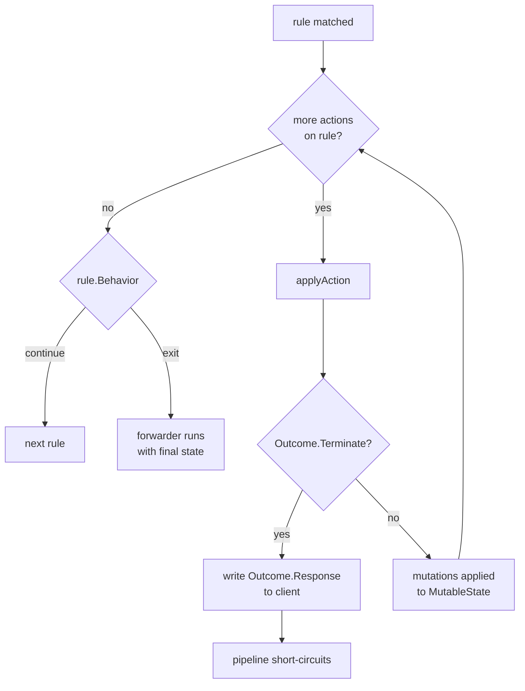
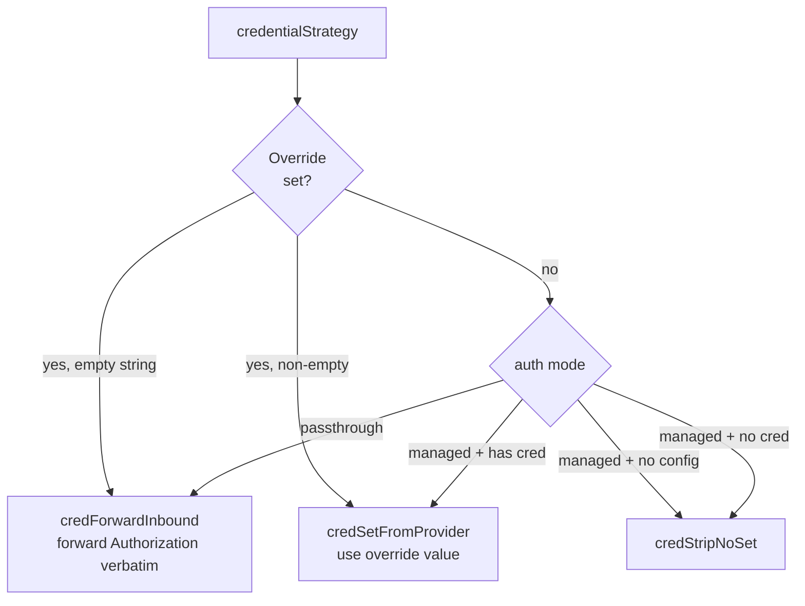
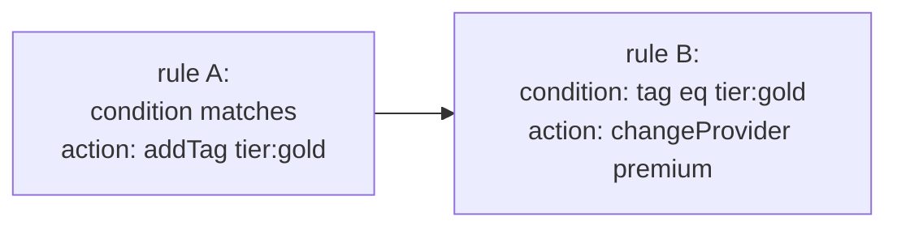

# Rule Actions

Conditions decide *which* rule fires. Actions decide *what happens* when one does. This page is the operator's reference for every action type the rules engine ships — what it mutates, when it short-circuits, and the gotchas that bite in production.

For the predicate side of the engine, see [`docs/rules.md`](rules.md). For the resilience orchestrator that consumes the `useResiliencePolicy` action, see [`docs/resilience.md`](resilience.md).

---

## Table of contents

1. [The action contract](#the-action-contract)
2. [Terminating vs non-terminating](#terminating-vs-non-terminating)
3. [What an action can mutate](#what-an-action-can-mutate)
4. [`changeProvider`](#changeprovider)
5. [`changeModelName`](#changemodelname)
6. [`changeUrl`](#changeurl)
7. [`changeApiKey`](#changeapikey)
8. [`setHeader`](#setheader)
9. [`appendQueryString`](#appendquerystring)
10. [`addTag`](#addtag)
11. [`useResiliencePolicy`](#useresiliencepolicy)
12. [`returnStatusCode`](#returnstatuscode)
13. [`llmImpersonation`](#llmimpersonation)
14. [Unknown action discriminators](#unknown-action-discriminators)
15. [Cross-references](#cross-references)

---

## The action contract

Every action implements the `rules.Action` interface in [`contracts/rules/action.go`](../contracts/rules/action.go):

```go
type Action interface {
    ActionType() string
    isAction()
}
```

`ActionType()` returns the polymorphic discriminator carried on the wire — the `type:` key the YAML loader and JSON unmarshaller dispatch on. The unexported `isAction()` is a sealing method: only types declared in `contracts/rules` can satisfy the interface, which keeps third-party packages from accidentally introducing wire-incompatible action types.

Every concrete action embeds `models.DynamicProperties` and routes its `UnmarshalJSON` through `models.UnmarshalDynamic`, so unknown wire fields round-trip via `DynamicProperties.Extra`. Combined with the `UnknownAction` fallback (see [Unknown action discriminators](#unknown-action-discriminators)), an action authored against a future control-plane build round-trips through the loader without truncation even if this gateway version doesn't model the new shape.

### Polymorphic dispatch

The action registry lives at the bottom of `action.go`:

```go
var actionRegistry = models.PolymorphicRegistry[Action]{
    DiscriminatorField: "type",
    Factories: map[string]func() Action{
        "changeProvider":      ...,
        "changeModelName":     ...,
        "changeUrl":           ...,
        "changeApiKey":        ...,
        "setHeader":           ...,
        "appendQueryString":   ...,
        "returnStatusCode":    ...,
        "llmImpersonation":    ...,
        "addTag":              ...,
        "useResiliencePolicy": ...,
    },
    Fallback: func(disc string) Action { return &UnknownAction{Type: disc} },
}
```

Both `UnmarshalAction` (JSON) and `DecodeActionYAMLNode` (YAML) dispatch through this registry. The YAML path is exported because [`contracts/resilience`](../contracts/resilience) reuses it to decode `targets[*].actions` without duplicating the type switch.

### Apply dispatch

The runtime side lives in [`internal/middleware/rules/actions.go`](../internal/middleware/rules/actions.go). `ApplyAction` is the public entry point; both the rules middleware and the v1.2 resilience orchestrator call it. It dispatches on the concrete pointer type via a type switch and returns an `Outcome`:

```go
type Outcome struct {
    Terminate bool
    Response  *Response
}
```

`Terminate=true` short-circuits the pipeline. `Response`, when non-nil, is the synthetic response the rules middleware writes to the client in lieu of forwarding upstream. Non-terminating actions return a zero `Outcome`.

---

## Terminating vs non-terminating

| Action | Terminating? | Discriminator |
|---|---|---|
| `changeProvider` | no | `changeProvider` |
| `changeModelName` | no | `changeModelName` |
| `changeUrl` | no | `changeUrl` |
| `changeApiKey` | no | `changeApiKey` |
| `setHeader` | no | `setHeader` |
| `appendQueryString` | no | `appendQueryString` |
| `addTag` | no | `addTag` |
| `useResiliencePolicy` | no | `useResiliencePolicy` |
| `returnStatusCode` | **yes** | `returnStatusCode` |
| `llmImpersonation` | **yes** | `llmImpersonation` |

A terminating action returns an `Outcome` with `Terminate=true` and a populated `Response`. The rules evaluator drops the synthetic response into the per-request context, breaks out of the per-rule action loop, breaks out of the per-configuration rule loop, and the middleware writes the response to the client. The forwarder never runs.

Non-terminating actions accumulate mutations into `MutableState`. Multiple non-terminating actions in the same rule chain compose: a `changeProvider` followed by a `setHeader` followed by an `addTag` all land on the same `MutableState`, in declaration order.



`rule.Behavior` only governs whether *the next rule* runs; it does not override termination. A terminating action always short-circuits, regardless of `Behavior: continue` or `Behavior: exit` on its owning rule.

---

## What an action can mutate

Actions write through a [`rules.MutableState`](../internal/middleware/rules/state.go) handle. This is the entire surface — anything not on `MutableState` cannot be reached from an action.

| Field | Type | Written by |
|---|---|---|
| `Provider` | `string` | `changeProvider` |
| `Endpoint` | `string` | (not directly writable in v1.0.x; re-resolved post-rule on the new provider) |
| `UpstreamURL` | `*url.URL` | `changeUrl` |
| `OutgoingHeaders` | `http.Header` | `setHeader` |
| `UpstreamCredentialOverride` | `*string` | `changeApiKey` |
| `PathParams` | `map[string]string` | `changeModelName` (writes `"model"` key) |
| `BodyMutated` | `bool` | `changeModelName` (signals re-marshal) |
| `QueryAdditions` | `[]QueryAddition` | `appendQueryString` |
| `Tags` | `[]string` | `addTag` |
| `PolicyRef` | `string` | `useResiliencePolicy` |

Two complementary side channels exist:

- **The typed request body** lives on `bodycapture.Captured.Body`, not on `MutableState` directly. `changeModelName` reaches it via the second argument to `ApplyAction`. When the action mutates the typed body, it also sets `state.BodyMutated = true`; the `BodyRemarshalHandler` middleware (next in the chain) re-encodes the typed body to bytes and replaces `r.Body` before the forwarder runs.

- **The synthetic response** flows through `Outcome.Response`, not through `MutableState`. Terminating actions return it; the middleware turns it into a real HTTP response.

---

## `changeProvider`

Rewrites the upstream provider for the request. Non-terminating.

### YAML

```yaml
- type: changeProvider
  newProvider: anthropic
```

### Fields

| Field | YAML | JSON | Required | Notes |
|---|---|---|---|---|
| `Type` | `type` | `type` | yes | Discriminator; must be `changeProvider`. |
| `NewProvider` | `newProvider` | `new_provider` | yes | Provider name. Must exist in `providers.yaml`. Trimmed; empty rejected at evaluate time. |

### What it mutates

- `state.Provider` = trimmed `NewProvider`.

### Special behaviour — invariant 7

`changeProvider` does *not* re-resolve the endpoint at action time. Instead, **the destination builder reads `state.Provider` post-rule and looks up the endpoint map on the new provider, not the original.** This is what makes the model-keyed redirect pattern work: a request hitting `/openai/v1/chat/completions` with a `claude-*` model can be flipped to `provider: anthropic`, and the destination builder will then dial anthropic's `chat_completions` endpoint with anthropic's credential and auth header — all because the lookup happens against `state.Provider`, not against the route the request entered on.

Bypassing this post-rule endpoint lookup (re-resolving in the action, hard-coding a URL, etc.) breaks the redirect pattern and is a hard no per `CLAUDE.md` invariant 7.

The credential header also re-resolves on the new provider: `resolveCredentialHeader` in `cmd/gateway/handler.go` walks endpoint override → provider override → `auth.UpstreamCredentialHeader` for `state.Provider`. This is invariant 6 — the destination builder is the single mint site for the credential header.

### Worked example — model-keyed redirect

```yaml
rules:
  - name: claude-on-openai-route
    condition:
      type: modelName
      operator: StartsWith
      expectedModelName: claude-
    actions:
      - type: changeProvider
        newProvider: anthropic
```

A client posts `{"model": "claude-3-5-sonnet", ...}` to `/openai/v1/chat/completions`. The OpenAI-compat chat surface accepts the request; the rule fires; `state.Provider` becomes `anthropic`; the destination builder resolves anthropic's `chat_completions` endpoint (anthropic's OpenAI-compat surface), uses anthropic's credential, and applies anthropic's auth header convention. The client sees an anthropic completion in OpenAI chat shape, transparently.

### Gotchas

- The destination builder re-resolves the endpoint on the new provider. If the new provider does not have the endpoint name the original route resolved to, the request fails — pair `changeProvider` with a `changeUrl` when redirecting across providers that don't share endpoint names.
- Pairing `changeProvider` with `changeModelName` in the same rule is the common idiom for cross-provider failover (see [resilience.md](resilience.md) for the per-target form).

---

## `changeModelName`

Rewrites the model name in the typed request body. Non-terminating.

### YAML

```yaml
- type: changeModelName
  newModelName: gpt-4o-mini
```

### Fields

| Field | YAML | JSON | Required | Notes |
|---|---|---|---|---|
| `Type` | `type` | `type` | yes | Discriminator; must be `changeModelName`. |
| `NewModelName` | `newModelName` | `new_model_name` | yes | Replacement model identifier. Trimmed; empty rejected at evaluate time. |

### What it mutates

The action type-switches on the typed body and writes the `Model` field directly:

| Body type | Write target |
|---|---|
| `openai/chat.ChatCompletionRequest` | `b.Model = newName` |
| `openai/responses.ResponsesRequest` | `b.Model = newName` |
| `anthropic/messages.MessagesRequest` | `b.Model = newName` |
| `gemini/content.GenerateContentRequest` | body has no `model` field; mutation is path-only |
| `nil` (passthrough route, no typed body captured) | no body write; path-only |
| any other concrete type | returns `ErrUnknownModelField` |

In every case it also writes `state.PathParams["model"] = newName` (creating the map if nil) so the path template re-renders consistently — this is how Gemini's `{model}` path placeholder gets the new value.

After mutating the body it sets `state.BodyMutated = true`. The `BodyRemarshalHandler` middleware reads this flag, calls `bodycapture.RemarshalTyped` to re-encode the typed body via its `MarshalJSON` (which preserves `DynamicProperties.Extra`), and replaces `r.Body` and `Content-Length` on the outgoing request before the forwarder runs.

### Special behaviour

- **Gemini has no body-level `Model`.** The mutation is purely a `PathParams` update; the destination builder substitutes `{model}` in the path template at URL-render time.
- **Passthrough routes have no typed body.** `body=nil` is tolerated — the action updates `PathParams` and `BodyMutated` (the latter is harmless: the re-marshal handler skips when `RemarshalTyped` returns `nil`).
- **Body restoration across attempts is currently leaky.** In multi-attempt resilience scenarios, attempt 1's body mutation persists into attempt 2 because the typed body is shared. See [resilience.md — Known limitations](resilience.md#known-limitations) item 1.

### Worked example — collapse model variants onto a single upstream model

```yaml
rules:
  - name: collapse-gpt4-variants
    condition:
      type: modelName
      operator: StartsWith
      expectedModelName: gpt-4-turbo
    actions:
      - type: changeModelName
        newModelName: gpt-4o
```

Every inbound `gpt-4-turbo*` model name is rewritten to `gpt-4o` before the request leaves the gateway. The client's tracking is unaffected (correlation IDs are unchanged); the upstream sees a single canonical model.

### Gotchas

- An empty `newModelName` after trimming returns `errEmptyValue` at evaluate time — the rule's `events.RuleMatched` payload carries the error message and `gateway.rule.errors.total{error_kind="action_apply"}` increments.
- For body types this build doesn't model (control-plane-minted future shapes), the action returns `ErrUnknownModelField` rather than silently no-op'ing — operators see the failure in the rule-error metric instead of debugging a "why didn't my rule fire" mystery.

---

## `changeUrl`

Overrides the upstream URL for this request. Non-terminating.

### YAML

```yaml
- type: changeUrl
  newUrl: https://eu-west-1.openai.example.com
```

### Fields

| Field | YAML | JSON | Required | Notes |
|---|---|---|---|---|
| `Type` | `type` | `type` | yes | Discriminator; must be `changeUrl`. |
| `NewURL` | `newUrl` | `new_url` | yes | Replacement URL. Parsed via `url.Parse`; parse failure returns an error at evaluate time. |

### What it mutates

- `state.UpstreamURL` = `url.Parse(NewURL)`.

The destination builder uses `UpstreamURL` verbatim when non-nil — it skips its usual `(Provider, Endpoint, PathParams)` resolution. Query additions from `appendQueryString` are still layered on top after this point.

### Special behaviour

- Per-request override only — does not persist beyond the single request.
- Does not change `state.Provider` or the credential header binding. If you redirect to a host that needs a different credential, pair with `changeApiKey`; if it's a different provider's surface entirely, lead with `changeProvider` and let the destination builder do the work.

### Worked example — pin a region

```yaml
rules:
  - name: eu-tenant-region
    condition:
      type: header
      keyOperator: Equals
      keyPattern: X-Tenant-Region
      valueOperator: Equals
      valuePattern: eu-west-1
    actions:
      - type: changeUrl
        newUrl: https://eu-west-1.api.openai.com
```

All requests from EU-tagged tenants exit through the European OpenAI region while keeping the OpenAI provider binding (and therefore OpenAI's auth header + credential lookup).

### Gotchas

- Parse failures are loud — a malformed `newUrl` returns an error at evaluate time and the rule's match record carries the parse error.
- `changeUrl` bypasses path-template rendering. The URL you supply is dialled as-is; if the upstream expects `{model}` substitutions you must include them yourself or skip `changeUrl` in favour of `changeProvider`.

---

## `changeApiKey`

Substitutes the upstream API key, or signals "forward the inbound Sluice bearer verbatim" for passthrough scenarios. Non-terminating.

### YAML

```yaml
# managed substitution
- type: changeApiKey
  apiKey: sk-upstream-regional

# passthrough — forward whatever Authorization header the client sent
- type: changeApiKey
  useSluiceKey: true
```

### Fields

| Field | YAML | JSON | Required | Notes |
|---|---|---|---|---|
| `Type` | `type` | `type` | yes | Discriminator; must be `changeApiKey`. |
| `APIKey` | `apiKey` | `api_key` | conditional | Literal upstream key substituted on the way out. Required unless `UseSluiceKey` is true; trimmed empty value is rejected. Ignored when `UseSluiceKey` is true. |
| `UseSluiceKey` | `useSluiceKey` | `use_sluice_key` | no | When `true`, forwards the inbound `Authorization` header verbatim. Used for passthrough auth flows. |

### What it mutates

- `state.UpstreamCredentialOverride` = `&trimmedAPIKey` when `UseSluiceKey=false`.
- `state.UpstreamCredentialOverride` = `&""` (a pointer to the empty string) when `UseSluiceKey=true` — the destination builder treats the empty-string override as a sentinel meaning "forward inbound Authorization verbatim."

### Special behaviour

The destination builder's credential strategy ([`cmd/gateway/handler.go::credentialStrategy`](../cmd/gateway/handler.go)) reads the override before consulting auth mode:



The override wins over auth mode. A managed-mode request whose rule fires `changeApiKey` ends up with the rule's key, even if the configuration has its own `upstream_credentials` entry for that provider.

### Worked example — per-tenant key segregation

```yaml
rules:
  - name: enterprise-tenant-dedicated-key
    condition:
      type: header
      keyOperator: Equals
      keyPattern: X-Tenant-Tier
      valueOperator: Equals
      valuePattern: enterprise
    actions:
      - type: changeApiKey
        apiKey: sk-enterprise-openai
```

The configuration's default OpenAI key is used for the long tail of tenants; enterprise tenants get a dedicated key for billing isolation.

### Gotchas

- The empty-string sentinel is load-bearing — do not "tidy up" `UseSluiceKey` by writing `state.UpstreamCredentialOverride = nil` when set; the nil state means "no override, fall back to managed-mode lookup", which is a different semantic.
- Sluice does not redact upstream keys in YAML it loads; treat the YAML file as a secret material. Mount from a k8s Secret, never check it in.

---

## `setHeader`

Mutates an outgoing HTTP header on the upstream request. Non-terminating.

### YAML

```yaml
- type: setHeader
  headerName: X-Routing-Tier
  headerAction: Set
  headerValue: priority
```

### Fields

| Field | YAML | JSON | Required | Notes |
|---|---|---|---|---|
| `Type` | `type` | `type` | yes | Discriminator; must be `setHeader`. |
| `HeaderName` | `headerName` | `header_name` | yes | Header to modify. Trimmed; empty rejected. |
| `HeaderAction` | `headerAction` | `header_action` | yes | One of `Set`, `Append`, `Prepend`, `Remove`. |
| `HeaderValue` | `headerValue` | `header_value` | conditional | Required for `Set`, `Append`, `Prepend`. Ignored for `Remove`. |

### What it mutates

- `state.OutgoingHeaders[HeaderName]` per `HeaderAction`:

| Op | Behaviour when header is missing | Behaviour when header is present |
|---|---|---|
| `Set` | Sets to `HeaderValue`. | Replaces existing value with `HeaderValue`. |
| `Remove` | No-op. | Deletes the header entirely. |
| `Append` | Sets to `HeaderValue` (symmetric with `Set`). | Sets to `existing + ", " + HeaderValue`. |
| `Prepend` | Sets to `HeaderValue` (symmetric with `Set`). | Sets to `HeaderValue + ", " + existing`. |

### Special behaviour

- **Multi-value concatenation uses `", "` (comma + space).** RFC 7230 §3.2.2 specifies comma as the list separator for multi-value headers when serialised to the wire. The .NET predecessor concatenated without a separator (so `"a" + "b" = "ab"`), which is a deliberate divergence — the comma form is the standards-compliant one.
- **Append/Prepend create the header when missing.** The .NET behaviour of "silently no-op on Append-to-missing" was a footgun; Sluice creates the header instead so the action's intent always lands.
- The destination builder layers provider-required headers (e.g. `anthropic-version`) and the resolved auth header on top of `OutgoingHeaders` after rule evaluation. To force-override an auth header, set it via `setHeader` *and* know that the auth-header binding will still run — usually `changeApiKey` + the provider's auth-header convention is what you actually want.

### Worked example — propagate a tenant tier downstream

```yaml
rules:
  - name: tag-enterprise-requests
    condition:
      type: header
      keyOperator: Equals
      keyPattern: X-Tenant-Tier
      valueOperator: Equals
      valuePattern: enterprise
    actions:
      - type: setHeader
        headerName: X-Upstream-Priority
        headerAction: Set
        headerValue: high
```

The upstream provider (or an intermediate proxy) sees `X-Upstream-Priority: high` and can route accordingly.

### Gotchas

- An unknown `HeaderAction` value (typo, future operator) returns an error at evaluate time — case matters: the constants are `Set`, `Append`, `Prepend`, `Remove`, not lowercase.
- `Remove` on a missing header is a no-op rather than an error; this is deliberate — a rule that defensively strips a header shouldn't fail when the header wasn't there to begin with.

---

## `appendQueryString`

Appends a query-string parameter to the outgoing upstream URL. Non-terminating.

### YAML

```yaml
- type: appendQueryString
  key: api-version
  value: "2024-08-06"
```

### Fields

| Field | YAML | JSON | Required | Notes |
|---|---|---|---|---|
| `Type` | `type` | `type` | yes | Discriminator; must be `appendQueryString`. |
| `Key` | `key` | `key` | yes | Query-string parameter name. Trimmed; empty rejected. |
| `Value` | `value` | `value` | yes | Query-string parameter value. Empty string is permitted (`?key=` is a valid wire form). |

### What it mutates

- Appends a `rules.QueryAddition{Key, Value}` to `state.QueryAdditions`.

### Special behaviour

The destination builder applies accumulated additions **after** `UpstreamURL` is resolved. This means:

- The action fires regardless of whether `changeUrl` has run yet; rule order is operator-authored, not engine-imposed.
- Duplicates are allowed. An upstream API that interprets repeated keys as a list (`?tag=a&tag=b`) sees both values in append order.
- Pre-existing query parameters on the URL (e.g. an inbound query string from the client) are not deduplicated against the additions.

### Worked example — pin Azure-style api-version

```yaml
rules:
  - name: pin-azure-api-version
    condition:
      type: provider
      operator: Equals
      expectedProvider: azure-openai
    actions:
      - type: appendQueryString
        key: api-version
        value: "2024-08-01-preview"
```

Every request to the Azure OpenAI surface picks up `?api-version=2024-08-01-preview` without the client having to know.

### Gotchas

- The action does not URL-encode `Value` ahead of time; the destination builder handles encoding when it stitches the final URL.
- There is no `setQueryString` counterpart that overrides a duplicate key. If you need exactly-once semantics, ensure the client does not send the key in the inbound URL.

---

## `addTag`

Attaches a tag to the in-flight request. Non-terminating.

### YAML

```yaml
- type: addTag
  tag: "tier:enterprise"
```

### Fields

| Field | YAML | JSON | Required | Notes |
|---|---|---|---|---|
| `Type` | `type` | `type` | yes | Discriminator; must be `addTag`. |
| `Tag` | `tag` | `tag` | yes | Tag string. Trimmed; empty rejected at evaluate time. |

### What it mutates

- `state.Tags` — `state.AddTag(t)` appends with set-semantics (a tag already present is a no-op).

### Special behaviour

Tags are both an **output** (surface in observability) and an **input** (downstream rules can match on accumulated tags via `tagCondition`). Because the evaluator runs rules in declaration order, you can chain producer/consumer pairs:



This pattern lets a single classifier rule fan out into multiple downstream behaviours without re-deriving the classification.

The reporter drains `state.Tags` at request completion onto `Record.Tags` (the captured connector record) and the live-feed `Entry`, and bumps `gateway.tags.applied.total` once per tag.

This channel is rule-action-driven and request-scoped. It is **separate from** the static `configurations[].tags` map (see [`configuration-model.md`](configuration-model.md#configurations-block)): configuration-level tags carry as request context for logs and the admin configuration detail page, but they do NOT propagate to `Record.Tags` and do NOT bump `gateway.tags.applied.total`. If you want a tag to surface in audit and dashboards, fire an `addTag` action.

### Worked example — classify then route

```yaml
rules:
  - name: classify-by-header
    condition:
      type: header
      keyOperator: Equals
      keyPattern: X-Tenant-Tier
      valueOperator: Equals
      valuePattern: enterprise
    actions:
      - type: addTag
        tag: "tier:enterprise"

  - name: route-enterprise-to-premium
    condition:
      type: tag
      operator: Equals
      expectedTag: "tier:enterprise"
    actions:
      - type: changeProvider
        newProvider: openai-premium
```

The first rule attaches a tag; the second consumes it. Rule order in `Configuration.RuleNames` is the producer/consumer ordering — put the producer first.

### Gotchas

- Set-semantics means double-adding the same tag is a silent no-op, but the rule still records `actions_applied`. If you rely on tag count for billing, drive the counter off `gateway.tags.applied.total` (which dedupes via `state.AddTag`'s return value).
- Convention: tags are free-form strings, but operators usually use a `prefix:value` form (`tier:gold`, `audit:pii`, `region:eu`) to namespace. The engine treats them as opaque strings.

---

## `useResiliencePolicy`

Binds the request to a named resilience policy. Non-terminating.

### YAML

```yaml
- type: useResiliencePolicy
  policyName: openai-failover
```

### Fields

| Field | YAML | JSON | Required | Notes |
|---|---|---|---|---|
| `Type` | `type` | `type` | yes | Discriminator; must be `useResiliencePolicy`. |
| `PolicyName` | `policyName` | `policyName` | conditional | Name of a `ResilienceConfig` in the top-level `resilience_policies:` library. Empty string explicitly clears any prior `PolicyRef`. |

### What it mutates

- `state.PolicyRef` = `strings.TrimSpace(PolicyName)`.

### Pointer to detail

**See [`docs/resilience.md`](resilience.md) for the full reference:** modes (`failover`, `load_balance`, `load_balance_with_failover`, `none`), `strict_weights`, per-target Actions, circuit-breaker mechanics, attempt observability, and worked end-to-end examples. The behaviour after the action sets `state.PolicyRef` is entirely the orchestrator's; this section only documents the action that sets the binding.

### Last-writer-wins

Multiple `useResiliencePolicy` actions in a rule chain follow last-writer-wins semantics — the evaluator processes actions in declaration order, so a later rule replaces an earlier rule's binding. Setting `PolicyName: ""` explicitly clears the binding; the orchestrator falls back to single-shot when `PolicyRef` is empty.

### Validation

The config-load cross-validator (in `internal/config`) proves every non-empty `PolicyName` references a real policy by name. Unknown names are a startup error — they never reach the runtime as a "silent fall-through to passthrough" surprise.

### Gotchas

- The action is non-terminating, so it composes with other actions in the same rule. Common pattern: `changeProvider` + `useResiliencePolicy` together for "redirect AND wrap in resilience."
- Per-target actions inside the policy are layered on top of the post-rule `MutableState` — they don't replace it. The rules engine's mutations are the baseline; each target's actions clone from there. See [resilience.md — Per-target Actions](resilience.md#per-target-actions).

---

## `returnStatusCode`

Synthesizes a response and returns it to the client without contacting upstream. **Terminating.**

### YAML

```yaml
- type: returnStatusCode
  statusCode: 429
  bodyType: json
  body: '{"error":{"message":"slow down","type":"rate_limit"}}'
```

### Fields

| Field | YAML | JSON | Required | Notes |
|---|---|---|---|---|
| `Type` | `type` | `type` | yes | Discriminator; must be `returnStatusCode`. |
| `StatusCode` | `statusCode` | `status_code` | yes | HTTP status returned to the client. Must be in `[100, 599]`; out-of-band values are coerced to `500`. |
| `Body` | `body` | `body` | no | Raw response body. Sent as-is for the chosen `BodyType`. |
| `BodyType` | `bodyType` | `body_type` | no | One of `text`, `json`, `html`. Selects the `Content-Type` family the rules middleware applies. |

### What it mutates

Returns:

```go
Outcome{
    Terminate: true,
    Response: &Response{
        StatusCode: clamped(a.StatusCode),
        Body:       []byte(a.Body),
        BodyType:   a.BodyType,
    },
}
```

`MutableState` is not touched — the action short-circuits before any downstream middleware (including the body-remarshal handler and forwarder) runs.

### Special behaviour

- **StatusCode is clamped to `[100, 599]`**, with out-of-band values mapping to `500`. This guarantees a misconfigured rule produces a recognisably-bad response rather than a `panic` in `net/http.WriteHeader`.
- `BodyType` selects only the `Content-Type` family; Sluice does not validate that `Body` is well-formed JSON when `BodyType: json`. The bytes are written verbatim.
- Empty `Body` is allowed — `204 No Content` with no body is the obvious use case.

### `BodyType` values and Content-Type mapping

`BodyType` is one of three `StatusCodeBodyType` constants from [`contracts/rules/types.go`](../contracts/rules/types.go); `contentTypeFor` in [`internal/middleware/rules/middleware.go`](../internal/middleware/rules/middleware.go) is the single mint site for the `Content-Type` header on the synthetic response.

| `bodyType` | Constant | Outbound `Content-Type` |
|---|---|---|
| `text` | `StatusBodyText` | `text/plain; charset=utf-8` |
| `json` | `StatusBodyJSON` | `application/json` |
| `html` | `StatusBodyHTML` | `text/html; charset=utf-8` |
| _(empty / unknown)_ | _(falls through)_ | `text/plain; charset=utf-8` |

The empty/unknown fallback is deliberate — a YAML that omits `bodyType` or uses a future value still produces a well-formed response rather than a missing header. Pick `text` explicitly when that's your intent so the choice is visible in the YAML.

### Worked example — synthetic rate-limit response

```yaml
rules:
  - name: block-banned-models
    condition:
      type: modelName
      operator: Equals
      expectedModelName: deprecated-model
    actions:
      - type: returnStatusCode
        statusCode: 410
        bodyType: json
        body: '{"error":{"message":"model has been retired","type":"gone"}}'
```

The gateway returns a 410 Gone to the client immediately; no upstream call, no tokens consumed, no provider quota burned.

### Gotchas

- `returnStatusCode` short-circuits ALL subsequent actions on the same rule, AND all subsequent rules in the configuration. If you want bookkeeping (an `addTag`, a `setHeader` on the synthetic response), put it *before* the `returnStatusCode` in the action list.
- The synthetic response is *not* sent to upstream; reporting fires with no upstream attempt recorded. Dashboards distinguish synthetic from forwarded traffic via the absence of an upstream status code on the `gateway.request` envelope.
- Do not use `returnStatusCode` inside a resilience target's `actions` list. The validator does not currently reject it but the orchestrator's behaviour is undefined — see [resilience.md — Known limitations](resilience.md#known-limitations) item 5.

---

## `llmImpersonation`

Returns a fake LLM completion to the client without contacting upstream. **Terminating.**

### YAML

```yaml
- type: llmImpersonation
  message: "This request was blocked by policy."
```

### Fields

| Field | YAML | JSON | Required | Notes |
|---|---|---|---|---|
| `Type` | `type` | `type` | yes | Discriminator; must be `llmImpersonation`. |
| `Message` | `message` | `message` | yes | Synthetic completion text. Trimmed; empty rejected. |

### What it mutates

Returns:

```go
Outcome{
    Terminate: true,
    Response: &Response{
        StatusCode: 200,
        Body:       []byte(message),
        BodyType:   StatusBodyText,
    },
}
```

### Special behaviour — the v1.0.1 stub

The current implementation is deliberately a **plain-text stub**. An operator pointing the OpenAI SDK at the gateway and triggering an `llmImpersonation` rule sees a `text/plain` 200 response with the configured message — **NOT** a fake `chat.completion` JSON shape.

This is by design: the per-provider response-shape synthesisers (`chat.completion` / `responses` / `message` / Gemini `candidates`, with streaming variants) are deferred to v1.0.3+. Until they land, the stub is honest about its stubbed nature — an operator monitoring the gateway sees `text/plain` and knows the per-provider synthesis is not active yet, rather than debugging subtly-wrong JSON that fooled an SDK into a stale state.

When v1.0.3 lands, the wire shape will become per-provider-correct and the `Content-Type` family will switch from `text` to `json` (or `text/event-stream` for streaming requests). Operator-authored rules will not need to change.

### Worked example — return a blocked-content notice

```yaml
rules:
  - name: block-pii-prompts
    condition:
      type: tag
      operator: Equals
      expectedTag: "guardrail:pii-detected"
    actions:
      - type: llmImpersonation
        message: "Your prompt was blocked because it contained personally identifiable information. Please redact and retry."
```

In conjunction with a (future) guardrail middleware that fires `addTag tag: "guardrail:pii-detected"`, the rule turns a detected PII prompt into a synthetic refusal without burning upstream tokens.

### Gotchas

- The stub status is always `200`. If you want a 4xx for a blocked prompt, use `returnStatusCode` instead — `llmImpersonation` is for the "looks like a model completion" use case, not the "tell the client they got rate-limited" use case.
- As with `returnStatusCode`, this action short-circuits the entire pipeline. Side effects (tagging, header-setting) must precede it.
- Do not use inside a resilience target's `actions` list. Same caveat as `returnStatusCode`.

---

## Unknown action discriminators

`UnknownAction` is the catch-all fallback. When the loader sees a `type:` value the registry doesn't recognise, it constructs an `UnknownAction{Type: <disc>}` and routes all other fields into `DynamicProperties.Extra`. The action round-trips on marshal — the original wire shape comes back out byte-for-byte.

At runtime, `applyAction` no-ops on `*UnknownAction` and returns a zero `Outcome`. This is forward-compatibility for control-plane-minted action types that a deployed gateway version doesn't yet model: the YAML loads cleanly, the action serialises back unchanged, and the rule's other (modelled) actions still fire.

### Why this matters

- A YAML containing a future action type does not fail to load on an older gateway; it just no-ops at evaluate time.
- The action survives a YAML → JSON → YAML round-trip via the admin console without truncation, so the operator can edit the rest of the rule without accidentally dropping the unknown action.
- The discriminator value is preserved verbatim on `Type`, so dashboards can surface "this gateway is seeing action types it doesn't recognise" as a deployment-version-skew signal.

If you need a known action's no-op fallback (an action that does nothing on purpose), use a `setHeader` on a header you don't care about — don't rely on `UnknownAction` for intentional no-ops, because a future gateway version may model your typo as a real action.

---

## Cross-references

- [`docs/rules.md`](rules.md) — the condition side of the engine: conditions, operators, rule ordering, `Behavior: continue|exit`, evaluator mechanics, cascade vs single-pass semantics, tag conditions.
- [`docs/resilience.md`](resilience.md) — the orchestrator that consumes `useResiliencePolicy`. Modes, per-target Actions, circuit breaker, attempt observability, end-to-end examples.
- [`docs/providers.md`](providers.md) — provider registry, per-endpoint `auth_header` / `auth_format` overrides, OpenAI-compat surfaces, credential header resolution table consumed post-`changeProvider`.
- [`contracts/rules/action.go`](../contracts/rules/action.go) — wire schema for every action.
- [`internal/middleware/rules/actions.go`](../internal/middleware/rules/actions.go) — runtime `ApplyAction` dispatch and per-action mutation logic.
- [`internal/middleware/rules/state.go`](../internal/middleware/rules/state.go) — `MutableState` definition and the surface every action writes through.
- [`cmd/gateway/handler.go`](../cmd/gateway/handler.go) — `resolveCredentialHeader` and `credentialStrategy`, the post-rule credential resolution that `changeProvider` and `changeApiKey` feed into. Load-bearing invariants 6 and 7.
