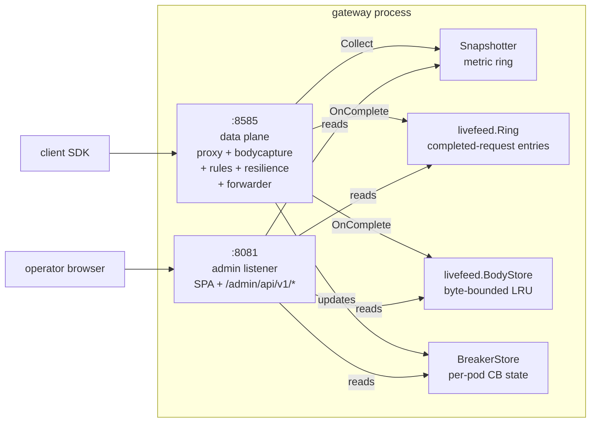
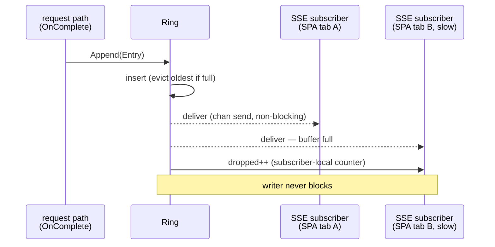
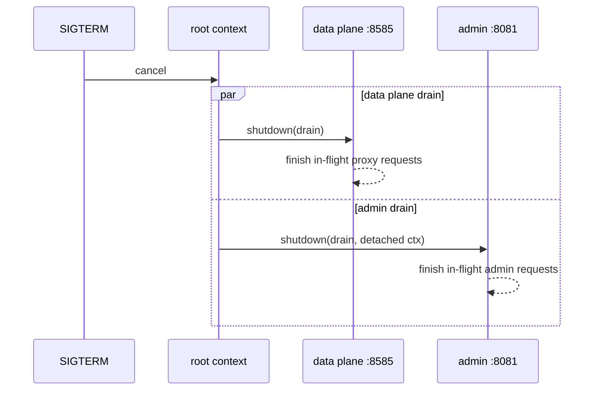

# Admin Console

SlipSpace's admin console is a management surface bolted onto the gateway binary. It runs as a **second `http.Server` on its own port** (default `:8081`), separate from the data plane (`:8585`), so admin traffic and proxy traffic never share a listener — no shared connection pool, no shared middleware stack, no risk of a stuck admin handler back-pressuring the request path.

The console exposes both read-only inspection surfaces (dashboard, live messages, policies, bindings, export) and a write API spanning most of the policy YAML: full CRUD for **Configurations, Providers, Groups, Connectors, Rules, and API Keys**. Bindings are exposed read-only (they are edited as part of a Configuration). Every write clones the live config snapshot, validates the clone, persists the YAML atomically, and publishes via `config.Store.Replace` — no pod restart, and in-flight requests are unaffected. The write API requires `SLIPSPACE_CONFIG_DIR` to be writable; see [Configuration mount → Read-write config dir](deployment.md#read-write-config-dir-admin-write-api) for the production pattern.

The console is two things stitched together: an embedded React SPA served at `/admin/` and a JSON control-plane API mounted at `/admin/api/v1/*`. Both come up only when `admin.enabled: true` *and* a password is configured. With either condition false, the listener never opens.

This page is the operator's reference: enabling the console, configuring the password, every env var the live-feed honours, every route the API exposes, every SPA page that consumes them.

---

## Table of contents

1. [Topology](#topology)
2. [Enabling the console](#enabling-the-console)
3. [Setting the password](#setting-the-password)
4. [Bind address](#bind-address)
5. [Environment variables](#environment-variables)
6. [HTTP Basic auth](#http-basic-auth)
7. [API routes](#api-routes)
8. [Per-route admin metric labels](#per-route-admin-metric-labels)
9. [SPA pages](#spa-pages)
10. [Live messages ring](#live-messages-ring)
11. [Body capture](#body-capture)
12. [Graceful shutdown](#graceful-shutdown)
13. [Operational notes](#operational-notes)
14. [Cross-references](#cross-references)

---

## Topology

The admin listener and the data plane share a process but nothing else. Both listeners are started from `cmd/gateway/main.go`: the admin console gets its own `http.Server` constructed inline in `startAdmin`, while the data plane's `http.Server` is built by `server.New` (`internal/server/server.go`) and started from main. They run under their own goroutines and are drained independently.



Both listeners share the observability provider (meters, snapshotter), the live-feed ring, the body store, and the breaker store — those are constructed once at startup and passed into both wirings. They also share the live `config.Store` (the single `ResolvedConfig` publisher — invariant #9) and the `ConfigDir` path the write/export API persists back to; the store is a first-class shared dependency, not a side-channel. The admin handler never calls into the proxy chain; the proxy chain never writes to admin state apart from the four side-channels above.

Mount `/admin/` behind the same ingress as the data plane if you like — the SPA owns the `/admin/` URL prefix so the routing rule on the ingress side stays dumb (`Host: slipspace.example.com; PathPrefix: /admin → :8081`). Or expose the admin port through a sidecar / `kubectl port-forward` for loopback-only access. Both work; the gateway doesn't care.

---

## Enabling the console

The console is off by default. Two things must both be true for the listener to come up:

1. `admin.enabled: true` in the merged YAML (`admin` is a top-level key — there is no `gateway:` parent block).
2. A non-empty password resolved from either the env var or the yaml `password` field.

These two conditions are checked in different places. `startAdmin` gates the listener solely on `admin.enabled` (`resolved.Admin != nil && resolved.Admin.Enabled`): when that's false it logs `"admin console disabled"` and returns without opening a port — the rest of the gateway boots normally. The non-empty-password requirement is *not* re-checked in `startAdmin`; it is enforced earlier, at config load, by `admin.Config.Validate`, which returns `ErrPasswordRequired` when `enabled: true` has no password — so an enabled console with no password fails to boot rather than logging `"admin console disabled"`.

The minimum viable wiring:

```yaml
admin:
  enabled: true
  password: operator-secret
```

The literal value here is what the YAML loader sees; substitute via your secret manager before mount. In production you almost always leave the yaml `password` field blank and set `SLIPSPACE_ADMIN_PASSWORD` instead (see [Setting the password](#setting-the-password)).

`admin.Config.Validate` enforces the invariants:

| Condition | Behaviour |
|---|---|
| `enabled: false` | Config passes regardless of bind/password — no listener starts. |
| `enabled: true`, no password (yaml + env both empty) | Returns `ErrPasswordRequired`. Boot fails. |
| `enabled: true`, password set, malformed `bind_addr` | Returns `ErrInvalidBindAddr`. Boot fails. |

The fail-loud-at-boot rule exists so an operator who wanted the console on but mis-wired the password doesn't ship a silently disabled listener.

---

## Setting the password

Two configuration paths feed `admin.Config.ResolvePassword()`:

| Path | YAML key / env var | Used when |
|---|---|---|
| Environment variable | `SLIPSPACE_ADMIN_PASSWORD` | Production. Mounted from a k8s `Secret` keyed as an env var. Wins when set. |
| Literal yaml field | `admin.password` | Dev / local. Convenient for `docker-compose` flows; never used in production. |

`ResolvePassword` consults the env var first; if it's set (non-empty after trim), that wins over the yaml field. If the env var is unset or empty, the yaml `password` field is used as-is. Both empty returns `""` — `Validate` then flags `ErrPasswordRequired`.

```yaml
# example: production wiring (env var dominates)
admin:
  enabled: true
  bind_addr: "0.0.0.0:8081"
  password: ""              # left blank; SLIPSPACE_ADMIN_PASSWORD wins anyway
```

```yaml
# example: local dev (yaml only — no env var set)
admin:
  enabled: true
  password: dev-password
```

### Redaction in the export bundle

The admin console exposes a redacted-config export at [`GET /admin/api/v1/config/export/files`](#api-routes) and [`/download`](#api-routes). The `admin.password` field is replaced by `***` before either endpoint emits a single byte — operators inspecting the bundle never see the literal value, and a snapshot accidentally committed to a ticket reveals nothing.

`SLIPSPACE_ADMIN_PASSWORD` is an env var, not a file artifact, so it is not in the export bundle at all. The MANIFEST.txt header lists gateway version, hostname, configDir, and timestamp — never credential material.

---

## Bind address

`admin.bind_addr` controls the listener address. Empty falls back to `admin.DefaultBindAddr = "0.0.0.0:8081"`.

| Setting | Effect |
|---|---|
| omitted / empty | Binds `0.0.0.0:8081`. Point a k8s `Service` or `NetworkPolicy` at the port for isolation. |
| `127.0.0.1:8081` | Loopback only. Use when a sidecar (e.g. `kubectl port-forward`, oauth2-proxy) fronts the console. |
| `:9090` | Binds all interfaces on a custom port. |
| `192.0.2.10:8081` | Binds a specific interface. |

The validator runs `net.SplitHostPort` + numeric-port check at load time, so `bind_addr: "garbage"` or `bind_addr: "host:notaport"` fails boot with `ErrInvalidBindAddr` rather than panicking at `net.Listen`.

`bind_addr` must not collide with the data-plane `SLIPSPACE_HTTP_BIND`. The OS will surface that as `EADDRINUSE` at `srv.ListenAndServe` time — the admin watcher logs it and the goroutine exits, but the gateway keeps serving traffic.

---

## Environment variables

Every `SLIPSPACE_ADMIN_*` env var feeding the console. Defaults live in `internal/config/env.go`; validators in the same file reject negative or malformed values at boot.

### Core

| Variable | Default | Notes |
|---|---|---|
| `SLIPSPACE_ADMIN_PASSWORD` | (unset) | Operator password for HTTP Basic auth. Wins over `admin.password` yaml field when both are populated. Required when `admin.enabled: true`. |
| `SLIPSPACE_ADMIN_SNAPSHOT_INTERVAL_MS` | `300000` (5m) | How often the dashboard's metric snapshotter reads the in-process registry. 5m gives 288 sample points across a 24h window — matches the chart resolution the SPA renders at. E2E tests drop this to ~200ms so dashboards reflect traffic within test wall-clock. Must be positive. |

### Live feed

| Variable | Default | Notes |
|---|---|---|
| `SLIPSPACE_ADMIN_LIVE_FEED_CAPACITY` | `100` | Size of the in-process ring of completed-request entries that backs `/api/v1/messages/recent` and `/api/v1/messages/stream`. Set to `0` to disable the pane entirely — the ring is not constructed and the messages endpoints return 503. Negative values fail boot. |

### Body capture

| Variable | Default | Notes |
|---|---|---|
| `SLIPSPACE_ADMIN_LIVE_FEED_BODY_BYTES` | `209715200` (200 MiB) | Total byte budget of the body LRU that backs `/api/v1/messages/{event_id}/body`. The store evicts oldest-first on overflow. Set to `0` to disable body capture; the live-tail pane still renders metadata. Stored bytes are zstd-compressed, so a 200 MiB budget commonly holds several GiB of logical content. |
| `SLIPSPACE_ADMIN_LIVE_FEED_BODY_MAX_BYTES` | `8388608` (8 MiB) | Per-body capture cap. Bodies above this size are stored head-only with a `*_truncated: true` flag. Must be `> 0` when `_BODY_BYTES` is non-zero; the loader rejects the combination otherwise. |

Body capture also requires the live feed itself to be enabled — without a ring there's no `event_id` to key bodies against. `ServerEnv.LiveFeedBodiesEnabled()` returns true iff both `_CAPACITY > 0` and `_BODY_BYTES > 0`.

---

## HTTP Basic auth

`internal/admin/auth.go::BasicAuth` wraps every authenticated route. The expected username is hardcoded to `admin.Username = "admin"`; the password is whatever `admin.Config.ResolvePassword()` returned at startup. Both comparisons use `subtle.ConstantTimeCompare` to keep timing flat across the "wrong username" and "wrong password" branches.

### Why no `WWW-Authenticate` header

A bare 401 is returned — no `WWW-Authenticate: Basic …` challenge. This is deliberate.

If the gateway emitted the challenge, browsers would intercept any 401 from `/admin/api/v1/*` and pop their **native** auth dialog over the SPA, then silently retry with whatever the user typed there. That bypass would let a stale `sessionStorage` password slip through whenever the user happened to type the right credential into the browser prompt — the SPA's login form would never see the value, and the user's actual cached credential would be quietly replaced. Suppressing the challenge keeps the credential UX entirely inside the SPA.

`curl --basic` callers still work fine: RFC 7617 doesn't require the server to advertise `WWW-Authenticate` for basic auth to function, only for browser-driven challenge-response, which is exactly the flow being suppressed.

### Login flow

1. SPA's `apiFetch` issues a request to any `/admin/api/v1/*` path with the cached credential.
2. On 401, the SPA's `useUnauthorizedRedirect` hook bounces the user to `/login`.
3. The login form stores the base64 `admin:password` credential in `sessionStorage` via `auth.store()` (`web/src/lib/auth.ts`), then calls `validateSession()` (`web/src/lib/api.ts`), which hits `/api/v1/auth/me` to confirm the credentials. `validateSession()` only validates — it does not perform the storage.
4. Subsequent SPA fetches reuse the cached credential via `apiFetch`'s `Authorization: Basic …` header.

### What's authenticated vs. public

| Path | Behind BasicAuth? |
|---|---|
| `/admin/` (SPA assets — HTML, JS, CSS, etc.) | no |
| `/admin/api/v1/version` | no — login page renders the version pre-credential |
| every other `/admin/api/v1/*` route | yes |

The SPA assets are static and reveal nothing operational. The version endpoint exposes a string already visible in container image labels and startup logs — handing it to the login page is not a leak.

---

## API routes

All routes are mounted under `Prefix = "/admin"`. Every route is wrapped in `InstrumentRoute` so `gateway.admin.requests.total` carries a stable `{route, status}` label set rather than picking the URL up at random cardinality.

### Public (unauthenticated)

| Method · Path | Response | Notes |
|---|---|---|
| `GET /admin/` | SPA `index.html` | ServeMux auto-redirects bare `/admin` → `/admin/`. |
| `GET /admin/{static-asset}` | SPA bundle file | Hashed JS/CSS/font assets from the embedded `webdist`. |
| `GET /admin/api/v1/version` | `{"version": "..."}` | The login page calls this before any credential is entered. |

### Authentication probe

| Method · Path | Response | Notes |
|---|---|---|
| `GET /admin/api/v1/auth/me` | `{"username":"admin"}` | Sits **inside** the BasicAuth tree — it is the authenticated probe the SPA uses to validate cached credentials, returning `200 {"username":"admin"}` only when the supplied Basic credentials are valid (401 otherwise). |

### Dashboard

| Method · Path | Response shape | Notes |
|---|---|---|
| `GET /admin/api/v1/dashboard/summary?window=1h\|24h` | `DashboardSummary` (`contracts/admin/dashboard.go`) | Totals, rates, by-provider, by-protocol, by-configuration, by-model, rules-fired, tags-fired, provider-health. (Latency percentiles were removed from the summary contract; a p95 curve still lives on `/dashboard/timeseries?series=p95_by_provider`.) `window` defaults to `MuxOptions.DashboardWindow` (24h). Provider-health is read over a separate 5m window (`MuxOptions.FiveMinWindow`). |
| `GET /admin/api/v1/dashboard/timeseries?series=...&window=...` | `DashboardTimeseries` (`contracts/admin/dashboard.go`) | One series per charted curve. Single-series queries (RPS, error rate) return one entry; multi-series queries (p95 by provider) return one entry per group key. |

### Configuration inspector (read)

Read handlers snapshot the store once at the top of the request and project the snapshot onto redacted DTOs (`internal/admin/config_handlers.go`) — every secret (API-key `Secret`, upstream `credentials`) is masked before it leaves the package. All read endpoints return 503 when the `Store` is nil (admin partially wired) rather than a misleading empty `200`.

| Method · Path | Response shape | Notes |
|---|---|---|
| `GET /admin/api/v1/config/configurations` | `[]ConfigurationSummary` | List of every configured `Configuration` with rule + API-key counts and tags. |
| `GET /admin/api/v1/config/configurations/{name}` | `ConfigurationDetail` | Full configuration: redacted per-provider `credentials`, generative `bindings`, `passthrough_bindings`, resolved rule chain, connector bindings, and the keyed API-keys summary (each redacted). |
| `GET /admin/api/v1/config/rules` | `[]RuleSummary` | Every rule in the library, alphabetical, each with a `used_by` backlink to the configurations that reference it. |
| `GET /admin/api/v1/config/rules/{name}` | `RuleDetail` | Full rule body — condition tree, action list, behavior, `used_by`. |
| `GET /admin/api/v1/config/providers` | `[]ProviderSummary` | Every provider connection declared in the config. |
| `GET /admin/api/v1/config/providers/{name}` | `ProviderDetail` | Provider's full protocol catalogue — per-protocol path + auth conventions and passthrough families. The load-bearing data for debugging the OpenAI-compat surfaces on Anthropic and Gemini. |
| `GET /admin/api/v1/config/groups` | `[]groupView` | Every resilience group (`groups` block) with its mode, targets, weights, and circuit-breaker config. The richer live per-target circuit-state projection stays on [`/api/v1/policies`](#resilience-policies). |
| `GET /admin/api/v1/config/groups/{name}` | `groupView` | A single group's full target list and resilience knobs. 404 when absent. |
| `GET /admin/api/v1/config/connectors` | `[]Connector` | Every connector in name order. Connector credentials are `secret_ref` indirections (`env:` / `file:`), so nothing is masked. |
| `GET /admin/api/v1/config/connectors/{name}` | `Connector` | A single connector's full definition. 404 when absent. |
| `GET /admin/api/v1/config/api-keys` | `[]APIKeyListItem` | Every API key, redacted (`secret` is a last-4/length stub), in name order. |
| `GET /admin/api/v1/config/api-keys/{id}` | `APIKeyListItem` | One key (redacted), addressed by minted UUID first, then name fallback. 404 when absent. |
| `GET /admin/api/v1/config/api-keys/reveal?configuration=&name=` | `APIKeyReveal` | Returns the plaintext secret for a single API key keyed by the `(configuration, name)` composite. Both query params required (400 if missing); 404 on no match; 503 on nil resolved config. List endpoints stay redacted by default; reveal is opt-in, per-row. |
| `GET /admin/api/v1/config/bindings` | `{bindings, passthrough_bindings}` | Read-only. The flattened binding table across every configuration — `(protocol, models) → provider\|group`, plus passthrough families. The v2 analogue of a route table: this is the data the router consults on every request, so it is the highest-value page for routing debugging. |

### Config write API

The console writes most of the policy YAML. Each mutating handler runs the same atomic write path (`internal/admin/config_write.go`, `rules_write.go::commitClone`): `store.Snapshot()` → `Clone()` → mutate the clone → `RevalidateAndIndex()` → `config.WriteConfig` (atomic temp-file rename of the affected YAML) → `store.Replace`. On any error the live snapshot is untouched — disk is only written after validation passes, and the data plane reads each request's snapshot atomically, so in-flight requests see either the pre-swap or post-swap config, never a torn mix.

Common behaviour across every write resource:

- **503** when `SLIPSPACE_CONFIG_DIR` is empty (the `writableGuard` in `rules_write.go`) — the data plane runs fine, but admin writes are disabled. The on-disk write also requires the config dir to be writable; see [deployment.md → Read-write config dir](deployment.md#read-write-config-dir-admin-write-api).
- **400** on a malformed / empty body or a missing name; the body cap is 256 KiB (`maxConfigBodyBytes` in `config_write.go`) for the configurations, providers, groups, connectors, and api-keys resources. The rules resource uses its own `maxRuleBodyBytes` cap (`rules_write.go`).
- **409** (shape `{error, name}`, with `used_by:[...]` added on referential-integrity refusals) on a duplicate name (POST), a rename attempt (PUT), or a delete blocked by referrers.
- **422** (shape `{error, detail}`) when `RevalidateAndIndex` rejects the clone (unknown provider/group reference, invalid binding, empty group targets, …).
- **204** on a successful DELETE; **201** on a successful POST; **200** on a successful PUT/PATCH.
- **`?dry_run=true`** validates a candidate mutation against a clone and returns a `PreviewResult` (`{valid, error}`) **without** persisting or swapping the live snapshot — the safety floor for the console's diff-preview.

| Resource | Mutating methods · Path | Notes |
|---|---|---|
| Configurations | `POST /config/configurations`, `PUT·DELETE /config/configurations/{name}` | Credentials use write-back-if-delivered semantics (`mergeSecret`): a `null` value (a masked round-trip) keeps the stored secret; a non-null value sets it. `api_keys` are never accepted here — keys are managed only via the API-keys resource. DELETE 409s with `used_by` listing the API keys still bound to the configuration; deleting the last configuration fails `Validate` (422). |
| Providers | `POST /config/providers`, `PUT·DELETE /config/providers/{name}` | Full v2 provider (base URL, required headers, protocols, passthrough families). DELETE 409s with `used_by` naming configuration bindings / credentials / passthrough / group targets that still reference the provider. |
| Groups | `POST /config/groups`, `PUT·DELETE /config/groups/{name}` | Resilience groups (mode, targets, weights, failure status codes, circuit breaker). DELETE 409s with `used_by` naming configuration bindings that target the group. |
| Connectors | `POST /config/connectors`, `PUT·DELETE /config/connectors/{name}` | Connector definitions; credentials are `secret_ref` indirections so nothing is masked. DELETE 409s with `used_by` naming configurations whose `connector_bindings` reference it. |
| Rules | `POST /config/rules`, `PUT·DELETE /config/rules/{name}` | Body is a `RuleContract` JSON payload (snake_case). DELETE 409s with `used_by` naming configurations that reference the rule via `rule_names`. The visual rule editor round-trips this surface. |
| API Keys | `POST /config/api-keys`, `PUT·PATCH·DELETE /config/api-keys/{id}` | See [API Keys](#api-keys) below — the only resource that mints a secret and reveals it once. |

All mutating paths are method-routed under Go 1.22 `ServeMux` patterns, so `GET` and the write verbs share a path without colliding. The URL name/id is authoritative on `PUT`/`PATCH`/`DELETE`; rename is rejected (409) — change a name by deleting and re-creating.

### API Keys

API keys are a **first-class resource managed only through the dedicated `/config/api-keys` endpoints** (`internal/admin/api_keys_write.go`) — never embedded in a configuration payload. A key is addressed by its minted UUID first, then by name fallback (so a hand-authored key with no id yet stays addressable); the secret is never an addressable identifier and never appears in a URL.

| Method · Path | Response | Notes |
|---|---|---|
| `POST /admin/api/v1/config/api-keys` | `APIKeyReveal` | Mints the key. The gateway generates the secret (`sk_live_` + 32 random bytes hex) and an id, then returns the **plaintext secret exactly once** in the `201` body. Body: `{name, configuration, enabled?}`. 400 on empty name; 409 when the name already exists; 422 when the configuration does not exist. This is the only time the plaintext leaves the gateway — every subsequent read is redacted. |
| `PUT /admin/api/v1/config/api-keys/{id}` | `APIKeyListItem` | Replace `configuration` + `enabled`. The secret is immutable (rotation is a deliberate re-mint, not a PUT); a rename is rejected with 409 (use PATCH). |
| `PATCH /admin/api/v1/config/api-keys/{id}` | `APIKeyListItem` | Partial update — toggle `enabled` (the everyday reversible off-switch), rename, or reassign the `configuration`. Omitted fields are unchanged; the secret is never touched. A rename to a name another key already holds returns 409. |
| `DELETE /admin/api/v1/config/api-keys/{id}` | `204 No Content` | Delete a key. Nothing references an API key, so there is no referential-integrity guard — the console gates this behind a destructive-action warning, and PATCH-disable is the reversible alternative. 404 when absent. |

Reads (`GET /config/api-keys` and `/{id}`) return the redacted `APIKeyListItem` (last-4/length stub). To recover a forgotten plaintext, use the per-row [`/api-keys/reveal`](#configuration-inspector-read) endpoint — both sit behind the same Basic auth, so handing an operator their own credential is not an escalation.

### Configuration export (Settings page)

| Method · Path | Response shape | Notes |
|---|---|---|
| `GET /admin/api/v1/config/export/files` | `ConfigExportFilesResponse` | Per-file redacted YAML payloads — backs the Settings page's tabbed inspector. 503 when `ConfigDir` is empty (export disabled). |
| `GET /admin/api/v1/config/export/download` | ZIP bundle | Streams a ZIP of every accepted YAML file under `SLIPSPACE_CONFIG_DIR`, secrets redacted, with a `MANIFEST.txt` header carrying gateway version, hostname, configDir, generation timestamp. Filename is timestamped: `slipspace-config-20260522T134712Z.zip`. Bumps `gateway.admin.config_exports.total{status="..."}`. |

The redactor (`internal/admin/configexport/redact.go`) replaces the **value** of every API-key secret, upstream credential, and `admin.password` scalar with `***` (the `RedactedPlaceholder` constant) before either endpoint emits a single byte — the scalar keys themselves are preserved. The redaction is split across distinct helpers in that file: `redactAdminBlock` handles only the `admin.password` scalar, while API-key secrets and configuration upstream credentials are redacted by separate functions.

---

## Per-route admin metric labels

`gateway.admin.requests.total` carries a `{route, status}` label set. `route` is the literal string the `InstrumentRoute` call site passes — picked at mount time from [`internal/admin/mux.go::NewMux`](../internal/admin/mux.go) — not the inbound URL. The label vocabulary is therefore closed and operator-debuggable: dashboards group by `route` without worrying about cardinality from arbitrary SPA asset paths.

Method-routed paths (the CRUD resources) share a single `route` label across their GET and write verbs — the label is the literal pattern string, not the method — so each path appears once below regardless of how many methods bind it.

| Route label | Backed by handler(s) | Auth |
|---|---|---|
| `/api/v1/version` | `VersionHandler` | public |
| `/api/v1/auth/me` | `AuthMeHandler` | yes |
| `/api/v1/dashboard/summary` | `DashboardSummaryHandler` | yes |
| `/api/v1/dashboard/timeseries` | `TimeseriesHandler` | yes |
| `/api/v1/config/api-keys/reveal` | `APIKeysRevealHandler` | yes |
| `/api/v1/config/api-keys` | `APIKeysListHandler` (GET), `APIKeysCreateHandler` (POST) | yes |
| `/api/v1/config/api-keys/{id}` | `APIKeyDetailHandler` (GET), `APIKeysReplaceHandler` (PUT), `APIKeysPatchHandler` (PATCH), `APIKeysDeleteHandler` (DELETE) | yes |
| `/api/v1/config/configurations` | `ConfigurationsListHandler` (GET), `ConfigurationsCreateHandler` (POST) | yes |
| `/api/v1/config/configurations/{name}` | `ConfigurationDetailHandler` (GET), `ConfigurationsReplaceHandler` (PUT), `ConfigurationsDeleteHandler` (DELETE) | yes |
| `/api/v1/config/rules` | `RulesListHandler` (GET), `RulesCreateHandler` (POST) | yes |
| `/api/v1/config/rules/{name}` | `RuleDetailHandler` (GET), `RulesReplaceHandler` (PUT), `RulesDeleteHandler` (DELETE) | yes |
| `/api/v1/config/providers` | `ProvidersListHandler` (GET), `ProvidersCreateHandler` (POST) | yes |
| `/api/v1/config/providers/{name}` | `ProviderDetailHandler` (GET), `ProvidersReplaceHandler` (PUT), `ProvidersDeleteHandler` (DELETE) | yes |
| `/api/v1/config/groups` | `GroupsListHandler` (GET), `GroupsCreateHandler` (POST) | yes |
| `/api/v1/config/groups/{name}` | `GroupDetailHandler` (GET), `GroupsReplaceHandler` (PUT), `GroupsDeleteHandler` (DELETE) | yes |
| `/api/v1/config/connectors` | `ConnectorsListHandler` (GET), `ConnectorsCreateHandler` (POST) | yes |
| `/api/v1/config/connectors/{name}` | `ConnectorDetailHandler` (GET), `ConnectorsReplaceHandler` (PUT), `ConnectorsDeleteHandler` (DELETE) | yes |
| `/api/v1/config/bindings` | `BindingsHandler` (read-only) | yes |
| `/api/v1/config/export/files` | `ConfigExportFilesHandler` | yes |
| `/api/v1/config/export/download` | `ConfigExportDownloadHandler` | yes |
| `/api/v1/messages/recent` | `MessagesRecentHandler` | yes |
| `/api/v1/messages/stream` | `MessagesStreamHandler` | yes |
| `/api/v1/messages/{event_id}/body` | `MessageBodyHandler` | yes |
| `/api/v1/policies` | `PoliciesHandler` | yes |
| `spa` | `SPAHandler` — static assets + SPA index fallback | public |

The `spa` label covers every `/admin/` URL that doesn't match a `/api/v1/*` pattern — JS, CSS, font assets, and the index.html fallback for client-side routes like `/admin/dashboard` or `/admin/messages`. Keeping it as a single label is what keeps the cardinality bounded; if you need to distinguish asset traffic from index.html fallbacks, look at the SPA build's own asset-fingerprinting, not the gateway metric.

`status` carries the response HTTP status code as a string. A 401 spike on `/api/v1/auth/me` is the canonical signal of an SPA tab whose cached credential has been revoked.

### Live messages

| Method · Path | Response shape | Notes |
|---|---|---|
| `GET /admin/api/v1/messages/recent?limit=N` | `MessagesRecentResponse` | Up-to-`limit` most recent entries, oldest first. `limit` clamps to `[1, ring capacity]`; defaults to capacity. 503 when the ring is disabled (`SLIPSPACE_ADMIN_LIVE_FEED_CAPACITY=0`). |
| `GET /admin/api/v1/messages/stream` | SSE | Server-Sent Events stream of appended entries. See [Live messages ring](#live-messages-ring) for frame shapes. 503 when the ring is disabled. |
| `GET /admin/api/v1/messages/{event_id}/body` | `MessageBodyDetail` | Request + response bodies + per-provider reassembled stream for one event. 503 when body capture is disabled; 404 when the `event_id` has rolled out of the body LRU; 400 on empty `event_id`. |

### Resilience policies

| Method · Path | Response shape | Notes |
|---|---|---|
| `GET /admin/api/v1/policies` | `PoliciesResponse` | One row per configured resilience policy with per-target weight/order and per-(policy, target) circuit-breaker state from the in-process `BreakerStore`. A target the breaker has never observed reports `circuit_state: "closed"` (the breaker treats unknown (policy, target) pairs as healthy). `circuit_state: "unknown"` is reported only when the circuit-breaker source is not wired (e.g. a partial boot before the resilience orchestrator is attached), where the handler defaults every target to `"unknown"`. See [`docs/resilience.md`](resilience.md) for the policy schema. |

---

## SPA pages

The SPA's router (`web/src/App.tsx`) protects every page behind `<ProtectedRoute>` except `/login`; the sidebar's top-level sections come from `web/src/lib/nav-meta.ts`. A 401 from any backing API call triggers `useUnauthorizedRedirect`, which bounces the user back to `/login`. List pages carry a "New" button into the matching editor; detail pages carry an "Edit" button into the same editor in `edit` mode. The editors POST/PUT the write API and can preview with `?dry_run=true`.

| Page | Path(s) | Backing endpoints | Purpose |
|---|---|---|---|
| Login | `/login` | `GET /api/v1/version`, `GET /api/v1/auth/me` | Credential capture. Stores the password in `sessionStorage` on success. |
| Dashboard | `/dashboard` | `GET /api/v1/dashboard/summary`, `GET /api/v1/dashboard/timeseries` | Totals, per-provider/endpoint/configuration/model tables, rules-fired, tags-fired, provider-health, and a p95 curve from `timeseries`. Single-page summary + sparkline charts. |
| Live messages | `/messages` | `GET /api/v1/messages/recent`, `GET /api/v1/messages/stream`, `GET /api/v1/messages/{event_id}/body` | Streaming list of completed requests with body modal. Up/down keyboard navigation through entries. Per-attempt expansion table when the entry is bound to a resilience policy. |
| Configurations | `/configurations`, `/configurations/:name` | `GET·POST·PUT·DELETE /api/v1/config/configurations[/{name}]` | Configuration inspector. Detail page shows the resolved rule chain, redacted credentials, bindings, and the keyed API-keys table with per-row reveal. |
| Configuration editor | `/configurations/new`, `/configurations/:name/edit` | `GET·POST·PUT /api/v1/config/configurations[/{name}]` | Create / edit a configuration — credentials, bindings, passthrough bindings, rule names, connector bindings. |
| Rules | `/rules`, `/rules/:name` | `GET·POST·PUT·DELETE /api/v1/config/rules[/{name}]` | Rule library. Detail page has a Visual + JSON tab for the condition tree and action list. |
| Rule editor | `/rules/new`, `/rules/:name/edit` | `GET·POST·PUT /api/v1/config/rules[/{name}]` | Create / edit a rule via the visual condition + action builder. |
| Providers | `/providers`, `/providers/:name` | `GET·POST·PUT·DELETE /api/v1/config/providers[/{name}]` | Provider inventory. Detail page shows the protocol catalogue with per-protocol auth conventions and passthrough families. |
| Provider editor | `/providers/new`, `/providers/:name/edit` | `GET·POST·PUT /api/v1/config/providers[/{name}]` | Create / edit a provider connection. |
| Group editor | `/groups/new`, `/groups/:name/edit` | `GET·POST·PUT /api/v1/config/groups[/{name}]` | Create / edit a resilience group. The group **list** is presented by the Policies page (the sidebar's "Groups" entry routes to `/policies`); editing is here. |
| Connectors | `/connectors` | `GET·POST·PUT·DELETE /api/v1/config/connectors[/{name}]` | Connector inventory. |
| Connector editor | `/connectors/new`, `/connectors/:name/edit` | `GET·POST·PUT /api/v1/config/connectors[/{name}]` | Create / edit a connector destination. |
| API keys | `/api-keys` | `GET·POST·PUT·PATCH·DELETE /api/v1/config/api-keys[/{id}]`, `GET /api/v1/config/api-keys/reveal` | Manage API keys: create (one-time secret reveal), enable/disable, reassign, delete, and per-row plaintext reveal. |
| Bindings | `/bindings` | `GET /api/v1/config/bindings` | Read-only flattened binding table across all configurations with a filter input. The highest-value page during routing debugging. |
| Policies | `/policies` | `GET /api/v1/policies` | One card per resilience group (labelled "Groups" in the nav) with the per-target weight/order table and a live circuit-breaker state badge per (policy, target). See [`docs/resilience.md`](resilience.md). |
| Settings | `/settings` | `GET /api/v1/config/export/files`, `GET /api/v1/config/export/download` | Tabbed inspector over the redacted YAML files plus a "Download ZIP" button. |

---

## Live messages ring

`internal/observability/livefeed.Ring` is a bounded in-memory store of completed-request entries plus a fan-out broadcaster for SSE subscribers. Append is non-blocking — under load it takes the write lock briefly to insert and to copy the subscriber set, then sends to each subscriber off-lock with per-subscriber non-blocking sends. A slow consumer increments its own drop counter rather than back-pressuring the writer.



### Entry fields

Every `Entry` (`livefeed.Entry`) carries: `EventID` (UUID minted at append), `At` (UTC completion time), `CorrelationID`, `Provider` / `Protocol` / `Model` (post-rule mutation), `Configuration`, `StatusCode`, `DurationMs`, `Streaming`, `UpstreamError`, `TokensIn` / `TokensOut` / `TokensCached` / `TokensCacheCreation`, `Tags` (rule-attached, in first-attach order), `RulesMatched` (per-rule action history), `PolicyRef` (resilience binding, empty for single-shot), `Attempts` (per-attempt orchestrator record, empty for single-shot), `SessionID` (+ `SessionIDSource`), `ConversationID` (+ `ConversationIDSource`), `ParentConversationID`, `AgentID` (+ `AgentIDSource`), `UserID` (+ `UserIDSource`), and `Method`. The wire DTO (`contracts/admin.MessageEntry`) is a superset projection: every field above maps 1:1, but `MessageEntry` also carries a telemetry/Arbiter-only `cost_usd` field that the gateway admin live feed (`toMessageEntry`) deliberately never populates (`livefeed.Entry` has no cost).

### SSE stream details

`MessagesStreamHandler` writes a `text/event-stream` response with three frame types:

| Frame | Emitted when | Frame body |
|---|---|---|
| `event: message` | Every appended entry the subscriber receives | `data: {<JSON-encoded MessageEntry>}\n\n` |
| `event: drop` | Subscriber's `Dropped()` counter advanced since last frame | `data: {"count": <delta>}\n\n` — the SPA renders "missed N entries" without polling a separate endpoint |
| comment | Every 15 s | `: heartbeat\n\n` — keeps proxies (nginx, etc.) from idle-closing the connection |

The response sets `Cache-Control: no-cache, no-transform` and `X-Accel-Buffering: no`. The first byte written is `retry: 1000\n\n` so `EventSource` reconnects after one second on disconnect.

### Drop semantics

Per-subscriber delivery channels default to a 32-slot buffer (configurable via `Subscribe(bufSize int)`). When `Append` finds a subscriber's buffer full, it drops the entry on the floor and bumps the subscriber's `dropped` counter — the writer never blocks, and other subscribers receive the entry normally.

---

## Body capture

`internal/observability/livefeed.BodyStore` is a byte-bounded LRU of per-event `BodyEnvelope`s keyed by `EventID`. Eviction is oldest-first when a new `Put` would exceed the total byte budget (`SLIPSPACE_ADMIN_LIVE_FEED_BODY_BYTES`).

Each envelope holds:

| Field | Content |
|---|---|
| `Request` | Inbound request body bytes, head-capped at `SLIPSPACE_ADMIN_LIVE_FEED_BODY_MAX_BYTES`. |
| `RequestTotalBytes` | Original size as the client sent it; equal to `len(Request)` when not truncated. |
| `RequestTruncated` | `true` when the request exceeded the per-body cap. |
| `Response` | Outbound response bytes — for streamed responses, the raw SSE event bytes pre-accumulator. |
| `ResponseTotalBytes`, `ResponseTruncated` | Same semantics as request side. |
| `ResponseAssembled` | JSON-encoded reconstruction of the response the provider would have returned non-streaming, built by the per-provider accumulator from the streamed chunks. Empty for non-streaming responses and for streams the accumulator could not parse. |
| `AssemblyPartial` | `true` when the accumulator hit a malformed chunk or unknown delta type mid-stream and could not complete reassembly. `ResponseAssembled` then holds whatever was parseable up to that point. |
| `RequestHeaders`, `ResponseHeaders` | HTTP header snapshots, with credential-bearing values replaced by `[REDACTED]` via `internal/headers.Redactor.Redact` server-side before storage. |

The byte-heavy fields are **zstd-compressed** before storage; the `Bytes()` accounting tracks compressed memory, so a 200 MiB budget commonly holds several GiB of logical content. Envelopes whose compressed size exceeds the entire budget are silently dropped — operators need a bigger budget. `Get` decompresses on the way out and bumps recency.

### What's never captured

- Body capture is **off** when `SLIPSPACE_ADMIN_LIVE_FEED_BODY_BYTES=0`. The live-tail pane still renders metadata; `/messages/{event_id}/body` returns 503.
- Bodies whose request never reached the bodycapture middleware (transport failure before headers, request cancelled mid-read) leave a zero-byte `Request` field.
- Header capture is per-(policy, target) opt-in via the middleware wiring — older entries in the LRU may have `nil` header maps.

### Redaction in transit

`/admin/api/v1/messages/{event_id}/body` returns the raw stored UTF-8 string for each body. Operators inspecting binary payloads (rare on JSON-shaped providers) see UTF-8 replacement characters — not worth a separate base64 encoding for the live-tail use case.

The redactor on headers runs **server-side at capture time**, not on read. A captured envelope cannot leak a credential even if the body store were later exfiltrated, because the credential never landed in the envelope to begin with.

---

## Graceful shutdown

`startAdmin` registers a watcher goroutine that waits for the gateway's root context to cancel (SIGTERM/SIGINT), then calls `srv.Shutdown` on the admin server with a **detached context** bounded by the same drain budget as the data plane (`SLIPSPACE_SHUTDOWN_DRAIN_SECONDS`, default 300 s).



The detached shutdown context is deliberate: if the budget were derived from `ctx`, it would already be cancelled when shutdown began, and `Shutdown` would close in-flight connections immediately. The `//nolint:contextcheck` annotation on `shutdownAdminServer` documents this — shutdown ctx must outlive the request ctx.

In-flight SSE streams to the messages pane exit cleanly: each subscriber goroutine selects on `r.Context().Done()` and closes its subscription on cancel.

---

## Operational notes

### Why basic-auth alone

The console is internal infrastructure. There's one operator credential, rotated out-of-band, scoped to a single environment. Multi-operator identity, RBAC, and OIDC/SAML SSO are all v1.3+ work — the v1.1 console assumes the operator holds the password, and that's the same operator who would hold the API-key reveal anyway.

### No TLS termination at this layer

The admin listener serves plain HTTP. TLS termination is an ingress / load-balancer concern: in production the admin port sits behind the same ingress (with the same certificates) as the data plane, behind a sidecar like oauth2-proxy, or behind `kubectl port-forward` for loopback-only access. Pushing TLS configuration into the gateway binary would duplicate the ingress's role and force operators to manage certificates in two places.

The same logic applies to authentication beyond Basic — if you want SSO in front of the console, put oauth2-proxy in front of the listener and let it validate the OIDC token before the request reaches port 8081.

### Cross-pod consistency

Multi-pod deployments have independent admin listeners, each reading from its own snapshotter ring, ring of completed requests, body store, and breaker store. The dashboard you see depends on which pod the ingress routed your `GET /admin/api/v1/dashboard/summary` to. For an aggregated cluster view, scrape Prometheus instead — `slipspace.requests.total` and friends roll up across pods naturally.

The `PoliciesResponse.Pod` field carries `os.Hostname()` so an operator hitting `/policies` knows which pod's CB state they're looking at.

---

## Cross-references

- [`docs/resilience.md`](resilience.md) — resilience policy schema, what `/admin/api/v1/policies` projects, and how per-target circuit-breaker state is computed.
- [`docs/environment-variables.md`](environment-variables.md) — the canonical `SLIPSPACE_*` env-var reference (incl. data-plane vars not covered here).
- [`docs/observability.md`](observability.md) — OTel meters, Prometheus scrape, runtime collectors, connector-captured records; the data-plane signals the admin dashboard reads.
- [`docs/deployment.md`](deployment.md) — Helm chart shape, ingress wiring, secret mounting; how `admin.password` reaches the pod in production.
- [`CLAUDE.md`](../CLAUDE.md) — project-level invariants, plus the web console (SPA) standards the admin pages follow.
