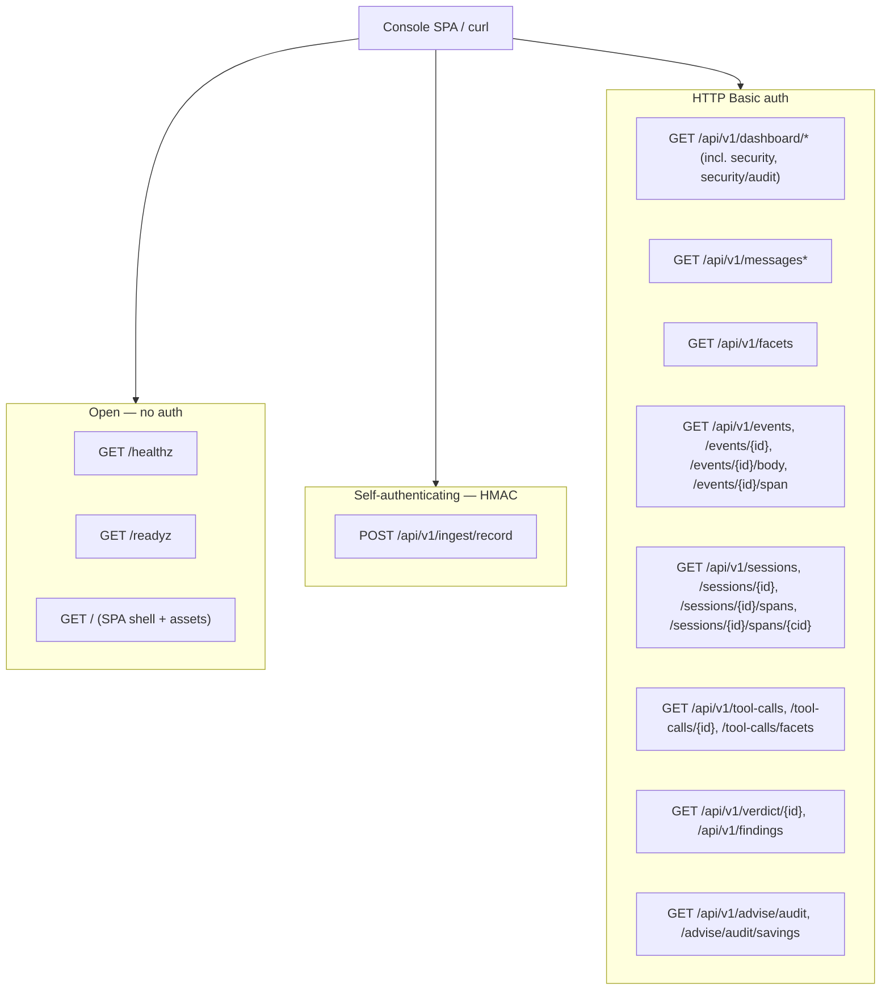

# Arbiter — Console Query API

The Arbiter exposes a read-only HTTP API that backs the operator
console (dashboard + message browser + per-request inspector). This page is the
route-by-route reference: paths, methods, query parameters, pagination, caching,
response shapes, and the auth model.

For the service as a whole — deployment topology, the two ingest listeners,
config YAML, and HMAC trust — see [arbiter.md](arbiter.md).
For the Record webhook that *feeds* this API see
[arbiter-webhook.md](arbiter-webhook.md); for the table shapes the queries
read see [arbiter-database-schema.md](arbiter-database-schema.md).

All routes are served from one `http.ServeMux` built in
`internal/arbiter/server/server.go::Server.Handler` and listen on the console
HTTP bind (default `0.0.0.0:8686`, config key `http_bind`). The OTLP ingest
listener (`:8687` gRPC) is a separate server and carries no HTTP API.

## Surface map

The mux splits into three trust zones:



- **Open probes + SPA** — liveness/readiness and the static SPA bundle are
  unauthenticated (`server.go::handleHealthz`, `handleReadyz`, `spaHandler`).
  The SPA is public because the API it calls is itself gated.
- **`POST /api/v1/ingest/record`** — mounted only when a webhook handler is
  wired in (`server.go::Handler`, the `s.webhook != nil` branch). It
  authenticates itself with an HMAC signature header rather than Basic auth, so
  it sits in the open zone. Full spec in
  [arbiter-webhook.md](arbiter-webhook.md).
- **Console query API** — everything under `/api/v1/` except `ingest/record` is
  registered by `server.go::registerQueryRoutes` (in `query.go`) and wrapped in
  `Server.basicAuth`. These routes only mount when the server was built with a
  non-nil `Queries` (`New(...)` in `server.go`); without a store-backed query
  layer they are absent.

## Authentication

Every `/api/v1/dashboard/*`, `/messages*`, `/facets`, `/events*`,
`/sessions/*`, `/verdict/{id}`, and `/findings` route is wrapped by `Server.basicAuth`
(`server.go::basicAuth`, lines 109-127). The credentials are the single console
user from config (`console.username` + `console.password_hash`, a bcrypt hash;
see [arbiter.md](arbiter.md#configuration)). There is no env
override and no second account.

```
Authorization: Basic base64(username:password)
```

- Username is compared with `subtle.ConstantTimeCompare`; the password with
  `bcrypt.CompareHashAndPassword`. Both branches are evaluated regardless of the
  username result so a wrong user and a wrong password cost the same
  (`credentialsValid`, lines 121-127).
- A rejected request returns a **bare `401` with `text/plain` body
  `unauthorized\n` and deliberately NO `WWW-Authenticate` header** (lines
  100-108). This mirrors `internal/admin.BasicAuth`: the SPA drives the login
  form itself and sends `Authorization` on every fetch, so suppressing the
  challenge header stops browsers from popping their native auth dialog over the
  SPA on each poll. `curl --basic -u user:pass` still works.

## Response compression

Every Basic-auth-gated query route negotiates **gzip** response compression
(`withGzip`, `internal/arbiter/server/gzip.go`): a request whose
`Accept-Encoding` includes `gzip` (with a non-zero q-value) gets a gzipped
body with `Content-Encoding: gzip` + `Vary: Accept-Encoding`; anything else
gets identity bytes, so `curl | jq` keeps working unchanged (`curl
--compressed` opts in). The console's large JSON payloads (span pages, event
lists) compress >10x; compression sits inside the auth gate, so unauthorized
responses and the open probe/ingest/SPA routes are never compressed.

## Common query parameters

The console query routes share two parameter families.

### Filters

`filterFromQuery` (`query.go`, lines 53-66) reads the same equality + status
filters on every route that takes them (dashboard summary/timeseries, messages,
messages/recent, events). Each maps to a column predicate in
`store.EventFilter` / `appendFilter` (`eventquery.go`, lines 20-76):

| Param | Column | Semantics |
|---|---|---|
| `configuration` | `configuration` | **repeatable**; `?configuration=a&configuration=b` matches events whose value is **ANY** of the listed ones (`= ANY($N)`, OR within the dimension) |
| `gateway` | `gateway_id` | exact match |
| `model` | `model` | **repeatable**; OR within the dimension, as `configuration` |
| `provider` | `provider` | **repeatable**; OR within the dimension (post-rule provider) |
| `protocol` | `protocol` | **repeatable**; OR within the dimension (the wire protocol/endpoint; the UI labels this column **"endpoint"**) |
| `status_class` | `status_code` | one of `2xx` / `4xx` / `5xx`; maps to a range predicate (`5xx` is open-ended `>= 500`) — `statusClassBounds`, lines 81-92 |
| `status_code` | `status_code` | **repeatable**; exact codes ORed (`status_code = ANY`). Blank/non-numeric entries are dropped (`intValues`). Composes (AND) with `status_class`. |
| `session_id` | `session_id` | exact match |
| `correlation_id` | `correlation_id` | exact match |
| `agent_id` | `agent_id` | exact match (the resolved agent/sub-agent id) |
| `user_id` | `user_id` | exact match (the resolved end-user id) |
| `tags` | `tags` | **repeatable**; `?tags=a&tags=b` requires the event's post-rule tag set to contain **ALL** listed tags (array `@>` containment against the promoted `tags text[]` column, GIN-indexed via `request_events_tags_arr`). Blank values are dropped (`nonEmpty`). |

An absent or empty param adds no predicate on that dimension. All present
predicates are AND-combined. Note the two multi-value semantics: the four
categorical dimensions (`configuration`/`model`/`provider`/`protocol`) OR
their values (an event matches any listed value), while `tags` ANDs its values
(the event must carry all of them). Blank values are dropped everywhere. The
**dashboard** routes read these dimensions single-valued (the first occurrence)
— multi-value applies to the browser routes (`/messages`, `/events`,
`/sessions`, `/tool-calls`).

> **Naming note.** The `protocol` filter and the `protocols` facet are the same
> `request_events.protocol` column, surfaced on the wire as `protocols`
> (`store.Facets.Protocols`, `facets.go`, lines 18-20). If the SPA shows an
> "endpoint" label for this column, that is a UI label only — the wire key is
> `protocols`, and there is no `endpoints` field.

### Time window

Two distinct window conventions:

- **Dashboard routes** use a coarse `?window` token — one of `15m`, `1h`, `6h`,
  `24h`, `7d`, `30d`; an unknown or absent token defaults to `1h`
  (`observability.go::parseWindow`, lines 23-38). The upper bound is padded by a
  one-minute `clockSkewMargin` so an event stamped by a slightly-ahead Postgres
  `now()` still falls inside the window (lines 40-50).
- **Browser routes** (`/messages`, `/events`) use precise `?from` / `?to`
  bounds, each an **RFC3339** timestamp (`parseWindowBounds`, lines 83-100). An
  unparseable value returns `400 {"error":"invalid from"}` (or `invalid to`). An
  absent bound adds no predicate, so the browser pages across all history unless
  explicitly bounded.

## Pagination (keyset cursor)

`/messages` and `/events` page with a stable keyset cursor, not an offset.
Ordering is `(observed_at DESC, correlation_id DESC)`
(`ListEventsFiltered`, `eventquery.go` lines 141-211).

- **Page size** comes from `?limit`. The store default is **100** and the cap is
  **500** (`eventListPageDefault` / `eventListPageMax`, lines 136-139); a
  `limit <= 0` or out-of-range value is clamped. The HTTP layer passes `limit=0`
  by default for these two routes (`intParam(r, "limit", 0)`), so they inherit
  the store's 100/500.
- The store fetches `limit+1` rows to learn whether a further page exists. When
  it does, `next_cursor` encodes the last *returned* row's position; otherwise
  `next_cursor` is `""` (the final page).
- The **cursor is opaque**: base64url (`RawURLEncoding`, no padding) of the JSON
  `{"o": "<observed_at RFC3339Nano>", "c": "<correlation_id>"}`
  (`eventCursor` + `encodeCursor`, lines 113-122). Do not construct it by hand.
- A malformed/tampered cursor returns `400 {"error":"invalid cursor"}`
  (`store.ErrInvalidCursor`, surfaced in `handleObsMessages` / `handleEvents`).

Paging example (each request reuses the prior `next_cursor`):

```bash
# page 1
curl -u admin:… 'http://localhost:8686/api/v1/messages?limit=50'
#   → {"entries":[…50…],"next_cursor":"eyJvIjoi…"}

# page 2
curl -u admin:… 'http://localhost:8686/api/v1/messages?limit=50&cursor=eyJvIjoi…'
#   → {"entries":[…50…],"next_cursor":"eyJvIjoi…2"}

# page 3 (final)
curl -u admin:… 'http://localhost:8686/api/v1/messages?limit=50&cursor=eyJvIjoi…2'
#   → {"entries":[…12…],"next_cursor":""}
```

Hold every filter/window param constant across the sequence — the cursor only
encodes position, not the predicate set.

## Routes

All routes are `GET` and return `application/json` on success. Errors are a JSON
`{"error":"…"}` body (`server.go::writeError`). Common codes: `400` (bad
param/cursor), `401` (auth), `404` (not found), `500` (query failure — the
detail is logged, not returned).

### Dashboard

#### `GET /api/v1/dashboard/summary`

Handler `handleObsSummary` (`observability.go`, lines 52-65). Accepts `?window`
plus the full filter set. Returns `contracts/admin.DashboardSummary`
(`contracts/admin/dashboard.go`), mapped from `store.DashboardSummary`
(`store/dashboard.go::QueryDashboardSummary`). Top-level fields:

| Field | Meaning |
|---|---|
| `window` | the resolved window token |
| `generated_at`, `gateway_started_at` | server time (UTC) |
| `totals` | `requests`, `requests_success`, `requests_errored`, `tokens_in/out/cached/cache_creation` |
| `rates` | `requests_per_second`, `error_rate` |
| `by_provider`, `by_protocol`, `by_configuration`, `by_model` | per-dimension breakdown rows (requests, error_rate; model rows carry token sums) |
| `rules_fired`, `tags_fired` | per-rule / per-tag fire counts + the configurations that produced them |
| `provider_health` | a short trailing-window (`now-5m`) per-provider health snapshot |

> **Latency percentiles dropped for MVP.** Earlier builds returned a `latency_ms`
> object (`p50`/`p95`/`p99` via Postgres `percentile_cont`) and per-dimension p95.
> The dashboard now reads the TimescaleDB continuous aggregates over `metric_points`
> (count/sum only, plain `timescaledb` without the percentile toolkit), and the
> latency histograms never reach `metric_points`, so the summary exposes **no
> latency quantiles**. Per-request `latency_ms` is still available in the inspector
> (decoded from the event's `span_event` blob). Quantiles return when the toolkit
> is adopted post-MVP.

> **Invariant #4.** Every dashboard panel aggregates a continuous aggregate over
> the meter feed: the request/outcome/`by_*` panels over `cagg_requests_1m`, token
> totals over `cagg_tokens_1m`, cost totals (`totals.cost_usd` +
> `totals.cost_by_category`, plus the `by_model` `cost_usd` column) over
> `cagg_cost_1m`, and `rules_fired` / `tags_fired` over
> `cagg_rules_1m` / `cagg_tags_1m` (`slipspace.rule.fired`,
> `gateway.tags.applied.total`) — `store/dashboard.go::queryDashFired`. Dashboards
> read meters, never a scan of the `request_events` entity or the captured record.

#### `GET /api/v1/dashboard/timeseries`

Handler `handleObsTimeseries`. Accepts `?window`, the filter set, and `?series`
— one of `requests` (default), `rps`, `error_rate`, `tokens_in`, `tokens_out`,
`cost` (`seriesValue`). The latency series (`p50`/`p95`/`p99`) are **gone** with
the MVP percentile drop — each `DashboardSeriesBucket` carries volume, errored
count, the two token curves, and the USD cost curve. The bucket width
auto-scales across the window. Returns `contracts/admin.DashboardTimeseries`:
one named `series` with `points` of `{timestamp, value}`, zero-filled across
empty buckets so the axis stays continuous. The series re-buckets the 1-minute
`cagg_requests_1m` / `cagg_tokens_1m` / `cagg_cost_1m` continuous aggregates up
to the requested width (`store/dashboard.go::QueryDashboardSeries`). `cost` is
the pricing engine's estimate (unit `USD`); buckets with no costing-enabled
gateway reporting read 0.

#### `GET /api/v1/dashboard/security`

Handler `handleObsSecurity` (`observability.go`). The Arbiter scanner posture for
the dashboard's security rows. Accepts `?window` only (no filter set). Returns
`contracts/admin.DashboardSecurity` mapped from
`store/dashboard_security.go::QueryDashboardSecurity`, over the verdict table:

| Field | Meaning |
|---|---|
| `enabled` | whether the scanner is on. **When `false` the handler returns this shape with zero counts and never touches the DB** — operators not running the scanner pay nothing, and the SPA renders the security rows only when `true`. |
| `window` | the resolved window token |
| `scanned` | requests that reached a verdict in the window |
| `flagged`, `partial`, `clean` | `scanned` split by terminal verdict state. **`partial` is first-class and never folds into `clean`** (ADR-017 / REF-008: inconclusive is not clean) |
| `by_check_type` | finding counts per check type (`injection` / `pii` / `toxicity`), `{key, count}`, descending |
| `top_categories` | most-common finding categories, `{key, count}`, server-capped |

> **Invariant #4.** The breakdown aggregates the `verdict` / `finding` tables the
> async scanner writes (`store/dashboard_security.go`), populated from the OTel
> gen_ai span, not from the connector record or S3. The security posture is still a
> read over the telemetry store.

#### `GET /api/v1/dashboard/security/audit`

Handler `handleObsSecurityAudit` (`observability.go`). The append-only log of
**operational scan failures** (timeout / detector-unreachable / detector-error /
no-detector / unit-missing) for the dashboard's scan-failures panel — distinct
from findings, which are detector *hits*. Accepts `?window` and `?limit` (default
100, hard cap 500). Like `/dashboard/security`, returns an empty (non-nil) item
list without a DB hit when the scanner is disabled. Returns
`contracts/admin.DashboardSecurityAudit` (`{window, items[]}`) mapped from
`store::ListScanAudit` (migration 16 `scan_audit` table). Each `ScanAuditEntry`:
`correlation_id`, `unit_id`, `check_type`, `detector_id` (empty when no detector
call was made), `reason`, `attempts`, `detail`, `occurred_at`.

### Messages (gateway-parity surface)

These three emit the exact `contracts/admin` shapes the gateway admin console
uses, so the shared SPA observability components decode them without
translation.

#### `GET /api/v1/messages/recent`

Handler `handleObsMessagesRecent` (lines 85-97). The dashboard live feed:
filter set + `?limit` (default **200**), no window, no cursor. Returns
`contracts/admin.MessagesRecentResponse` `{capacity, entries}` — entries
**oldest-first** to match the gateway's live feed (`mapMessages` reverses the
newest-first store order).

#### `GET /api/v1/messages`

Handler `handleObsMessages`. The full message browser: filter set + `?from`/`?to`
(RFC3339) + `?cursor` + `?limit`. Returns `{"entries":[…], "next_cursor":"…", "total":N}`
where each entry is a `contracts/admin.MessageEntry` — **newest-first** (browser
order, unlike the live feed). `total` is the full filter + window match count
(page-independent) for the pager. Entries are served in store order (newest-first)
directly on the wire — the browser does **not** reverse client-side. Entry fields include the projected filter columns
(provider/model/configuration/protocol/status), plus the rich extras decoded from
the event's `span_event` blob (`store.SpanFields`): latency, token counts, the
streaming flag, the post-rule `tags`, `rules_matched` (`RuleHit{rule_name,
actions_applied, terminated, error_message}`), and `attempts` (`AttemptHit{target,
started_at, duration_ms, status_code, error, outcome}`) — see `mapEntry`. A list
page returns rendered rows, so it does read `span_event`; the cost is bounded by
the page `LIMIT`, not the whole table (the pure-aggregate scans — dashboard
rollups, facet unnest — still touch columns only).

#### `GET /api/v1/messages/{id}/body`

Handler `handleObsMessageBody`. `{id}` is the correlation id. Returns
`contracts/admin.MessageBodyDetail` (`mapBody`) assembled from **two lazily-joined
sources**: the raw bodies/headers + assembled SSE rollup come from the verbatim
`record` blob (`request` / `response` bodies + `*_total_bytes`,
`response_assembled`, decoded `request_headers` / `response_headers`,
`assembly_partial`) — present **iff** reporting forwarding was on; the bounded
`gen_ai_content` comes from the entity's `span_event` blob — present **iff**
content capture was on. `404 {"error":"no body"}` only when **neither** the entity
nor a record exists for the id; if the entity exists but no record was pushed, the
response carries the gen_ai content with the raw bodies empty.

### Facets

#### `GET /api/v1/facets`

Handler `handleFacets`. Optional `?from` / `?to` RFC3339 bounds
(`parseWindowBounds`, same convention as the browser routes; a malformed bound
is a 400) scope the enumeration to events observed in that window, so the
dropdowns offer only values present in the range the table is showing. Absent
bounds enumerate all history. The route also accepts the **common filter
params** (`filterFromQuery` — e.g. `?session_id=`), narrowing every dimension
to the matching rows; the session view's messages table uses this to offer
only its session's values. Filtered lookups bypass the TTL cache (narrow
indexed scans; the cache holds only whole-window results). Returns the
distinct dropdown values for the message browser, including `status_codes`
(distinct exact HTTP codes, zero excluded):

```json
{
  "providers": ["anthropic", "openai"],
  "models": ["claude-opus-4-1", "gpt-4o"],
  "configurations": ["team-a"],
  "protocols": ["chat_completions", "messages"],
  "status_codes": [200, 429, 500],
  "tags": ["billing", "internal"]
}
```

Each list is sorted, excludes the empty string, and renders as `[]` rather than
`null` when empty (`nonNil`). `protocols` is the `protocol` column (see the
naming note above). `tags` is flattened out of the promoted `tags text[]`
column (migration v12), GIN-indexed via `request_events_tags_arr` — not the
`span_event->'tags'` blob path (`store/facets.go::Facets`). The prior blob scan
(`jsonb_array_elements_text(span_event->'tags')`) detoasted every ~95 kB span
and emptied all dropdowns past the request deadline; the column projection
(`unnest(tags)`) is what fixed it. The blob remains the source of truth for the
inspector, but facets and filters read the column.

**Caching.** Facets are memoized behind a mutex with a **30-second TTL**, one
entry per requested window (`facetsTTL` / `facetsCache`, `observability.go`).
The cache key quantizes the `from`/`to` bounds to 10-second buckets
(`facetsKeyQuantum`) — the SPA resolves relative presets ("last 1h") to a
fresh timestamp on every fetch, so exact bounds would never repeat and the
cache would never hit. The lock is held *across* the refresh query, so a burst
of concurrent dropdown opens on one window collapses into a single table scan
rather than a thundering herd; expired entries are pruned opportunistically. A
newly-seen provider/model/tag therefore appears in the dropdowns within at
most 30 seconds.

### Events + sessions (telemetry-native)

These extend beyond the gateway parity surface and emit `internal/arbiter`
shapes (`store` / `stitch`) rather than `contracts/admin`.

#### `GET /api/v1/events`

Handler `handleEvents` (`query.go`). Same filter + `?from`/`?to` + `?cursor` +
`?limit` as `/messages`, but returns the raw `store.RequestEvent` rows (scalar
columns + the `span_event` blob): `{"events":[…], "next_cursor":"…"}`.
Newest-first, keyset-paged. Like `/messages` it omits the default window unless
`from`/`to` are given.

#### `GET /api/v1/events/{id}`

Handler `handleEventInspector` (`query.go`). `{id}` is the correlation id.
Returns a `stitch.RequestView` — the single-writer entity joined lazily to its
(optional) verbatim record:

```json
{
  "event": { "...": "store.RequestEvent fields, incl. span_event" },
  "record": { "...": "the decoded cc.Record (omitted when none was pushed)" }
}
```

`event` is the entity the OTel span wrote; `record` is the gateway's verbatim
`cc.Record`, present **only** when reporting forwarding was on and the push has
arrived (`stitch.BuildRequestView`). `404 {"error":"event not found"}` when no
event matches (`store.ErrRequestEventNotFound`); a missing or malformed record is
tolerated — the view simply omits `record` and the inspector renders the entity's
`span_event` (rule chain, tags, gen_ai content) alone.

#### `GET /api/v1/events/{id}/body`

Handler `handleEventBody` (`query.go`). Returns just the decoded verbatim
`cc.Record` for the correlation id (request/response bodies, headers, rule chain,
attempts). `404 {"error":"no record"}` when none was pushed (reporting forwarding
off, or not yet arrived).

#### `GET /api/v1/sessions`

Handler `handleSessions`. The session-discovery list — a keyset page of session
summaries for the **Sessions** console page. Query params:

| Param | Meaning |
|---|---|
| `from` / `to` | RFC3339 window bounds (either omittable). A session is included when its **span overlaps** `[from, to)` — i.e. it was active during the window, even if it began before or continues after it. |
| `configuration` / `provider` / `protocol` / `model` (each repeatable) | Categorical filters (`store.EventFilter`); many values OR within the dimension (`= ANY`). |
| `tags` (repeatable) | AND containment over the post-rule tag set. |
| `cursor` | Opaque keyset cursor from a prior `next_cursor`. |
| `limit` | Page size (default 100, capped 500). |

The categorical / `tags` predicates are applied to the rows **before**
aggregation, so a session appears when it has matching requests overlapping the
window and the rollup (`messages` / `total_tokens` / `total_cost` / `models` /
`started_at` / `last_activity`) reflects only the matching subset. `started_at` / `last_activity`
are the session's real bounds and may fall outside the window. Results are ordered
by `last_activity DESC, session_id DESC`.

```json
{
  "sessions": [
    {
      "session_id": "sess-123",
      "messages": 4,
      "total_tokens": 6000,
      "total_cost": 0.0421,
      "models": ["claude-opus-4-8", "claude-haiku-4-5"],
      "started_at": "2026-06-07T10:00:00Z",
      "last_activity": "2026-06-07T10:42:00Z"
    }
  ],
  "next_cursor": ""
}
```

`next_cursor` is empty on the last page; `400 {"error":"invalid cursor"}` for a
malformed cursor, `400 {"error":"invalid from"}` / `invalid to` for an
unparseable bound. Like the dashboard facets, the underlying query is a
whole-table grouped scan, so the console defaults it to a recent window.

#### `GET /api/v1/sessions/{id}`

Handler `handleSession` (`query.go`). `{id}` is the session id. Returns the
tagged `contracts/admin.SessionView`: every event sharing the session mapped
through `mapEntry` (the `MessageEntry` shape), **oldest-first**, plus
aggregate `totals`:

```json
{
  "session_id": "sess-123",
  "requests": [ { "...": "contracts/admin.MessageEntry" } ],
  "totals": { "requests": 4, "errors": 1, "tokens_in": 5120, "tokens_out": 880 }
}
```

A request with `status_code >= 400` counts as an error
(`stitch.BuildSessionView`). `404 {"error":"session not found"}` when no event
carries that session id.

**Memory discipline.** The rollup reads `store.EventsBySessionRollup` — a
keyset-batched scan over the **narrow projection** that strips
`gen_ai_content` from `span_event` in SQL (`sessionRollupColumns`), so the
captured content (the only unbounded key on the blob) never leaves Postgres
for this view. A whole session costs O(rows × stripped-blob), bounded per row
regardless of session size. (The pre-fix form selected every full blob into
memory — ~280 MB on a 688-message session — and OOM-killed the service.)

#### `GET /api/v1/sessions/{id}/spans`

Handler `handleSessionSpans` (`sessionspans.go`). The **session lifecycle**
feed: the session's gen_ai spans in **SessionSpansDTO v1** — the shape the
lifecycle page renders lanes, gaps, the tool ledger, and exec stats from
(`contracts/admin.SessionSpan`). One element per request event, ordered by
`at` (oldest first, `(observed_at, correlation_id)`).

**Keyset-paged** (`contracts/admin.SessionSpansPage`): the response is
`{"spans": […], "next_cursor": "…"}`. Query params:

| Param | Meaning |
|---|---|
| `cursor` | Opaque keyset cursor from a prior `next_cursor` (same encoding as the event list). Empty/absent = first page. |
| `limit` | Page size (default 200, capped 500). |
| `include` | `structure` serves the **envelope-only** projection: the content bodies (part `text`, tool `args`, `input_text`, `output_text`) are omitted while every id, name, `*_chars` size, timing, and usage field survives. Any other value (or none) serves the full bodies — the back-compat default. |

`next_cursor` is empty on the last page; `400 {"error":"invalid cursor"}` for
a malformed cursor. The SPA fetcher (`web/src/lib/session-spans.ts`) follows
`next_cursor` until exhausted, so the page still renders the complete session
— paging bounds *server* memory, not the rendered list. The store streams
rows through a callback (`store.EventsBySessionPage`) into a small
order-preserving worker pool (`spanProjectWorkers`, capped at 8), so the
service holds a bounded handful of full `span_event` blobs plus one page of
capped DTOs at a time — never the whole session (the pre-paging single-shot
array peaked at 600 MB+ on big sessions and OOM-killed the service) — while
the page's per-row blob decode runs in parallel instead of serially.

**Why `include=structure` exists.** The lifecycle dashboard renders lanes,
gaps, the tool ledger, and exec stats from the part ENVELOPE + sizes alone —
content bodies are only ever shown in the span inspector modal. Serving the
bodies on every page made a 125-span page 3.3 MB / 3.5 s (2026-06-10 prod
baseline); structure pages are KBs. The SPA requests `include=structure` for
the dashboard and lazy-fetches the single span the modal needs (below).

#### `GET /api/v1/sessions/{id}/spans/{cid}`

Handler `handleSessionSpan` (`sessionspans.go`). One span's **full** DTO
element — a single `contracts/admin.SessionSpan` (not wrapped in a page
envelope), content bodies included, still per-field capped — the lazy fetch
behind the lifecycle page's span inspector, which renders the dashboard from
envelope-only structure pages and pulls one full span on modal open.
`404 {"error":"span not found"}` when the correlation id is unknown **or**
belongs to a different session, so the session-scoped route never leaks
spans across sessions.

Everything is projected from the `request_events` columns plus the
`span_event` blob — the span feed alone, never the lazy `record` blob, so the
projection works whether or not reporting forwarding was on:

```json
{
 "next_cursor": "",
 "spans": [
  {
    "cid": "0b8e…",
    "at": "2026-06-10T12:00:00Z",
    "latency_ms": 1234,
    "ttfc_ms": 250,
    "status": 200,
    "model": "claude-opus-4-8",
    "finish_reason": "tool_use",
    "session_id": "sess-123",
    "conversation_id": "sess-123",
    "parent_conversation_id": null,
    "usage": {
      "input": 100, "output": 25, "cache_read": 64, "cache_creation": null,
      "server_tool_use": { "web_search_requests": 2 }
    },
    "output_parts": [
      { "type": "text", "chars": 5 },
      { "type": "reasoning", "chars": 40 },
      { "type": "tool_call", "id": "toolu_01", "name": "Bash",
        "args": "{\"command\":\"make e2e\"}", "args_chars": 22 }
    ],
    "input_parts": [
      { "type": "tool_call_response", "id": "toolu_00", "chars": 13,
        "text": "ok: 12 passed" }
    ],
    "input_text": null, "input_text_chars": null,
    "output_text": "on it", "output_text_chars": 5
  }
 ]
}
```

Field sources: `latency_ms` is the blob's derived `slipspace.latency_ms`;
`ttfc_ms` converts `gen_ai.response.time_to_first_chunk` (seconds, streaming
only) to ms; `status` prefers `slipspace.upstream_status` over the client-facing
column; `finish_reason` is the first `gen_ai.response.finish_reasons` entry;
the usage counts are presence-keyed (null when the span carried no such
attribute, distinguishing "not reported" from zero) and `server_tool_use`
collects every `gen_ai.usage.server_tool_use.*` counter. The part envelopes
come from the blob's `gen_ai_content` (`{input_messages, output_messages}`,
present only when content capture was on): output parts map the normalizer's
uniform shape onto `text`/`reasoning` (size only), `tool_call`
(`id`/`name`/raw `args` JSON), and `tool_call_response` (`id` + result
`text` — server-executed tools land call + response on the same span); other
block types (media) become `unknown`. Input parts keep only `text` and
`tool_call_response` — a `tool_call_response.id` here joins a *prior* span's
`tool_call.id` (the renderer's exact-ledger rule).

**Truncation policy: per-field server cap.** Each served content field —
text, tool `args`, `input_text`, `output_text` — is capped at
`span_field_max_bytes` (default 65536; `0` disables), cut on a rune boundary
so capped fields stay valid UTF-8. Every `*_chars` field carries the TRUE
uncapped size (counted in Unicode code points), so the renderer's "showing
first N of M (server cap)" notice fires exactly when the server truncated.
This revises the v1 "no truncation" decision: full fidelity is unsafe while
ingest content caps are disabled (`content_max_bytes: 0`), and 64 KiB per
field keeps any realistic page to tens of MB. Truncation remains a server
prerogative per the DTO schema — a cap change never changes the renderer.

`404 {"error":"session not found"}` when the **first** page of a session is
empty (same as the sibling `/sessions/{id}`); an empty continuation page (a
`cursor` was given) is a normal `200` end-of-list.

> **Invariant #4 compliance.** `sessions/{id}` and `events/{id}` assemble their
> views from the `request_events` entity (and, for `events/{id}`, the lazily-joined
> `record` blob) the ingest listeners populate — never from the connector spool or
> S3. The console is a read view over the telemetry store, not a record-scan reader.

### Tool calls (audit index)

Individual tool calls extracted into a first-class, searchable `tool_call` table
(migration 18) so an operator can audit every invocation of a named tool — e.g.
every `Skill` call — and inspect its input arguments and eventual result. The
gateway already normalises tool calls across all three providers into a uniform
part shape inside `span_event.gen_ai_content`; ingest reads those parts out of
the blob (no per-protocol parsing) and upserts one row per `tool_call_id`. See
the Tool-Call Index design note (DonkeyWork) and
`internal/arbiter/store/toolcalls.go`.

A single invocation spans **two** spans of the same session: the **call**
(name + arguments) rides an assistant *response*, and its **result** rides the
*next request*. The two halves are joined on the provider-assigned
`tool_call_id` (`toolu_…` / `call_…`); a row whose result has not arrived yet is
`status: "pending"` (e.g. a client tool the caller abandoned) — a real state,
not an error. Extraction requires content capture (`SLIPSPACE_OTEL_CAPTURE_CONTENT`);
arguments are stored whole as JSONB, the result text is capped at ingest (64 KiB,
true size in `result_chars`). Gemini function calls carry no wire id and so are
not indexed.

#### `GET /api/v1/tool-calls`

Handler `handleToolCalls` (`toolcalls.go`). Filtered, keyset-paged list, newest
first by `observed_at` (the first-seen time), in a `{tool_calls, next_cursor}`
envelope. Filters (all AND across dimensions, all optional): `name` (tool
name), `provider`, `configuration`, `protocol`, `model` — each **repeatable**,
many values OR within the dimension (`= ANY`) — plus `session_id` (exact),
`status` (`pending` | `resolved`), and a `from`/`to` window on `observed_at`.
`limit` defaults to 100, capped at 500.

```json
{
 "next_cursor": "",
 "tool_calls": [
  {
    "tool_call_id": "toolu_01",
    "tool_name": "Skill",
    "session_id": "sess-123",
    "status": "resolved",
    "executor": "client",
    "provider": "anthropic",
    "configuration": "dev",
    "protocol": "messages",
    "model": "claude-opus-4-8",
    "arguments": { "skill": "ship" },
    "arguments_chars": 16,
    "result": "done",
    "result_chars": 4,
    "call_correlation_id": "corr-a",
    "response_correlation_id": "corr-b",
    "called_at": "2026-06-19T12:00:00Z",
    "responded_at": "2026-06-19T12:00:05Z",
    "observed_at": "2026-06-19T12:00:00Z"
  }
 ]
}
```

`arguments` embeds the model's argument object as raw JSON (omitted when the call
had none); `arguments`/`result` are bounded as above with `*_chars` carrying the
true sizes. A bad `from`/`to` or `cursor` is `400`.

#### `GET /api/v1/tool-calls/{id}`

Handler `handleToolCall`. One tool call by `tool_call_id` (the same entry shape,
full bounded arguments + result). `404 {"error":"tool call not found"}` when the
id is unknown.

#### `GET /api/v1/tool-calls/facets`

Handler `handleToolNames`. The distinct tool names seen, sorted, for the audit
page's tool dropdown: `{ "tool_names": ["Bash", "Read", "Skill"] }` (always an
array, never null). The literal `/facets` route is matched ahead of `/{id}`.

> **Invariant #4 compliance.** The `tool_call` table is a per-call index derived
> from the same gen_ai span feed as `request_events` — never the connector spool
> or S3, and not a meter. Aggregate dashboard panels still read CAGGs over
> `metric_points`; this surface is a per-call audit read, not an aggregate.

### Advise audit (agent routing)

Every agent-routing judgement the advisor serves — fresh, cached, or failed —
is recorded post-response in the append-only `advise_audit` table (migration
21): the payload the judge saw (identity, prompt excerpts, tools), the verdict,
and the cache/latency/error facts. See [agent-routing.md](agent-routing.md)
and [arbiter-database-schema.md](arbiter-database-schema.md#advise_audit).

#### `GET /api/v1/advise/audit`

Handler `handleAdviseAudit` (`advise_audit.go`). The judgement log, newest
first, in an `{items}` envelope mirroring the table in snake_case
(`received_at`, `gateway_id`, `conversation_id`, identity + payload fields,
`verdict_switch` / `verdict_model` / `verdict_reason` / `verdict_confidence`,
`cache_hit`, `judge_latency_ms`, `error`). `limit` caps the page (store-clamped
to 200); `before` (RFC3339) is the keyset cursor — pass the last row's
`received_at` to fetch the next page. A bad `before` is `400`.

#### `GET /api/v1/advise/audit/savings`

Handler `handleAdviseSavings`. Savings attribution for the traffic the judge
down-ranked: for every switch verdict since `?since=` (RFC3339, default the
last 24 hours), the requests that actually ran pinned (`request_events` joined
on `conversation_id` + the `agent-route:<model>` tag, at or after the verdict)
and their summed `cost_usd`, scaled into a counterfactual by the operator's
`advise.model_rates` ratios (counterfactual = actual x rate[requested] /
rate[pinned]):

```json
{
 "since": "2026-07-16T08:00:00Z",
 "items": [
  {
    "conversation_id": "conv-1",
    "requested_model": "claude-opus-4-8",
    "pinned_model": "claude-haiku-4-5",
    "pinned_requests": 21,
    "actual_usd": 2.1,
    "counterfactual_usd": 10.5,
    "saved_usd": 8.4
  }
 ],
 "totals": {
  "actual_usd": 2.1,
  "counterfactual_usd": 10.5,
  "saved_usd": 8.4,
  "judge_cost_usd": 0.12,
  "net_saved_usd": 8.28
 }
}
```

A row whose requested or pinned model has no configured rate carries **null**
`counterfactual_usd` / `saved_usd` (never guessed) and is excluded from those
totals; `actual_usd` always sums. `judge_cost_usd` is the summed `cost_usd` of
every request the judge itself made in the window (keyed on its
`advise-judge` named-agent id), and `net_saved_usd` charges it against the
saving — the routing layer's overhead is always on the bill. A bad `since` is
`400`.

### Security — findings + verdict (Arbiter)

The async SlipSpace Arbiter scanner writes per-finding rows and a reduced
per-request verdict; these two routes read them back for the console's Security
surfaces. Both mount unconditionally (like the rest of the query API), but return
empty/clean shapes when the scanner has written nothing. Detector contract,
verdict reduction, and storage are in
[arbiter-database-schema.md](arbiter-database-schema.md) (migrations 13–17)
and the DonkeyWork *SlipSpace Arbiter* milestone (ADR-014/017/018).

#### `GET /api/v1/verdict/{id}`

Handler `handleVerdict` (`verdict.go`). The verdict **plus** findings for one
request, keyed by correlation id, for the message inspector's Security pane.
Returns `contracts/admin.VerdictResponse`. A missing verdict (scan not yet at
quiescence, or scanner disabled) is **not a 404** — it returns `200` with
`verdict: null` and whatever findings exist, so the console renders "no verdict
yet" rather than an error.

| Field | Meaning |
|---|---|
| `correlation_id` | the request this describes |
| `verdict` | reduced outcome, or `null` when no verdict row exists yet |
| `verdict.state` | `"flagged"` / `"partial"` / `"clean"` (ADR-017) |
| `verdict.max_score` | highest finding score (highest-risk-wins) |
| `verdict.top_category` | category of the highest-scoring finding |
| `verdict.severity` | worst operator-assigned level across findings (`info`/`warning`/`error`); empty when none |
| `verdict.finding_count` | number of findings on the request |
| `verdict.inconclusive` | check types that timed out/failed — the set that raises the request to PARTIAL; never read as clean |
| `findings[]` | per-hit detail: `unit_id`, `check_type`, `category`, `score`, `raw_label`, `detector`, `localization`, `offending_text`, `severity` |

#### `GET /api/v1/findings`

Handler `handleFindings` (`verdict.go`). A flat, newest-first list of findings —
the operator Security view. With **`?session=<id>`** it returns every finding in
that one session (the session view's Security tab); without it, the most recent
findings across all sessions (the top-level Security page), bounded by `?limit`
(store default ~100). One row shape (`contracts/admin.FindingRow`) backs both,
sourced from `store::ListFindingsBySession` / `ListRecentFindings`. Returns
`contracts/admin.FindingsListResponse` (`{items[]}`). Each row is finding-centric
and carries both deep-link targets — `correlation_id` (→ message inspector) and
`session_id` (→ session view) — plus the request facts the operator triages by
(`observed_at`, `model`, `configuration`), the offending unit's `unit_kind` /
`unit_role`, the `offending_text` that fired, and the `severity` band. Fields
sourced from the source `request_events` row (`model`, `configuration`,
`observed_at`) are empty when that row has aged out of retention.

## Error reference

| Code | Body | When |
|---|---|---|
| `400` | `{"error":"invalid from"}` / `invalid to` | unparseable RFC3339 window bound |
| `400` | `{"error":"invalid cursor"}` | malformed/tampered keyset cursor |
| `401` | `unauthorized\n` (text/plain) | missing/wrong Basic credentials — note: no `WWW-Authenticate` |
| `404` | `{"error":"event not found"}` / `no body` / `no record` / `session not found` / `span not found` | unknown correlation/session id, cross-session span cid, or no stored record for the id |
| `500` | `{"error":"<op>"}` | query failed; detail logged server-side only (`queryError`) |

## See also

- [arbiter.md](arbiter.md) — service overview, two-listener
  topology, config YAML, deployment, HMAC trust.
- [arbiter-webhook.md](arbiter-webhook.md) — the `POST /api/v1/ingest/record`
  HMAC webhook that feeds the store this API reads.
- [arbiter-database-schema.md](arbiter-database-schema.md) —
  `request_events` (single-writer entity + `span_event`), the lazy `record` blob,
  and `metric_points` + continuous aggregates.
