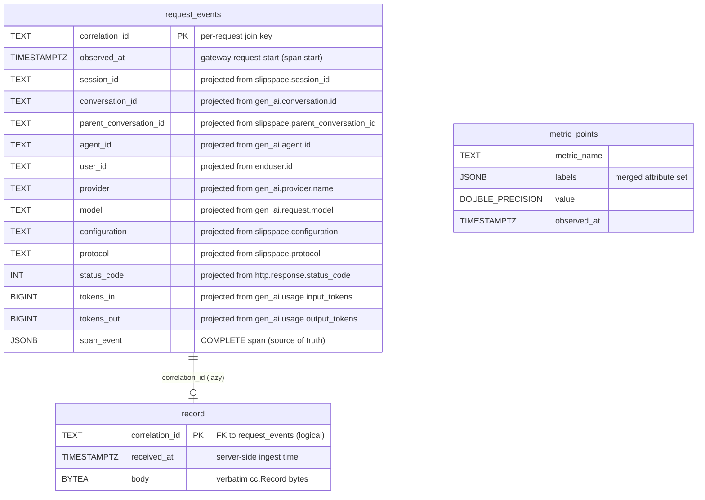

# Arbiter Database Schema

The Arbiter stores everything it ingests in a single Postgres (TimescaleDB) database: a single-writer per-request entity owned by the OTel span feed, a lazily-joined verbatim record blob, and the raw OTLP metric timeseries the dashboard reads through continuous aggregates. This page is the operator's and developer's reference for that schema — the tables, their columns and indexes, the span_event projection, the lazy record join, the CAGG metrics plane, and the migration history.

The source of truth lives in [`internal/arbiter/store/`](../internal/arbiter/store/). If a value here disagrees with that package, the code wins — open a PR. For the service that owns this database (deployment topology, ports, config YAML, ingest contracts, query API, console), see [arbiter.md](arbiter.md).

---

## Table of contents

1. [Mental model](#mental-model)
2. [Entity-relationship diagram](#entity-relationship-diagram)
3. [`request_events`](#request_events)
4. [The span_event projection](#the-span_event-projection)
5. [`record`](#record)
6. [`metric_points` + continuous aggregates](#metric_points--continuous-aggregates)
7. [Migration history](#migration-history)
8. [Schema bookkeeping](#schema-bookkeeping)
9. [Cross-references](#cross-references)

---

## Mental model

> **Single writer, one join key.** The OTel span feed is the sole writer of the `request_events` entity. `correlation_id` ties that entity to its lazily-joined verbatim `record` blob; metric samples correlate only by shared label values, never by a foreign key.

The Arbiter receives a request's observability over two independent channels:

- the **gen_ai OTLP feed** (`:8687` gRPC) — both the trace service, whose spans are the **single writer** of `request_events`, and the metrics service, whose number data points land in `metric_points`;
- the **gateway Record webhook** (`:8686` HTTP) — which lands the gateway's verbatim `cc.Record` bytes in the `record` table, joined to the entity lazily by `correlation_id` only when the inspector's record tab opens.

This is a **single-writer** model. The span feed owns `request_events` outright: `EventFromSpan` stores the **complete span** verbatim into an immutable `span_event JSONB` column and projects the filter columns out of it. The Record feed no longer writes the entity at all — there is **no cross-feed COALESCE merge**, and the old `request_payloads` table is gone. The dashboard reads pre-aggregated TimescaleDB **continuous aggregates** over `metric_points`, never a scan of the entity.

There is no ORM and no schema-generation magic: the schema is forward-only SQL strings in [`internal/arbiter/store/migrations.go`](../internal/arbiter/store/migrations.go), applied by a hand-rolled runner ([`store.go::Migrate`](../internal/arbiter/store/store.go)) that records each step in `schema_migrations`.

---

## Entity-relationship diagram

> `record` is joined to `request_events` by `correlation_id`, but there is **no database-level foreign key** — a record can be webhook-pushed before (or without) its span, and an event can exist with no record (reporting forwarding off), so the relationship is a logical, lazy join. `metric_points` has no join column at all; it correlates to events only by shared label values (e.g. `slipspace.configuration`), and the dashboard reads it through its continuous aggregates as an independent timeseries (invariant #4: dashboards read meters, never record scans).

---

## `request_events`

The single-writer per-request entity. The **OTel span feed is the sole writer**, keyed `correlation_id`. The scalar columns are a **materialized index projected from `span_event`** at ingest — the immutable blob is the source of truth, the columns are backfillable from it by re-projecting. List/filter/facet queries read the columns and never `SELECT span_event`; drill-down selects the blob and decodes it into `SpanFields`. Defined in [`events.go::RequestEvent`](../internal/arbiter/store/events.go) and rebuilt by migration 6.

| Column | Type | Default | Projected from | Notes |
|---|---|---|---|---|
| `correlation_id` | `TEXT` | — | `slipspace.correlation_id` | **Primary key**; the per-request join key. The only span attribute whose absence makes a span unusable. |
| `observed_at` | `TIMESTAMPTZ` | `now()` | span START time | The gateway request-start, **not** ingest `now()` — load-bearing for ordering, pagination, and retention. A zero start defaults to server `now()` only as a last resort. |
| `session_id` | `TEXT` | `''` | `slipspace.session_id` | Resolved session bundle root (falls back to `gen_ai.conversation.id` for spans predating the attribute). |
| `conversation_id` | `TEXT` | `''` | `gen_ai.conversation.id` | The per-turn conversation/thread (subagent thread when active, else the session). Added by migration 9. |
| `parent_conversation_id` | `TEXT` | `''` | `slipspace.parent_conversation_id` | Links a subagent thread toward its session; empty for a main agent. Added by migration 9. |
| `agent_id` | `TEXT` | `''` | `gen_ai.agent.id` | Resolved id of a genuinely named agent (a subagent thread rides `conversation_id`, not this). |
| `user_id` | `TEXT` | `''` | `enduser.id` | Resolved end-user id. |
| `provider` | `TEXT` | `''` | `gen_ai.provider.name` | Post-rule upstream provider. |
| `model` | `TEXT` | `''` | `gen_ai.request.model` | Requested model. |
| `configuration` | `TEXT` | `''` | `slipspace.configuration` | Resolved policy-bundle name (a gateway span fact). |
| `protocol` | `TEXT` | `''` | `slipspace.protocol` | Post-rule wire protocol / endpoint (a gateway span fact). |
| `status_code` | `INT` | `0` | `http.response.status_code` | Client-facing HTTP status. |
| `tokens_in` | `BIGINT` | `0` | `gen_ai.usage.input_tokens` | Promoted by migration 10 (#318/#325) so the session-list aggregate sums tokens without detoasting `span_event`. Pre-v10 rows read 0 until the run-once boot backfill (`store.BackfillTokenColumns`) re-projects them. |
| `tokens_out` | `BIGINT` | `0` | `gen_ai.usage.output_tokens` | As `tokens_in`. |
| `cost_usd` | `DOUBLE PRECISION` | `0` | `slipspace.cost.usd` | Promoted by migration 20 so the session-list and per-thread spend aggregates sum cost without detoasting `span_event`. Pre-v20 rows read 0 until the run-once boot backfill (`store.BackfillCost`) re-projects them. Zero also means costing-off/unpriced — the blob's `slipspace.cost.unpriced` flag disambiguates on drill-down. |
| `tags` | `text[]` | `'{}'` | `slipspace.tags` | Promoted by migration 12 (#318 facets-detoast fix) so the facets distinct-tag enumeration and session-list tag rollup read a GIN-indexed column instead of detoasting `span_event`. Pre-v12 rows read `'{}'` until the run-once boot backfill (`store.BackfillTags`) re-projects them. |
| `span_event` | `JSONB` | — (NOT NULL) | — | The **complete span** as received — every merged attribute plus the bounded gen_ai content — stored verbatim and never stripped. The scalar columns above are projections of it. |

> **Columns that do NOT exist (common query mistakes).** Everything else lives **inside `span_event`** — there is no `streaming` column (dropped by migration 6; query `(span_event->>'gen_ai.request.stream')::boolean`), no `latency_ms`, `detail`, or `gen_ai_content` columns (all migration-6 casualties, all blob keys now), and the cached / cache-creation token counts are blob-only. On the `record` table the payload column is **`body`**, not `blob` — "the record blob" is prose, not a column name. Both mistakes hit prod on 2026-06-10 (`ERROR: column "streaming" does not exist`, `ERROR: column "blob" does not exist`).

The upsert is one-sided: `insertEventSQL` ([`events.go`](../internal/arbiter/store/events.go)) does `INSERT … ON CONFLICT (correlation_id) DO UPDATE` where **every column is overwritten from the latest span**. There is one writer, so there is no cross-feed merge to preserve — a re-delivered span simply replaces the row.

### Indexes

Created by migration 6. The dashboard no longer scans this table (it reads the CAGGs), so the indexes now serve the **message browser and drill-downs** only.

| Index | Definition | Serves |
|---|---|---|
| `request_events_observed_corr` | `(observed_at DESC, correlation_id DESC)` | Keyset pagination of `/messages` and `/events`. |
| `request_events_filter` | `(observed_at DESC, configuration, provider, model, protocol, status_code)` | The message browser's faceted equality filters paired with a time range; `observed_at` leads so the range bound stays index-driven and the equality filters narrow within it. |
| `request_events_session` | `(session_id)` | Session grouping / lookup. |
| `request_events_agent` | `(agent_id)` | Agent lookup / drill-down. |
| `request_events_user` | `(user_id)` | End-user lookup / drill-down. |
| `request_events_conversation` | `(conversation_id)` | Subagent-thread drill-down (migration 9). |
| `request_events_parent` | `(parent_conversation_id)` | Children-of-a-parent drill-down (migration 9). |
| `request_events_tags` | `GIN ((span_event->'tags'))` | Tag containment filter (`span_event->'tags' @> …`) and the distinct-tag dropdown scan. |
| `request_events_rules` | `GIN ((span_event->'rules_fired'))` | Fired-rule containment filter and the distinct-rule scan. |

> `tags` is now **promoted to a GIN-indexed `text[]` column** (migration 12, #318 facets-detoast fix) — the facets distinct-tag enumeration and the session-list tag rollup read the column (`LATERAL unnest(tags)`), not the blob. `rules_fired` stays **inside the blob** (GIN-indexed expression), backing both the `@>` containment filter and the `jsonb_array_elements_text` facet scan without a full table scan.

---

## The span_event projection

`span_event` holds the complete span; the scalar columns are an index over it. Everything the console needs beyond the filter columns — the source headers for the identity ids, the inbound method, the outcome measurements, the streaming flag, the post-rule tags + fired-rule lifecycle, the resilience attempts, and the bounded gen_ai content — lives **inside the blob** and is decoded lazily by `RequestEvent.DecodeSpanFields` ([`events.go::SpanFields`](../internal/arbiter/store/events.go)) when a drill-down (message entry, session rollup, inspector) needs it. The list/filter/facet paths never touch it.

The blob is built by `buildSpanEvent` ([`ingest/extract.go`](../internal/arbiter/ingest/extract.go)): every merged attribute keyed by its OTLP name (so nothing is discarded — the telemetry analogue of invariant #1), plus a few derived/normalised keys. The JSON keys mirror the OTel/Record attribute names the gateway emits, so the blob round-trips the wire shape.

`SpanFields` decodes these keys out of the blob:

| Field | `span_event` key | Source |
|---|---|---|
| `LatencyMs` | `slipspace.latency_ms` | Derived from the span's start/end bounds at ingest (the gateway also emits it). |
| `TokensIn` / `TokensOut` | `gen_ai.usage.input_tokens` / `gen_ai.usage.output_tokens` | gen_ai usage attributes. Also promoted to the `tokens_in` / `tokens_out` columns (migration 10) for the session-list aggregate; the blob stays the source of truth. |
| `TokensCached` / `TokensCacheCreation` | `gen_ai.usage.cache_read.input_tokens` / `gen_ai.usage.cache_creation.input_tokens` | Provider-managed prompt-cache attributes. |
| `Streaming` | `gen_ai.request.stream` | Whether the upstream response was an SSE stream. |
| `GatewayID` | `gateway_id` | The producing appliance (lifted from the span/resource attribute). |
| `Method` | `slipspace.method` | Inbound client HTTP verb (a gateway span fact). |
| `APIKeyName` | `slipspace.api_key_name` | Resolved SlipSpace API-key name (managed mode); empty in passthrough. |
| `UpstreamStatus` | `slipspace.upstream_status` | Provider-reported status, distinct from the client status column. |
| `PolicyRef` | `slipspace.policy_ref` | Resilience policy the rules engine bound. |
| `SessionIDSource` / `AgentIDSource` / `UserIDSource` | `slipspace.session_id_source` etc. | The header each identity id was resolved from. |
| `Tags` | `tags` | Post-rule tag set, normalised to a JSON `[]string` from `slipspace.tags` (GIN-indexed). |
| `RulesFired` | `rules_fired` | Fired rule names, normalised to a JSON `[]string` from `slipspace.rules_fired` (GIN-indexed). |
| `GenAIContent` | `gen_ai_content` | The bounded `gen_ai.*` content object (`{input_messages, output_messages, tool_definitions, system_instructions}`), `nil` when none was captured. Bounded by `content_max_bytes`. |

The fired-rule **lifecycle** beyond names (`RuleChain` — actions applied, terminated, error) and the resilience `Attempts` are also carried in the blob when the gateway emits them, decoded into `RuleChainEntry` / `AttemptDetail`. Tool results are captured as `tool_call_response` message parts inside `gen_ai_content` across all four protocols.

Query tags inside the blob with the JSONB operators — e.g. `WHERE span_event->'tags' @> '["prod"]'` (GIN-indexed) or `jsonb_array_elements_text(span_event->'rules_fired')` to unnest fired rules. An empty `tags` / `rules_fired` simply means none were applied.

---

## `record`

The lazily-joined verbatim Record blob — the full per-request digital record (request/response bodies, headers, the post-rule tag set, the fired-rule chain, the resilience attempt log) the gateway HMAC-pushes in real time, stored **exactly as received**, one row per correlation id. Defined in [`record.go`](../internal/arbiter/store/record.go) and created by migration 6.

| Column | Type | Default | Notes |
|---|---|---|---|
| `correlation_id` | `TEXT` | — | **Primary key**; the lazy join key to `request_events`. |
| `received_at` | `TIMESTAMPTZ` | `now()` | Server-side ingest time (the moment the webhook landed), not a producer clock. |
| `body` | `BYTEA` | — (NOT NULL) | The raw `cc.Record` bytes exactly as received — the signature was verified over these bytes, so the inspector renders exactly what the gateway signed. Deserialized lazily into `cc.Record` only when the record/inspector tab opens. |

`UpsertRecord` is `INSERT … ON CONFLICT (correlation_id) DO UPDATE`, so a re-push (pusher retry, operator replay) overwrites in place rather than duplicating. `GetRecordBody` returns the raw bytes or `ErrRecordNotFound`; **an absent row is normal** — it means reporting forwarding was off for the request, or the push has not yet arrived. The console degrades gracefully to the entity-only view in that case.

The Record handler ([`ingest/record.go`](../internal/arbiter/ingest/record.go)) decodes the body only far enough to read `correlation_id` (the join key), then stores the bytes undisturbed. It writes **no** `request_events` columns and **no** per-item payload rows — that fan-out is gone with the single-writer rearchitecture.

A secondary index `record_received_at (received_at)` backs retention/pruning scans by ingest time.

---

## `metric_points` + continuous aggregates

The raw OTLP numeric timeseries — the **number data points** (gauges + sums/counters) a gateway pushed over OTLP — is a **TimescaleDB hypertable** (migration 7). The dashboard does not query it directly; it reads four **continuous aggregates** that pre-bucket the meter feed at one minute. Defined in [`metrics.go::MetricPoint`](../internal/arbiter/store/metrics.go) (table) and the migration-7 DDL (CAGGs).

Only number points land here. `PointsFromMetric` ([`ingest/otlp.go`](../internal/arbiter/ingest/otlp.go)) extracts a metric's gauge and sum data points; its `default:` branch returns nil, so **histogram and summary metrics are dropped on ingest**. The consequence is structural: the gateway's latency *histograms* never reach `metric_points`, and **the dashboard exposes no latency percentiles** (see below).

### `metric_points` (hypertable)

| Column | Type | Default | Notes |
|---|---|---|---|
| `metric_name` | `TEXT` | — | The OTLP metric name (e.g. `slipspace.requests.total`). |
| `labels` | `JSONB` | `'{}'::jsonb` | Merged attribute set; an empty batch entry lands as `{}` rather than `NULL`. |
| `value` | `DOUBLE PRECISION` | — | The sample value. |
| `observed_at` | `TIMESTAMPTZ` | — | The sample's timestamp (the hypertable's time dimension; no `now()` default — the producer's clock owns it). |

`metric_points` is append-only (no primary key), written in batches inside one transaction by `InsertMetricPoints`. Migration 7 turns it into a hypertable on `observed_at` and adds `metric_points_name_labels_time (metric_name, observed_at DESC)`.

### The four continuous aggregates

Migration 7 (run with autocommit — TimescaleDB forbids creating a continuous aggregate inside a transaction) creates `timescaledb` if absent and four 1-minute CAGGs with real-time aggregation (`materialized_only = false`) and a 1-minute refresh policy. CAGG dimensions are projected from the meter `labels` JSONB with `->>` (immutable, so legal in a continuous-aggregate `GROUP BY`). The aggregation is **count/sum only — no percentiles** (MVP runs plain `timescaledb` without the percentile toolkit).

| CAGG | Source metric(s) | Dimensions | Value | Backs |
|---|---|---|---|---|
| `cagg_requests_1m` | `slipspace.requests.total` | provider, model, configuration, protocol, status_code | `sum(value)` AS `requests` | Request counts, the success/error outcome split (by `status_code`), and every `By*` / `ProviderHealth` panel. |
| `cagg_tokens_1m` | `slipspace.tokens.{input,output,cached,cache_creation}.total` | metric_name, provider, model, configuration, protocol | `sum(value)` AS `tokens` | Token sums (Totals, ByModel), pivoted by `metric_name`. |
| `cagg_rules_1m` | `slipspace.rule.fired` | rule_name, configuration | `sum(value)` AS `fired` | The RulesFired panel. |
| `cagg_tags_1m` | `gateway.tags.applied.total` | tag, configuration | `sum(value)` AS `applied` | The TagsFired panel. |
| `cagg_cost_1m` | `slipspace.cost.usd.total` | provider, model, configuration, protocol, category | `sum(value)` AS `usd` | Cost totals + the charge-category split (Totals.CostUSD/CostByCategory), the ByModel cost column, and the `?series=cost` curve. Added by migration 19. |

The dashboard ([`store/dashboard.go`](../internal/arbiter/store/dashboard.go)) re-buckets these 1-minute rows up to the requested window with an outer `time_bucket`. Because the CAGGs carry only the dimensions above, the dashboard honors only the window plus the equality filters those views actually have (configuration / model / provider / protocol, plus the status band on the request CAGG); tags / gateway_id / the id search boxes are message-browser-only and are silently ignored at the dashboard layer. This is the scale fix: dashboard rollups read pre-aggregated meters, never the `request_events` entity, never the record spool ([invariant #4](../CLAUDE.md)).

> **Dropped for MVP: latency percentiles.** The pre-rearchitecture schema computed p50/p95/p99 from `request_events.latency_ms` via Postgres `percentile_cont`. The CAGG plane is count/sum only, and the latency histograms never reach `metric_points`, so the dashboard summary and timeseries no longer expose latency quantiles. `latency_ms` is still carried per-request inside `span_event` (`SpanFields.LatencyMs`) for the inspector. Percentiles return when the TimescaleDB toolkit (`percentile_agg`) is adopted post-MVP.

> **New token counters.** Token sums in `cagg_tokens_1m` are fed by `slipspace.tokens.input.total` / `slipspace.tokens.output.total` — counter mirrors the gateway added alongside the existing `slipspace.tokens.cached.total` / `slipspace.tokens.cache_creation.total`. The telemetry ingest skips histograms, so the `gen_ai.client.token.usage` histogram cannot feed a token sum; these counters exist precisely so the dashboard's token CAGG has a number-point source. See [observability.md](observability.md#tokens).

---

## `tool_call`

The searchable per-call audit index (migration 18). One row per `tool_call_id`,
filled from the normalized tool-call parts of `span_event.gen_ai_content` at
ingest — never the connector spool or a meter (so it stays within
[invariant #4](../CLAUDE.md): the dashboard aggregates still read CAGGs over
`metric_points`; this is a per-call read view). A single invocation is filled by
**two** independent upserts on different spans of the same session — the call
half (an assistant *response*) and the result half (the *next request*) — joined
on `tool_call_id`. Decoupled from `request_events` by design (no foreign key,
ADR-003): a half that lands before its span never blocks ingest.

| Column | Type | Default | Notes |
|---|---|---|---|
| `tool_call_id` | `TEXT` | — | **Primary key**; the provider-assigned id (`toolu_…` / `call_…`) the two halves join on. Gemini calls carry no wire id and are not indexed. |
| `tool_name` | `TEXT` | `''` | The function name (the audit search target). Empty until the call half lands. |
| `session_id` | `TEXT` | `''` | The session bundle root both halves share. |
| `executor` | `TEXT` | `''` | `server` (provider-executed) vs `client`; empty when unknown. |
| `provider` / `configuration` / `protocol` / `model` | `TEXT` | `''` | The call span's routing facts, copied so the audit list filters without joining `request_events`. |
| `arguments` | `JSONB` | — | The model's argument object verbatim (whole, not capped); `NULL` when the call had none. |
| `arguments_chars` | `INTEGER` | `0` | True (uncapped) size of the arguments. |
| `result` | `TEXT` | `''` | The tool output text, capped at ingest (64 KiB). |
| `result_chars` | `INTEGER` | `0` | True (uncapped) size of the result. |
| `call_correlation_id` / `response_correlation_id` | `TEXT` | `''` | The two source spans. |
| `called_at` / `responded_at` | `TIMESTAMPTZ` | — (nullable) | The two halves' span times; a `NULL` `responded_at` is the `pending` status. |
| `observed_at` | `TIMESTAMPTZ` | `now()` | First-seen time (set on first insert from whichever half arrived first, never updated) — the stable, non-null keyset axis. |

Indexes: `tool_call_name_observed (tool_name, observed_at DESC, tool_call_id DESC)` serves "every call to tool X, newest first" index-only; `tool_call_observed (observed_at DESC, tool_call_id DESC)` serves the unfiltered list + its keyset seek; `tool_call_session (session_id)` the per-session drill-down. The audit query surface is in [arbiter-api.md](arbiter-api.md) (`GET /api/v1/tool-calls`).

---

## `advise_audit`

The agent-routing judgement audit log (migration 21). One append-only row per
advisory decision the advise handler serves — a fresh judgement, a cache hit,
or a judge failure — carrying the full (truncated) payload the judge saw and
the verdict it returned. Written by the handler **after** the HTTP response
(never on the advisory path's latency budget); a failed insert is only logged.
Like `scan_audit`, this is a derived control-plane table, not the S3/spool
Record channel, so console reads stay within [invariant #4](../CLAUDE.md).

| Column | Type | Default | Notes |
|---|---|---|---|
| `id` | `BIGSERIAL` | — | **Primary key.** |
| `received_at` | `TIMESTAMPTZ` | `now()` | Decision time (DB-stamped; never backdated). The list's keyset axis. |
| `gateway_id` | `TEXT` | — | The HMAC-verified gateway that asked. Required. |
| `conversation_id` | `TEXT` | — | The subagent conversation the verdict decides for. Required; the savings join key. |
| `session_id` / `configuration` / `protocol` / `provider` / `requested_model` | `TEXT` | `''` | The judged conversation's routing facts as the gateway sent them. |
| `agent_family` / `entrypoint` / `is_subagent` | `TEXT` / `TEXT` / `BOOLEAN` | `''` / `''` / `false` | The tier-1 header identity. |
| `tool_names` | `TEXT[]` | `'{}'` | The judged request's declared tools. |
| `system_prefix` / `first_user_message` | `TEXT` | `''` | The prompt excerpts the judge read, re-truncated to 4 KiB at insert. |
| `verdict_switch` / `verdict_model` / `verdict_reason` / `verdict_confidence` | `BOOLEAN` / `TEXT` / `TEXT` / `REAL` | `false` / `''` / `''` / `0` | The verdict (zero-valued on judge failure). |
| `cache_hit` | `BOOLEAN` | `false` | Served from the template-hash cache (no judge call). |
| `judge_latency_ms` | `INTEGER` | `0` | Wall-clock of the judge call (0 on cache hits). |
| `error` | `TEXT` | `''` | Judge failure text when no verdict was produced. |

Indexes: `advise_audit_received (received_at DESC)` backs the newest-first
list; `advise_audit_conversation (conversation_id)` backs the savings join
against `request_events` (pinned requests carry the `agent-route:<model>` tag
and sum their promoted `cost_usd` column). Query surface:
`GET /api/v1/advise/audit` and `GET /api/v1/advise/audit/savings`
([arbiter-api.md](arbiter-api.md)).

---

## Migration history

Migrations are a forward-only, append-only ordered set in [`migrations.go`](../internal/arbiter/store/migrations.go). The runner ([`store.go::Migrate`](../internal/arbiter/store/store.go)) applies every entry whose `version` is newer than the highest recorded in `schema_migrations`, each in its own transaction (except `noTx` steps, below), and is idempotent on a fully-migrated database. **Never edit or renumber a shipped entry.**

| Version | Name | What it does | Rationale |
|---|---|---|---|
| 1 | `telemetry_core` | Creates the original three-feed tables: `request_events` (with a `backend` column, `request_payloads`, `metric_points`) and their indexes. | Lays down the original two-feed-merge model. |
| 2 | `rename_backend_to_provider` | `ALTER TABLE request_events RENAME COLUMN backend TO provider;` | Vocabulary unification — the configured upstream is "provider" everywhere else (config schema, admin API, gen_ai OTel label), so the telemetry dimension follows. A hard cut with no dual-read window. |
| 3 | `tags_gin_index` | `CREATE INDEX … request_events_tags … USING gin ((detail->'tags'));` | The message browser's tag containment filter and distinct-tag dropdown, index-backed. (Superseded by migration 6, which moves tags into `span_event`.) |
| 4 | `add_agent_id` | Adds `agent_id` / `agent_id_source` columns + `request_events_agent` index. | Agent drill-down, mirroring `request_events_session`. |
| 5 | `add_user_id` | Adds `user_id` / `user_id_source` columns + `request_events_user` index. | End-user drill-down, mirroring `request_events_agent`. |
| 6 | `single_writer_span_event` | **Re-architecture.** `DROP` + `CREATE` rebuild: drops `request_payloads`; rebuilds `request_events` around the immutable `span_event JSONB` (complete span) with the scalar columns as a projection and tags/rules_fired GIN-indexed inside the blob; drops the measurement/`detail`/`gen_ai_content` columns (they now live in `span_event`); creates the lazy `record(correlation_id, received_at, body)` table. | The OTel span becomes the **single writer** of the entity; the Record lands a lazy verbatim blob joined only when the inspector opens. Eliminates the two-feed COALESCE merge and the per-item payload fan-out. A forward-only rebuild — backfill from spans/records is a separate operational step, not part of the migration. |
| 7 | `metric_points_hypertable_caggs` (`noTx`) | `CREATE EXTENSION timescaledb`; turns `metric_points` into a hypertable; creates the four 1-minute continuous aggregates (`cagg_requests_1m` / `cagg_tokens_1m` / `cagg_rules_1m` / `cagg_tags_1m`) `WITH NO DATA` + a 1-minute refresh policy each. | **Metrics plane.** The dashboard stops scanning the entity for rollups and reads pre-aggregated CAGGs — the scale fix. Count/sum only; no percentiles for MVP (plain `timescaledb`, no toolkit). Runs with autocommit (`noTx`) because TimescaleDB forbids creating a continuous aggregate inside a transaction block; every statement is idempotent and free of embedded semicolons. |
| 8 | `drop_dupe_span_keys` | `UPDATE request_events SET span_event = span_event - 'slipspace.tags' - 'slipspace.rules_fired';` | Strips the byte-identical raw-attr duplicates of the normalised `tags` / `rules_fired` keys from existing blobs (#316); ingest stopped writing them. |
| 9 | `add_conversation_parent` | Adds `conversation_id` / `parent_conversation_id` columns + their indexes. | Unified conversation/thread/parent paradigm (#320): models a subagent thread coherently across clients; `session_id` keeps the bundle-root meaning. |
| 10 | `promote_token_columns` | Adds `tokens_in` / `tokens_out` `BIGINT` columns (`ADD COLUMN ... DEFAULT 0`, metadata-only, instant). | Detoast fix for the session list (#318/#325): the aggregate sums columns instead of reaching into the TOASTed blob. **Columns only** — the original inline backfill UPDATE detoasted every row inside `Migrate()`, outlasted the liveness probe, and crash-looped the rollout (#327). Existing rows read 0 until the run-once boot backfill (below) re-projects them. |
| 11 | `backfill_bookkeeping` | Creates `backfill_runs (name PK, completed_at)`. | Run-once bookkeeping for the out-of-band backfills migrations defer. `store.BackfillTokenColumns` (spawned in the background at boot, after `Migrate()`, bound to the process ctx) walks `request_events` in `correlation_id` keyset batches re-projecting `tokens_in` / `tokens_out` from `span_event`, then records completion here so later boots skip the scan. |
| 12 | `promote_tags_column` | Promotes `tags` to a GIN-indexed `text[]` column (`ADD COLUMN ... DEFAULT '{}'`, metadata-only, instant) + the `request_events_tags_arr` index. | Detoast fix for the facets dropdowns + session-list tag rollup (#318), same lesson as migration 10: the distinct-tag enumeration scanned `jsonb_array_elements_text(span_event->'tags')` over the whole table, detoasting every span, and emptied every dropdown when it blew past the request deadline. **Column only** — the backfill is deferred out-of-band to `store.BackfillTags` (`v12_tags_column` in `backfill_runs`); existing rows read `'{}'` until it re-projects them. |
| 13 | `arbiter_scanner_tables` | Creates `check_tasks` / `finding` / `verdict` / `evidence` for the async security scanner, each with its indexes. | SlipSpace Arbiter async scanner (REF-007/REF-008). All four reference `correlation_id` but carry **no foreign key** (ADR-003), so a finding landing before (or without) its span never blocks ingest; `check_tasks` is the transactional outbox claimed with `FOR UPDATE SKIP LOCKED`, `evidence` stores only the offending field as at-rest ciphertext (ADR-018). Additive, forward-only; regular tx (no hypertable). |
| 14 | `finding_offending_text` | Adds `offending_text` to `finding` (`ADD COLUMN ... DEFAULT ''`). | Denormalizes the offending text onto each finding so the Security reports render it directly; the same content already lives in `span_event` plaintext, so the copy adds no new exposure. Additive, forward-only; backfilled rows keep `''`. |
| 15 | `security_dashboard_time_indexes` | Adds `finding_created_at` (`finding.created_at DESC`) and `verdict_decided_at` (`verdict.decided_at DESC`) indexes. | The security dashboard time-buckets the `finding` / `verdict` tables by their timestamps; `finding` had only a correlation index and `verdict`'s only time index leads with `state`, so a bare window count seq-scanned. Additive, forward-only; regular tx. |
| 16 | `scan_audit_log` | Creates `scan_audit` (append-only log of scans that did not complete cleanly) + its `occurred_at DESC` index. | Distinct from the mutating `check_tasks` outbox, which loses a task's failure history once it ends terminal; this immutable log lets the dashboard surface **when** scans fail (timeout/unreachable/detector_error/no_detector/unit_missing), not just the aggregate inconclusive count. Append-only, forward-only; regular tx. |
| 17 | `finding_verdict_severity` | Adds `severity` to `finding` and `verdict` (`ADD COLUMN ... DEFAULT ''`, metadata-only, instant). | Operator-assigned severity for the scanner's tag/finding controls (Scanner Tag Selection + Finding Filtering + Severity design note): the scanner maps each finding's category to `info`/`warning`/`error` via `scanner.severity` and stamps it on the finding; the reduce step rolls the max up onto the verdict so the Security dashboard triages by level. Additive, forward-only; existing rows read `''` until re-scanned. |
| 18 | `tool_call_index` | Creates `tool_call` (one row per `tool_call_id`) + the `tool_call_name_observed` / `tool_call_observed` / `tool_call_session` indexes. | Tool-Call Index design note: makes individual tool calls first-class and searchable (audit every `Skill` call). Filled from `span_event.gen_ai_content` at ingest — the gateway already normalised tool calls across providers, so no per-protocol parsing. The call + result halves land on different spans of the same session and are joined on `tool_call_id` by two half-merging upserts; references `correlation_id` with **no foreign key** (like the scanner tables, ADR-003). Additive, forward-only; regular tx. |
| 19 | `cagg_cost_1m` (`noTx`) | Creates the 1-minute cost continuous aggregate over `slipspace.cost.usd.total` (provider/model/configuration/protocol/category) `WITH NO DATA` + refresh policy. | **Cost timeseries.** The gateway's pricing engine (the `pricing:` block) emits per-request USD estimates; this CAGG is the dashboard's spend rollup. The view is correct from creation and fills as costing-enabled gateways report. |
| 20 | `promote_cost_column` | Adds the `cost_usd` `DOUBLE PRECISION` column (`ADD COLUMN ... DEFAULT 0`, metadata-only, instant). No index — only ever summed under the already-indexed `session_id` / `conversation_id` GROUP BYs, like the token columns. | **Per-session / per-thread spend.** Summing `slipspace.cost.usd` out of the JSONB blob would be the exact whole-blob detoast migration 10 eliminated for tokens. Existing rows read 0 until the run-once boot backfill (`store.BackfillCost`, v11 bookkeeping) re-projects them. |
| 21 | `advise_audit` | Creates `advise_audit` (append-only log of agent-routing judgements: request payload + verdict + cache/latency/error facts) + its `received_at DESC` and `conversation_id` indexes. | Agent-routing observability: judgements existed only as log lines. One row per decided advisory call, written post-response by the advise handler; the `conversation_id` index backs the savings attribution join against `request_events` (`agent-route:<model>` tag + `cost_usd`). Append-only, forward-only; regular tx. |

> Migrations 1–5 describe the **pre-rearchitecture** schema. On a fresh database the runner still applies them in order before migration 6 rebuilds the entity — the early steps lay down structures that 6 then drops and recreates. Read migrations 1–5 as history; the **live** shape of `request_events` is migration 6's plus the additive columns from 9, 10, and the promoted `tags` column from 12, and the live metrics plane is migration 7's. In particular, migration 1's `streaming` / `detail` / `gen_ai_content` / measurement columns are **gone** — do not query them.

### `noTx` migrations

Migration 7 sets `noTx: true`: its statements run with autocommit instead of one wrapping transaction, because `CREATE MATERIALIZED VIEW … WITH (timescaledb.continuous)` cannot run inside a transaction block. `noTx` SQL is split on `;` and each statement executed in turn, so it MUST NOT contain embedded semicolons (no dollar-quoted bodies) and every statement MUST be idempotent (`IF NOT EXISTS` / `if_not_exists`) — a mid-batch failure re-runs the whole step, since the version row is recorded only after all statements succeed.

---

## Schema bookkeeping

The migration runner tracks state in a `schema_migrations` table bootstrapped outside the numbered set (so the runner can query the current version on a brand-new database), defined in [`migrations.go::createSchemaMigrations`](../internal/arbiter/store/migrations.go):

| Column | Type | Notes |
|---|---|---|
| `version` | `INTEGER` | Primary key; the applied migration's version. |
| `name` | `TEXT` | Human-facing bookkeeping name (e.g. `single_writer_span_event`). |
| `applied_at` | `TIMESTAMPTZ` | Defaults to `now()` at apply time. |

`SchemaVersion` returns `COALESCE(MAX(version), 0)` — `0` on an empty database. Each migration's SQL and its `schema_migrations` row commit together in one transaction ([`store.go::applyMigration`](../internal/arbiter/store/store.go)) for transactional steps, so the table never claims a half-applied step; for a `noTx` step the version row is written only after every statement has succeeded.

A sibling `backfill_runs (name PK, completed_at)` table (migration 11) tracks the **out-of-band data backfills** the schema migrations deliberately defer — currently `v10_token_columns` ([`backfill.go::BackfillTokenColumns`](../internal/arbiter/store/backfill.go)) and `v12_tags_column` ([`backfill.go::BackfillTags`](../internal/arbiter/store/backfill.go)). Unlike `schema_migrations`, an absent row here is normal mid-flight: the backfill runs batched in the background after boot and records its name only on completion, so an interrupted run resumes (idempotently) on the next boot.

---

## Cross-references

- [arbiter.md](arbiter.md) — the service that owns this database: deployment topology, ports, config YAML, ingest contracts, query API, console.
- [arbiter-api.md](arbiter-api.md) — the console query API that reads these tables.
- [arbiter-webhook.md](arbiter-webhook.md) — the HMAC Record webhook that feeds the `record` table.
- [observability.md](observability.md) — gateway-side OTel pipeline that produces the OTLP metric and trace feeds this schema ingests, including the new token counters.
- Code: [`internal/arbiter/store/`](../internal/arbiter/store/) — `migrations.go`, `store.go`, `events.go`, `record.go`, `metrics.go`, `dashboard.go`, `scan.go`.
