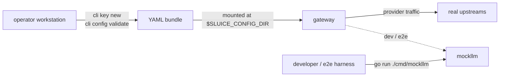

# Auxiliary Binaries

Sluice ships three binaries from this repo. `cmd/gateway` is the data plane — every other doc in this directory is about it. This page covers the other two: `cmd/cli` (operator toolkit) and `cmd/mockllm` (test upstream surrogate).

This page is the reference. It documents every flag, every subcommand, every exit code, plus when an operator or developer would actually reach for each.

---

## Table of contents

1. [Overview](#overview)
2. [What gets baked into images](#what-gets-baked-into-images)
3. [`sluice-cli`](#sluice-cli)
4. [`sluice-mockllm`](#sluice-mockllm)
5. [Cross-references](#cross-references)

---

## Overview

| Binary | Role | Audience | Status |
|---|---|---|---|
| `gateway` | data plane: proxies provider traffic, runs rules + resilience, serves admin console | operators, every deployment | shipping |
| `cli` | local toolkit: generate API keys, validate config bundles | operators, anyone editing YAML | shipping |
| `mockllm` | test upstream: deterministic canned responses + behaviour primitives for e2e and dev | developers, e2e harness, local docker-compose | shipping (dev-only image) |

`cli` and `mockllm` are real tools you use today.



---

## What gets baked into images

The published images are narrowly scoped — only the binaries that need to run inside a cluster are containerised.

| Binary | Dockerfile | Published image | Notes |
|---|---|---|---|
| `gateway` | [`deploy/docker/Dockerfile`](../deploy/docker/Dockerfile) | `ghcr.io/andyjmorgan/sluice-gateway` | Scratch image with the SPA bundle embedded. Exposes `:8585` (data plane) + `:8081` (admin). Runs as `65532:65532`. |
| `mockllm` | [`deploy/docker/Dockerfile.mockllm`](../deploy/docker/Dockerfile.mockllm) | `ghcr.io/andyjmorgan/sluice-mockllm` | Scratch image. Exposes `:5555`. Dev/test only — **never** for production traffic. |
| `cli` | none | none | Runs locally via `go run ./cmd/cli` or as a `go install`'d binary. No container shape — it's an operator tool. |

The local `docker-compose.yaml` references `sluice-mockllm:dev` (built from `Dockerfile.mockllm`) for the dev harness; the upstream `ghcr.io/andyjmorgan/sluice-mockllm` tag is the same shape, pre-built.

---

## `sluice-cli`

The operator's local toolkit. Two responsibilities: minting new API keys and validating a configuration directory before you mount it into a running gateway. No daemons, no listeners, no state — just a one-shot CLI that prints to stdout and exits.

### How to run it

```sh
# From the repo
go run ./cmd/cli <command> [flags]

# Installed binary (after `go install ./cmd/cli`)
cli <command> [flags]
```

`go install ./cmd/cli` produces a binary named `cli` (Go names the binary after the `cmd/<name>` directory) — **not** `sluice-cli`. This page uses "sluice-cli" as the friendly product name, but the invocable command is `cli`. There is no `--config` global flag; per-subcommand flags are documented below.

### Top-level flags

| Flag | Purpose |
|---|---|
| `--version` | Print `cli <version>` to stdout and exit 0. |
| (no args) | Prints usage to stderr and exits with code 2. |

### Exit codes

| Code | Meaning |
|---|---|
| `0` | Success. |
| `1` | A handled error (e.g. `config validate` failed; the diagnostic was printed to stdout). |
| `2` | Usage error — unknown subcommand, unrecognised flag, or an unexpected positional argument. The usage block is written to stderr. |

### Subcommand reference

| Subcommand | What it does |
|---|---|
| [`key new`](#key-new) | Generate a cryptographically random API key and a `api_keys:` YAML snippet ready to paste into your bundle. |
| [`config validate`](#config-validate) | Load and validate a configuration directory the same way the gateway does at startup. Reports counts on success, a classified failure code on error. |

#### `key new`

Mints a 32-byte (256-bit) random key, hex-encoded, with a configurable prefix.

```sh
cli key new [--label <name>] [--configuration <name>] [--prefix <prefix>]
```

| Flag | Default | Notes |
|---|---|---|
| `--label` | (empty) | Human-readable label. When present, emitted as `name:` on the YAML snippet. When empty, the `name:` line is omitted entirely. |
| `--configuration` | `production` | Configuration name the new key references. Must exist in your `configurations:` block, but `cli` doesn't validate that — `config validate` will, post-paste. |
| `--prefix` | `sk_live_` | Prefix the key string starts with. Use `sk_dev_`, `sk_test_`, or anything else that distinguishes environments. |

The key value is the literal `<prefix>` followed by 64 hex characters (`crypto/rand` → `encoding/hex`). Two calls never collide.

Output goes to stdout: the raw key on line 1, blank line, then a YAML snippet starting with the `# yaml-snippet:` marker. Pipe to your editor or paste into `api_keys.yaml`.

#### `config validate`

Loads the full `gateway.yaml` / `providers.yaml` / `configurations.yaml` / `api_keys.yaml` bundle through the same loader the gateway uses at startup, runs the same validators (route collision, prefix-required, unknown-configuration references, etc.), and reports the result.

```sh
cli config validate [--dir <path>]
```

| Flag | Default | Notes |
|---|---|---|
| `--dir` | `$SLUICE_CONFIG_DIR`, or the documented default | The directory to load. If unset, falls back to the env var; if that's empty, uses the config package's `DefaultConfigDir`. |

The env vars themselves (`SLUICE_LOG_LEVEL`, `SLUICE_HTTP_BIND`, etc.) are also validated — a bad `SLUICE_LOG_LEVEL=shouty` will block the file load with `FAIL: invalid_env:` before the directory is ever read.

On success: `OK: env N vars resolved, K configuration(s), J api_keys, P providers, B bindings` — where `B` is the total of every configuration's `bindings` plus `passthrough_bindings` (`cmd/cli/validate.go::runConfigValidate`).

On failure: `FAIL: <category>: <error message>`. Exit code is `1`. The category is one of:

| Category | Trigger |
|---|---|
| `invalid_env` | One of the `SLUICE_*` env vars failed validation (bad log level, bad bind address, unknown OTLP protocol, etc.). |
| `empty_directory` | The directory exists but contains no YAML files. |
| `unexpected_config_file` | A `.yaml`/`.yml` file in the directory uses a filename the loader doesn't recognise. |
| `wrong_file_for_key` | A top-level key (`gateway`, `providers`, `configurations`, `api_keys`, ...) appears in a file the convention puts a different key in. |
| `no_configurations` | The bundle parsed but defines zero configurations. |
| `unknown_configuration` | An API key or rule references a configuration name that doesn't exist. |
| `path_collision` | **Legacy (v1) code.** Defined in `cmd/cli/validate.go` but unreachable under the v2 schema — providers no longer carry `path_prefix`/route paths (routing is protocol + binding based; see [routing.md](routing.md)). Retained for back-compat; never emitted for a v2 bundle. |
| `prefix_required_empty` | **Legacy (v1) code.** Same as above — the v2 provider schema has no `prefix_required`/`path_prefix` fields, so this can no longer fire. |
| `invalid_bind` | A bind address (HTTP, admin, Prometheus) is malformed. |
| `parse_error` | YAML failed to parse. |
| `other` | A category not yet classified — file a bug. |

### Worked example — mint a new managed-mode key

```sh
$ cli key new --label "ci runner" --configuration internal-dev --prefix sk_dev_
sk_dev_8b1f...c3a4

# yaml-snippet:
api_keys:
  - secret: "sk_dev_8b1f...c3a4"
    name: "ci runner"
    configuration: internal-dev
    enabled: true
```

Paste the YAML block into `api_keys.yaml`, redeploy, and the key is live. The raw key string never leaves your workstation unless you put it in a secret store — `cli` does not persist anything to disk.

### Worked example — validate before deploy

```sh
$ SLUICE_CONFIG_DIR=./config-prod cli config validate
OK: env 12 vars resolved, 3 configuration(s), 47 api_keys, 5 providers, 18 bindings
```

Failure case:

```sh
$ cli config validate --dir ./config-broken
FAIL: unknown_configuration: api key "sk_live_..." references configuration "prod" that doesn't exist
```

Exit code `1`. Pipe through `tee` or check `$?` from a deploy script.

The recommended pre-deploy ritual: `cli config validate --dir <bundle>` exits `0`, **then** apply the new ConfigMap / mount.

---

## `sluice-mockllm`

A deterministic upstream surrogate. The gateway forwards provider traffic to a configured upstream URL; in dev and e2e that URL is `mockllm`, which serves canned JSON or SSE responses based on the path the gateway hits, with optional behaviour primitives (delays, transport-level close, hang) for resilience scenarios.

**Never run mockllm against production traffic.** Its responses are pre-recorded fixtures, not real model output.

### How to run it

```sh
# From the repo
go run ./cmd/mockllm [flags]

# Docker (matches what docker-compose brings up)
docker run --rm -p 5555:5555 ghcr.io/andyjmorgan/sluice-mockllm:latest

# In the dev compose stack — auto-started by `make dev`
make dev
```

The compose stack also exposes mockllm through the network alias `mockllm:5555` to the gateway container; the host port is intentionally not published in the default `docker-compose.yaml` (uncomment the `ports:` block if you need to poke at it from the host).

### Flags

| Flag | Default | Purpose |
|---|---|---|
| `--port` | `5555` | TCP port to listen on. Binds to `0.0.0.0:<port>`. |
| `--responses` | (empty) | Optional path to a YAML or JSON file of canned responses to seed the global pool at startup. Extension must be `.yaml`, `.yml`, or `.json`. |
| `--version` | — | Print `mockllm <version>` and exit. |

Logging level comes from `LOG_LEVEL` (`debug` / `info` / `warn` / `error`). Output is JSON via `log/slog` on stderr.

### The `--responses` file

The file is a top-level YAML or JSON array. Each entry is a `CannedResponse` object — defined in [`cmd/mockllm/registry.go`](../cmd/mockllm/registry.go). Fields:

| Field | Type | Purpose |
|---|---|---|
| `method` | string | HTTP method matcher (e.g. `POST`). Empty matches any method. Case-insensitive. |
| `path` | string | URL path matcher (e.g. `/v1/chat/completions`). Empty matches any path. Case-insensitive. |
| `request_body_contains` | string | Substring match against the inbound request body. Empty disables body matching. Lets one fixture file stage different responses per model. |
| `status` | int | HTTP status code to write. Defaults to 200. |
| `headers` | map[string]string | Response headers. `Content-Type` defaults to `application/json` (non-streaming) or `text/event-stream` (streaming). |
| `streaming` | bool | When true, writes `stream_chunks` as SSE-framed events with per-chunk flushes. |
| `body` | string | Response body (non-streaming). |
| `stream_chunks` | list of `{data, delay_ms}` | SSE chunks. Each `data` is wrapped in `data: <data>\n\n` framing. `delay_ms` is the pre-write delay applied **before** the chunk is flushed. |
| `max_responses` | int | Caps how many times this entry matches. `0` (default) means unlimited. On each match the counter decrements; at zero the entry is removed from the pool. Pop is scoped to the session pool the entry was staged in. |
| `delay_ms` | int | Pre-response delay before the status line is written. Honours request-context cancellation — client disconnect cancels promptly. |
| `behavior` | enum string | Overrides the normal write path with a transport-level failure simulation. See below. |

The `behavior` field accepts:

| Value | Effect |
|---|---|
| `""` (default) | Normal write — body and/or stream chunks per the other fields. |
| `"close"` | Hijack the TCP connection and close it without writing a status line. Models a transport error (the gateway's resilience orchestrator treats this as "no headers received"). |
| `"hang"` | Block until the request context is cancelled. Models a hung upstream — used by per-attempt header-timeout tests. |

Unknown `behavior` values fall through to the normal write path.

Matcher resolution: `method`, `path`, and `request_body_contains` all act as AND-conjoined predicates. An empty predicate matches anything; a non-empty one must match. The first entry in pool order that satisfies every set predicate wins. Order in the YAML file is the order entries are evaluated in (within a single pool).

### Session scenarios

Mockllm partitions canned responses by session ID, sourced from the inbound request's `X-Sluice-Session-Id` header. The gateway echoes this header end-to-end, so a test sets it once on the client and every upstream call carries it.

Match resolution: the session pool is consulted first; on miss the global pool is consulted as a fall-back. `max_responses` pop is scoped to the pool the entry was found in — a session-staged entry never decrements the global one. This is what lets one mockllm serve multiple independent scenarios in parallel (e.g. "session A's primary returns 503 twice then 200" running alongside "session B's primary always returns 200" without either test contaminating the other).

The `--responses` file populates the **global** pool only. Per-session entries are staged via the control plane (see below).

### Control-plane endpoints

The server exposes a small control surface for test harnesses to stage and inspect state at runtime:

| Endpoint | Method | Purpose |
|---|---|---|
| `/control/responses?session=<id>` | `POST` | Append one `CannedResponse` JSON object to the named session pool. Empty `session=` (or omitted) targets the global pool. Returns 201. |
| `/control/responses?session=<id>` | `DELETE` | Clear the named session pool. Empty `session=` clears **everything** (every session + global) — back-compat with pre-session tests. Returns 204. |
| `/control/state` | `GET` | Returns `{"responses": [...], "sessions": {...}, "request_count": N}`. `responses` is the global pool; `sessions` only contains non-empty per-session pools. |
| `/control/captured?session=<id>` | `GET` | Returns every captured inbound request (method, path, query, headers, body, session ID). Optional `session=` filters to one scenario. Bounded ring of 32. |
| `/control/captured` | `DELETE` | Clears the captured-request log. |
| `/healthz` | `GET` | Returns 200 `ok`. Used by docker-compose health checks. |

The control-plane is unauthenticated — mockllm is a dev tool, and the listener is meant to live on a private compose network, not the public internet.

### Worked example — single canned response

`responses.yaml`:

```yaml
- method: POST
  path: /v1/chat/completions
  status: 200
  headers:
    Content-Type: application/json
  body: |
    {"id":"chatcmpl-1","object":"chat.completion","choices":[{"message":{"role":"assistant","content":"hello from mockllm"}}]}
```

Run:

```sh
go run ./cmd/mockllm --responses responses.yaml
```

The first `POST /v1/chat/completions` from the gateway gets the canned body. Subsequent matches keep returning the same response because `max_responses` is 0 (unlimited).

### Worked example — failover scenario via session

Goal: "primary returns 503 twice, then 200 — backup always returns 200." Stage at the start of the test against session `failover-1`:

```sh
SESSION=failover-1

# Two 503s from the primary path
for i in 1 2; do
  curl -sS -X POST "http://localhost:5555/control/responses?session=$SESSION" \
    -H 'Content-Type: application/json' \
    -d '{"path":"/v1/chat/completions","request_body_contains":"primary","status":503,"max_responses":1}'
done

# Then a 200 from the primary path
curl -sS -X POST "http://localhost:5555/control/responses?session=$SESSION" \
  -H 'Content-Type: application/json' \
  -d '{"path":"/v1/chat/completions","request_body_contains":"primary","status":200,"body":"{\"ok\":true}"}'

# Backup path always 200
curl -sS -X POST "http://localhost:5555/control/responses?session=$SESSION" \
  -H 'Content-Type: application/json' \
  -d '{"path":"/v1/messages","status":200,"body":"{\"ok\":true,\"backend\":\"backup\"}"}'

# Run the test — every request carries X-Sluice-Session-Id: failover-1
```

The mockllm-side ordering is deterministic: the first two matching primary calls hit the 503 entries (each `max_responses: 1`, so each pops after one match), and the third onwards hits the unlimited 200. Tests assert on `/control/captured?session=failover-1` to confirm the gateway issued the expected calls in the expected order.

### Cross-link

For the dev compose layout and how mockllm fits in alongside the gateway, see [local development](local-development.md).

---

## Cross-references

- [Local development](local-development.md) — how `mockllm` and the gateway compose together for dev iteration.
- [Deployment](deployment.md) — how the published `gateway` image is rolled out and what auxiliary infrastructure is required.
- [Configuration model](configuration-model.md) — the YAML schema that `sluice-cli config validate` enforces, including every error category the validator can return.
- [Routing](routing.md) — protocol + binding routing in v2 (the `path_collision` / `prefix_required_empty` codes are legacy v1 holdovers that no longer fire).
- [Admin console](admin-console.md) — the read-only config-inspection surface embedded in the gateway.
- [Telemetry service](telemetry-service.md) — the standalone fleet-observability service.
