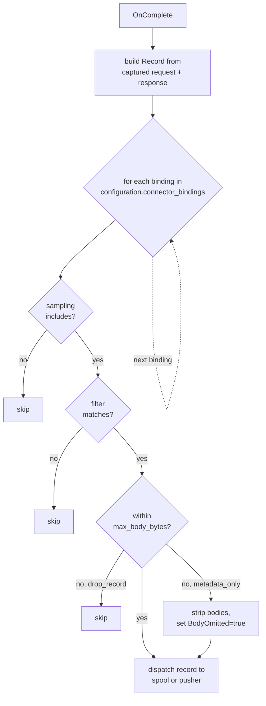

# Connector bindings

A **connector binding** attaches one connector to one configuration with per-binding overrides — sampling fraction, predicate filter, per-record body cap, oversize behaviour. Bindings are how an operator says "configuration `production` ships these records to connector `prod-audit`, this fraction with these filters."

The connector itself ([connectors.md](connectors.md)) owns the destination shape and dispatch runtime: `s3` / `azure_blob` use a durable spool track, while `webhook` uses the real-time pusher. The binding decides *what* survives the journey from request-completion to dispatch. Multiple configurations may bind the same connector with different bindings; each configuration's bindings evaluate independently.

Source of truth: [`contracts/config/connectors.go`](../contracts/config/connectors.go) (struct), [`contracts/config/connectors_validate.go`](../contracts/config/connectors_validate.go) (validation), [`cmd/gateway/binding.go`](../cmd/gateway/binding.go) (runtime evaluation).

---

## Table of contents

1. [Mental model](#mental-model)
2. [YAML shape](#yaml-shape)
3. [Evaluation order](#evaluation-order)
4. [Sampling](#sampling)
5. [Filter](#filter)
6. [Per-record body cap](#per-record-body-cap)
7. [Oversize behaviour](#oversize-behaviour)
8. [Worked examples](#worked-examples)
9. [Cross-references](#cross-references)

---

## Mental model

At end-of-request the reporter builds one [`Record`](../contracts/connector/record.go) per inbound request and then runs every binding on the configuration to decide which connectors get it:



The record passed to each binding is a fresh **value copy** — `applyOversize` can strip the body for one binding without affecting the next. Multiple bindings on the same configuration with different size caps are independent.

---

## YAML shape

```yaml
# policy.yaml
configurations:
  production:
    credentials:
      openai: sk-prod-openai
    rule_names:
      - route-claude-models-to-anthropic
    connector_bindings:
      - connector: prod-audit-s3
        sampling: 1.0
        sampling_key: correlation_id
        max_body_bytes: 16777216    # 16 MiB
        oversize_behaviour: metadata_only
        filter:
          providers: [openai, anthropic]
          status_min: 200
          status_max: 499

      - connector: siem-webhook
        sampling: 0.05
        sampling_key: random
        max_body_bytes: 1048576     # 1 MiB
        oversize_behaviour: drop_record
        filter:
          status_min: 500
          tags_any: [billing, compliance]
```

`connector_bindings:` is a slice on the configuration. Empty (or absent) means "no capture" — when no bindings exist the reporter skips building and enqueuing a Record (cmd/gateway/reporter.go enqueueRecord returns early on len(ConnectorBindings)==0), so no record is assembled or shipped. Note the inbound body-capture middleware itself still runs — it is required to decode the model for selection and rules — so it does not short-circuit; only record assembly/enqueue is skipped.

Each binding entry's fields:

| Field | Type | Default | Notes |
|---|---|---|---|
| `connector` | string | — (required) | Name of an entry in the top-level `connectors:` slice. Unknown name aborts load. |
| `sampling` | float in `[0, 1]` | `1.0` (everything) | Fraction of records routed to this binding. The validator accepts `[0, 1]` inclusive, but the runtime treats any `sampling <= 0` as `1.0` (sends everything) — `0` does **not** disable the binding. See [Sampling](#sampling). |
| `sampling_key` | enum | `correlation_id` | `correlation_id` (deterministic, retries stay grouped) or `random` (per-record). |
| `max_body_bytes` | int (optional) | unset → no cap (DefaultMaxBodyBytes returns 0 for all types) | Per-record body cap. Unset applies the connector-type default; explicit `0` means no cap (the override); a positive value caps the larger of request/response body. See [Per-record body cap](#per-record-body-cap). |
| `oversize_behaviour` | enum | `metadata_only` | What to do when the record's body exceeds the cap: `metadata_only` (strip body, ship metadata) or `drop_record` (skip entirely). |
| `filter` | object | nil (all-pass) | Predicate filter narrowing which records this binding receives. See [Filter](#filter). |

---

## Evaluation order

For each binding in the configuration's `connector_bindings` list, in order:

1. **Sampling.** Out → skip (no enqueue).
2. **Filter.** Mismatch → skip.
3. **Body cap.** Within → ship as-is. Over + `drop_record` → skip. Over + `metadata_only` → strip bodies, set `BodyOmitted=true`, ship.

A record that survives all three is dispatched according to the connector type: `s3` / `azure_blob` land on the connector's spool track via `Spool.Enqueue`, and `webhook` lands on the connector's real-time pusher. Bindings on a single configuration are independent — each evaluates its own predicates against a fresh value-copy of the record.

---

## Sampling

`sampling` controls what fraction of records reach this binding. `1.0` (default) sends every record; `0.5` sends half.

**`0` does not disable the binding — it sends everything.** The runtime treats any `sampling <= 0` as `1.0`: `samplingIncludes` in [`cmd/gateway/binding.go`](../cmd/gateway/binding.go) opens with `if s <= 0 { s = 1.0 }`. Go's zero-value semantics make an explicit `sampling: 0` indistinguishable from an omitted field, and the validator ([`contracts/config/connectors_validate.go`](../contracts/config/connectors_validate.go), `sampling must be in [0, 1]`) accepts `0` rather than rejecting it — so both collapse to "include everything." This is a deliberate footgun trade-off (a custom `UnmarshalYAML` shim to distinguish the two would cost more than it saves; see the `ConnectorBinding.Sampling` godoc in [`contracts/config/connectors.go`](../contracts/config/connectors.go)). To actually stop a binding from shipping, **remove it from `connector_bindings`**, or set a vanishingly small fraction like `0.0001` to keep the destination warm while dropping nearly all traffic.

```yaml
sampling: 0.05               # 5%
sampling_key: correlation_id # default
```

`sampling_key` decides how the bucketing happens:

| Value | Behaviour | When to use |
|---|---|---|
| `correlation_id` (default) | Deterministic: hash the record's `correlation_id` (FNV-1a 64-bit) into a uniform `[0, 1)` bucket; ship iff `bucket < sampling`. | The default. Same correlation_id always lands the same side of the threshold — retries and tool-call follow-ups on the same request stay grouped. |
| `random` | Per-record `rand.Float64() < sampling`. | When the operator deliberately wants independent sampling per record (statistical sampling for billing audit). |

The deterministic-by-default behaviour is load-bearing for the multi-attempt case: when the resilience orchestrator runs four attempts against three different backends for one logical request, all four attempts share `correlation_id`, so `correlation_id`-keyed sampling either takes all four or none. `random` would tear the group apart.

Sampling is independent across bindings — a binding sampling at 100% and another sampling at 5% on the same configuration produce disjoint shipped sets (the 100% gets everything; the 5% gets its deterministic 5% subset).

---

## Filter

`filter:` narrows which records this binding receives. Within a single field (e.g. `providers`), values OR together; across fields, the predicates AND together. Empty lists = no constraint on that field.

```yaml
filter:
  providers: [openai, anthropic]
  protocols: [chat]
  models: ["claude-*", "gpt-4o"]
  status_min: 200
  status_max: 499
  tags_any: [billing]
  tags_all: []
```

A record passes iff **every** populated predicate evaluates true:

| Field | Type | Match semantics |
|---|---|---|
| `providers` | []string | Record's `Provider` (post-rule) is in the list. |
| `protocols` | []string | Record's `Protocol` (post-rule) is in the list. |
| `models` | []string | Record's `Model` matches any pattern. Patterns are exact-equal unless they end in `*` (trailing wildcard); other wildcards are rejected by validation. |
| `status_min`, `status_max` | int (HTTP status) | Record's status is in `[status_min, status_max]`. Defaults: `status_min=200`, `status_max=599`. Validation rejects out-of-`[100, 599]` and `min > max`. |
| `tags_any` | []string | Record carries **any** of these tags. Empty = no constraint. |
| `tags_all` | []string | Record carries **every** one of these tags. Empty = no constraint. |

**Status code field semantics.** The runtime prefers the upstream status (`Record.UpstreamStatus`) when set; for short-circuited requests it falls back to the response status. Records where neither was populated (e.g. a transport-error path that never saw headers) have a synthetic zero status that falls outside the default `[200, 599]` range — explicitly broaden `status_min` if you want to capture those.

**Model patterns.** Trailing-`*` is the only wildcard form. `"claude-*"` matches `claude-haiku-4-5` and `claude-opus-4-7`; `"gpt-4o"` matches only the exact name. `"*-mini"` (leading or interior wildcards) is rejected at config-load.

**Tag fields.** Tags come from `addTag` rule actions on the request path; see [actions.md → addTag](actions.md#addtag). The same tag values flow into `Record.Tags`, and these predicates filter against that set. Configuration-level `tags:` metadata on `Configuration` is **not** the same channel — it does not flow into `Record.Tags` and the filter does not see it. Use `addTag` for per-request labels you intend to filter on.

---

## Per-record body cap

`max_body_bytes` caps the larger of the request body length and the response body length. Records whose largest body fits the cap pass through with bodies intact. Records exceeding the cap trip `oversize_behaviour` (see below).

```yaml
max_body_bytes: 16777216     # 16 MiB
```

`max_body_bytes` is a three-way knob — unset, explicit zero, and positive each mean something distinct:

| Value | Effective cap |
|---|---|
| **unset** | The connector-type default (below). |
| **`0`** | No cap — the explicit override that opts a binding out of its type default. |
| **`> 0`** | Cap at that many bytes. |
| **`< 0`** | Config-load error. |

Per-type defaults applied when `max_body_bytes` is unset:

| Connector type | Default | Reasoning |
|---|---|---|
| `webhook` | none (no cap) | No default cap; set `max_body_bytes` to a positive value to bound the body. |
| `s3`, `azure_blob` | none (no cap) | Blob stores ingest large objects out of band, so there is no default cap. |

Bodies are already bounded upstream regardless: the bodycapture middleware reads at most `MaxBodyBytes` (10 MiB) from the inbound request, so a record's bodies never exceed that ceiling even with no binding cap.

```yaml
max_body_bytes: 1048576      # 1 MiB — explicit cap
# max_body_bytes: 0          # explicit no cap (same as unset)
# (omit entirely)            # no cap for all types (webhook/s3/azure)
```

The cap is **per record**, not per segment — multiple oversized records on the same segment are each evaluated independently.

---

## Oversize behaviour

When a record's body exceeds `max_body_bytes`, the binding's `oversize_behaviour` decides what to do.

| Value | Behaviour |
|---|---|
| `metadata_only` (default) | Strip both request and response bodies; set `Request.BodyOmitted` and `Response.BodyOmitted` to `true`; ship the rest of the record (headers, timing, tokens, rule matches, attempts). |
| `drop_record` | Skip the record entirely — no enqueue. |

`metadata_only` is the safe default. The consumer downstream sees a record that says "this request happened, here are the labels and tokens, the body was too big to capture." `drop_record` is appropriate when the downstream pipeline is genuinely useless without bodies (e.g. a webhook receiver that does prompt content analysis) and you'd rather have nothing than partial.

Either outcome is logged at **ERROR** so the capping is never silent — an operator chasing a destination missing its bodies sees the breadcrumb on the request's correlation_id:

```json
{"level":"ERROR","msg":"connector record body exceeded max_body_bytes; bodies stripped",
 "correlation_id":"...","connector":"siem-webhook","connector_type":"webhook",
 "max_body_bytes":1048576,"body_bytes":2202010}
```

The message reads `...; record dropped` for `drop_record`. `logOversize` ([`cmd/gateway/reporter.go`](../cmd/gateway/reporter.go)) attaches `connector`, `connector_type`, the effective cap that was hit (`max_body_bytes`), and the body length that tripped it (`body_bytes`), so a recurring oversize is easy to spot and re-tune. The `correlation_id` (and `service` / `version`) are not arguments to that call — they come from the per-request enriched logger that `observability.FromContext(ctx)` returns, set once per request in [`cmd/gateway/correlation.go`](../cmd/gateway/correlation.go) (`baseLogger.With(LogFieldCorrelationID, id)`). Because the reporter runs on the request context, every oversize breadcrumb is automatically keyed to the request's `correlation_id`.

The cap **does not** truncate the body to fit. Either the body is captured in full or it is replaced with `BodyOmitted=true`. There is no head-only / partial body shape on the wire — keep that separation explicit so consumers can't accidentally read truncated content as authoritative.

---

## Worked examples

### Ship every record to one s3 bucket

```yaml
configurations:
  production:
    connector_bindings:
      - connector: prod-audit-s3
```

Defaults across the board: `sampling=1.0`, `sampling_key=correlation_id`, `max_body_bytes` unset → **no cap** (s3 / azure_blob AND webhook all have no default body cap; `DefaultMaxBodyBytes` returns 0 for all types), `oversize_behaviour=metadata_only`, no filter. Bodies are still bounded by the bodycapture middleware's 10 MiB inbound read limit regardless.

### 5% webhook sampling on errors only

```yaml
configurations:
  production:
    connector_bindings:
      - connector: prod-audit-s3            # full-fidelity audit

      - connector: siem-webhook             # sampled error stream
        sampling: 0.05
        sampling_key: random
        oversize_behaviour: drop_record
        filter:
          status_min: 500
          status_max: 599
```

Two bindings on the same configuration. The first ships everything to s3 with the defaults. The second ships only 5xx records (server errors) at 5% random sampling to a webhook; records exceeding the binding's explicit `max_body_bytes` cap are dropped entirely because the receiver expects intact bodies.

### Different connectors for different traffic shapes

```yaml
configurations:
  production:
    connector_bindings:
      - connector: prod-audit-s3            # all anthropic + openai
        filter:
          providers: [anthropic, openai]

      - connector: gemini-research-s3       # gemini only, body-heavy
        filter:
          providers: [gemini]
        max_body_bytes: 33554432            # 32 MiB

      - connector: billing-webhook          # successful chat completions
        sampling: 1.0
        filter:
          protocols: [chat, messages, generate_content]
          status_min: 200
          status_max: 299
          tags_any: [billable]
```

Three bindings, three different connectors, three different filter shapes. The `billable` tag is set by an `addTag` rule action on requests whose configuration / model / API key should hit the billing pipeline.

### Tags-driven routing for compliance

```yaml
configurations:
  production:
    connector_bindings:
      - connector: gdpr-eu-s3
        filter:
          tags_all: [gdpr-eu]               # only records with this tag

      - connector: us-non-restricted-s3
        filter:
          tags_any: [us, public]            # records with either tag
```

The `gdpr-eu` and `us` / `public` tags come from `addTag` actions keyed on the API key's region metadata or the request's tenant header. The bindings ensure GDPR-bounded data only lands in the EU bucket and US data only lands in the US bucket.

---

## Cross-references

- [connectors.md](connectors.md) — the destinations bindings reference.
- [spool.md](spool.md) — what happens once a record enqueues.
- [configuration-model.md](configuration-model.md#configurations-block) — the `configurations` block where `connector_bindings:` lives.
- [actions.md → addTag](actions.md#addtag) — the rule action that drives the `tags_any` / `tags_all` predicates.
- [`cmd/gateway/binding.go`](../cmd/gateway/binding.go) — runtime evaluation (`evaluateBinding`, `samplingIncludes`, `matchesFilter`, `applyOversize`).
- [`contracts/config/connectors_validate.go`](../contracts/config/connectors_validate.go) — `ConnectorBinding.Validate` and `ConnectorFilter.Validate`.
