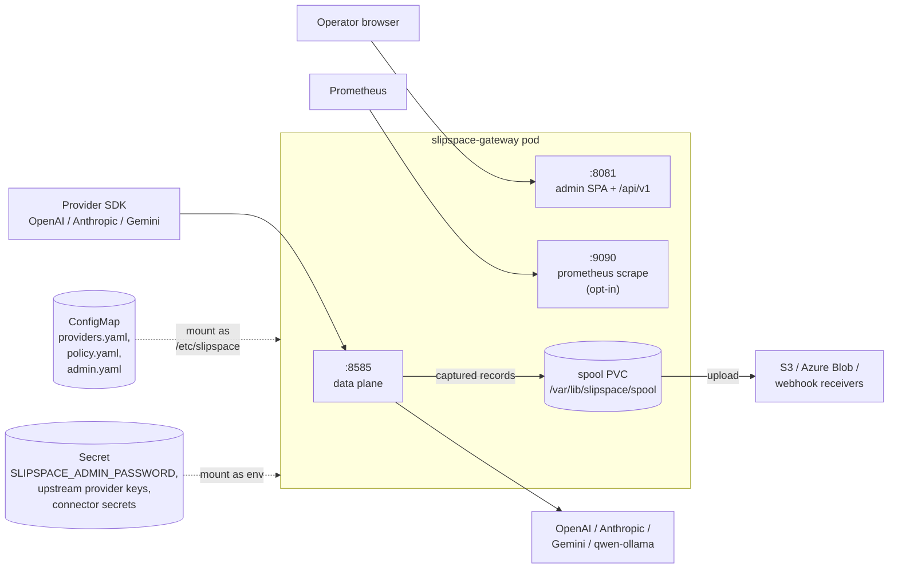
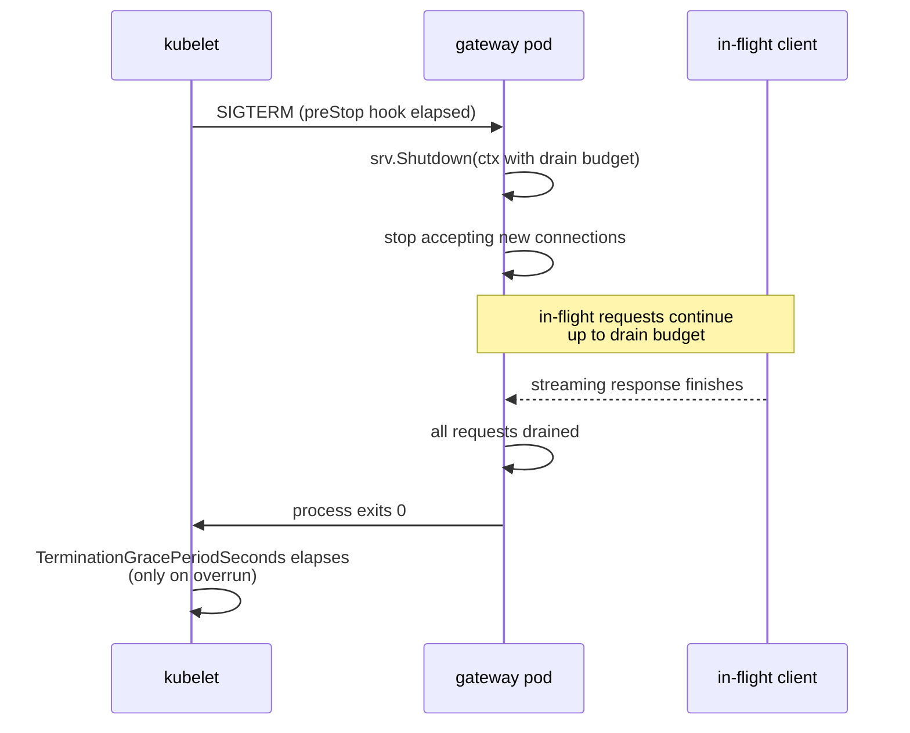

# Deployment

SlipSpace ships as a single-arch (linux/amd64) container image with the SPA baked in. The image runs as a data-plane process plus an optional admin listener inside the same pod; configuration is mounted as a directory of YAML files; the connector spool persists on a PVC; telemetry is wired through env vars. This page is the operator's reference for the production deployment shape — container image, Kubernetes topology, mount conventions, multi-pod considerations, rolling updates — and the local-dev shortcut that mirrors it.

---

## Table of contents

1. [Deployment topology](#deployment-topology)
2. [Container image](#container-image)
3. [Release pipeline](#release-pipeline)
4. [Kubernetes deployment shape](#kubernetes-deployment-shape)
5. [Helm chart status](#helm-chart-status)
6. [Configuration mount](#configuration-mount)
7. [Admin password mount](#admin-password-mount)
8. [docker-compose local dev](#docker-compose-local-dev)
9. [Listeners and ports reference](#listeners-and-ports-reference)
10. [Multi-pod considerations](#multi-pod-considerations)
11. [Rolling updates and graceful drain](#rolling-updates-and-graceful-drain)
12. [Smoke tests against a live deploy](#smoke-tests-against-a-live-deploy)
13. [Cross-references](#cross-references)

---

## Deployment topology

A SlipSpace pod runs one container that opens up to three listeners and reads one config directory. Only the data-plane listener is on by default; the admin and Prometheus listeners are opt-in management surfaces (admin via `admin.enabled: true`, Prometheus by setting `SLIPSPACE_PROMETHEUS_BIND` — the binary default is empty/disabled, and `:9090` below is the conventional value the dev compose sets explicitly). The data-plane listener is the only port that proxies provider traffic; the admin and Prometheus listeners must not be exposed to clients.

### Single-pod



### Multi-pod

```mermaid
flowchart LR
    Client[Provider SDKs] --> SVC[Service<br/>:8585]
    Operator[Operator] --> ADSVC[Service<br/>:8081]
    Scrape[Prometheus] --> PRSVC[Service<br/>:9090 (opt-in)]

    SVC --> P1[Pod A<br/>:8585<br/>+ spool PVC]
    SVC --> P2[Pod B<br/>:8585<br/>+ spool PVC]
    SVC --> P3[Pod C<br/>:8585<br/>+ spool PVC]

    ADSVC --> P1
    ADSVC --> P2
    ADSVC --> P3

    PRSVC -. scrape each replica .-> P1
    PRSVC -. scrape each replica .-> P2
    PRSVC -. scrape each replica .-> P3

    P1 -- upload --> Dest[(S3 / Azure Blob /<br/>webhook receivers)]
    P2 -- upload --> Dest
    P3 -- upload --> Dest

    CFG[("ConfigMap")] -. mount /etc/slipspace .-> P1
    CFG -. .-> P2
    CFG -. .-> P3
    SEC[("Secret")] -. env .-> P1
    SEC -. .-> P2
    SEC -. .-> P3
```

Every pod in a replica set reads the same ConfigMap and Secret. Per-pod state (circuit-breaker counters, admin snapshotter buffer, in-process live-feed ring, **spool segments**) is **not** synchronised between replicas — each pod needs its own spool PVC, and consumers downstream of S3 / Azure Blob / webhook see records from every replica interleaved. See [Multi-pod considerations](#multi-pod-considerations).

---

## Container image

Published at `ghcr.io/andyjmorgan/slipspace-gateway`. Multi-stage build defined in [`deploy/docker/Dockerfile`](../deploy/docker/Dockerfile).

### Stages

| Stage | Base | Purpose |
|---|---|---|
| `certs` | `alpine:3` | Pulls `ca-certificates` so the scratch image can speak TLS to upstream providers. |
| `spa-builder` | `node:22-alpine` | `npm ci` + `npm run build` in `web/`. Vite emits to `internal/admin/webdist/`; the stage moves the result to `/out/webdist` for an unambiguous COPY. |
| `builder` | `golang:1.25-alpine` | Overlays the SPA bundle on top of the committed `placeholder.html` so `go:embed` picks up the real assets, then builds `cmd/gateway` static with `CGO_ENABLED=0`. |
| (final stage) | `scratch` | Carries `/gateway` binary + CA bundle. ~5.5 MB total. Unnamed in the Dockerfile — `FROM scratch` with no `AS final`; only `certs`, `spa-builder`, and `builder` are named stages. |

The version string baked into `/gateway` via `-ldflags "-X .../version.Version=${VERSION}"` is whatever the build pipeline passes — `git describe --tags --always`, so tagged builds report `v1.3.0` and main builds report `v1.3.0-3-gabc1234`. The admin console exposes it at `GET /admin/api/v1/version`.

### What's in the image

- `/gateway` — statically linked, stripped, the only executable.
- `/etc/ssl/certs/ca-certificates.crt` — system CA bundle, mandatory for TLS to upstream providers.
- The embedded SPA bundle (compiled into `/gateway` via `//go:embed`).
- Two exposed ports as image metadata: `8585` (data plane) and `8081` (admin).

### What's NOT in the image

- A shell. There is no `/bin/sh` — `kubectl exec` against the pod will fail unless you also override the entrypoint or run an ephemeral debug container.
- The config directory. The image does not ship `providers.yaml` or `policy.yaml`; the operator mounts those at `SLIPSPACE_CONFIG_DIR` (default `/etc/slipspace/`).
- A writable root filesystem. The image runs as UID `65532:65532` (nonroot); pair it with `readOnlyRootFilesystem: true` in the pod's `securityContext`.
- The mock LLM. `slipspace-mockllm` is a separate image (`ghcr.io/andyjmorgan/slipspace-mockllm`) used in local-dev and CI only; never deploy it.

---

## Release pipeline

[`.github/workflows/release.yaml`](../.github/workflows/release.yaml) drives image publication and GitHub Release creation. It runs on the `office-cluster` self-hosted runner.

### Trigger matrix

| Trigger | What gets published |
|---|---|
| Push to `main` | `ghcr.io/andyjmorgan/slipspace-gateway:main`, `:sha-<short>`, and `:latest` (floats on every default-branch build since #248, mirroring `:main`). Same tags for `slipspace-mockllm` and `slipspace-arbiter`. No GitHub Release. |
| Tag push `v*.*.*` | All of the above **plus** `:<version>` and `:<major>.<minor>` (`:latest` moves on both events). The release job then creates (or edits, on tag re-push) a GitHub Release with rendered notes pointing at the freshly-pushed image tags. |

All three images in the matrix (`slipspace-gateway`, `slipspace-mockllm`, `slipspace-arbiter` — the latter from `deploy/docker/Dockerfile.arbiter`, added in #234) build for `linux/amd64` only (arm64 was dropped in #224); the buildkit config at `/home/runner/.config/buildkit/buildkitd.toml` routes `docker.io` pulls through the cluster's pull-through mirror to avoid rate limits.

### Image visibility

Tagged releases run a best-effort `Mark package public` step (`continue-on-error: true`) on GHCR per image. As of the v1.3.0 rebrand the renamed packages — `slipspace-gateway`, `slipspace-mockllm`, `slipspace-arbiter` — are **private** on GHCR, so a deployment must pull them with an `imagePullSecret` (the `ghcr-secret` referenced in the pod spec below). Untagged `main` builds inherit the package's current visibility.

### Idempotence on tag re-push

`gh release create` returns HTTP 422 if the release already exists, which is common when a tag is force-moved during an in-progress release cycle. The release job pre-checks with `gh release view` and swaps to `gh release edit` if present, so the workflow stays green and the release notes get refreshed.

---

## Kubernetes deployment shape

SlipSpace has no opinion on whether you ship it via Helm, kustomize, raw manifests, or a higher-level platform abstraction — the image is a vanilla container with file + env-var configuration. What follows is the minimum shape any deployment must produce; treat it as a checklist regardless of the tool that emits the YAML.

### Required objects

| Object | Purpose |
|---|---|
| `Deployment` | Runs `ghcr.io/andyjmorgan/slipspace-gateway:<tag>` with the config volume, env vars, and probes. |
| `Service` (data plane) | ClusterIP on `:8585` → pod `:8585`. The one externally-reachable surface. |
| `Service` (admin) | Optional. ClusterIP on `:8081` → pod `:8081`. Front with an ingress + auth proxy or expose loopback-only inside the cluster. |
| `Service` (prometheus) | Optional. ClusterIP on `:9090` → pod `:9090`. Or use a `Service`-less `ServiceMonitor` pointing at pod IPs. |
| `ConfigMap` | Mounts `providers.yaml` + `policy.yaml` (+ `admin.yaml`) at `/etc/slipspace/`. Read-only as a direct mount; for admin write API support see [Read-write config dir](#read-write-config-dir-admin-write-api). |
| `Secret` | Provides `SLIPSPACE_ADMIN_PASSWORD`, upstream provider keys referenced by `policy.yaml`, and connector secrets referenced by `connectors:` (s3 keys, azure SAS / account keys, webhook signing secrets). |
| `PersistentVolumeClaim` (spool) | Optional — required when `policy.yaml` declares any `connectors:` entries. Mounted at `SLIPSPACE_SPOOL_ROOT` (default `/var/lib/slipspace/spool`) so sealed segments survive process restarts. |
| `PersistentVolumeClaim` (config, optional) | Mount at `SLIPSPACE_CONFIG_DIR` instead of an `emptyDir` when admin-API rule edits need to persist across pod restarts. See [Read-write config dir](#read-write-config-dir-admin-write-api). |

The data plane and admin listeners run in the **same pod**, in the same container. There is no separate admin sidecar — they share the binary, the in-process metric registry, and the live-feed ring.

### Minimum pod spec

```yaml
spec:
  securityContext:
    runAsNonRoot: true
    runAsUser: 65532
    runAsGroup: 65532
    readOnlyRootFilesystem: true
    seccompProfile:
      type: RuntimeDefault
  imagePullSecrets:
    - name: ghcr-secret          # the slipspace-* / arbiter packages are private on GHCR
  containers:
    - name: gateway
      image: ghcr.io/andyjmorgan/slipspace-gateway:v1.3.0
      ports:
        - { name: data,    containerPort: 8585 }
        - { name: admin,   containerPort: 8081 }
        - { name: metrics, containerPort: 9090 }
      env:
        - { name: SLIPSPACE_CONFIG_DIR,    value: /etc/slipspace }
        - { name: SLIPSPACE_HTTP_BIND,     value: 0.0.0.0:8585 }
        - { name: SLIPSPACE_PROMETHEUS_BIND, value: 0.0.0.0:9090 }
        - { name: SLIPSPACE_SPOOL_ROOT,    value: /var/lib/slipspace/spool }
        - name: SLIPSPACE_ADMIN_PASSWORD
          valueFrom:
            secretKeyRef: { name: slipspace-admin, key: password }
      volumeMounts:
        - { name: config, mountPath: /etc/slipspace, readOnly: true }
        - { name: spool,  mountPath: /var/lib/slipspace/spool }
      readinessProbe:
        httpGet: { path: /healthz, port: data }
      livenessProbe:
        httpGet: { path: /healthz, port: data }
  volumes:
    - name: config
      configMap: { name: slipspace-config }
    - name: spool
      persistentVolumeClaim: { claimName: slipspace-spool }
```

Every field above is load-bearing. `runAsNonRoot` + `readOnlyRootFilesystem` are compatible with the scratch image (UID `65532:65532`, no writes outside `/tmp` and the spool mount); the listeners must bind `0.0.0.0` inside the container so the kube proxy reaches them. Of the env vars shown, only `SLIPSPACE_ADMIN_PASSWORD` is strictly required, and only when `admin.enabled: true` — `SLIPSPACE_HTTP_BIND` and `SLIPSPACE_PROMETHEUS_BIND` are optional (the data-plane listener defaults to `:8585` and the Prometheus listener defaults to disabled/empty). The spec sets the binds explicitly for legibility, not because the binary requires them. The `spool` PVC mount is read-write and must be writable by UID `65532` (set `fsGroup: 65532` on the pod's `securityContext`, or rely on the storage class's default ownership rules). Drop the volume + mount + `SLIPSPACE_SPOOL_ROOT` when `policy.yaml` has no `connectors:` block — the spool is constructed lazily and idle deployments do not need storage.

---

## Helm chart status

The `deploy/helm/slipspace-gateway/` chart is on the v0.1 milestone but **has not landed in the repo yet**. Operators provisioning SlipSpace today author their own manifests (or kustomize/Helm bases) against the shape in [Kubernetes deployment shape](#kubernetes-deployment-shape).

When the chart lands, it will be a standalone (no parent) chart producing the objects in the table above, with values for:

- `image.repository`, `image.tag`, `image.pullPolicy` — image coordinates.
- `replicaCount` — pod count.
- `resources.requests` / `resources.limits` — CPU + memory.
- `service.dataPlane.type` / `service.dataPlane.port` — typically `ClusterIP` / `8585`.
- `service.admin.enabled` / `service.admin.bindAddr` / `service.admin.type` — admin exposure.
- `service.prometheus.enabled` — Prometheus scrape listener.
- `ingress.dataPlane.*` — optional ingress overlay for the data plane.
- `config.providers` / `config.policy` / `config.admin` — inline YAML written into a ConfigMap, or `config.existingConfigMap` to bring your own.
- `adminPassword.existingSecret` / `adminPassword.secretKey` — `SLIPSPACE_ADMIN_PASSWORD` source.
- `env` — pass-through additional `SLIPSPACE_*` env vars (see [`docs/environment-variables.md`](environment-variables.md)).
- `nodeSelector`, `tolerations`, `affinity` — standard scheduling controls.
- `podAnnotations`, `serviceAccount.*` — telemetry/IAM hooks.

This page will grow a comprehensive values table the moment the chart ships. Until then, the canonical shape is what the [docker-compose local dev](#docker-compose-local-dev) compose stack produces, scaled up by hand.

---

## Configuration mount

SlipSpace reads a directory at `SLIPSPACE_CONFIG_DIR` (default `/etc/slipspace/`). The loader scans every `*.yaml`, merges by top-level key, and errors on duplicate keys across files. See [`docs/configuration-model.md`](configuration-model.md) for the schema.

### ConfigMap vs Secret

| Concern | ConfigMap | Secret |
|---|---|---|
| `providers.yaml` route table | yes | acceptable, no benefit |
| `policy.yaml` configurations + rules + resilience | acceptable when no `upstream_credentials` are inlined | **yes** when any provider credential is inlined into the YAML |
| `admin.yaml` enable flag + bind | yes | n/a |
| `admin.password` field | no — use `SLIPSPACE_ADMIN_PASSWORD` env from Secret instead | yes (rarely needed; env path is simpler) |

**File contents are trusted.** The loader does not perform `${VAR}` substitution; what's on disk is what reaches the resolver. This is deliberate — file mounts from k8s Secrets are already access-controlled and SOPS-encrypted at rest, and one less templating layer means fewer ways for a `$` in a real credential to break things. The full rationale is in [`docs/configuration-model.md`](configuration-model.md#why-no-var-substitution).

### File permissions

The container runs as UID `65532:65532`. ConfigMap and Secret projected files default to mode `0644`, owned by root; both are world-readable, so the gateway can read them as the nonroot user with no further tuning. If you set `defaultMode: 0400` on a Secret projection, also set `fsGroup: 65532` on the pod's `securityContext` so the gateway can still read.

### Read-write config dir (admin write API)

The rules write API (`POST/PUT/DELETE /admin/api/v1/config/rules`) re-marshals `policy.yaml` on every successful write via a temp-file rename inside `SLIPSPACE_CONFIG_DIR`. **Direct ConfigMap or Secret mounts are read-only at the kubelet projection layer** — even if the volumeMount drops `readOnly: true`, kubelet still refuses writes through the projected files. Without a writable mount, write API calls return `500` with `permission denied`.

Two patterns work in production:

**1. initContainer + emptyDir (ephemeral writes).** The init container copies the immutable ConfigMap/Secret into an `emptyDir`; the main container points `SLIPSPACE_CONFIG_DIR` at the `emptyDir`. Edits made via the admin API survive within the pod's lifetime but are lost on restart — on the next pod boot the init container re-seeds from the source ConfigMap, so committing changes back to the source is the operator's responsibility (typically by re-rendering the ConfigMap from the latest `policy.yaml`).

```yaml
spec:
  template:
    spec:
      initContainers:
        - name: copy-config
          image: busybox:1.36
          command: ["sh","-c","cp /secret/providers.yaml /secret/policy.yaml /secret/admin.yaml /etc/slipspace/ && chmod 0644 /etc/slipspace/*.yaml"]
          volumeMounts:
            - { name: slipspace-config-secret, mountPath: /secret, readOnly: true }
            - { name: slipspace-config-rw,     mountPath: /etc/slipspace }
      containers:
        - name: gateway
          env:
            - { name: SLIPSPACE_CONFIG_DIR, value: /etc/slipspace }
          volumeMounts:
            - { name: slipspace-config-rw, mountPath: /etc/slipspace }
      volumes:
        - name: slipspace-config-secret
          secret: { secretName: slipspace-gateway-config }
        - name: slipspace-config-rw
          emptyDir: {}
```

`readOnlyRootFilesystem: true` does **not** block writes to explicitly-mounted volumes, so the security posture is unchanged from the read-only mount.

**2. PVC (durable writes).** Mount a `PersistentVolumeClaim` at `/etc/slipspace` instead of an `emptyDir`. Admin edits persist across pod restarts and rollouts. Trade-off: the operator has to seed `providers.yaml` + `admin.yaml` + the initial `policy.yaml` onto the PVC out-of-band (init job, manual `kubectl cp`, or a one-off init container that copies-if-absent). Use this when the admin console is the source of truth for rules and the operator does not want a parallel ConfigMap-to-API sync loop.

### Restart-to-apply (non-admin paths only)

Config edits via the admin write API apply live — `config.Store.Replace` swaps the snapshot atomically and the next request evaluates against the new config. Live write APIs cover rules, providers, groups, configurations, api_keys, and connectors (each clones the snapshot, validates, persists back to the block's source file, then publishes through `config.Store.Replace` — no restart). **Direct YAML edits on disk** (e.g. updating the source ConfigMap, editing the PVC contents from a sidecar, manual `kubectl cp`) still require a process restart — the in-binary `fsnotify` watcher is a v1.2+ task. To apply a direct edit, roll the Deployment (`kubectl rollout restart deployment/slipspace-gateway`). The `admin` and `telemetry` blocks have no write API; changes to those also require a restart.

---

## Admin password mount

Three paths, same precedence as documented in [`docs/admin-console.md`](admin-console.md). Pick the one that matches your secret-management surface; do **not** combine them.

| Path | How | When to use |
|---|---|---|
| **Env var from Secret** | `SLIPSPACE_ADMIN_PASSWORD` via `secretKeyRef` in the pod spec | Default. Keeps the secret out of `admin.yaml`. |
| **File-backed env via projected Secret** | `SLIPSPACE_ADMIN_PASSWORD` set from a sidecar that reads a projected file (e.g. CSI-mounted from an external vault) | Vault / SOPS / cloud-secret-manager integrations that publish files. |
| **Literal in `admin.yaml`** | `admin.password: "..."` in a YAML file inside `SLIPSPACE_CONFIG_DIR` | Dev only. The CLAUDE.md placeholder is `slipspace-gateway`; never use this shape in production. |

`SLIPSPACE_ADMIN_PASSWORD` wins over `admin.password` when both are set — the env var is checked first by `Config.ResolvePassword()` ([`contracts/admin/admin.go`](../contracts/admin/admin.go)). If the admin block is `enabled: true` and neither source resolves to a non-empty password, the gateway fails validation at startup with `ErrPasswordRequired`.

The HTTP Basic username is hardcoded to `admin` (`admin.Username` in [`contracts/admin/admin.go`](../contracts/admin/admin.go)); multi-operator identity is a v1.2+ task. See [`docs/admin-console.md`](admin-console.md) for the full auth surface.

---

## docker-compose local dev

> **Just want to run SlipSpace from the published images?** Use the turnkey
> quickstart bundle at [`deploy/quickstart/`](../deploy/quickstart/) instead of
> the dev composes below. It ships three copy-paste stacks (gateway + console,
> gateway only, gateway + Arbiter) that pull `ghcr.io/andyjmorgan/slipspace-*`,
> proxy the real providers, and are configured entirely from a `.env` file — no
> source checkout or build toolchain. The composes in *this* section build from
> source and target the mock LLM for development.

The committed [`docker-compose.yaml`](../docker-compose.yaml) brings up the gateway image + the published `slipspace-mockllm`, mounted against `config-dev/` for the policy bundle. This is the path that mirrors production layout most closely — the same image, the same mount conventions, the same env vars.

```sh
make dev-compose          # builds + starts gateway, mockllm
# open http://localhost:8081/admin
make dev-compose-down     # tear it down
```

Host ports exposed by the committed compose:

| Host port | Container port | Surface |
|---|---|---|
| `8585` | `8585` | Data plane |
| `8081` | `8081` | Admin console (SPA + `/api/v1`) |
| `9090` | `9090` | Prometheus scrape |

The compose mounts `./config-dev` at `/etc/slipspace` read-only, overlays `./deploy/compose/admin.yaml` on top so the admin listener binds `0.0.0.0` (the host-side `config-dev/admin.yaml` binds loopback because the pure-Go `make dev` loop runs natively and doesn't need port forwarding), and provisions a named volume `slipspace-spool` at `/var/lib/slipspace/spool` for the connector spool. `SLIPSPACE_ADMIN_PASSWORD` defaults to `slipspace-gateway` if unset — override via `.env` or `export` before invoking compose.

### Overlay conventions

Two overlays sit alongside the committed compose. Both are stacked with `-f docker-compose.yaml -f <overlay>` rather than replacing the base:

| Overlay | Tracked? | Purpose |
|---|---|---|
| `docker-compose.dev.yaml` | gitignored | Local mock-LLM override. Sample at [`docker-compose.dev.yaml.example`](../docker-compose.dev.yaml.example) — copy + edit. Two common shapes: build the in-repo Go `cmd/mockllm` locally, or point at the legacy C# mock from a sibling workspace. The committed compose always references the published `ghcr.io/andyjmorgan/slipspace-mockllm` image so CI and onboarding work out of the box. |
| [`docker-compose.real.yaml`](../docker-compose.real.yaml) | committed | Swaps the mock-pointed `config-dev` mount for `config-dev.real`, which `scripts/dev-real-config.sh` materialises from `.env`. Reaches `api.openai.com` / `api.anthropic.com` / `generativelanguage.googleapis.com` plus a host-port-forwarded ollama. Driven by `make dev-real`. |

### Pure-Go dev loop

For Go iteration without an image rebuild, `make dev` brings up only `mockllm` via compose and runs `go run ./cmd/gateway` natively on the host. The native gateway reads `./config-dev/admin.yaml` (binds `127.0.0.1:8081`) rather than the compose overlay, and writes the spool to its default `/var/lib/slipspace/spool/` — the `DEV_ENV` block does **not** set `SLIPSPACE_SPOOL_ROOT`, so export `SLIPSPACE_SPOOL_ROOT=./tmp/spool` yourself to keep segments under the working tree (see [local-development.md](./local-development.md)). Faster than `make dev-compose` because the SPA isn't rebuilt; useful when you're iterating on the data-plane Go code and the SPA bundle is already built into `internal/admin/webdist/`.

For SPA-only iteration, leave `make dev-compose` running and start `make web-dev` in a second terminal — Vite serves on `:5180/admin` and proxies `/admin/api/v1` to the running gateway on `:8081`.

---

## Listeners and ports reference

| Listener | Default bind | Env var (server) / yaml | Trusted? | Notes |
|---|---|---|---|---|
| Data plane | `:8585` | `SLIPSPACE_HTTP_BIND` | yes — the public surface | Only port that proxies provider traffic. |
| Admin (SPA + `/api/v1`) | `0.0.0.0:8081` | `admin.bind_addr` in `admin.yaml` | no — front with ingress + auth or restrict to loopback | Off by default; opt-in via `admin.enabled: true`. |
| Prometheus scrape | unset (disabled) | `SLIPSPACE_PROMETHEUS_BIND` | no — restrict to scrape source | Empty value disables the listener; OTLP push is a separate path. |

Full env-var inventory in [`docs/environment-variables.md`](environment-variables.md). The data-plane listener is the **only** port that should ever appear in an external `Service` of type `LoadBalancer` or behind a public ingress.

---

## Multi-pod considerations

Several pieces of SlipSpace state are per-pod, in-memory, and not synchronised across replicas. None of them break correctness, but each shows up in observability and a few shape capacity planning.

### Circuit-breaker state is per-pod

The breaker counters live in-process per (policy, target) pair. Two replicas observing the same provider will trip independently — three failures on Pod A do not contribute to Pod B's window. Restart wipes the state. The `gateway.cb.state` gauge labels by `pod` so dashboards can disambiguate.

This is documented intentionally in [`docs/resilience.md`](resilience.md#known-limitations) (item 4). The Redis-backed `BreakerStore` swap behind the existing interface is a v1.3+ task. Until then, size your trip thresholds with the per-pod sample rate in mind, not the cluster-aggregate rate.

### The snapshotter is per-pod

The admin console's dashboard reads from an in-process snapshotter that polls the OTel registry every `SLIPSPACE_ADMIN_SNAPSHOT_INTERVAL_MS` (default 5 minutes — production-tuned to give the 24h dashboard 288 sample points). Each pod has its own snapshotter, so the admin console's dashboard reflects **only the replica that handled the request hitting `/admin/api/v1/*`** — not the cluster aggregate.

For cluster-aggregate views, scrape `:9090` with Prometheus and build the dashboard in Grafana against the registry's labelled counters and histograms. The snapshotter is a single-pod operator's-eyes pane, not a fleet dashboard. See [`docs/observability.md`](observability.md).

### Connector spool is per-pod

Each pod has its own spool tree under `SLIPSPACE_SPOOL_ROOT`. Sealed segments on Pod A are not visible to Pod B; the upload workers ship from each pod's own disk independently. Three operational consequences:

1. **PVC per pod.** When using `StatefulSet` or per-pod PVC templating, every replica gets its own volume — segments stay co-located with the pod that wrote them.
2. **Records interleave at the destination.** S3, Azure Blob, and webhook receivers see records from every replica in arrival order. Consumers must sort by `(ts_ns, instance_id, seq)` to recover global ordering; receive order from the destination is not stable. See [observability.md → Connector-captured records](observability.md#connector-captured-records).
3. **A pod that exits cleanly drains its spool.** During SIGTERM, the spool's `Stop` runs with a 30-second timeout. Sealed segments still in `uploading/` or `sealed/` are left on the PVC and the next pod replacing this one's storage (or the same pod after a restart) picks up where it left off via recovery.

If `Spool.Stats()` shows a non-zero `DroppedRing` rate per track, the right response is to investigate the connector destination — drops at the hot path mean drain can't keep up with ingest, usually because the destination is slow or broken. See [spool.md → Loss policy](spool.md#loss-policy).

### Live-feed ring is per-pod

The admin console's live-messages pane reads an in-process ring (default capacity 100, sized via `SLIPSPACE_ADMIN_LIVE_FEED_CAPACITY`). It is **a few-minute live tail of the pod that served the request**, not an audit log or a fleet view. The pane is honest about this — see the design rationale in [`internal/config/env.go`](../internal/config/env.go) on `DefaultAdminLiveFeedCapacity`.

For durable audit, configure a `connectors:` entry on the relevant configuration; for cross-pod correlation, use `X-Slipspace-Correlation-Id` to join captured records to gateway logs.

---

## Rolling updates and graceful drain

SlipSpace handles SIGTERM by entering a drain phase: `http.Server.Shutdown` stops accepting new connections, waits for in-flight requests to complete, then exits. The drain budget is `SLIPSPACE_SHUTDOWN_DRAIN_SECONDS` (default `300`, parsed in [`internal/config/env.go`](../internal/config/env.go)). The admin listener drains on the same budget via a separate detached context so its shutdown outlives the SIGTERM that triggered it.



In a Deployment with `strategy: RollingUpdate` and `maxUnavailable: 0`, this gives you a clean rollover — Kubernetes waits for the old pod's readiness probe to fail before culling, the old pod drains in-flight, the new pod becomes ready before the next eviction. Set `terminationGracePeriodSeconds` on the pod spec to **at least `SLIPSPACE_SHUTDOWN_DRAIN_SECONDS + 30`** so the kubelet doesn't SIGKILL mid-stream. For streaming chat completions on the 1M-token context tier, leave the default `300` (five minutes); the longest legitimate stream comfortably fits.

In-flight requests **complete normally** during the drain — clients see no error. New requests arriving after SIGTERM see a connection refused at the kube-proxy layer once the readiness probe fails; the Service's iptables rules cull the draining pod from the endpoint set within milliseconds.

See [`docs/environment-variables.md`](environment-variables.md) for `SLIPSPACE_SHUTDOWN_DRAIN_SECONDS` and the related shutdown-timer env vars.

---

## Smoke tests against a live deploy

`make smoke` runs the post-deploy smoke harness in `test/smoke/` — pytest with the official OpenAI / Anthropic / Gemini SDKs pointed at a live gateway. Use it after every cluster roll.

```sh
SLIPSPACE_API_KEY=$SLIPSPACE_API_KEY make smoke
```

Optional env:

| Var | Default | Purpose |
|---|---|---|
| `SLIPSPACE_BASE_URL` | `https://slipspace.donkeywork.dev` | Override to point at a non-default deploy. |
| `SLIPSPACE_SMOKE_QWEN` | unset | Set to `true` to enable the cluster-side qwen redirect tests. |

The harness uses real provider SDKs to confirm wire compatibility through whatever you deployed; failures are tagged as wire-compat regressions, the same release-blocker class as `make py-compat`. Never echo the `SLIPSPACE_API_KEY` value in scripts, PR text, or chat — reference it as `$SLIPSPACE_API_KEY` per the project standing rules.

---

## Cross-references

| For | See |
|---|---|
| YAML schema, file-trusting model, no-`${VAR}` rationale | [`docs/configuration-model.md`](configuration-model.md) |
| Admin listener, password resolution, auth shape | [`docs/admin-console.md`](admin-console.md) |
| Every `SLIPSPACE_*` env var, parsing rules, validation | [`docs/environment-variables.md`](environment-variables.md) |
| OTel metrics, runtime/process collectors, scrape vs push | [`docs/observability.md`](observability.md) |
| Resilience policies, per-pod CB state, known limitations | [`docs/resilience.md`](resilience.md) |
| Connector types, per-type auth, key layout | [`docs/connectors.md`](connectors.md) |
| Per-binding sampling / filter / size-cap | [`docs/connector-bindings.md`](connector-bindings.md) |
| Spool disk layout, lifecycle, loss policy, sizing | [`docs/spool.md`](spool.md) |
