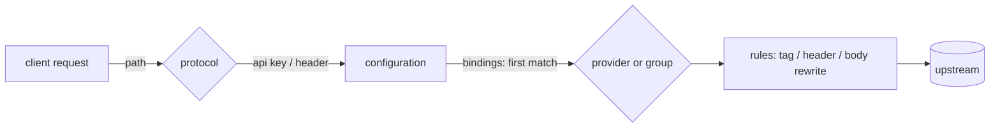

# FAQ — how do I … ?

Task-oriented answers for the things operators actually reach for: routing a model
to a provider, rewriting request/response bodies, proxying Anthropic message
batches, wiring Azure OpenAI, load-balancing, and applying rule changes live.

Every example below is taken from a real test fixture or the live cluster policy,
not invented — the file path is cited so you can `grep` the canonical form. The
fullest single example is the selection engine's golden fixture
(`internal/selection/selection_test.go`, the `golden` constant), which is the production
config expressed in the current model.

> **Config model note.** Sluice routes on the **v2 model**: a shared `providers`
> catalogue (connections) plus per-configuration `bindings` (the router as data)
> and `credentials`. Routing is config, not rule actions. The
> `changeProvider`/`changeUrl`/`changeApiKey`/`useResiliencePolicy` actions are
> **not gone** — they still parse, validate, round-trip, and apply to
> `MutableState` (registered in `contracts/rules/action.go`) — but the v2 data
> plane no longer consults the state they write, so they are **inert for
> routing**: `changeUrl` (`state.UpstreamURL`) and `changeApiKey`
> (`state.UpstreamCredentialOverride`) are written but never read;
> `useResiliencePolicy` (`state.PolicyRef`) is ignored because the binding-derived
> `ResilienceConfig` stashed on context wins and the data plane wires the name
> lookup to `nil`; `changeProvider` (`state.Provider`) is overwritten per attempt
> by the orchestrator's binding-derived provider switch before the final handler
> reads it. Treat those four as no-ops and route via `bindings`/`groups` instead.
> (`changeModelName` still works — it rewrites the typed body model and the path
> param, both of which the data plane reads; a binding/group `alias` is the
> last writer.) Rules are otherwise pure request/response **transforms** (tags,
> headers, body rewrites, short-circuits). A few older pages under `docs/` still
> describe the previous single-`providers.yaml` shape; where they disagree with
> this page and with `contracts/config/model.go`, the code (and this page) win.

---

## Contents

- [The 60-second mental model](#the-60-second-mental-model)
- [How do I route a model to a provider?](#how-do-i-route-a-model-to-a-provider)
- [How do I send one model to several providers with failover or load-balancing?](#how-do-i-send-one-model-to-several-providers-with-failover-or-load-balancing)
- [How do I rewrite a field in the request body?](#how-do-i-rewrite-a-field-in-the-request-body)
- [How do I delete or append to a body field?](#how-do-i-delete-or-append-to-a-body-field)
- [How do I rewrite the *response* body?](#how-do-i-rewrite-the-response-body)
- [What tokens can a rewrite value reference?](#what-tokens-can-a-rewrite-value-reference)
- [How do I gate a rewrite on the body content?](#how-do-i-gate-a-rewrite-on-the-body-content)
- [How do I support Anthropic message batches (and other passthrough surfaces)?](#how-do-i-support-anthropic-message-batches-and-other-passthrough-surfaces)
- [How do I add Azure OpenAI as a provider?](#how-do-i-add-azure-openai-as-a-provider)
- [How do I pin a query parameter like `api-version` on every request?](#how-do-i-pin-a-query-parameter-like-api-version-on-every-request)
- [How do I rename the model the upstream sees?](#how-do-i-rename-the-model-the-upstream-sees)
- [How do I tag requests for telemetry?](#how-do-i-tag-requests-for-telemetry)
- [How do I change rules without restarting?](#how-do-i-change-rules-without-restarting)
- [Why doesn't my rewrite fire?](#why-doesnt-my-rewrite-fire)

---

## The 60-second mental model

A request flows through four decisions:

1. **Protocol** — the inbound path fixes one wire shape: `chat`
   (`/v1/chat/completions`), `responses` (`/v1/responses`), `messages`
   (`/v1/messages`), `generate_content` (Gemini), or `embeddings`.
2. **Configuration** — resolved from the API key (managed mode) or the
   `X-Sluice-Configuration` header (passthrough). See [auth.md](auth.md).
3. **Binding** — the configuration's `bindings` are scanned in order;
   the first whose `protocol` matches and whose `models` glob matches the
   body's `model` wins. It names a single `provider` or a resilience `group`.
4. **Rules** — the configuration's `rule_names` run as transforms over the
   chosen request (and, on the way back, the response).

Three top-level blocks carry it (any number of `*.yaml` files in
`SLUICE_CONFIG_DIR`, merged by top-level key):

| Block | Holds | Type |
|---|---|---|
| `providers` | connections: `base_url`, per-protocol `path` + `auth`, `required_headers`, `query`, `passthrough` families | `contracts/config/model.go` → `Provider` |
| `groups` | resilience units: `mode`, `targets`, `circuit_breaker` | `model.go` → `Group` |
| `configurations` | per-name `credentials`, `bindings`, `passthrough_bindings`, `rule_names`, `tags` | `model.go` → `Configuration` |

Providers hold **no** credentials — the configuration supplies the key per
provider, substituted into the auth `format`'s `{key}` placeholder.



---

## How do I route a model to a provider?

Declare the provider once, then add a binding on the configuration. Bindings are
ordered; first match wins, and an empty `models` list is a catch-all for the
protocol.

```yaml
# providers.yaml
providers:
  openai:
    base_url: https://api.openai.com
    protocols:
      chat:      { path: /v1/chat/completions, auth: { header: Authorization, format: "Bearer {key}" } }
      responses: { path: /v1/responses,        auth: { header: Authorization, format: "Bearer {key}" } }
  anthropic:
    base_url: https://api.anthropic.com
    required_headers: { anthropic-version: "2023-06-01" }
    protocols:
      messages: { path: /v1/messages,        auth: { header: x-api-key,     format: "{key}" } }
      chat:     { path: /v1/chat/completions, auth: { header: Authorization, format: "Bearer {key}" } }
```

```yaml
# policy.yaml
configurations:
  production:
    credentials:
      openai: sk-openai
      anthropic: sk-anthropic
    bindings:
      - { protocol: chat,     models: ["gpt-*", "o3*"], provider: openai }
      - { protocol: chat,     models: ["claude-*"],     provider: anthropic }
      - { protocol: messages, models: ["claude-*"],     provider: anthropic }
```

Source: `internal/selection/selection_test.go` (the `golden` constant) and `config-dev/policy.yaml`. Model globs use a
trailing-`*` wildcard (`gpt-*`, `o3*`). The same provider can serve more than one
protocol with **different** auth conventions per protocol — that's how
Anthropic's native `messages` (`x-api-key`) and its OpenAI-compat `chat` surface
(`Authorization: Bearer`) coexist on one provider (invariant #6).

---

## How do I send one model to several providers with failover or load-balancing?

Define a `group` and point the binding at it with `group:` instead of `provider:`.
A group cuts across providers; every target must serve the binding's protocol (no
mid-failover translation).

```yaml
groups:
  qwen-load-balance:
    mode: load_balance               # or: failover
    failure_status_codes: [502, 503, 504]
    circuit_breaker: { enabled: true, failure_threshold: 3, cooldown_seconds: 60 }
    targets:
      - { provider: qwen-ollama,     alias: "qwen2.5-coder:7b" }
      - { provider: qwen-standalone, alias: "qwen-coder" }

configurations:
  production:
    bindings:
      - { protocol: chat, models: ["qwen2.5-coder:7b"], group: qwen-load-balance }
```

Source: `internal/selection/selection_test.go` (the `golden` constant). Per-target `alias`
rewrites the body's model name when *that* target is picked, so one logical model
maps to a different upstream id per provider. For weighted load-balance use
`weight:` on targets; for ordered failover use `mode: failover` (declaration
order is the sequence). Full semantics: [resilience.md](resilience.md).

---

## How do I rewrite a field in the request body?

Add a `rewriteField` action to a rule and list the rule in the configuration's
`rule_names`. Targets are `request.body.<dotted.path>`; missing intermediate
objects are created.

```yaml
configurations:
  production:
    rule_names:
      - force-stream-usage

rules:
  - name: force-stream-usage
    condition:
      type: group
      logicalOperator: And
      children:
        - { type: provider, operator: Equals, expectedProvider: openai }
        - { type: protocol, operator: Equals, expectedProtocol: chat }
        - { type: bodyField, target: request.body.stream, operator: Equals, value: "true" }
    actions:
      - type: rewriteField
        target: request.body.stream_options.include_usage
        value: true
    behavior: continue
```

Source: `test/e2e/rules/rewrite_test.go`. Notes that bite:

- **The `provider` condition matches the resolved provider name and the
  `protocol` condition matches the resolved protocol** (`chat`/`messages`/…) or
  passthrough family. The condition above reads "OpenAI provider, chat protocol".
- **Value typing follows YAML.** An unquoted scalar is emitted with its JSON type
  (`value: true` → boolean `true`, `value: 42` → number). A **quoted** string is a
  template that may contain `{…}` refs (`value: "t1"` → string `"t1"`). A YAML
  sequence/mapping is emitted as a verbatim JSON array/object. See
  `contracts/rules/rewrite.go` → `RewriteValue`.
- Writable paths are **bare identifiers only** — no array indices, wildcards, or
  gjson query syntax. (Reads in `bodyField` are unconstrained; only writes are
  locked down — `contracts/rules/rewrite.go` → `ParseTarget`.)
- `behavior: continue` lets later rules run; `behavior: exit` stops rule
  evaluation after this rule.

---

## How do I delete or append to a body field?

`removeField` deletes a key entirely (distinct from setting it to `null`).
`appendField` pushes onto an array, creating the array if absent.

```yaml
rules:
  - name: strip-user
    condition: { type: provider, operator: Equals, expectedProvider: openai }
    actions:
      - { type: removeField, target: request.body.user }
    behavior: continue

  - name: inject-system
    condition: { type: provider, operator: Equals, expectedProvider: openai }
    actions:
      - type: appendField
        target: request.body.messages
        value:
          role: system
          content: be good
    behavior: continue
```

Source: `test/e2e/rules/rewrite_test.go`. `appendField` addresses the array
*container*, not an element — there is no positional index.

---

## How do I rewrite the *response* body?

Use the same actions with a `response.body.<path>` target. The canonical case is
rebasing an upstream URL so a client that follows it comes back through Sluice
(keeping auth + telemetry) instead of hitting the provider directly:

```yaml
rules:
  - name: rebase-batches-results-url
    condition:
      type: group
      logicalOperator: And
      children:
        - { type: provider, operator: Equals, expectedProvider: anthropic }
        - { type: protocol, operator: Equals, expectedProtocol: messages_batches }
    actions:
      - type: rewriteField
        target: response.body.results_url
        value: "{external_url}/anthropic/v1/messages/batches/{response.body.id}/results"
    behavior: continue
```

Source: `test/e2e/rules/batches_rebase_test.go`. With `ExternalURL` set to
`https://sluice.donkeywork.dev`, an upstream `results_url` is rewritten to
`https://sluice.donkeywork.dev/anthropic/v1/messages/batches/<id>/results` while
every other field of the payload round-trips untouched.

**Streaming caveat:** response-body rewrites are **dropped on streaming (SSE)
responses** — the chunks aren't one JSON document — with a structured warn and a
bump to `gateway.rewrite.dropped.total` (`internal/middleware/rules/bodyrewrite.go`
→ `ApplyResponseRewrites`). Rewrite response bodies only on non-streaming surfaces.

---

## What tokens can a rewrite value reference?

A **quoted** `value` (or a `setHeader` value) is a template. Supported tokens
(`internal/bodypatch/bodypatch.go`):

| Token | Resolves to | Notes |
|---|---|---|
| `{request.body.<path>}` | a field of the request body | gjson path; the working body on the request phase |
| `{response.body.<path>}` | a field of the response body | response phase only |
| `{path_params.<name>}` | a URL path placeholder | e.g. `{path_params.id}` from `/v1/messages/batches/{id}` |
| `{state.provider}` | the resolved provider name | |
| `{state.protocol}` | the resolved protocol / family | |
| `{external_url}` | the gateway's external base URL | from the `ExternalURL` setting |

A bare quoted string with no `{…}` resolves to itself. Unresolved/empty refs
cause the op to be dropped (counted), never to forward a half-substituted value.

---

## How do I gate a rewrite on the body content?

Add a `bodyField` condition. Reads support full gjson query syntax (unlike
writes), so you can match inside arrays:

```yaml
condition:
  type: bodyField
  target: request.body.tools.#(name=="bash")     # gjson predicate read
  operator: Exists
```

Operators (`contracts/rules/rewrite.go` → `BodyFieldOperator`): `Equals`,
`Contains`, `Matches` (RE2 regex), `Exists`, `Is` (JSON type name —
`string`/`number`/`bool`/`array`/`object`/`null`). Add `not: true` to invert.
`bodyField` reads the **request** body only — `response.body` is rejected for
conditions (they evaluate before the upstream replies).

---

## How do I support Anthropic message batches (and other passthrough surfaces)?

Batches, file uploads, and other stateful/opaque families aren't model-keyed —
they're matched by **path pattern**, not by parsing a body. Declare a
`passthrough` family on the provider, then expose it with a `passthrough_binding`.

```yaml
# providers.yaml — on the anthropic provider
providers:
  anthropic:
    base_url: https://api.anthropic.com
    required_headers: { anthropic-version: "2023-06-01" }
    protocols:
      messages: { path: /v1/messages, auth: { header: x-api-key, format: "{key}" } }
    passthrough:
      messages_batches:
        auth: { header: x-api-key, format: "{key}" }
        paths:
          - { match: /v1/messages/batches,               methods: [POST, GET] }
          - { match: "/v1/messages/batches/{id}",        methods: [GET, DELETE] }
          - { match: "/v1/messages/batches/{id}/results", methods: [GET] }
```

```yaml
# policy.yaml — on the configuration
configurations:
  production:
    passthrough_bindings:
      - { family: messages_batches, provider: anthropic }
```

Source: `config-dev/providers.yaml` (the three-path `messages_batches` family above is the full local-dev definition; the `golden` fixture in `internal/selection/selection_test.go` carries a trimmed two-path variant of the same family).

A passthrough family differs from a normal binding in three ways:

- **Selected by path**, not by `(protocol, model)`.
- **Proxied verbatim** — no typed parsing, no GenAI telemetry, no payload
  capture. Only rewrites (for URL rebasing — see the response-rewrite question)
  and plain HTTP metrics apply.
- `{id}` placeholders in `match` are extracted and exposed to rewrites as
  `{path_params.id}`.

---

## How do I add Azure OpenAI as a provider?

Azure OpenAI is just another provider, with three Azure-isms: the `api-version`
query parameter, the `api-key` auth header (not `Authorization: Bearer`), and a
deployment-shaped path.

```yaml
providers:
  azure-foundry:
    base_url: https://res.cognitiveservices.azure.com
    query: { api-version: 2025-04-01-preview }
    protocols:
      responses: { path: /openai/responses, auth: { header: api-key, format: "{key}" } }

configurations:
  production:
    credentials:
      azure-foundry: az-key
    bindings:
      - { protocol: responses, models: ["foundry-model-name"], provider: azure-foundry, alias: gpt-5.2-chat, tags: [foundry] }
```

Source: `internal/selection/selection_test.go` (the `golden` constant). Here the client asks
for `foundry-model-name`; the binding routes it to the Azure provider and `alias`
rewrites the body's model to the deployment id `gpt-5.2-chat` the upstream
expects. The `api-version` rides as a provider-level default query param (next
question), and `api-key: {key}` injects the `az-key` credential.

> **Don't** confuse this with the **`azure_blob` connector**
> ([connectors.md](connectors.md)) — that's a spool *destination* for captured
> records, unrelated to routing traffic to Azure OpenAI.

---

## How do I pin a query parameter like `api-version` on every request?

Put it on the provider's `query` map — it's appended to every forwarded request to
that provider:

```yaml
providers:
  azure-foundry:
    base_url: https://res.cognitiveservices.azure.com
    query: { api-version: 2025-04-01-preview }
```

A binding or group target can add or override entries with its own `query:`; the
effective set is provider ∪ override, override winning (`model.go` →
`Provider.Query` / `Target.Query`). This replaces the old per-rule
"append query string" action — the pin is now provider data.

For static **headers** (e.g. `anthropic-version`), use `required_headers` on the
provider instead; those are injected on every request and overwrite any inbound
header of the same name.

---

## How do I rename the model the upstream sees?

Use `alias`:

- on a **binding** (single provider) — `{ …, provider: azure-foundry, alias: gpt-5.2-chat }`
- on a **group target** — `{ provider: qwen-ollama, alias: "qwen2.5-coder:7b" }`

`alias` rewrites the request body's `model` field when that destination is
selected. Putting it on the target (not the binding) lets one logical model map
to a different upstream id per provider in a group. Source:
`internal/selection/selection_test.go`, `contracts/config/model.go` →
`Target.Alias` / `Binding.Alias`.

---

## How do I tag requests for telemetry?

Three places attach tags, all propagated to telemetry:

- **Configuration-wide:** `tags: { tier: production }` on the configuration.
- **Per-binding:** `tags: [foundry]` on a binding (carries the old
  "addTag on route" pattern).
- **Per-rule:** an `addTag` action, optionally gated by a condition:

```yaml
rules:
  - name: tag-k3s-agentling
    condition:
      type: header
      keyOperator: Equals
      keyPattern: X-Agentling-Name
      valueOperator: Equals
      valuePattern: k3s-agentling
      caseInsensitive: true
    actions:
      - { type: addTag, tag: client:k3s-agentling }
    behavior: continue
```

Source: `config-dev/policy.yaml`. Full action catalogue: [actions.md](actions.md);
condition catalogue: [rules.md](rules.md).

---

## How do I change rules without restarting?

Rule edits go through the admin write API and apply **live** — the gateway clones
the live config, validates, persists `policy.yaml`, and atomically swaps it in, so
in-flight requests see either the old or new rule set, never a torn mix
(invariant #9):

```
POST   /admin/api/v1/config/rules
PUT    /admin/api/v1/config/rules/{name}
DELETE /admin/api/v1/config/rules/{name}
```

The visual editor in the [admin console](admin-console.md) drives these. **Only
rules** are live-editable today; edits to `providers`, `configurations`,
`api_keys`, `connectors`, and `groups` are still YAML-on-disk and need a process
restart (hot reload for those is a v1.2+ item). Validate a bundle before deploy
with `sluice-cli config validate` ([auxiliary-binaries.md](auxiliary-binaries.md)).

---

## Why doesn't my rewrite fire?

Walk these in order:

1. **Is the rule listed?** A rule only runs if its `name` is in the
   configuration's `rule_names`. Defining it in the `rules` block is not enough.
2. **Does the condition match the v2 vocabulary?** `provider` = resolved
   **provider name** (e.g. `anthropic`, `azure-foundry`), `protocol` = the
   **protocol** (`chat`/`messages`/`responses`/`generate_content`) or passthrough
   **family** (`messages_batches`). A condition expecting an old provider/protocol
   name silently never matches.
3. **Right phase?** `request.body.*` rewrites apply before forwarding;
   `response.body.*` only on **non-streaming** responses (streaming SSE drops
   them — check `gateway.rewrite.dropped.total` with `reason="streaming_response"`).
4. **Writable target?** Write paths must be bare identifiers
   (`request.body.a.b.c`) — indices/wildcards/queries are rejected at config load.
   Use a `bodyField` *read* if you need a predicate.
5. **Value typed as you meant?** Quote for a string/template, leave unquoted for
   a JSON scalar. `value: "true"` is the string `"true"`; `value: true` is boolean.
6. **Don't probe with real model names.** A no-match test model like
   `claude-haiku-4-5` breaks the day a binding grows a `claude-*` glob — use a
   synthetic name like `nomatch-internal`.

Rewrite outcomes are observable: `gateway.rewrite.applied.total` and
`gateway.rewrite.dropped.total` (by `action_type` and `reason`; dots become
underscores on the Prometheus `/metrics` surface) — see
[observability.md](observability.md).

---

## See also

- [Configuration model](configuration-model.md) — loader, file allow-list, merge rules
- [Routing](routing.md) — path → protocol matching, `X-Sluice-*` headers
- [Authentication](auth.md) — managed vs passthrough, credential resolution
- [Rules](rules.md) / [Actions](actions.md) — every condition and action
- [Resilience](resilience.md) — failover, load-balance, circuit breaker
- [Connectors](connectors.md) — `azure_blob` / `s3` / `webhook` record destinations
