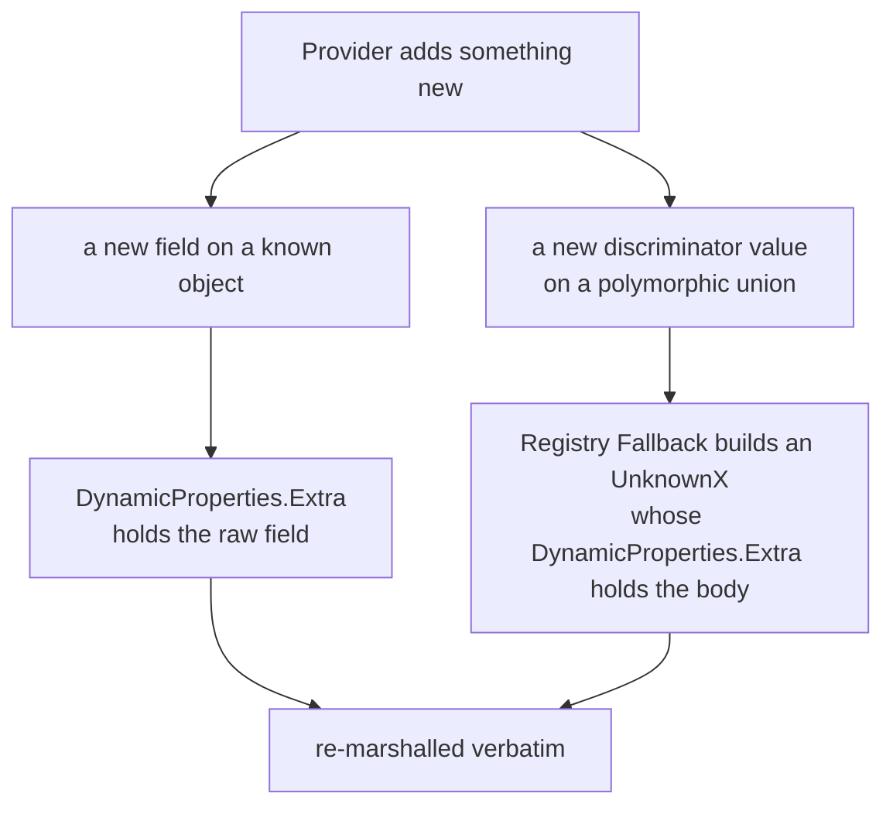

# The `models` package — unknown-field round-tripping

The `models` package (`models/`) holds the load-bearing helpers that let every
provider model type survive a parse-and-reserialise cycle without dropping
fields. It is the machinery behind **invariant #1** in
[`CLAUDE.md`](../CLAUDE.md): *unknown JSON fields round-trip back to the upstream
provider intact.*

Provider APIs evolve constantly. If the gateway parses a request into a typed
struct, forwards it, and silently drops a field the struct does not model, the
customer's request subtly breaks — and there is no error to log and no metric to
spike. The three primitives documented here are the safety net that prevents
that:

| Primitive | File | Job |
|---|---|---|
| `DynamicProperties` + `MarshalDynamic` / `UnmarshalDynamic` | `models/dynamic.go` | Capture and re-emit unknown **object fields** |
| `PolymorphicRegistry[T]` + `Fallback` | `models/polymorphic.go` | Dispatch a discriminated union; preserve unknown **discriminator values** |
| `CollectUnmapped` | `models/unmapped.go` | Surface, for telemetry, every field that landed in a `DynamicProperties.Extra` |

Together they guarantee: *if a payload parses, it round-trips* — the property the
fuzz suite asserts on every `UnmarshalJSON` in `protocols/` (see the
[Testing Strategy](../CLAUDE.md#protocol-contracts--perpetual-maintenance)).

The concrete provider types that embed these primitives are documented in
[provider-models.md](provider-models.md).

## Why two layers

Provider wire shapes drift in two independent ways, and each needs a different
catch:



- A **new field** on an object we already model (e.g. OpenAI adds
  `safety_identifier` to a request body) is caught by `DynamicProperties`.
- A **new member** of a discriminated union (e.g. Anthropic ships a new content
  block `type`) is caught by `PolymorphicRegistry.Fallback`, which builds an
  `UnknownX` placeholder — and *that* placeholder embeds `DynamicProperties`, so
  the unknown member's own body round-trips too. The two layers compose.

## DynamicProperties

`DynamicProperties` (`models/dynamic.go:33-44`) is a one-field struct embedded on
every provider model type:

```go
type DynamicProperties struct {
    Extra map[string]json.RawMessage `json:"-" yaml:"-"`
}
```

`Extra` holds the JSON object keys that did not match any typed field on the
embedding struct, stored as raw bytes keyed by their wire name. The `json:"-"`
tag keeps the standard library from touching `Extra` directly — the custom
marshal/unmarshal pair below owns it. The `yaml:"-"` tag keeps `Extra` out of
YAML entirely: YAML is the operator-authored format for *our* schemas (rules,
configurations), never a carrier for provider-side unknown fields, so there is
nothing for YAML to preserve (`models/dynamic.go:38-43`).

### The embed-and-delegate pattern

A type opts into round-tripping by (a) embedding `DynamicProperties` and (b)
delegating its `json` methods to the two helpers. Every type in `protocols/`
follows this exact shape:

```go
type ChatCompletionRequest struct {
    Model    string          `json:"model"`
    Messages RequestMessages `json:"messages"`
    // ... typed fields ...
    models.DynamicProperties
}

func (r *ChatCompletionRequest) UnmarshalJSON(data []byte) error {
    return models.UnmarshalDynamic(data, r)
}
func (r ChatCompletionRequest) MarshalJSON() ([]byte, error) {
    return models.MarshalDynamic(r)
}
```

(`protocols/openai/chat/chat.go:120-127`)

### UnmarshalDynamic

`UnmarshalDynamic(data, v)` (`models/dynamic.go:106-147`) decodes `data` into
`v` (a non-nil pointer to a struct embedding `DynamicProperties`):

1. Decodes the whole object into a `map[string]json.RawMessage`.
2. For every key that matches a typed field's `json` name, unmarshals the value
   into that field and **removes** the key from the map.
3. Whatever keys remain are set as `DynamicProperties.Extra`. If none remain,
   `Extra` is zeroed (so a payload with no unknowns leaves a nil map, not an
   empty one).

It returns `ErrNotPointer` for a non-pointer/nil argument and `ErrNotStruct`
when the value does not reference a struct (or has no embedded
`DynamicProperties`) (`models/dynamic.go:16-22`, `:137-140`).

### MarshalDynamic

`MarshalDynamic(v)` (`models/dynamic.go:49-101`) does the inverse, merging the
typed fields and `Extra` back into one object:

1. Seeds the output map with every `Extra` key.
2. Overlays the typed fields — **typed fields win on collision**, so a field the
   struct models always reflects the struct's value, never a stale `Extra` copy.
3. Honours `omitempty`: an empty typed field is deleted from the output (and
   does not resurrect a same-named `Extra` entry).
4. Emits keys in **sorted order** so output is deterministic — this is what
   makes the inline golden round-trip byte-equivalence tests in each
   `protocols/*/*_test.go` possible (`test/fixtures/` holds E2E fixtures, not
   the per-type golden round-trips).

Because output is sorted, a round-trip is byte-equivalent *modulo key order*:
the gateway does not promise to preserve the provider's original key ordering,
only the full set of keys and their values. Tag enforcement (`json` tags on
every exported field) is verified per package by a per-package
`TestX_AllExportedFieldsHaveJSONTag` reflection meta-test (e.g.
`TestChat_AllExportedFieldsHaveJSONTag`,
`TestContentBlock_AllExportedFieldsHaveJSONTag`).

> **Edge case — fields kept as `json.RawMessage`.** Some polymorphic or
> string-or-array fields (e.g. `ChatCompletionRequest.Stop`,
> `ChatCompletionRequest.ToolChoice`, Anthropic `MessagesRequest.System`,
> `Message.Content`) are typed as `json.RawMessage` rather than a concrete type.
> They are still "typed fields" as far as `MarshalDynamic` is concerned — they
> are not unknown — so they round-trip through the named field, not through
> `Extra`. This is how the gateway preserves shapes it deliberately chooses not
> to fully model. See [provider-models.md](provider-models.md) for the catalogue.

## PolymorphicRegistry[T]

A discriminated union — Anthropic content blocks, OpenAI chat messages, OpenAI
content parts — cannot be decoded by `json.Unmarshal` into a `[]Interface`,
because Go cannot pick the concrete type from a bare interface.
`PolymorphicRegistry[T]` (`models/polymorphic.go:34-48`) does that dispatch:

```go
type PolymorphicRegistry[T any] struct {
    DiscriminatorField string                 // e.g. "type" or "role"
    Factories          map[string]func() T    // known value -> constructor
    Fallback           func(discriminator string) T  // unknown value -> UnknownX
}
```

`UnmarshalOne(data)` (`models/polymorphic.go:52-76`):

1. Peeks the `DiscriminatorField` value out of the object
   (`peekDiscriminator`, `:96-113`).
2. If a factory is registered for that value, constructs the concrete type and
   unmarshals into it.
3. Otherwise, if `Fallback` is non-nil, calls it with the unknown value to build
   a catch-all (conventionally an `UnknownX` type) and unmarshals the full body
   into that.
4. With no factory and no `Fallback`, returns `ErrUnknownDiscriminator`.

`UnmarshalSlice(data)` (`:80-94`) decodes a JSON array by dispatching each
element through `UnmarshalOne`.

### The Fallback contract — UnknownX preservation

The `Fallback` is what makes unknown discriminators survive. By convention each
union has an `UnknownX` member whose only typed field is the discriminator
itself; everything else lands in `DynamicProperties.Extra`. The Anthropic
content-block registry is the canonical example
(`protocols/anthropic/messages/contentblock.go:473-491`):

```go
var blockRegistry = models.PolymorphicRegistry[ContentBlock]{
    DiscriminatorField: "type",
    Factories: map[string]func() ContentBlock{
        "text":              func() ContentBlock { return &TextBlock{} },
        "image":             func() ContentBlock { return &ImageBlock{} },
        "tool_use":          func() ContentBlock { return &ToolUseBlock{} },
        "tool_result":       func() ContentBlock { return &ToolResultBlock{} },
        "server_tool_use":   func() ContentBlock { return &ServerToolUseBlock{} },
        "web_search_tool_result": func() ContentBlock { return &WebSearchToolResultBlock{} },
        "web_fetch_tool_result":  func() ContentBlock { return &WebFetchToolResultBlock{} },
        "thinking":          func() ContentBlock { return &ThinkingBlock{} },
        "redacted_thinking": func() ContentBlock { return &RedactedThinkingBlock{} },
    },
    Fallback: func(disc string) ContentBlock { return &UnknownBlock{Type: disc} },
}
```

A content block with a `type` Anthropic adds next quarter — say a hypothetical
`"computer_tool_result"` — has no factory, so the registry builds an
`UnknownBlock` carrying that `Type` and routes the rest of the object into
`Extra`. The block re-marshals byte-equivalent and forwards to the provider
intact. **A new union member added without an `UnknownX` fallback is a
regression** against invariant #1.

The shared registry backs these unions (among others):

| Union | Discriminator | Registry | Fallback type |
|---|---|---|---|
| Anthropic `ContentBlock` | `type` | `contentblock.go:473-491` | `UnknownBlock` |
| Anthropic `ContextEdit` | `type` | `context_management.go:280` | `UnknownContextEdit` |
| Anthropic `StreamEvent` | `type` | `stream.go:394` | `UnknownStreamEvent` |
| Anthropic `ContentBlockDelta` | `type` | `stream.go:600` | `UnknownContentBlockDelta` |
| OpenAI chat `RequestMessage` | `role` | `messages.go:275` | `UnknownRequestMessage` |
| OpenAI chat `ContentPart` | `type` | `content_parts.go:294` | `UnknownContentPart` |
| OpenAI chat `Annotation` | `type` | `annotations.go:127` | `UnknownAnnotation` |
| OpenAI Responses `ToolDefinition` | `type` | `tool.go:240` | `UnknownTool` |
| OpenAI Responses `ResponsesStreamEvent` | `type` | `events.go:435` | `UnknownEvent` |

Gemini `Part` is also a discriminated union but dispatches by **key-presence**
(`{"text":…}` vs `{"functionCall":…}`) rather than a single discriminator field,
so it has its own hand-rolled `UnmarshalPart` instead of the shared registry —
see [provider-models.md → Gemini parts](provider-models.md#parts--key-presence-polymorphism)
and `protocols/gemini/content/parts.go:405-431`.

## CollectUnmapped

`CollectUnmapped(v)` (`models/unmapped.go:35-47`) walks a provider model value
(or pointer) and returns the sorted, de-duplicated dotted paths of every field
that landed in a `DynamicProperties.Extra` anywhere in the tree. It is the
signal that drives the `gateway.unmapped_fields.total` meter described in
[observability.md](observability.md): a non-empty result means the provider sent
fields this build does not model, which is the early-warning that a provider
spec has drifted ahead of `protocols/`.

Path construction (`models/unmapped.go:16-26`, `collectUnmapped` `:49-84`):

- Each path is the chain of `json` field names from the root to the embedding
  struct, joined by `.`, with the unmapped key appended.
- **Slice and map elements do not add an index segment.** Every element of a
  `content` array that carried an unmodelled `reasoning_id` collapses to the
  single path `content.reasoning_id`, so the cardinality of the resulting metric
  stays bounded regardless of array length.

### The RawMessage opacity boundary

`CollectUnmapped` treats `json.RawMessage` (and any other `[]byte`) as an
**opaque leaf** — it does not parse the bytes, so unmodelled fields nested
inside a raw sub-document are not discovered (`models/unmapped.go:28-34`,
`isByteSequence` `:89-94`). This has a concrete, asymmetric consequence for
Anthropic, baked into the type design:

- Anthropic **request** `Message.Content` is kept as `json.RawMessage`
  (`protocols/anthropic/messages/messages.go:147`), so a request-side walk
  surfaces top-level and message-level unknowns but **not** content-block
  internals.
- Anthropic **response** `Content` is typed `[]ContentBlock`
  (`protocols/anthropic/messages/response.go:26`), so a response-side walk *does*
  descend into blocks and surface unmodelled block fields.

The recursion is depth-bounded at `maxUnmappedDepth = 64`
(`models/unmapped.go:9-12`) — a defensive backstop against a pathological or
future self-referential type, not an expected limit; provider models are shallow
acyclic trees well under it.

## Invariants this package upholds

1. **Every provider model type embeds `DynamicProperties`** and delegates its
   `json` methods to `Marshal/UnmarshalDynamic`. A new struct without this is a
   regression (invariant #1).
2. **Every polymorphic union has an `UnknownX` fallback** wired into its
   registry (or `UnmarshalPart` for Gemini). Unknown discriminators must never
   error or drop.
3. **Typed fields win over `Extra` on marshal**, and output keys are sorted, so
   round-trips are byte-equivalent modulo key order.

## See also

- [provider-models.md](provider-models.md) — the concrete provider model
  types built on these primitives.
- [genai-conformance-audit.md](genai-conformance-audit.md) — how the typed
  models feed OTel GenAI telemetry.
- [observability.md](observability.md) — the `gateway.unmapped_fields.total`
  meter that `CollectUnmapped` drives.
</content>
</invoke>
