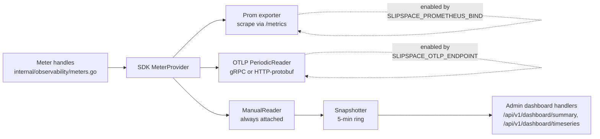

# Observability

SlipSpace ships three independent observability channels: OTel metrics for operational counters and quantiles, structured `log/slog` JSON for debugging and audit, and the connector spool for billing and downstream consumers. They share a correlation ID and resolved per-request labels but never overlap responsibilities — meters never carry bodies, captured records never replace metrics, logs never become the wire-of-record for billing.

This page is the operator reference for everything the gateway emits: every meter, the Go runtime and process collectors exposed on `/metrics`, every per-request log field, and the in-process snapshotter that backs the admin dashboard. The resilience.* and cb.* meters are covered alongside the orchestrator in [docs/resilience.md](resilience.md); this page links out rather than duplicating them. For the connector spool's wire shape (the captured-record format) see [spool.md](spool.md) and [connectors.md](connectors.md).

---

## Table of contents

1. [Three channels](#three-channels)
2. [OTel pipeline](#otel-pipeline)
3. [Meters](#meters)
   - [Requests](#requests)
   - [Tokens](#tokens)
   - [Rules](#rules)
   - [Tags](#tags)
   - [Resilience and circuit breaker](#resilience-and-circuit-breaker)
   - [Admin](#admin)
   - [Errors](#errors)
   - [Crash safety](#crash-safety)
   - [Provider drift](#provider-drift)
   - [Control path](#control-path)
4. [Runtime and process collectors](#runtime-and-process-collectors)
5. [Histogram bucket boundaries](#histogram-bucket-boundaries)
6. [Snapshotter](#snapshotter)
7. [Health endpoint](#health-endpoint)
8. [Structured logs](#structured-logs)
9. [Connector-captured records](#connector-captured-records)
10. [Cross-references](#cross-references)

---

## Three channels

> **Metrics count. Logs explain. Connectors bill.**

The three channels are intentionally disjoint. Every signal the gateway emits belongs to exactly one of them, and the consumers — Prometheus / Grafana, log aggregator, connector destination — should never have to reach across to compose a view.

**OTel metrics** are counters, histograms, and gauges scraped by Prometheus and/or pushed via OTLP. They answer *how many*, *how fast*, and *how often*. They are bounded-cardinality — labels come from operator-authored configuration (provider names, endpoint names, configuration names, rule names, policy/target names) and never from client input. They are **not** the audit log: provider response bodies, prompt contents, and per-request payloads never appear in a metric label.

**Structured logs** are JSON records emitted via `log/slog` to stdout. They carry a service header (`service`, `version`), a per-request envelope (`correlation_id`, `provider`, `protocol`, `model`, …) and the human-readable narrative the operator needs to debug a failing request. They are **not** billable: log shipping is best-effort, the storage tier is operator-chosen, and provider response bodies are deliberately excluded — bodies go to the connector spool.

**Connector-captured records** are end-of-pipeline payloads shipped to operator-configured destinations. S3 and Azure Blob use ndjson.zst segments written to a per-connector spool; webhooks use a bounded real-time pusher. Both paths are non-blocking — see [load-bearing invariant 2](../CLAUDE.md) — drops occur under backpressure rather than blocking the request. They are **not** operational telemetry: a Grafana panel must never read records from S3; the equivalent OTel meter exists for every dimension a dashboard cares about.

---

## OTel pipeline

`internal/observability/setup.go` constructs the SDK MeterProvider with three potential readers:

- **Prometheus exporter** — enabled when the `SLIPSPACE_PROMETHEUS_BIND` environment variable is non-empty (it is env-configured, not a `gateway.yaml` key). Registers an `otelprom` exporter against a fresh `prometheus.Registry` and exposes a `promhttp.Handler` the data plane mounts at `/metrics` on the Prometheus listener.
- **OTLP exporter** — enabled when the `SLIPSPACE_OTLP_ENDPOINT` environment variable is non-empty. `SLIPSPACE_OTLP_PROTOCOL` selects between gRPC (`grpc`, and the default when the variable is unset or empty) and HTTP-protobuf (`http/protobuf`); any other value fails startup with `observability: unsupported OTLP protocol %q`. The gateway's env validator (`internal/config/env.go`, `ErrUnknownOTLPProtocol`) admits only `grpc` and `http/protobuf` and rejects anything else at startup; `internal/observability` also recognises a bare `http` alias, but that path is unreachable from the gateway binary because `ServerEnv.Validate` runs first. These are environment variables, not `gateway.yaml` keys. Wrapped in a `sdkmetric.PeriodicReader` so the SDK batches pushes on its own cadence. Metrics export with **delta** temporality (`internal/observability/setup.go::deltaTemporality`) — sums and histograms go delta so the ingest side can SUM a window of points to an exact count, while up-down counters and the cb.state gauge stay cumulative (delta is undefined for them); the Prometheus reader is unaffected and stays cumulative. The endpoint is typically the central **Arbiter**, which ingests these meters plus the GenAI spans and events below — see [docs/arbiter.md](arbiter.md) for its OTLP ingest and the [Second cap](#genai-spans-and-events) it applies to assembled content.
- **ManualReader** — **always attached**, regardless of the other two. The [snapshotter](#snapshotter) pulls from this reader on a configurable interval; nothing external consumes it. The cost when both Prom scrape and OTLP push are disabled is essentially zero — the reader only runs work when the snapshotter calls `Collect`.

The same `MeterProvider` is also registered globally via `otel.SetMeterProvider`, so stray code reaching for the global meter still lands on the same instrument set.



`Provider.Shutdown` collapses every exporter shutdown and the MeterProvider shutdown into a single idempotent `once.Do` so graceful termination handlers can call it multiple times without double-flushing.

Resource attributes stamped on every metric series:

| Attribute | Source |
|---|---|
| `service.name` | `BuildInfo.Service` (always `gateway` for `cmd/gateway`) |
| `service.version` | `BuildInfo.Version`, sourced from `internal/version.Version` |
| `deployment.environment` | `SLIPSPACE_ENV` env var, omitted when empty |

---

## Meters

Gateway instruments span three namespaces under the OTel meter scope `slipspace-gateway`: `gen_ai.*` for the spec inference signals (`gen_ai.client.token.usage`, `gen_ai.client.operation.duration` / `.time_to_first_chunk` / `.time_per_output_chunk`), `slipspace.*` for SlipSpace convenience aggregates (`slipspace.requests.total`, `slipspace.config.hit`, `slipspace.rule.fired`, `slipspace.tokens.input.total`, `slipspace.tokens.output.total`, `slipspace.tokens.cached.total`, `slipspace.tokens.cache_creation.total`, `slipspace.cost.usd.total`, `slipspace.pricing.unmatched.total`), and `gateway.*` for instruments the GenAI spec has no concept for (rule engine, resilience orchestrator, circuit breaker, admin console). All names live as exported constants in [`internal/observability/meters.go`](../internal/observability/meters.go) (`Metric*`); call sites reference the constants rather than string literals.

### Requests

The data-plane request lifecycle. Per-request counters fire **exactly once per inbound request** — multi-attempt orchestration suppresses the per-attempt terminal publish so the closure is invoked once at FireTerminal time. Per-attempt phenomena (TTFB, transport errors) stay attempt-shaped because that's the shape of the underlying event.

| Metric | Type | Labels | Unit | What it counts |
|---|---|---|---|---|
| `slipspace.requests.total` | counter | `gen_ai.provider.name, gen_ai.request.model, gen_ai.operation.name, slipspace.protocol, slipspace.configuration, gen_ai.response.model (when present), http.response.status_code, error.type (failure), server.address/port` | 1 | Total requests completed. One increment per inbound request at OnComplete, after rule mutation and (for orchestrated requests) after the resilience orchestrator has resolved a final status. SlipSpace-namespaced convenience counter — the GenAI spec derives request count from the duration histogram `_count`; this is a spec-legal additive extra the admin console's per-dimension counting is built on. |
| `slipspace.config.hit` | counter | `slipspace.configuration` | 1 | Requests resolved to a named configuration. One increment per inbound request at OnComplete, fired only when a configuration resolved (the reporter skips it when `r.configuration` is empty — `cmd/gateway/reporter.go::recordPerRequestMetrics`). The SlipSpace-namespaced by-configuration rollup the Arbiter reads for its per-configuration dashboard panel, so a dashboard never scans the per-request record store (channel-2 meter, [invariant #4](../CLAUDE.md)). |
| `gen_ai.client.operation.duration` | histogram | `gen_ai.provider.name, gen_ai.request.model, gen_ai.operation.name, slipspace.protocol, slipspace.configuration, gen_ai.response.model (when present), http.response.status_code, error.type (failure), server.address/port (when present)` | s | End-to-end request duration, observed by the gateway as it calls upstream — the GenAI *client* vantage (SlipSpace is a client of the provider; it times the round trip, it does not generate tokens). Recorded alongside `slipspace.requests.total` so the two share an attribute set and Grafana can join rate + quantile by the same dimensions. |
| `gateway.active_requests` | up-down counter | (none) | 1 | Requests currently in flight. Incremented at OnRequestStart, decremented at OnComplete. |
| `gen_ai.client.operation.time_to_first_chunk` | histogram | `gen_ai.provider.name, gen_ai.request.model, gen_ai.operation.name, slipspace.protocol, gen_ai.response.model (when present), server.address/port (when present)` | s | Time from request acceptance to the first response chunk received from upstream (client vantage — time to *receive* the first chunk, not the server-side time to *generate* the first token). **Streaming requests only**, per the GenAI spec, which scopes this metric to streaming calls: a non-streaming response has no first chunk distinct from the whole body, so recording it there would only duplicate `operation.duration`. Shares `streamingMetricAttrs` with `time_per_output_chunk`. No `slipspace.configuration` or status — it is a transport metric, not a billing one. |
| `gen_ai.client.operation.time_per_output_chunk` | histogram | `gen_ai.provider.name, gen_ai.request.model, gen_ai.operation.name, gen_ai.response.model, slipspace.protocol, server.address/port` | s | Time between consecutive streamed response chunks — one observation per chunk after the first. **Streaming only.** Flush timestamps are captured per chunk on the write path (no recording there) and the gaps are emitted at OnComplete, so `gen_ai.response.model` can ride along. |
| `gateway.upstream_errors.total` | counter | `gen_ai.provider.name, gen_ai.request.model, gen_ai.operation.name, slipspace.protocol, server.address/port (when present)` | 1 | Errors returned by upstream providers. Bumped from `OnUpstreamError` (transport-level failure: connection refused, EOF before headers, timeout before status line). Provider 4xx / 5xx with a body do **not** fire this — those are normal completions. Carries no `endpoint` label — it shares the mid-request `providerEndpointModelAttrs` set, which knows nothing of status. |
| `gateway.request.panics.total` | counter | `provider, protocol` | 1 | Panics caught by the request-path recovery middleware (`cmd/gateway/recover.go`). A non-zero rate implies a buggy middleware or handler leaked a panic that the recovery filter converted to a 500; investigate. |

`model` is sanitised at label-emit time: empty input passes through, anything over `modelLabelMaxLen` (80 chars) collapses to `other`. This guards the cardinality of `model` against a misbehaving client that injects long or unique strings.

### Tokens

Provider-reported token usage extracted from the upstream response body. Input and output usage ride **both** the `gen_ai.client.token.usage` histogram (keyed by `gen_ai.token.type=input|output`) and the `slipspace.tokens.input.total` / `slipspace.tokens.output.total` **counters**; cache tokens ride two more `slipspace.*` counters. All share the same base **request labelset** (`requestDimensionAttrs` — `gen_ai.provider.name`, `gen_ai.request.model`, `gen_ai.operation.name`, `slipspace.protocol`, `slipspace.configuration`, plus `gen_ai.response.model` when the response carried a model and `server.address`/`server.port` when the upstream host is known), so token rate and traffic rate join cleanly in Grafana. The two `gen_ai.client.token.usage` rows add `gen_ai.token.type=input|output` on top of that base; the counters carry the base alone and **no HTTP status** — token instruments are status-free. They are recorded **only for non-zero values** — a request that doesn't include `usage` produces no observation rather than a zero-valued one.

The histogram and the input/output counters carry the **same totals** by deliberate redundancy. The histogram is the distribution view for Prometheus/Grafana (buckets, quantiles). The central **Arbiter** ingests only number data points — its OTLP ingest **skips histograms by design** — so the histogram alone cannot feed its dashboard's token sums. The `slipspace.tokens.input.total` / `slipspace.tokens.output.total` counters exist as the number-point mirror the Arbiter's `cagg_tokens_1m` continuous aggregate sums (alongside the cache counters it already summed). See [arbiter-database-schema.md → metric_points + continuous aggregates](arbiter-database-schema.md#metric_points--continuous-aggregates).

| Metric | Type | Labels | Unit | What it counts |
|---|---|---|---|---|
| `gen_ai.client.token.usage` (`gen_ai.token.type=input`) | histogram | `gen_ai.token.type=input`, plus the shared request labelset | {token} | Sum of prompt tokens billed for the request, from the upstream `usage` block. Includes cached input (also reported separately in `slipspace.tokens.cached.total`). No observation when the upstream omitted `usage` — typical for streaming without `include_usage`, cancelled streams, or Gemini preview models. |
| `gen_ai.client.token.usage` (`gen_ai.token.type=output`) | histogram | `gen_ai.token.type=output`, plus the shared request labelset | {token} | Tokens the model generated. For providers that bill reasoning tokens separately (OpenAI o1/o3, Gemini thoughts) they are included — the field reflects what the customer pays for, not just visible output. |
| `slipspace.tokens.input.total` | counter | the shared request labelset (no status code) | 1 | Sum of provider-reported input tokens — the counter mirror of the input histogram row, emitted so the Arbiter (which ingests no histograms) can sum per-window input totals in its dashboard continuous aggregate. |
| `slipspace.tokens.output.total` | counter | the shared request labelset (no status code) | 1 | Sum of provider-reported output tokens — the counter mirror of the output histogram row, for the same telemetry-dashboard reason. |
| `slipspace.tokens.cached.total` | counter | the shared request labelset (no status code) | 1 | Share of the input tokens the provider served from its prompt cache and billed at the cached-read price. Informational; already counted in input, not a deduction. |
| `slipspace.tokens.cache_creation.total` | counter | the shared request labelset (no status code) | 1 | Share of the input tokens billed at the cache-write premium. Anthropic-only today — OpenAI and Gemini cache writes are implicit and not separately billed, so this stays zero for them. |

### Cost

When the [`pricing:` block](configuration-model.md#pricing-block) is enabled, the reporter prices each request's extracted charge quantities against the compiled rate card and emits USD estimates. Same base request labelset as the token counters (no status); cost is an **estimate at observation time** — the token counters stay the re-priceable ground truth, and every estimate carries its rate-card version on the span/Record.

| Metric | Type | Labels | Unit | What it counts |
|---|---|---|---|---|
| `slipspace.cost.usd.total` | counter (float) | the shared request labelset + `slipspace.cost.category` (`input`\|`output`\|`cache_read`\|`cache_write`\|`tool_calls`) | {USD} | Estimated USD spend per charge category. One Add per non-zero category per request. The Arbiter's cost continuous aggregate sums this, exactly like the token counters. |
| `slipspace.pricing.unmatched.total` | counter | the shared request labelset | 1 | Usage-bearing requests that matched no rate-card entry — reported unpriced, never guessed at $0. A climbing series is the cue to add a `pricing.models` entry for that model. |

The span/event carry the same estimate as attributes: `slipspace.cost.usd` (total), `slipspace.cost.<category>.usd` per non-zero category, or `slipspace.cost.unpriced=true` for an unmatched model.

Token capture is gated on the live-feed response buffer being attached to context. When body capture is disabled (`SLIPSPACE_ADMIN_LIVE_FEED_BODY_BYTES=0`, the knob `ServerEnv.LiveFeedBodiesEnabled()` keys off — see [`internal/config/env.go`](../internal/config/env.go); the gate is `LiveFeedEnabled() && AdminLiveFeedBodyBytes > 0`) tokens stay zero and the counters don't fire.

### Rules

The rules engine instruments. Labels are bounded by the configured policy library — `rule_name` and `rule_id` come from operator YAML (or the control plane mint path), never from client input.

| Metric | Type | Labels | Unit | What it counts |
|---|---|---|---|---|
| `gateway.rule.matches.total` | counter | `rule_name, rule_id, terminated, action_count` | 1 | Rules that matched on a request. Bumped from the evaluator's match loop, after the condition matched and the actions ran. `terminated=true` iff a terminating action (`returnStatusCode`, `llmImpersonation`) short-circuited the pipeline. `action_count` is the number of action types the evaluator attempted on the matched rule — an action whose Apply returned an error is still counted (its failure surfaces on `gateway.rule.errors.total{error_kind="action_apply"}` and on the rule's `RuleMatched.error_message`), while actions after a terminating action are not, because the per-rule loop breaks immediately. |
| `gateway.rule.errors.total` | counter | `rule_name, rule_id, error_kind` (the `body_remarshal` path carries `error_kind` only) | 1 | Action execution failures during rule evaluation. `error_kind` is a small fixed taxonomy: `group_depth` (RuleGroup tree exceeded the configured cap), `action_apply` (an Apply call returned an error), `body_remarshal` (typed-body re-marshal failed). The `group_depth` / `action_apply` paths emit inside the evaluator with the matched rule in hand, so they carry all three labels; `body_remarshal` happens in the re-marshal middleware after evaluation, outside any single rule's scope, so it emits with `error_kind` alone (no `rule_name` / `rule_id`). |
| `gateway.rule.evaluation.duration` | histogram | `configuration` | s | Per-request rule-evaluation cycle duration. Sub-millisecond resolution since evaluation runs synchronously on the request path; the long tail captures pathological policies (deep groups, regex catastrophes). |
| `slipspace.rule.fired` | counter | `rule_name, slipspace.configuration` | 1 | Rules that fired on a request, carrying the resolved configuration. One increment per drained rule match, emitted by the reporter at OnComplete (`cmd/gateway/reporter.go::recordRuleFired`) where the configuration is resolved. Distinct from `gateway.rule.matches.total` above: that one is evaluator-emitted with engine-introspection labels (`rule_name/rule_id/terminated/action_count`); this SlipSpace-namespaced counter swaps in `slipspace.configuration` so the Arbiter can roll up "rule X fired N times under configuration Y" without the gateway's rule→configuration map. It is the channel-2 meter the rules-fired dashboard panel reads ([invariant #4](../CLAUDE.md)); the same fact also rides `Record.rules_fired` (channel 3) for the per-request inspector, at a different altitude. |
| `gateway.rewrite.applied.total` | counter | `action_type` | 1 | Body-field mutations that actually changed a request or response body. `action_type` is one of `rewriteField`, `removeField`, `appendField`. Bumped from the body-rewrite path (`internal/middleware/rules/bodyrewrite.go`), one increment per applied op. |
| `gateway.rewrite.dropped.total` | counter | `action_type, reason` | 1 | Body-field mutations skipped without changing the body. `reason` is the fixed taxonomy from [`internal/bodypatch`](../internal/bodypatch/bodypatch.go): `path_traverses_primitive`, `append_non_array`, `template_ref_miss`, `streaming_response` (a response-side op on a streamed response), `apply_error`. The reason is always operator/taxonomy-derived, never client input. |

`rule_id` is the UUID minted by the control plane on author; static YAML-authored rules leave it empty and `rule_name` is the stable handle.

### Tags

| Metric | Type | Labels | Unit | What it counts |
|---|---|---|---|---|
| `gateway.tags.applied.total` | counter | `tag, slipspace.configuration` | 1 | Applications of the `addTag` rule action. One increment per (request, tag) pair after the rules middleware drained tags from the post-rule `MutableState`. `tag` is bounded by the operator-defined tag library; `slipspace.configuration` rides alongside so the Arbiter can roll up tag applications per configuration (the tags-fired panel) without the gateway's tag→configuration map. `provider` / `protocol` stay off to keep cardinality bounded. |

The tag side-channel runs in lockstep with `Record.Tags` on captured connector records; both come from the same drain at OnComplete.

### Resilience and circuit breaker

Covered alongside the orchestrator in [docs/resilience.md → Observability](resilience.md#observability). The full set is:

- `gateway.resilience.attempts.total` (counter, labels: `policy, target, outcome`)
- `gateway.resilience.attempt.duration` (histogram, labels: `policy, target`)
- `gateway.resilience.attempts_per_request` (histogram, labels: `policy`)
- `gateway.resilience.outcome.total` (counter, labels: `policy, outcome`)
- `gateway.cb.state` (observable gauge, labels: `policy, target, pod, state_name`)
- `gateway.cb.transitions.total` (counter, labels: `policy, target, to_state`)

`gateway.cb.state` is the one ObservableGauge in the registry — it does not push, it pulls. Each collection invokes the callback registered by `RegisterCircuitBreakerStateGauge`, which iterates `BreakerStore.Snapshot()` and emits one observation per known `(policy, target)` pair. The `pod` label disambiguates multi-pod deployments since CB state is per-pod and in-memory.

### Admin

The admin console runs on a separate listener (default `0.0.0.0:8081`); its traffic is metered separately from the data plane so SLO panels for the gateway stay disjoint from operator UI traffic.

| Metric | Type | Labels | Unit | What it counts |
|---|---|---|---|---|
| `gateway.admin.requests.total` | counter | `route, status` | 1 | Requests handled by the management-console listener. `route` is a fixed-cardinality matched-route string (`/api/v1/auth/me`, `/api/v1/messages/stream`, `static` for SPA assets, `fallback` for the index.html SPA fallback) rather than a raw URL — keeps cardinality bounded even when the SPA serves arbitrary asset paths. `status` is the response HTTP status code. |
| `gateway.admin.config_exports.total` | counter | `status` | 1 | Redacted-config bundle downloads served by `/api/v1/config/export/download` (the download endpoint; `/api/v1/config/export/files` is the sibling listing route). Separated from the broader admin counter so a spike on non-200 surfaces export failures (malformed YAML on disk, missing config dir) without scanning logs. |

### Errors

| Metric | Type | Labels | Unit | What it counts |
|---|---|---|---|---|
| `gateway.error_responses.total` | counter | `layer, code, status_code` | 1 | JSON error responses written by the gateway middleware chain via `internal/httperr.Writer`. `layer` names the middleware that produced the error (`routing`, `handler`, …); `code` is the stable machine-readable identifier (`no_route`, `forward_failed`, `panic_recovered`, …); `status_code` is the HTTP status. This is the counter that powers the dashboard's "errors by layer" breakdown. |

### Crash safety

Both crash-safety counters surface a panic that the gateway's `recover()` wrappers converted to a logged error rather than letting the process exit. A non-zero rate on either is an operator-attention signal.

| Metric | Type | Labels | Unit | What it counts |
|---|---|---|---|---|
| `gateway.goroutine.panics.total` | counter | `site` | 1 | Panics caught by `safego.Go` in background goroutines (process kept alive). `site` is the identifier the caller passed to `safego.Go` (e.g. `bus.publisher.worker`, `bus.publisher.stop_join`). Implies an unhandled edge in a background worker; the parent caller doesn't see it because the panic was off the request path. |
| `gateway.request.panics.total` | counter | `provider, protocol` | 1 | Panics caught by the request-path recovery middleware (`cmd/gateway/recover.go`). The client received a 500 but the process stayed up. Implies a buggy middleware or handler is leaking panics — fix the underlying bug; do not rely on the recovery filter as a long-term substitute. |

### Provider drift

| Metric | Type | Labels | Unit | What it counts |
|---|---|---|---|---|
| `gateway.unmapped_fields.total` | counter | `gen_ai.provider.name, slipspace.protocol, slipspace.unmapped_direction (request\|response), slipspace.unmapped_field` | 1 | Provider fields this build does not model, detected on the typed request body and the reconstructed typed response. One increment per `(direction, field path)` at OnComplete (`cmd/gateway/reporter.go::recordUnmappedFields` → `emitUnmappedFields`); the same field set is logged once via a `unmapped provider fields detected` warning. The DynamicProperties safety net round-trips these intact (invariant #1), so a non-zero count is silent today — it is the provider-drift early-warning signal that a `protocols/` contract update is due. `slipspace.unmapped_field` is the dotted JSON path; cardinality is bounded by the provider API surface, not by client input. Reporting stays separate from telemetry: the field paths ride the meter and the log, never the connector record ([invariant #4](../CLAUDE.md)). |
| `gateway.translation.field_drops.total` | counter | `slipspace.translate_source, slipspace.translate_target, slipspace.translate_field` | 1 | Source features dropped during cross-provider translation (the `translate` rule action) because the target protocol has no equivalent — e.g. `top_k`, `thinking`. One increment per dropped feature, finalised in the forwarder's `ModifyResponse` transform, labelled by source/target protocol and dropped field path. A field's count climbing is the early-warning that a provider shipped a feature the translator does not yet carry — the same drift-detection role as `gateway.unmapped_fields.total`. The flag-gated `X-Slipspace-Translation-Lossy` response header (`SLIPSPACE_TRANSLATE_LOSSY_HEADER`) carries the same per-request list for developers; the counter is always on. Cardinality bounded by the modelled field set. |

### Control path

One counter is fed by the control path rather than the request path.

| Metric | Type | Labels | Unit | What it counts |
|---|---|---|---|---|
| `gateway.config_reload.total` | counter | (none) | 1 | Live config swaps published through `config.Store.Replace` — the admin write API's only observability signal. Wired in `cmd/gateway/main.go` via `observability.ConfigReloadCounter` subscribed to the store (`internal/observability/configreload.go`); the subscriber's immediate registration call is deliberately not counted. Disk-file hot reload (fsnotify) is still unimplemented, so today every increment comes from an admin write endpoint. |

---

## Runtime and process collectors

In addition to the OTel-bridged `gateway.*` meters, the Prometheus `/metrics` endpoint exposes the Go runtime and process collectors registered against the same `prometheus.Registry`. These cover the runtime telemetry that `gateway.*` deliberately doesn't model — memory pressure, goroutine counts, fd usage, CPU time. They never replace the gateway's own counters; they sit alongside them.

The registration happens in [`internal/observability/setup.go`](../internal/observability/setup.go) (~line 201):

```go
reg.MustRegister(
    collectors.NewGoCollector(),
    collectors.NewProcessCollector(collectors.ProcessCollectorOpts{}),
)
```

| Metric | What it surfaces | Why operators care |
|---|---|---|
| `go_memstats_*` | Heap, stack, GC pause, allocation counters. | Memory pressure visibility. The body store and live-feed ring are bounded but request-handler allocations are not; a sustained heap climb usually means a handler is leaking. |
| `go_goroutines` | Live goroutine count. | A monotonic climb is the canonical "goroutine leak" signal. Steady-state on a healthy gateway is roughly `(active_requests × 2) + (workers × tracks) + (small fixed overhead)`. |
| `go_threads` | OS threads created by the runtime. | A climb past the goroutine-to-thread expectation points at blocking syscalls or cgo stalls pinning threads. |
| `go_gc_duration_seconds` | GC pause-time summary (quantiles). | Long pauses correlate with latency spikes; pair with `go_memstats_*` to tell GC pressure from a slow upstream. |
| `go_info` | Build info label (`version` = the Go toolchain). | A single constant-1 series; the dimension that tells you which Go runtime the pod is on after a base-image bump. |
| `process_resident_memory_bytes` | OS-reported RSS. | The dispositive answer to "how much memory is this pod using". `go_memstats_alloc_bytes` is heap-only; RSS includes goroutine stacks, runtime metadata, mmap'd files. |
| `process_virtual_memory_bytes` / `process_virtual_memory_max_bytes` | OS-reported virtual address space, current and max. | RSS is the live answer; VMS surfaces address-space exhaustion on a constrained cgroup. |
| `process_cpu_seconds_total` | OS-reported user + system CPU. | Pair with `slipspace.requests.total` to compute CPU-per-request. The natural diagnostic for "the gateway feels slower today". |
| `process_open_fds` / `process_max_fds` | Currently-open file descriptors against the OS limit. | The spool keeps one fd open per active segment; HTTP webhook pushes may briefly hold sockets while in flight. `open_fds` climbing toward `max_fds` means an fd leak — usually a missed `Close()` on an error path. |
| `process_start_time_seconds` | Process start time (unix epoch). | Anchors uptime and makes a silent restart obvious (the value jumps without a deploy). |

These are the **legacy default collector set** — `NewGoCollector()` and `NewProcessCollector(...)` are constructed with default options; there is no `WithGoCollectorRuntimeMetrics`, so the newer `go_*` runtime/metrics histogram families are not exposed.

The collectors are registered **only when** `SLIPSPACE_PROMETHEUS_BIND` is non-empty — same gate as the rest of the `/metrics` surface. OTLP push does not carry these collectors (OTel's SDK has its own runtime instrumentation; we don't bridge the Prometheus ones across).

---

## Histogram bucket boundaries

Bucket boundaries are package-level vars in [`internal/observability/meters.go`](../internal/observability/meters.go) (not consts because Go doesn't permit composite literal constants). Each slice is read once by `NewMeters` and never mutated.

| Histogram | Buckets | Unit | Rationale |
|---|---|---|---|
| `gen_ai.client.operation.duration`<br/>`gen_ai.client.operation.time_to_first_chunk`<br/>`gen_ai.client.operation.time_per_output_chunk`<br/>`gateway.resilience.attempt.duration` | `0.01, 0.02, 0.04, 0.08, 0.16, 0.32, 0.64, 1.28, 2.56, 5.12, 10.24, 20.48, 40.96, 81.92` | s | The GenAI-semconv recommended boundaries — a power-of-two sweep from 10 ms to ~82 s. Shared across the three client latency histograms (and the resilience attempt histogram, which mirrors the request shape) so they use the spec values and dashboards correlate without rebasing. |
| `gen_ai.client.token.usage` | `1, 4, 16, 64, 256, 1024, 4096, 16384, 65536, 262144, 1048576, 4194304, 16777216, 67108864` | {token} | The GenAI-semconv advisory boundaries for token counts (`TokenUsageBuckets`, `internal/observability/genai.go`). A powers-of-four sweep from 1 token to ~67 M, since token counts span a very wide range — a few tokens to multi-million-token contexts — and powers of four keep the bucket count bounded across that span. |
| `gateway.rule.evaluation.duration` | `0, 0.0001, 0.0005, 0.001, 0.005, 0.01, 0.05, 0.1, 0.5, 1` | s | Sub-millisecond resolution since rule evaluation is synchronous on the request path. The long tail anchors at 1s to capture pathological policies (deep groups, regex catastrophes) without polluting the common case. |
| `gateway.resilience.attempts_per_request` | `1, 2, 3, 5, 10` | 1 | Integer-tuned for the realistic spread: most requests are single-shot, multi-target failover rarely exceeds 3, and the +Inf bucket past 10 covers pathological policy fan-out. |

## GenAI spans and events

When an OTLP endpoint is configured, the data plane also emits OpenTelemetry **spans** and **events** (log records) conforming to the GenAI semantic conventions v1.41.0. The gateway is a *client* of the upstream provider, so it emits the `gen_ai.client.*` surface. Spans are recorded under the tracer (instrumentation-scope) name `slipspace-gateway` — the same scope identity as the meters, so spans and metrics share one scope.

**Span** — one `gen_ai` client span per request (name `{operation} {model}`, kind CLIENT), synthesised at completion with a backdated start so nothing on the request path waits on the tracer (the batch processor exports out of band). It carries the full GenAI attribute set: operation/provider/request model, response id/model/finish_reasons, request sampling params (temperature, top_p, …, seed, choice.count, output.type, stream), usage (input/output/cache_creation/cache_read/reasoning) tokens — reasoning covers OpenAI Chat + Responses `reasoning_tokens`, Anthropic `thinking_tokens`, and Gemini `thoughtsTokenCount` — plus the charge-grade breakdowns: the Anthropic per-TTL cache-write split (`slipspace.usage.cache_creation.ephemeral_{5m,1h}_input_tokens`), audio-modality shares (`slipspace.usage.audio.{input,output}_tokens`, from OpenAI `*_tokens_details.audio_tokens` and Gemini per-modality `*TokensDetails`), the billed tier (`slipspace.service_tier` for every provider that reports one, alongside `openai.response.service_tier` on OpenAI-dialect protocols) and Anthropic's region multiplier (`slipspace.inference_geo`), plus per-tool server-side usage counters (`gen_ai.usage.server_tool_use.<counter>` — Anthropic's `usage.server_tool_use` block, e.g. `web_search_requests`; OpenAI Responses built-in tools counted per `*_call` output item deduplicated by item id, e.g. `web_search_call`; Gemini Google Search grounding counted per issued query as `web_search_queries`; one attribute per non-zero counter, generic over future tool families; the operation-details event carries the same attributes), `http.response.status_code` (set on every request span), `server.address`/`server.port`, `error.type`, and the `openai.*` deltas. When a session resolves it also carries `slipspace.session_id` (the resolved bundle id, which the Arbiter projects to `request_events.session_id`) and `gen_ai.conversation.id` (the resolved conversation/thread id — `Thread-Id` / `X-Claude-Code-Agent-Id` — which equals the session id only for a main agent; the parent edge rides `slipspace.parent_conversation_id`); streaming spans add `gen_ai.response.time_to_first_chunk`. When the request carries the identity headers the span also carries `gen_ai.agent.id` and `enduser.id` (spec-namespaced, not `slipspace.*` — see [Agent id](#agent-id) and [User id](#user-id)). Alongside `slipspace.correlation_id` (the stitch join key) the span carries a bounded set of gateway-fact attributes the Arbiter ingest reads to populate the gen_ai-owned `request_events` columns: `slipspace.configuration`, `slipspace.protocol`, `slipspace.method`, `slipspace.api_key_name`, `slipspace.upstream_status`, `slipspace.tags`, and the fired-rule names — names/scalars only. Resilience attempts render as reconstructed child spans. The full rule chain (actions, termination), request/response bodies, and per-attempt detail remain on the connector `Record` (invariant #4); the span carries names/scalars, the Record is the audit-grade carrier. See `cmd/gateway/reporter.go::appendSlipSpaceFactAttrs`. Inbound W3C `traceparent` is extracted in the correlation middleware so the span nests under a caller's distributed trace.

**Resilience attempt child spans** — a request the orchestrator drove across multiple upstream attempts becomes a parent request span with one CLIENT **child span per attempt** (name `{operation} {model} [{target}]`), reconstructed from each attempt's `StartedAt` + `DurationMs` so a failover walk renders as a waterfall. Each child carries `slipspace.resilience.target` and `slipspace.resilience.outcome` (`success`, `failure_status`, `transport_error`, `cb_blocked`), plus `http.response.status_code` and `error.type` when the attempt failed. A `cb_blocked` attempt (zero duration, never ran) still appears as a zero-width marker.

**Events** —
- `gen_ai.client.operation.exception` — fires on any failure (4xx/5xx or transport error), carrying `exception.type` / `exception.message`.
- `gen_ai.client.inference.operation.details` — carries the operation-detail attribute set plus the **bounded prompt/response content**. It is *not* identical to the span: it carries `slipspace.protocol` and `slipspace.configuration` alongside the operation-detail set (the span carries them too — see `cmd/gateway/reporter.go::appendSlipSpaceFactAttrs`), so a log-only consumer can pivot on protocol and configuration without joining back to the Record.

**Content capture** (`gen_ai.input.messages`, `output.messages`, `system_instructions`, `tool.definitions`) is **opt-in and off by default**, gated by `SLIPSPACE_OTEL_CAPTURE_CONTENT`. When enabled it is:
- **multi-part, per the message JSON schema** — messages are `[{role, parts:[…]}]` and system instructions are a bare parts array `[{type, …}]`. Parts carry the well-known types: `text` (`{type,content}`), `tool_call` (`{type,id,name,arguments}`), `tool_call_response` (`{type,id,response}`), `reasoning` (a model's thinking trace — Anthropic `thinking` + `redacted_thinking` blocks; `redacted_thinking` carries no recoverable text, so its part is emitted with empty content and the type alone signals its presence); media blocks pass through by `type` with no inline bytes. Server-executed tool rounds map to the same shapes: Anthropic `server_tool_use` / `mcp_tool_use` blocks and OpenAI Responses built-in `*_call` items (`web_search_call`, `file_search_call`, `code_interpreter_call`, `computer_call`, `mcp_call`, …) become `tool_call` parts (named by the item type minus `_call` on Responses), and any Anthropic `*_tool_result` block — or a Responses item carrying inline results — becomes the paired `tool_call_response`, with bulky payload carriers (`encrypted_content`, document `data`) stripped so the part stays bounded. Gemini's built-in tools map the same way: the code-execution tool's `executableCode` / `codeExecutionResult` parts and a candidate's Google Search grounding (the issued `webSearchQueries` and retrieved `groundingChunks`) project to server `tool_call` / `tool_call_response` parts named `code_execution` / `google_search`, and a thought-flagged text part becomes a `reasoning` part. The grounding extras with no content-model home (the `searchEntryPoint` widget, per-span `groundingSupports`) are dropped from the span and stay on the connector record. Unknown future block types degrade to a bare typed part, never a silent drop. A tool-only model turn keeps its `tool_call` parts rather than vanishing;
- **multi-source** — every system/developer message contributes to `system_instructions` (OpenAI chat + Responses `input[]`), each Anthropic `system` block is its own part, not just the first;
- **spec-shaped tool definitions** — `tool.definitions` is normalised to `{type:"function",name,description,parameters}` regardless of the provider's native encoding (OpenAI's nested `function`, Anthropic's `input_schema`, Gemini's `functionDeclarations`); Gemini's built-in-tool markers (`googleSearch`, `codeExecution`, `urlContext`, `googleSearchRetrieval`) surface as named defs (`google_search`, `code_execution`, …) so a request that enabled web search or code execution isn't reported tool-less;
- **bounded** — only the latest user turn (not full history) and the model response; the full turn lives in the connector spool (the system of record), never telemetry (invariant #4);
- **redacted** — credential-shaped tokens masked (`internal/contentredact`), applied before capping so a secret can't hide across the truncation boundary;
- **capped** — each text/argument field size-limited; tool-definition parameter schemas are dropped wholesale over the cap (name/description kept legible).

**Tuning the caps.** The default caps (32 KiB per text field, 32 KiB per system-instruction part, 64 KiB combined tool-definition parameters) are operator-tunable via the top-level `telemetry:` block in any file in the config directory (conventionally `admin.yaml`) — the loader merges it by top-level key. Defaults preserve today's behaviour, so a deployment that doesn't set the block sees no change. Three knobs:

```yaml
telemetry:
  content_capture:
    # Per text-field cap on input.messages / output.messages content
    # (text parts' `content`, tool_call_response `response`, tool_call
    # `arguments` whole-document size, plus each tool definition's
    # `description`). 0 = unbounded. Default 32768.
    messages_max_bytes: 32768

    # Per text-field cap on system_instructions parts' `content`.
    # 0 = unbounded. Default 32768.
    system_instructions_max_bytes: 32768

    # Combined `parameters` JSON-schema size across all tool
    # definitions. Once exceeded, parameters are dropped wholesale
    # from every definition (type/name/description still emitted).
    # 0 = unbounded. Default 65536.
    tool_definitions_max_bytes: 65536
```

| YAML state | Behaviour |
|---|---|
| key absent | use built-in default (32 KiB / 32 KiB / 64 KiB) |
| key present, value `0` | unbounded — no truncation, no drop |
| key present, value `N > 0` | cap at N bytes |
| key present, value `< 0` | falls back to the built-in default (negative is not an error) |

Tool-call `arguments` overflow drops the whole document rather than truncating in place — a half-truncated JSON object would not parse. All other text fields are credential-redacted before the cap is applied (so a secret never hides across the boundary) and the marker `…[truncated]` makes the truncation visible to downstream consumers.

The caps shape only what reaches the span and the operation-details event; they do not affect the connector spool, which carries the full unredacted body to operator-configured destinations (invariant #4). `SLIPSPACE_OTEL_CAPTURE_CONTENT` still gates emission entirely — the caps only apply when capture is on.

On the **span**, content rides as JSON strings (span attributes can't hold structured values — the spec permits a JSON string there); on the **event**, it is recorded in structured form, as the spec requires. The operation-detail events are emitted within the request span's context, so the log records carry the span's `trace_id`/`span_id` for native trace↔logs correlation.

**Second cap — the Arbiter ingest.** The gateway caps above shape *individual* parts before emission. The Arbiter applies a *second*, independent cap on the **assembled** gen_ai content object as it ingests each span — a whole-object byte limit, not a per-part one. When the assembled content exceeds it, the service stores no content for that request: it keeps only a `{"truncated": true, "original_bytes": N}` marker, which the console renders as a banner pointing operators at the Request/Response tabs (the spool-captured bytes, present when a connector binding is configured). This cap is set on the Arbiter via `content_max_bytes` in its config file (defaults to 16384; `0` or negative disables it). Note the two layers can disagree — the gateway per-part defaults (32 KiB each) sum well past the ingest default (16 KiB), so an assembled object can clear every gateway cap yet still be dropped whole by the ingest cap. Raise or zero `content_max_bytes` to keep large content in the console.

---

## Snapshotter

The snapshotter is the in-process windowed metric store that backs the admin console's dashboard. It pulls from the always-attached ManualReader on a configurable interval and keeps a bounded ring of `Sample` values, each containing a deterministic encoding of every counter and histogram at that moment.

```mermaid
flowchart LR
    MR[ManualReader] -- Collect --> Snap[Snapshotter<br/>ring of Samples]
    Snap -- WindowEnds(window) --> H1[/api/v1/dashboard/summary<br/>summary handler]
    Snap -- Samples() --> H2[/api/v1/dashboard/timeseries<br/>time-bucketed handler]
    H1 --> UI[Admin SPA<br/>dashboard cards + charts]
    H2 --> UI
```

The dashboard handlers subtract two `Sample`s to derive windowed totals, rates, and histogram quantiles — counters are cumulative-since-process-start, so `end.value - start.value` over `end.At - start.At` gives the window's rate. Quantiles are interpolated from cumulative bucket counts using the bounds the sample captured (no re-bucketing, no per-window aggregation drift).

| Knob | Default | Override | Notes |
|---|---|---|---|
| `Interval` | 5 minutes | `SLIPSPACE_ADMIN_SNAPSHOT_INTERVAL_MS` (production) | Matches the SPA's 288-point 24h chart cadence (288 × 5 min = 24 h). The Setup-level `Config.SnapshotInterval` is plumbed from `ServerEnv.AdminSnapshotIntervalMs`. E2E harnesses drop this to 200 ms so the dashboard reflects real traffic in test wall-clock. |
| `Capacity` | 290 samples | not exposed | One 5-min window per chart point in a 24h view (288), plus a small margin so a slow consumer doesn't lose the most recent point to a snapshot writer mid-collect. |
| `Now` | `time.Now` | test seam | Production should always leave nil. |

**Lifecycle.** `internal/observability/setup.go::Setup` returns a constructed-but-not-started Snapshotter. The data plane's startup calls `obs.Snapshotter.Start(ctx)` (in `cmd/gateway/main.go`) once with the server lifetime context; the immediate first call to `Snapshot` happens synchronously inside `Start` so consumers don't have to wait an entire interval before the dashboard renders anything. The collection loop runs in a `safego`-style goroutine with `recover()` — a panic during collect logs but does not tear the process down.

**Sample shape.** `Sample` is two maps:

- `Counters: map[metric] map[LabelKey] int64` — cumulative count per (metric, label set).
- `Histograms: map[metric] map[LabelKey] HistogramSnapshot` — cumulative `Sum`, `Count`, `Bounds`, `Counts` per (metric, label set). `Counts` has `len(Bounds)+1` entries; the final entry is the +Inf bucket.

`LabelKey` is a deterministic encoding (`"k1=v1,k2=v2"` with sorted keys) so map lookups across snapshots agree on equality — the underlying `attribute.Set` does not compare with `==`.

**Ring eviction.** When the ring is full the oldest sample is dropped and the rest shift left. Readers (`Samples()`, `Latest()`, `WindowEnds()`) grab a read lock and copy out the slice they need; no caller is blocked by a write.

**WindowEnds.** The window selector for the dashboard. Given a requested duration it returns the (start, end) `Sample` pair that covers at least that window, the realised duration between them (shorter than requested if the ring isn't full yet — useful for "since startup" framing), and `ok=false` if the ring has fewer than two samples.

---

## Health endpoint

The data-plane listener mounts `GET /healthz` ahead of the main handler chain ([`internal/server/server.go`](../internal/server/server.go) + [`internal/server/healthz.go`](../internal/server/healthz.go)). It is not behind auth, routing, or rule evaluation — it's a plain `http.Handler` checked into the mux before the proxy stack ever sees the request. It is the **readiness** probe (so the code documents it: `server.go` describes `healthz` as "the readiness probe handler"). A liveness probe must **not** target it: it returns `503` during drain (see below), which would wrongly fail a liveness check and kill a pod that is shutting down cleanly. No probe manifests are committed under `deploy/` — wiring the probes is the operator's responsibility.

| Phase | Status | Body |
|---|---|---|
| Steady state | `200 OK` | `ok\n` |
| Drain (SIGTERM received) | `503 Service Unavailable` | `draining\n` |
| Non-GET method | `405 Method Not Allowed` (with `Allow: GET`) | empty |

The 200→503 flip is the contract the kubelet's eviction loop reads. The shutdown sequence in [`Server.Run`](../internal/server/server.go) is:

1. Root `ctx` cancels (signal received).
2. `healthz.MarkDraining()` flips the response mode atomically — every subsequent probe sees 503.
3. The kube proxy culls the pod from the Service's endpoint set within milliseconds; new traffic stops arriving.
4. `http.Server.Shutdown` begins draining in-flight requests with a detached context bounded by `SLIPSPACE_SHUTDOWN_DRAIN_SECONDS` (default 300s).
5. If drain exceeds the budget, `Server.Close` hard-closes remaining connections.

The transition is one-way per process — there is no "undrain" path. A pod that has begun draining stays draining until it exits.

The 200 `ok\n` and 503 `draining\n` responses carry `Content-Type: text/plain; charset=utf-8`, and the body is two bytes plus a newline (`ok\n`) or eight plus a newline (`draining\n`), so the probe's curl wire cost is negligible. The 405 response sets only `Allow: GET` — it returns before the `Content-Type` header is set ([`internal/server/healthz.go:33-37`](../internal/server/healthz.go)) and has no body. If a request `ctx` is already cancelled when the handler runs (client disconnect, upstream timeout — rare on a probe path), the handler returns early without writing the body to avoid noisy "use of closed connection" log noise.

The admin listener has no health endpoint of its own — its lifecycle is bound to the same root context as the data plane, and `kubectl` style introspection against the admin port is rarely useful. Probe the data plane; the admin port's readiness is implied.

---

## Structured logs

The gateway emits one logger handler per process: `log/slog` with a JSON handler bound to stdout. Format and level come from the env vars `SLIPSPACE_LOG_FORMAT` / `SLIPSPACE_LOG_LEVEL` (validated upstream in `ServerEnv`); the supported formats are `json` (default) and `text` (only useful for local dev tailing).

The root logger is enriched at startup with the service header. Every record carries:

| Field | Set by | When |
|---|---|---|
| `service` | `EnrichLogger` at startup | Always. The binary name — `gateway` for `cmd/gateway`. |
| `version` | `EnrichLogger` at startup | Always. From `internal/version.Version`. |

The per-request logger is derived from the root via `WithLogger(ctx, l)` and stashed on `context.Context`. Downstream middleware fetches it via `observability.FromContext(ctx)`. Field constants are exported from `internal/observability/logging.go` (`LogFieldCorrelationID`, `LogFieldProvider`, …) so middleware doesn't duplicate the strings.

Per-request enrichment, in the order it gets layered on:

| Field | Set by | When |
|---|---|---|
| `correlation_id` | correlation middleware | Set in the correlation middleware (`cmd/gateway/correlation.go`), which runs ahead of auth and routing. Sourced from the inbound `X-Slipspace-Correlation-Id` if present, otherwise a fresh UUIDv4 via `NewCorrelationID`. Also echoed back on the response as `X-Slipspace-Correlation-Id`. |
| `session_id` | correlation middleware | When a session header resolves (see [Session bundling](#session-bundling)). Empty when none is present. One level above `correlation_id` — groups every request of one conversation. |
| `agent_id` | correlation middleware | When an agent header resolves (see [Agent id](#agent-id)). Empty when none is present. Identifies the agent/sub-agent that issued the request — one axis below `session_id`. |
| `user_id` | correlation middleware | When a user header resolves (see [User id](#user-id)). Empty when none is present. Identifies the end user on whose behalf the request was made — orthogonal to `session_id` / `agent_id`. |
| `api_key_id` | auth middleware | After managed-mode API-key resolution. Empty for passthrough-mode requests. |
| `configuration` | auth middleware | After the request's named configuration has been resolved. Bounded cardinality — operator-defined names. |
| `provider`, `protocol`, `model` | the cmd/gateway final handler (forwarded path) / rules middleware (synthetic path) | At destination-finalisation time, after all rule mutations. Both writers call `WithRequestLabels(ctx, …)` and re-derive the per-request logger so reporters and downstream code see the post-rule values. |

The reporter emits one terminal log record at OnComplete:

```
INFO request completed
  status_code=200 duration_ms=1240 provider=openai protocol=chat
  model=gpt-4o-mini streaming=true ttfb_ms=180 upstream_error= policy_ref= attempts=0
```

Notable rules of the road:

- **Provider response bodies are never logged in full.** They flow into the connector spool when a configuration's `connector_bindings` allows; only metadata + correlation IDs hit logs. See CLAUDE.md's logging standards section.
- The recovery middleware logs `request handler panic recovered` with `path`, `method`, `panic`, `stack` before writing the 500. `safego.Go` logs goroutine panics with `site`, `panic`, `stack`.
- The spool's per-track goroutines log `spool: write record failed` (error) on a segment write failure and `spool: seal failed` (error) when a rotation can't complete. The uploader logs at error on `Complete` / `Deadletter` failures.

---

## Connector-captured records

When a configuration declares `connector_bindings`, the reporter at OnComplete builds one [`Record`](../contracts/connector/record.go) per inbound request and dispatches a value-copy for every binding that the sampling / filter / size-cap allows. `s3` and `azure_blob` bindings enqueue onto the durable spool; `webhook` bindings enqueue onto the real-time pusher. See [connector-bindings.md](connector-bindings.md) for the evaluation order, [spool.md](spool.md) for the on-disk runtime, and [connectors.md](connectors.md#webhook-connector) for webhook pusher semantics.

The `Record` shape is the wire format every connector destination sees. Key fields:

- `correlation_id`, `provider`, `protocol`, `model`, `configuration`, `api_key_name` — the post-rule resolved labels.
- `session_id`, `session_id_source` — the resolved session/bundle id and the header it came from (see [Session bundling](#session-bundling)). Both omitted when no session header was present.
- `agent_id`, `agent_id_source` — the resolved agent id and the header it came from (see [Agent id](#agent-id)). Both omitted when no agent header was present.
- `user_id`, `user_id_source` — the resolved end-user id and the header it came from (see [User id](#user-id)). Both omitted when no user header was present. `schema_version` is `6`: `2` added session, `3` added agent, `4` added `user_id`, `5` added the charge-accounting token sub-buckets (reasoning, cache_creation_5m/1h, input/output audio) plus `server_tool_use` / `service_tier` / `inference_geo`, and `6` added the `Cost` block (gateway-computed USD + rate-card version).
- `request`, `response` — method, path, headers, sha256, byte length, and either inline `body` or `body_omitted: true` (set when oversize behaviour stripped the body).
- `tokens` — provider-reported usage when the upstream returned one.
- `tags` — the set of tags `addTag` actions attached, in first-attach order, deduplicated.
- `rules_fired` — ordered list of rules that matched, including action types and termination flag.
- `policy_ref`, `attempts` — set only when the rules engine bound the request to a resilience policy via `useResiliencePolicy`. Single-shot requests omit both fields. See [docs/resilience.md → Observability](resilience.md#multi-attempt-record-shape) for the multi-attempt shape.

The `id`, `ts_ns`, `seq`, `instance_id` quartet stamps each record so consumers can sort by `(ts_ns, instance_id, seq)` and group by `correlation_id`. Across-instance ordering is by wall-clock; within one instance, `seq` is the per-process monotonic tiebreaker.

**Consumer sort key.** A consumer reading sealed segments must sort by `(ts_ns, instance_id, seq)` before assuming order; segments arrive from the spool's per-track drain in the same order their records enqueued, but **across** connectors there is no global ordering guarantee. The `seq` field is the per-instance disambiguator when `ts_ns` collides.

**Trace → full payload.** A slim GenAI span and its full request/response record share `correlation_id` — the handle for hopping from a trace to the captured bodies. The link is a deliberate **soft promise**: a backing payload *may* be fetchable by `correlation_id`, but its absence is a normal answer (sampled, filtered, oversize, or dropped under the spool's loss policy), never an error. See [spool.md → Payload backref contract](spool.md#payload-backref-contract).

---

## Session bundling

One agent conversation is many HTTP requests — Claude Code or Codex fires a request per turn, and each is an independent call. A **session** (or bundle) groups them under one client-supplied identifier, one level above `correlation_id`: `correlation_id` is the request (and its retries); `session_id` is the whole conversation.

**Resolution order.** The correlation middleware resolves the session id from the inbound headers, SlipSpace-first then a fallback chain walked top-down:

1. `X-Slipspace-Session-Id` — authoritative. When a client or proxy sets it, it wins over any ambient client header.
2. `Session-Id` — Codex's root session id (hyphenated, verified live; **not** the underscore `Session_id` we previously and wrongly chased), shared across all subagent threads.
3. `X-Claude-Code-Session-Id` — Claude Code.
4. Operator extras from [`SLIPSPACE_SESSION_ID_HEADERS`](environment-variables.md) — appended in the order given, so a custom client's header (e.g. `X-Acme-Conversation-Id`) bundles with no code change.

The per-turn thread/subagent id is a **separate axis** resolved by `ConversationResolver` (`DefaultThreadIDHeaders`: `Thread-Id`, `X-Claude-Code-Agent-Id`), not a session fallback. Its resolved value is echoed back on the response under `X-Slipspace-Thread-Id` — the same header that, inbound, is the authoritative source for that axis and wins over the fallback chain — alongside the session/agent/user echoes.

The first header that is **present, non-empty, and not redacted** wins; the header it came from is recorded as `session_id_source` (the bundle's provenance, which the console uses to label "Codex thread" vs "Claude Code session" vs a custom source).

**Redaction is honoured.** A candidate header that matches the redactor (built-ins plus `SLIPSPACE_REDACT_EXTRA_HEADERS`) counts as *absent*, and resolution falls through to the next candidate. A promoted `session_id` can therefore never resurface a value an operator deliberately redacted.

**Where it surfaces.** The resolved id is echoed back on the response under `X-Slipspace-Session-Id`, enriches the per-request logger (`session_id`), and is stamped onto the connector `Record` (`session_id` + `session_id_source`), the OTel span as **`slipspace.session_id`** (which the Arbiter projects to `request_events.session_id`; the GenAI-semconv `gen_ai.conversation.id` carries the resolved conversation/thread id, which equals the session id only for a main agent), and the admin live-messages entry.

**Not a metric label.** Session id has unbounded cardinality, so it is deliberately kept off OTel meters — bundling is a records / live-feed concern, not a telemetry one (see [the reporting-vs-telemetry separation](#three-channels)). Consumers bundle on the **`(configuration, session_id)` tuple**, never the bare id: client-controlled ids can collide across unrelated configurations, and the tuple keeps two configurations' identically-named sessions distinct.

**Scope.** The fallback chain is configured globally (the env var). Per-configuration overrides are intentionally not supported: a client sends a consistent session header regardless of which configuration it hits, and session resolution runs in the correlation middleware *before* the configuration is resolved — so a per-config chain would be both low-value and architecturally awkward. The built-in chain plus the global extras covers the real cases.

---

## Agent id

Alongside the session, the correlation middleware resolves an **agent id** — the identifier of the agent (or sub-agent) that issued the request, one axis *below* `session_id`. It mirrors session bundling exactly: same SlipSpace-first resolution, same redaction handling, same off-the-meters cardinality rule.

**Resolution order.** SlipSpace-first, then a fallback chain walked top-down:

1. `X-Slipspace-Agent-Id` — authoritative. When a client or proxy sets it, it wins over any ambient client header.
2. Operator extras from [`SLIPSPACE_AGENT_ID_HEADERS`](environment-variables.md) — appended in the order given, so a custom client's agent header is promoted with no code change.

There is no shipped default fallback: `DefaultAgentIDHeaders` is intentionally empty because `gen_ai.agent.id` is reserved for a genuinely named agent. `X-Claude-Code-Agent-Id` was deliberately moved **off** this axis to the conversation/thread axis (`DefaultThreadIDHeaders`) because its values are opaque per-invocation instance ids, not named agents.

The first header that is **present, non-empty, and not redacted** wins; the header it came from is recorded as `agent_id_source` (the provenance the console labels the agent with). A candidate matching the redactor (built-ins plus `SLIPSPACE_REDACT_EXTRA_HEADERS`) counts as *absent* and resolution falls through, so a promoted `agent_id` can never resurface a redacted value.

**Where it surfaces.** The resolved id is echoed back on the response under `X-Slipspace-Agent-Id`, enriches the per-request logger (`agent_id`), and is stamped onto the connector `Record` (`agent_id` + `agent_id_source`), the OTel span and operation-details event as **`gen_ai.agent.id`** (the GenAI-semconv home for an agent identifier), the admin live-messages entry, and the Arbiter's `request_events` row (where it is an indexed drill-down/filter dimension).

**Not a metric label.** Like `session_id`, agent id has unbounded cardinality and is deliberately kept off OTel meters — it rides records / spans / events / the live feed / the telemetry DB, never a meter dimension (see [the reporting-vs-telemetry separation](#three-channels)).

---

## User id

Alongside the session and agent, the correlation middleware resolves a **user id** — the identifier of the end user on whose behalf the request was made, *orthogonal* to `session_id` and `agent_id`. It mirrors agent id exactly: same SlipSpace-first resolution, same redaction handling, same off-the-meters cardinality rule.

**Resolution order.** SlipSpace-first, then a fallback chain walked top-down:

1. `X-Slipspace-User-Id` — authoritative. When a client or proxy sets it, it wins over any ambient client header.
2. Operator extras from [`SLIPSPACE_USER_ID_HEADERS`](environment-variables.md) — appended in the order given, so a custom client's user header is promoted with no code change. Unlike session/agent id there is **no shipped client default** — no client emits a standard end-user header — so without operator extras only the authoritative header resolves.

The first header that is **present, non-empty, and not redacted** wins; the header it came from is recorded as `user_id_source` (the provenance the console labels the user with). A candidate matching the redactor (built-ins plus `SLIPSPACE_REDACT_EXTRA_HEADERS`) counts as *absent* and resolution falls through, so a promoted `user_id` can never resurface a redacted value.

**Where it surfaces.** The resolved id is echoed back on the response under `X-Slipspace-User-Id`, enriches the per-request logger (`user_id`), and is stamped onto the connector `Record` (`user_id` + `user_id_source`), the OTel span and operation-details event as **`enduser.id`** (the GenAI semconv defines no user attribute, so the end user rides the general `enduser` namespace), the admin live-messages entry, and the Arbiter's `request_events` row (where it is an indexed drill-down/filter dimension).

**Not a metric label.** Like `session_id` and `agent_id`, user id has unbounded cardinality and is deliberately kept off OTel meters — it rides records / spans / events / the live feed / the telemetry DB, never a meter dimension (see [the reporting-vs-telemetry separation](#three-channels)).

---

## Cross-references

- [docs/arbiter.md](arbiter.md) — the central service that ingests the gateway's OTLP meters/spans/events (delta temporality, never-rejecting batch) and the connector records, and serves the dashboard/messages console.
- [docs/resilience.md](resilience.md) — resilience.* and cb.* meters in their orchestrator context; multi-attempt record shape.
- [docs/connectors.md](connectors.md) — destination types (s3, azure_blob, webhook) and per-type auth.
- [docs/connector-bindings.md](connector-bindings.md) — per-configuration sampling, filter, oversize behaviour.
- [docs/spool.md](spool.md) — disk-backed runtime between OnComplete and the destinations.
- [docs/admin-console.md](admin-console.md) — admin listener, dashboard handlers backed by the snapshotter, live-messages pane backed by the in-process ring.
- [docs/environment-variables.md](environment-variables.md) — full env reference, including `SLIPSPACE_ADMIN_SNAPSHOT_INTERVAL_MS`, `SLIPSPACE_ENV`, Prometheus / OTLP / log knobs.
- [docs/deployment.md](deployment.md) — K8s topology including the spool PVC mount and destination wiring.
