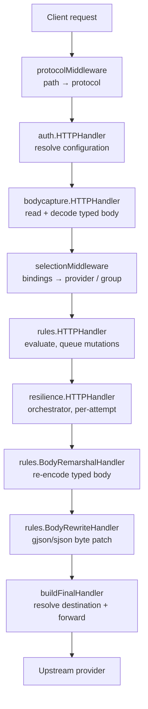
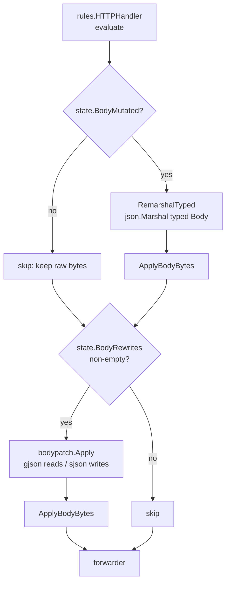
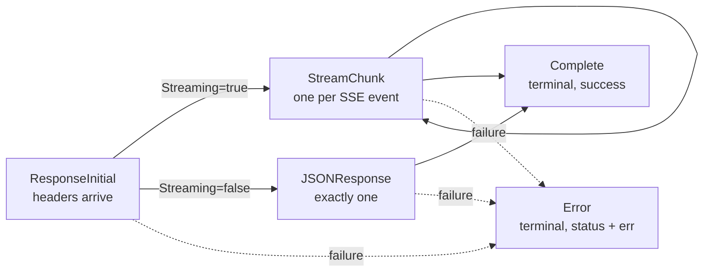

# Pipeline & Middleware

Sluice has **two** layered processing stacks, and they are easy to confuse:

1. **The HTTP middleware chain** — the live request path. A linear stack of
   `http.Handler` wrappers composed in
   [`cmd/gateway/handler.go::buildDataPlaneHandler`](../cmd/gateway/handler.go).
   This is what actually runs in production today: it captures the body, picks a
   destination, evaluates rules, mutates the outgoing bytes, and forwards.

2. **The typed-message channel pipeline** — [`internal/pipeline`](../internal/pipeline).
   A channel-composed stream of typed `Message` values (`ResponseInitial`,
   `StreamChunk`, `JSONResponse`, `Complete`, `Error`) that is the architectural
   foundation for streaming-aware middleware (guardrails/DLP, content-safety
   inspection). **It is wired but currently inert** — see
   [Typed-message pipeline](#typed-message-pipeline-internalpipeline). Only
   [`internal/middleware/guardrails`](../internal/middleware/guardrails) consumes
   it today, and that stage is not yet attached to the forwarder. The
   [`Forwarder`](../internal/proxy/forwarder.go) doc comment names the
   integration as a follow-up; the `Observer` seam is the intended bridge.

This page documents both, the body-mutation re-marshal contract that spans them,
and the request/response size caps.

---

## Table of contents

1. [The HTTP middleware chain](#the-http-middleware-chain)
2. [Body capture](#body-capture)
3. [The body-mutation re-marshal contract](#the-body-mutation-re-marshal-contract)
4. [Size caps: request body and SSE frame](#size-caps-request-body-and-sse-frame)
5. [Typed-message pipeline (`internal/pipeline`)](#typed-message-pipeline-internalpipeline)
6. [Guardrails / DLP inspector](#guardrails--dlp-inspector)
7. [Redaction surfaces](#redaction-surfaces)
8. [Error responses (`httperr`)](#error-responses-httperr)

---

## The HTTP middleware chain

The data plane is composed in
[`buildDataPlaneHandler`](../cmd/gateway/handler.go). Go wraps handlers
inside-out, so the source reads in **reverse** execution order; the function's
own doc comment states the real order:

```
protocol → auth → bodycapture → selection → rules → resilience →
    body-remarshal → body-rewrite → final-forward
```



Each stage and its role:

| Stage | Source | Responsibility |
|---|---|---|
| `protocolMiddleware` | [`cmd/gateway/pipeline.go`](../cmd/gateway/pipeline.go) | Map the inbound path to a v2 protocol; stash `protocolInfo`. Always succeeds. |
| `auth.HTTPHandler` | [`internal/middleware/auth`](../internal/middleware/auth) | Resolve the owning configuration from headers; pick managed vs passthrough mode. |
| `bodycapture.HTTPHandler` | [`internal/middleware/bodycapture`](../internal/middleware/bodycapture/bodycapture.go) | Buffer the body once, decode the typed request, replace `r.Body`. |
| `selectionMiddleware` | [`cmd/gateway/pipeline.go`](../cmd/gateway/pipeline.go) | Walk the configuration's bindings to pick a provider or resilience group; seed `MutableState`. The only stage that returns 404/405. |
| `rules.HTTPHandler` | [`internal/middleware/rules`](../internal/middleware/rules) | Evaluate rules; queue header/body/query mutations onto `MutableState`. |
| `resilience.HTTPHandler` | [`internal/middleware/resilience`](../internal/middleware/resilience) | Orchestrate single-target or group attempts; re-invoke the inner chain per attempt, switching `state.Provider`. |
| `rules.BodyRemarshalHandler` | [`internal/middleware/rules/remarshal.go`](../internal/middleware/rules/remarshal.go) | Re-encode the typed body when a rule mutated it. |
| `rules.BodyRewriteHandler` | [`internal/middleware/rules/bodyrewrite.go`](../internal/middleware/rules/bodyrewrite.go) | Apply queued gjson/sjson byte patches to the final outgoing body. |
| `buildFinalHandler` | [`cmd/gateway/handler.go`](../cmd/gateway/handler.go) | Re-resolve the post-rule provider's transport and forward. |

Two placement facts are load-bearing:

- **`BodyRemarshalHandler` and `BodyRewriteHandler` sit *inside* the resilience
  orchestrator** (they wrap `buildFinalHandler`, which the orchestrator invokes).
  That is deliberate: each retry/failover attempt re-runs the re-marshal +
  byte-patch step so a per-target alias rewrite produces correct bytes on every
  attempt. This is why the underlying primitives
  ([`ApplyBodyBytes`](../internal/middleware/bodycapture/remarshal.go)) are
  documented as idempotent.
- **`rules.HTTPHandler` runs *before* resilience**, so rules see the request once
  and queue their mutations onto `MutableState`; the mutations are *materialised*
  onto the wire later, downstream of the orchestrator.

`correlationMiddleware` ([`cmd/gateway/correlation.go`](../cmd/gateway/correlation.go))
wraps the whole chain ahead of `protocolMiddleware` so every stage shares one
correlation ID.

---

## Body capture

[`bodycapture.HTTPHandler`](../internal/middleware/bodycapture/bodycapture.go)
reads the inbound body **once** and produces a `Captured`:

- `Raw` — verbatim inbound bytes, capped at
  [`MaxBodyBytes`](../internal/middleware/bodycapture/bodycapture.go) (10 MiB).
  `r.Body` is replaced with a reader over `Raw` so the forwarder resends
  byte-for-byte what the client sent.
- `Body` — the typed decoded value, selected by `RequestKind`: one of
  `*openaichat.ChatCompletionRequest`, `*openairesponses.ResponsesRequest`,
  `*messages.MessagesRequest`, `*content.GenerateContentRequest`, or `nil` for
  `KindPassthrough`. Every concrete type embeds `DynamicProperties`, so unknown
  provider fields round-trip (invariant #1).
- `Headers` — the inbound header map with credential-bearing values masked to
  `[REDACTED]` via [`headers.Redactor`](../internal/headers/redact.go), surfaced
  to operators through the live-feed envelope.

The `RequestKind` is injected, not read from config, via the
`KindFromContextFunc` seam. The gateway supplies
[`kindFromProtocol`](../cmd/gateway/pipeline.go), which maps the stashed protocol
to a kind. This indirection exists to keep `bodycapture` from importing the
selection/routing packages (an import cycle). The five kinds:

| `RequestKind` | Protocol | Typed model |
|---|---|---|
| `KindChat` | `chat` | `*openaichat.ChatCompletionRequest` |
| `KindResponses` | `responses` | `*openairesponses.ResponsesRequest` |
| `KindMessages` | `messages` | `*messages.MessagesRequest` |
| `KindGenerateContent` | `generate_content` | `*content.GenerateContentRequest` |
| `KindPassthrough` | everything else (incl. `embeddings`) | `nil` (raw only) |

Failure mapping inside `HTTPHandler`:

| Condition | Sentinel | HTTP status |
|---|---|---|
| Body over the cap | `ErrBodyTooLarge` | 413 |
| Malformed JSON | `ErrParse` | 400 |
| Unmodelled kind / no kind on context | `ErrUnknownKind` | 500 (wiring bug) |

For test wiring,
[`bodycapture.WithCaptured`](../internal/middleware/bodycapture/context.go)
installs a `Captured` directly so downstream middleware (rules, forwarder) can be
exercised without running the full capture chain.

---

## The body-mutation re-marshal contract

Rules never write to the wire directly. They queue mutations onto the
`MutableState`, and two innermost handlers materialise them in a fixed two-stage
order. Both stages funnel through
[`bodycapture.ApplyBodyBytes`](../internal/middleware/bodycapture/remarshal.go),
which atomically replaces `r.Body`, `r.ContentLength`, and the `Content-Length`
header.



**Stage 1 — typed re-marshal**
([`BodyRemarshalHandler`](../internal/middleware/rules/remarshal.go)). When a
typed-body action ran (e.g. `changeModelName`), the rules engine sets
`state.BodyMutated`. The handler calls
[`RemarshalTyped`](../internal/middleware/bodycapture/remarshal.go), which
re-encodes the captured typed `Body` via its `MarshalJSON`. The output is
byte-equivalent to the input *up to key ordering* — `DynamicProperties` and the
`UnknownX` fallbacks preserve every unknown field, and upstreams accept any key
order. When `BodyMutated` is false (the common case — header/tag/policy-only
rules), the stage is a pure no-op and the verbatim raw bytes pass through
untouched. The `state.BodyMutated` flag exists purely to avoid the re-marshal
cost on that common path. A marshal failure returns HTTP 500 and increments
`gateway.rule.errors.total{error_kind="body_remarshal"}`.

**Stage 2 — byte patch**
([`BodyRewriteHandler`](../internal/middleware/rules/bodyrewrite.go)). Applies the
queued `state.BodyRewrites` (from `rewriteField` / `removeField` / `appendField`
actions) to the *current* outgoing bytes — i.e. the Stage-1 output when a typed
action ran, or the verbatim inbound bytes otherwise. The patch engine is
[`bodypatch.Apply`](../internal/bodypatch/bodypatch.go): gjson for reads, sjson
for writes, operating on bytes so numeric precision and unknown fields survive
byte-for-byte. `bodypatch.Apply` cannot fail fatally — every failure mode
(template-ref miss, scalar-collision, append-to-non-array, sjson splice error) is
a per-op drop recorded on `Result`, never an aborted batch.

`bodypatch` is phase-aware. `bodypatch.Refs.Phase` selects which document a
`{request.body.x}` / `{response.body.x}` template reference resolves against:

| Phase | Working document | `{request.body.x}` | `{response.body.x}` |
|---|---|---|---|
| `PhaseRequest` | request body | reads the evolving working body | not in scope |
| `PhaseResponse` | response body | reads the immutable request snapshot | reads the evolving working body |

The same engine serves the response path: response-body patches are applied from
the proxy's `ModifyResponse` hook via
[`rules.ApplyResponseRewrites`](../internal/middleware/rules/bodyrewrite.go).
**Streaming (SSE) responses are never patched** — queued response rewrites are
dropped with a structured warn and counted under
`bodypatch.ReasonStreamingResponse`, because SSE chunks do not form one JSON
document.

Both `RemarshalTyped` and `ApplyBodyBytes` are exported so the resilience
orchestrator can reuse them per attempt without re-implementing the
content-length / reader-replacement logic.

---

## Size caps: request body and SSE frame

Two independent caps bound how much the gateway will buffer. Operators should
know both:

- **Request body — 10 MiB.**
  [`bodycapture.MaxBodyBytes`](../internal/middleware/bodycapture/bodycapture.go)
  (`10 * 1024 * 1024`) caps the inbound request the gateway will buffer. The whole
  payload is held in memory to feed both the typed deserialiser and the
  forwarder, so the cap is an OOM guard against a misbehaving client. A body over
  the cap is rejected with **HTTP 413** before any upstream call. Connector
  records of the request are bounded by this same cap.

- **Response SSE frame — 4 MiB.**
  [`sseframe.maxFrameBytes`](../internal/middleware/sseframe/sseframe.go)
  (`4 * 1024 * 1024`) bounds a single SSE frame during response collation.
  [`sseframe.Collate`](../internal/middleware/sseframe/sseframe.go) splits a
  provider response into the JSON documents that carry it — once per request: a
  non-streaming body is a single frame; an SSE stream is one frame per `data:`
  event, with empty frames and `[DONE]` sentinels dropped. It exists so the
  response is parsed exactly once and the same frames feed both the token-usage
  extractor and the GenAI-attribute extractor in the reporter, rather than each
  re-scanning the raw bytes. The 4 MiB bound matches the content accumulator and
  token scanners so no component clips a large tool-call argument delta.

---

## Typed-message pipeline (`internal/pipeline`)

[`internal/pipeline`](../internal/pipeline) defines a channel-based middleware
model distinct from the HTTP chain. **It is the foundation for streaming-aware
middleware and is currently inert** — wired and tested, but not yet attached to
the forwarder (only [`guardrails`](#guardrails--dlp-inspector) consumes it, and
that stage is itself not yet hooked into the data plane). Document it as the
shape future streaming stages will take, not as a live request path.

### The `Message` sum type

[`pipeline.Message`](../internal/pipeline/message.go) is a closed sum type. The
`isMessage()` method is unexported, so the concrete set is sealed to the package
and a type-switch over `Message` is exhaustive by construction.



| Message | Emitted when | Carries |
|---|---|---|
| [`ResponseInitial`](../internal/pipeline/message.go) | Upstream returns response headers (always first) | `StatusCode`, `Headers`, `Streaming` |
| [`StreamChunk`](../internal/pipeline/message.go) | Each SSE event of a streaming response | `Data`, `Event`, `ID`, `IsRaw` (true for opaque sentinels like `[DONE]`) |
| [`JSONResponse`](../internal/pipeline/message.go) | A non-streaming response (exactly one) | `Body` (verbatim bytes) |
| [`Error`](../internal/pipeline/message.go) | Any stage hits an unrecoverable failure (terminal) | `StatusCode` (400 client / 502 upstream / 500 internal), `Err` |
| [`Complete`](../internal/pipeline/message.go) | Final message of a successful response (terminal) | nothing — its presence is the signal |

`Error` and `Complete` are terminal. A middleware that sees `Error` forwards it
downstream unchanged so the writer can translate it to an HTTP error.

### Composition: `Middleware` and `Chain`

A stage is a function over channels
([`pipeline.Middleware`](../internal/pipeline/chain.go)):

```go
type Middleware func(in <-chan Message) <-chan Message
```

Each implementation spawns a goroutine (bound to a `context.Context` via
[`safego.Go`](../internal/safego/safego.go), so a panic is recovered and counted)
that reads `in`, transforms, and writes `out`, **closing `out`** when `in` drains
or the context is cancelled.
[`Chain`](../internal/pipeline/chain.go) feeds each stage's output into the next:
the leftmost reads the original input, the rightmost's output is the chain's
output. Two helpers round out the package:

- [`Pass`](../internal/pipeline/chain.go) — the canonical no-op stage. Forwards
  every message unchanged. It uses a **two-stage cancellation select**: the read
  select can be preempted by `ctx.Done()`, and the send select re-checks
  `ctx.Done()` so a downstream consumer that stops reading cannot strand (leak)
  the goroutine on a blocked send. Future stages should follow this pattern.
- [`Source`](../internal/pipeline/chain.go) — a test helper that yields a canned
  message sequence (e.g. a synthetic `ResponseInitial` + `JSONResponse` +
  `Complete` triple) and closes, without standing up the forwarder.

The channel model exists so a future stage can transform per-chunk (`StreamChunk`)
without blocking the forwarder — the goroutine-per-stage design lets a slow
inspector apply backpressure stage-by-stage rather than buffering the whole
response.

---

## Guardrails / DLP inspector

[`guardrails`](../internal/middleware/guardrails/guardrails.go) is the gateway's
DLP / content-safety seam, expressed as a `pipeline.Middleware`. It is part of the
inert typed-message pipeline above — wired and tested, not yet attached to the
forwarder.

[`guardrails.Middleware`](../internal/middleware/guardrails/guardrails.go) runs
every `pipeline.Message` through an
[`Inspector`](../internal/middleware/guardrails/guardrails.go):

```go
type Inspector interface {
    Inspect(ctx context.Context, msg pipeline.Message) (pipeline.Message, error)
}
```

- **v1.0 ships
  [`NopInspector`](../internal/middleware/guardrails/guardrails.go)** — it returns
  every message unchanged. The stage exists so the pipeline can include a
  guardrails slot today without committing to a DLP engine.
- **v1.2+ swaps in real implementations** (regex redaction, classifier blocks)
  without touching pipeline wiring. An `Inspector` instance is shared across
  requests, so implementations must be safe for concurrent use.
- **An `Inspector` error terminates the pipeline** with a `pipeline.Error` of
  status **500** — guardrail failures are treated as internal (the DLP engine is
  a gateway concern, not a client-facing one), not surfaced as a client error.

---

## Redaction surfaces

Two distinct redactors guard different channels; do not conflate them:

- **[`internal/headers.Redactor`](../internal/headers/redact.go)** masks
  credential-bearing **header names** for operator-facing display (debug logs, the
  live-feed body envelope). A built-in lowercase-substring list (`auth`,
  `api-key`, `apikey`, `token`, `cookie`, `secret`, `sluice-identity`) is always
  active; operators can add extras via `NewRedactor`. `Redactor.Extras()` returns
  *only* the operator-supplied substrings (built-ins excluded) so observability
  code can report what the operator added rather than the full match set.

- **[`internal/contentredact`](../internal/contentredact/contentredact.go)** masks
  credential-shaped tokens in **free-text GenAI content** (prompts/responses)
  before that content lands on a telemetry span or log. It is deliberately
  conservative — only well-known provider key/token shapes (Sluice `sk_live_*`,
  OpenAI/Anthropic `sk-*`, Google `AIza*`, Slack `xox*`, JWTs, `Bearer` tokens),
  each anchored with a minimum length so ordinary prose is not mangled. It is
  defence-in-depth for the opt-in content-capture case, not a general PII engine;
  the primary guard on content remains the opt-in flag (default off) and the
  connector spool being the system of record.

---

## Error responses (`httperr`)

Every middleware that rejects a request writes through
[`httperr.Writer`](../internal/httperr/httperr.go) so error bodies are uniform and
instrumented. The shape is two stable fields:

```json
{ "error": "no_route", "message": "no route for path" }
```

- `error` — the **machine-readable code** (e.g. `no_route`, `no_binding`,
  `internal`, `forward_failed`, `method_not_allowed`). Stable across releases so
  dashboards and clients can pin on it.
- `message` — the human-readable detail. Omitted from the JSON when empty, so
  terse 404s stay terse.

`Writer.Write(ctx, w, status, layer, code, msg)` also increments an OTel counter
labelled `layer` (the originating middleware, e.g. `selection`, `handler`),
`code`, and `status_code`, so error volume by source and class shows up alongside
the other gateway counters without scraping bodies. The counter is optional — a
`Writer` constructed with a nil counter is a pure formatter (useful before
`observability.Setup` has run, and in tests). The selection, auth, and final
handlers all write through it; see the 404/405 paths in
[`selectionMiddleware`](../cmd/gateway/pipeline.go).
