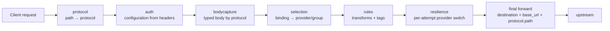
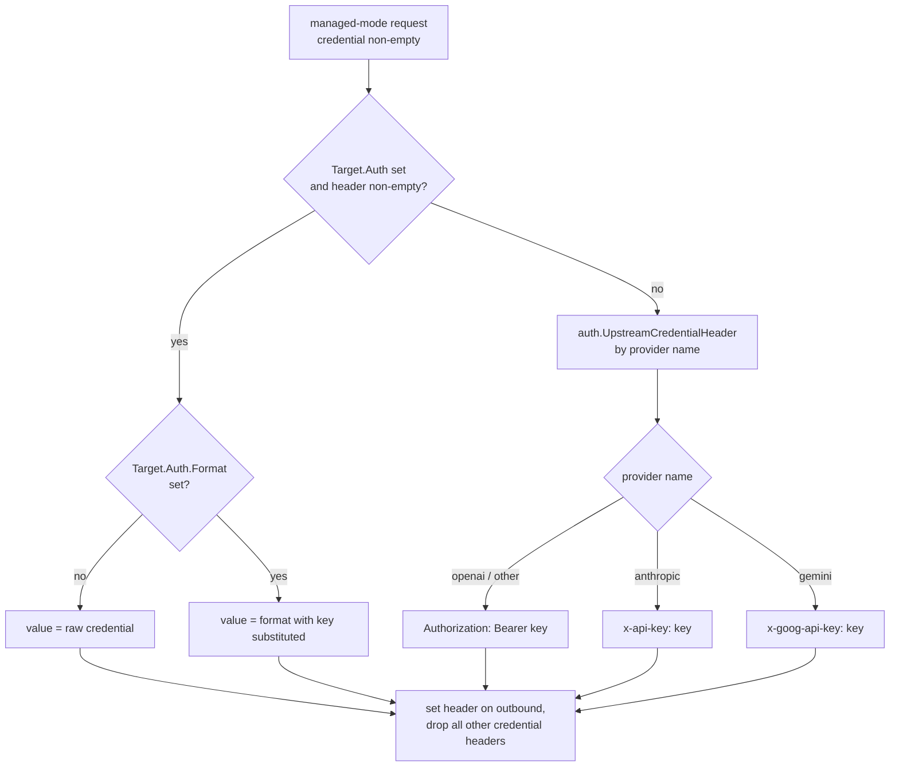

# Providers

A provider in SlipSpace is an upstream **connection** — OpenAI, Anthropic, Gemini, an in-cluster ollama, a self-hosted vLLM, anything that speaks one of the wire shapes the gateway knows. The `providers:` block declares its base URL, the per-protocol upstream paths and credential conventions, the headers and query parameters every request to it carries, and any opaque passthrough families it exposes.

A provider is a *connection definition, not a credential holder*. The upstream key lives on a Configuration (`credentials.<provider>`), and is substituted into the protocol's auth `format` at request time. Routing — which provider serves a given request — is **not** declared here either: it lives in a Configuration's `bindings`, which map `(protocol, model)` to a provider or a resilience group.

This page is the operator's reference for the provider half of the v2 config model. Every field on `Provider`, `ProviderProtocol`, `ProviderAuth`, and the passthrough types is enumerated, with the credential-header resolution table and worked examples drawn from [`config-dev/providers.yaml`](../config-dev/providers.yaml).

> **v1 → v2.** Earlier releases declared a route table on each provider: `prefix`, `prefix_required`, an `endpoints` map with `accepted_paths`, `request_kind`, and per-endpoint `auth_header`/`auth_format`, with routing driven by `changeProvider` rules. That model is gone. The provider now declares only the connection (`base_url`, `required_headers`, `query`), the generative `protocols` it serves, and `passthrough` families. Routing is config data on the Configuration. If you are migrating a v1 `providers.yaml`, none of the `prefix*` / `accepted_paths` / `endpoints` fields survive.

---

## Table of contents

1. [Mental model](#mental-model)
2. [Where it sits in the pipeline](#where-it-sits-in-the-pipeline)
3. [Quick start](#quick-start)
4. [YAML schema](#yaml-schema)
5. [How a request reaches a provider](#how-a-request-reaches-a-provider)
6. [Credential header resolution](#credential-header-resolution)
7. [The OpenAI-compat surface](#the-openai-compat-surface)
8. [Passthrough families](#passthrough-families)
9. [Path placeholders](#path-placeholders)
10. [Streaming behaviour](#streaming-behaviour)
11. [Worked examples](#worked-examples)
12. [Validation errors](#validation-errors)
13. [Cross-references](#cross-references)

---

## Mental model

> **A provider is a base URL plus a per-protocol auth convention plus any passthrough families. It declares *how to reach and authenticate* an upstream — never *when* it is chosen. Choosing a provider is the Configuration's job, via bindings on `(protocol, model)`.**

SlipSpace does not auto-discover what an upstream supports, and a provider no longer carries a path catalogue. Instead:

- The **inbound path is the protocol.** `/v1/chat/completions` is the `chat` protocol, `/v1/messages` is `messages`, `/v1beta/models/{model}:generateContent` is `generate_content`, and so on. The mapping is fixed in code — [`internal/selection/protocol.go::ProtocolForPath`](../internal/selection/protocol.go).
- A **provider declares which protocols it serves** under `protocols:`, each with the upstream `path` to forward to and an optional per-protocol auth override.
- A **Configuration's bindings** select a provider (or resilience group) for a `(protocol, model)` pair. Selection — [`internal/selection/selection.go::Select`](../internal/selection/selection.go) — walks the bindings in order and returns the first match.

Provider names are referenced by:

- **Configurations** — `credentials.<provider>` holds the upstream key, and each `binding` names the provider (or group) it routes to. See [`Configuration`](../contracts/config/model.go) in `contracts/config/model.go`.
- **Groups** — `groups.<name>.targets[*].provider` names the provider each resilience target dispatches against. See [`docs/resilience.md`](resilience.md).
- **Rules** — the `provider` and `endpoint` (protocol) conditions match the *already-selected* provider/protocol; rules in v2 are pure request/response transforms (tags, header/body rewrites) and no longer control routing.

When a request is bound to a resilience group, the orchestrator picks a target per attempt and the pipeline re-resolves that provider's transport via [`selection.ResolveTarget`](../internal/selection/selection.go) — the per-attempt provider switch is what makes failover and load-balance work without a route table (invariant 7 in [`CLAUDE.md`](../CLAUDE.md)).

---

## Where it sits in the pipeline



The chain is composed in [`cmd/gateway/handler.go::buildDataPlaneHandler`](../cmd/gateway/handler.go). The provider declaration is read by:

- **selection** — resolves the binding to a provider, then composes the effective transport (`base_url`, protocol `path`, `auth`, `required_headers`, `query`) into a fully-resolved [`selection.Target`](../internal/selection/selection.go).
- **bodycapture** — picks the typed deserialiser from the protocol (not from the provider).
- **the final handler** — [`cmd/gateway/destination.go::buildDestination`](../cmd/gateway/destination.go) reads the resolved `Target` to build the upstream URL and mint the credential header.

Get the provider YAML right and the rest of the pipeline follows from the bindings.

---

## Quick start

### 30-second provider declaration

```yaml
providers:
  openai:
    base_url: https://api.openai.com
    protocols:
      chat:
        path: /v1/chat/completions
        auth:
          header: Authorization
          format: "Bearer {key}"
      responses:
        path: /v1/responses
        auth:
          header: Authorization
          format: "Bearer {key}"
    passthrough:
      models:
        auth:
          header: Authorization
          format: "Bearer {key}"
        paths:
          - match: /v1/models
            methods: [GET]
```

This says: openai is reachable at `https://api.openai.com`, it serves the `chat` and `responses` generative protocols (each forwarded to the path shown, authenticated with `Authorization: Bearer <key>`), and it exposes a `models` passthrough family. Nothing here decides *when* openai is chosen — that is a Configuration binding (see [How a request reaches a provider](#how-a-request-reaches-a-provider)).

### 30-second OpenAI-compat surface

```yaml
providers:
  anthropic:
    base_url: https://api.anthropic.com
    required_headers:
      anthropic-version: "2023-06-01"
    protocols:
      messages:
        path: /v1/messages
        auth:
          header: x-api-key
          format: "{key}"
      chat:
        path: /v1/chat/completions
        auth:
          header: Authorization
          format: "Bearer {key}"
```

Same provider, two protocols, two credential conventions. The native `messages` protocol uses Anthropic's `x-api-key`; the OpenAI-compat `chat` protocol uses bearer. See [The OpenAI-compat surface](#the-openai-compat-surface).

---

## YAML schema

The canonical Go types are in [`contracts/config/model.go`](../contracts/config/model.go) — `Provider` (lines 50–81), `ProviderProtocol` (84–96), `ProviderAuth` (101–110), `PassthroughFamily` (118–127) / `PassthroughPath` (130–137). What follows is the operator-facing summary.

### Top-level

```yaml
providers:
  <provider name>:
    base_url: https://api.example.com
    required_headers:
      x-api-version: "2024-10-01"
    query:
      api-version: "2024-10-01"
    protocols:
      <protocol name>:
        path: /v1/chat/completions
        auth:
          header: Authorization
          format: "Bearer {key}"
    passthrough:
      <family name>:
        auth:
          header: Authorization
          format: "Bearer {key}"
        paths:
          - match: /v1/files
            methods: [GET, POST]
```

### Provider fields

| Field | Required | Notes |
|---|---|---|
| `base_url` | yes | Upstream root URL. A protocol's `path` (after placeholder substitution) is appended to it when forwarding. Validation rejects an empty `base_url`. |
| `required_headers` | no | Headers the gateway injects on every forwarded request to this provider, generative or passthrough. Use for static API-version pins like `anthropic-version: "2023-06-01"`. Inbound headers of the same name are overwritten. |
| `query` | no | Default query-string parameters appended to every request to this provider (e.g. Azure's `api-version`). A binding or group target may add or override entries; the effective set is provider ∪ override, with the override winning ([`selection.mergeQuery`](../internal/selection/selection.go)). |
| `protocols` | no* | The generative wire shapes this provider serves, keyed by protocol name (`chat`, `responses`, `messages`, `generate_content`, `embeddings` — the `ProtocolX` constants in [`contracts/config/model.go`](../contracts/config/model.go)). Each entry is a [`ProviderProtocol`](#providerprotocol-fields). |
| `passthrough` | no* | The opaque/stateful endpoint families this provider exposes (e.g. Anthropic message batches), keyed by family name. Each entry is a [`PassthroughFamily`](#passthrough-family-fields). |

*\*A provider must declare at least one of `protocols` or `passthrough`, or validation fails with `provider %q: declares no protocols or passthrough families`.*

### `ProviderProtocol` fields

| Field | Required | Notes |
|---|---|---|
| `path` | no | Upstream path the gateway forwards to, appended to `base_url`. May contain placeholders the gateway substitutes — `{model}` and `{op}` for Gemini's path-addressed `generate_content` (see [Path placeholders](#path-placeholders)). A binding or group target may override the path per use. |
| `auth` | no | Per-protocol credential convention ([`ProviderAuth`](#providerauth-fields)). Omit (`nil`) to defer to the provider-native default for the wire shape ([`auth.UpstreamCredentialHeader`](../internal/middleware/auth/resolver.go)). The override is load-bearing for OpenAI-compat surfaces, where a provider's native protocol authenticates one way and its compat `chat` surface another (invariant 6 in [`CLAUDE.md`](../CLAUDE.md)). |

### `ProviderAuth` fields

| Field | Required | Notes |
|---|---|---|
| `header` | yes | Outgoing HTTP header name the credential is injected into — e.g. `Authorization`, `x-api-key`, `x-goog-api-key`, `api-key`. |
| `format` | no | Template for the header value. Must contain exactly one `{key}` placeholder, substituted with the resolved upstream credential (e.g. `"Bearer {key}"` or `"{key}"`). Empty `format` means the raw credential is used as the header value. Validation rejects a `format` set without a `header` (`ErrAuthFormatWithoutHeader`) and a `format` with zero or multiple `{key}` placeholders (`ErrInvalidAuthFormat`). |

### Passthrough family fields

| Field | Required | Notes |
|---|---|---|
| `auth` | no | Credential convention for the family ([`ProviderAuth`](#providerauth-fields)); `nil` defers to the provider-native default. Resolved through the same mint site as protocol auth. |
| `paths` | yes | The inbound path patterns this family claims, each with the methods it accepts. A pattern may contain `{name}` placeholders (e.g. `/v1/messages/batches/{id}/results`). See [Passthrough families](#passthrough-families). |

Each `paths[*]` entry is a [`PassthroughPath`](../contracts/config/model.go): `match` (the inbound pattern, required) and `methods` (the accepted HTTP methods, required).

---

## How a request reaches a provider

A provider is *reachable* but never *reached* until a Configuration binds it. The binding lives on the Configuration, not the provider:

```yaml
configurations:
  dev:
    credentials:
      openai: sk-dev-mock
      anthropic: sk-ant-dev-mock
    bindings:
      - { protocol: chat,     models: ["gpt-*", "o1*", "o3*"], provider: openai }
      - { protocol: chat,     models: ["claude-*"],            provider: anthropic }
      - { protocol: messages, models: ["claude-*"],            provider: anthropic }
```

At request time:

1. **protocol** — the inbound path resolves to a protocol ([`ProtocolForPath`](../internal/selection/protocol.go)). `/v1/chat/completions` → `chat`.
2. **auth** — the headers resolve to a Configuration.
3. **bodycapture** — the body is parsed under the protocol's typed shape; the model name is extracted (or, for `generate_content`, taken from the path).
4. **selection** — [`Select`](../internal/selection/selection.go) walks the Configuration's bindings in order; the first whose `protocol` equals the request protocol **and** whose `models` patterns match the request model wins. An empty `models` list is a catch-all for the protocol (default-permissive, invariant 1). No match → `ErrNoBinding` → 404.
5. The matched binding names a `provider` (single target) or a `group` (resilience). [`resolveTarget`](../internal/selection/selection.go) composes the effective transport from the provider plus any per-binding/per-target overrides (`alias`, `query`, `path`).

Model patterns reuse the connector-filter matcher: a trailing-`*` is a prefix match, otherwise exact-equal ([`matchesModelPatterns`](../internal/selection/selection.go)). Bindings, groups, and the full Configuration schema are documented in [`docs/configuration-model.md`](configuration-model.md) and [`docs/resilience.md`](resilience.md); this page covers only the provider side they reference.

---

## Credential header resolution

[`cmd/gateway/destination.go::resolveCredentialHeaders`](../cmd/gateway/destination.go) is the **single mint site** for the upstream credential header (invariant 6 in `CLAUDE.md`) — both [`buildDestination`](../cmd/gateway/destination.go) and [`buildPassthroughDestination`](../cmd/gateway/pipeline.go) funnel through it. In managed mode it calls the helper [`credentialHeaderFor`](../cmd/gateway/destination.go) to format the `(header, value)` pair. By the time `credentialHeaderFor` runs, selection has already composed the effective auth onto the resolved `Target` (`Target.Auth` = the protocol's `auth`, or `nil`), so there is no per-request endpoint/provider override walk — the helper is a three-branch function:



Resolution table:

| `Target.Auth` (from the protocol's `auth`) | Result |
|---|---|
| `header` set, `format` set | header = `auth.header`; value = `auth.format` with `{key}` → credential. |
| `header` set, `format` empty | header = `auth.header`; value = raw credential. |
| `nil` (no override) | fall back to the per-provider default in [`auth.UpstreamCredentialHeader`](../internal/middleware/auth/resolver.go). |

Per-provider defaults (from [`internal/middleware/auth/resolver.go::UpstreamCredentialHeader`](../internal/middleware/auth/resolver.go)):

| Provider name (literal match) | Default header | Default value |
|---|---|---|
| `openai` | `Authorization` | `Bearer <credential>` |
| `anthropic` | `x-api-key` | `<credential>` |
| `gemini` | `x-goog-api-key` | `<credential>` |
| anything else | `Authorization` | `Bearer <credential>` |

The fallback exists so a binding that targets an as-yet-unmodelled provider still produces a reasonable outgoing shape. If your custom provider needs a different convention, declare `auth` on the protocol so the mint site never falls through to the default.

Whichever header is minted, [`buildDestination`](../cmd/gateway/destination.go) **drops every other credential header** in the closed set (`Authorization`, `X-Api-Key`, `X-Goog-Api-Key` — `credentialHeaderNames` in [`cmd/gateway/handler.go`](../cmd/gateway/handler.go)) so a managed→other forward never leaks the inbound token. Two non-managed branches:

- **Passthrough auth mode** — the inbound `Authorization` is forwarded verbatim and no managed credential is minted ([`buildDestination`](../cmd/gateway/destination.go), `mode == auth.ModePassthrough` branch).
- **No-credential provider** — when the Configuration holds an empty credential for the provider (`credentials.<provider>: ""`), every credential header is stripped and none is set. This is the typical in-cluster ollama case.

Passthrough-family requests resolve their credential through the same `resolveCredentialHeaders` ([`cmd/gateway/pipeline.go::buildPassthroughDestination`](../cmd/gateway/pipeline.go) funnels through it), so the format table cannot fragment between generative and passthrough paths. Note that in passthrough *auth mode* the inbound `Authorization` is forwarded verbatim and `credentialHeaderFor` is normally **not** invoked — but the post-rule `changeApiKey` override is checked *before* the auth mode (`resolveCredentialHeaders`, cmd/gateway/destination.go: literal-override branch precedes the passthrough branch), so a `changeApiKey` literal on a passthrough request does reach the format helper and mints the provider/protocol credential header. Only when the override is nil (or the empty-string `UseSlipSpaceKey` sentinel) does the passthrough branch forward the inbound bearer untouched.

---

## The OpenAI-compat surface

Anthropic and Gemini both expose OpenAI-compatible `chat/completions` endpoints on their native APIs. The clients that hit those endpoints are written against the OpenAI SDK and send `Authorization: Bearer` — not anthropic's `x-api-key` or gemini's `x-goog-api-key`. The per-protocol `auth` override is what lets the same provider serve two protocols with two different credential conventions:

```yaml
providers:
  anthropic:
    base_url: https://api.anthropic.com
    required_headers:
      anthropic-version: "2023-06-01"
    protocols:
      messages:                      # native
        path: /v1/messages
        auth:
          header: x-api-key
          format: "{key}"
      chat:                          # OpenAI-compat
        path: /v1/chat/completions
        auth:
          header: Authorization
          format: "Bearer {key}"
```

Same upstream credential (`credentials.anthropic` on the Configuration), two wire formats — `messages` mints `x-api-key`, `chat` mints `Authorization: Bearer`. Gemini follows the same pattern: its native `generate_content` uses `x-goog-api-key` while its `chat` protocol (`/v1beta/openai/chat/completions`) uses `Authorization: Bearer`.

This pairs with the model-keyed binding pattern. A Configuration that binds `chat` + `models: ["claude-*"]` to provider `anthropic` routes an OpenAI-SDK client sending `model: claude-...` against the gateway's `/v1/chat/completions` straight to anthropic's `chat` protocol — landing on `/v1/chat/completions` upstream with `Authorization: Bearer`, exactly what anthropic's compat surface wants. Without the per-protocol `auth` override, the mint site would fall through to anthropic's `x-api-key` default — wrong for the compat surface.

> **v1 note.** This is the same capability the v1 docs described as the endpoint-level `auth_header`/`auth_format` override fired by a `changeProvider` rule. In v2 the override lives on `protocols.<name>.auth` and the cross-provider redirect is a binding, not a rule.

---

## Passthrough families

A passthrough family is an opaque, stateful endpoint group proxied **verbatim** — Anthropic's message-batches surface (create / get / results / cancel), a provider's files API, and similar. Passthrough requests are never *typed* — no protocol model is parsed ([`bodycapture`](../internal/middleware/bodycapture) short-circuits `KindPassthrough` with a nil typed body) and no GenAI telemetry is emitted; only header/query rewrites and plain HTTP metrics apply. They **are** still recorded by the connector spool: whenever the resolved configuration declares `connector_bindings`, [`cmd/gateway/reporter.go`](../cmd/gateway/reporter.go) builds a `Record` carrying the raw request and response bodies, their SHA-256 digests, and the redacted headers — there is no passthrough exemption in `enqueueRecord`. To keep passthrough payloads out of the spool, drop `connector_bindings` on that configuration or exclude them via sampling/filters. See [`PassthroughFamily`](../contracts/config/model.go) and [`selection.MatchPassthrough`](../internal/selection/selection.go).

Unlike generative protocols, a passthrough family is **selected by path pattern, not by model**:

```yaml
providers:
  anthropic:
    base_url: https://api.anthropic.com
    required_headers:
      anthropic-version: "2023-06-01"
    passthrough:
      messages_batches:
        auth:
          header: x-api-key
          format: "{key}"
        paths:
          - match: /v1/messages/batches
            methods: [POST, GET]
          - match: "/v1/messages/batches/{id}"
            methods: [GET, DELETE]
          - match: "/v1/messages/batches/{id}/results"
            methods: [GET]
```

A family is exposed on a Configuration through a `passthrough_binding`:

```yaml
configurations:
  dev:
    credentials:
      anthropic: sk-ant-dev-mock
    passthrough_bindings:
      - { family: messages_batches, provider: anthropic }
```

At request time, when the inbound path does not resolve to a generative protocol ([`ProtocolForPath`](../internal/selection/protocol.go) returns `ok == false`), the gateway falls through to [`MatchPassthrough`](../internal/selection/selection.go), which walks the Configuration's `passthrough_bindings`, matches the path against each exposed family's `paths` patterns (capturing `{name}` placeholders), and checks the method:

- No family claims the path → `ErrNoPassthrough` → 404.
- A family claims the path but not the method → `ErrMethodNotAllowed` → 405.

The matched family's `auth` is resolved through the same [`credentialHeaderFor`](../cmd/gateway/destination.go) mint site as a generative protocol; `nil` family auth defers to the provider-native default. In telemetry, the request labels struct is `observability.RequestLabels` = `provider`, `protocol`, `model`, `method`, `configuration` (populated at [`cmd/gateway/handler.go::buildFinalHandler`](../cmd/gateway/handler.go) — passthrough and generative each set their own). Of these, `method` is deliberately **not** emitted as a metric label (see [`internal/observability/labels.go`](../internal/observability/labels.go)) — it would multiply the request-count series cardinality with no dashboard dimension; it is carried for logs and record enrichment only. A passthrough request labels `protocol` with the **family name** (e.g. `messages_batches`) rather than a protocol name. The v1 `endpoint` label was retired when v2 routing landed.

---

## Path placeholders

A protocol's `path` (and a passthrough `match`) may contain `{name}` placeholders the gateway substitutes from the request's path params. Gemini's `generate_content` is the canonical generative case — the model and operation ride in the URL, not the body:

```yaml
providers:
  gemini:
    base_url: https://generativelanguage.googleapis.com
    protocols:
      generate_content:
        path: "/v1beta/models/{model}:{op}"
        auth:
          header: x-goog-api-key
          format: "{key}"
```

[`ProtocolForPath`](../internal/selection/protocol.go) parses the inbound `/v1beta/models/{model}:{op}` path, captures `model` and `op` (one of `generateContent` / `streamGenerateContent`), and stashes them as path params. The final handler substitutes them back into the upstream path via [`substitutePlaceholders`](../cmd/gateway/handler.go). When a target alias is set the alias becomes the effective `{model}` for the path; body-keyed protocols alias the model in the body-rewrite stage instead.

If a placeholder is present in the path but has no captured value, the upstream URL keeps the literal `{model}` segment and the upstream rejects it — surface that as a selection/parse bug, not a routing issue.

---

## Streaming behaviour

There is no `accepts_streaming` flag in v2 — whether a response streams is decided by the upstream and the client (the `stream` field in the request body / the operation, e.g. `streamGenerateContent`). Three layers cooperate at request time to keep SSE flowing end-to-end without buffering.

### `http.Flusher` passthrough

The forwarder uses `httputil.ReverseProxy` with `FlushInterval = -1` ([`internal/proxy/forwarder.go`](../internal/proxy/forwarder.go)), which tells the standard library to flush immediately on every write — the behaviour SSE requires. Every response-writer wrapper in the gateway stack implements `http.Flusher`. The status recorder ([`internal/proxy/statuswriter.go`](../internal/proxy/statuswriter.go)) and the streaming observer forward `Flush()` straight through to the wrapped writer (the status recorder fires the `onChunk` observer first, so the chunk timestamp reflects when the chunk was ready rather than when the socket write returned). The resilience orchestrator's [`BufferingResponseWriter`](../internal/proxy/buffering_writer.go) forwards `Flush()` only after the status line has been committed — before commit it is deliberately a no-op ([`internal/proxy/buffering_writer.go`](../internal/proxy/buffering_writer.go)), because flushing uncommitted bytes downstream would forfeit the orchestrator's ability to retry the attempt. The contract that **every** wrapper preserves `Flusher` is what keeps SSE chunks landing at the client unbatched.

### `BufferingResponseWriter` swap under a resilience group

When a request is bound to a resilience group, the orchestrator wraps the outbound `http.ResponseWriter` in a [`BufferingResponseWriter`](../internal/proxy/buffering_writer.go) before each attempt. Despite the name, it never buffers body bytes — it stages only the response headers and makes a one-time commit-or-discard decision at the status line (`WriteHeader`). A status in the group's `failure_status_codes` set discards the attempt (the staged headers are dropped and the body bytes are drained/absorbed from the connection but never delivered) and the orchestrator tries the next target; any other status commits, after which all body bytes — including SSE chunks — pass straight through the `Flusher` chain unbuffered.

The gateway never retries past the status line, so a streaming response under a resilience group is **not** buffered until the upstream commits — it streams from the first byte after the (non-retryable) status line, exactly like a single-target binding. Single-target bindings still flow through the orchestrator as a degenerate `ModeNone` policy ([`cmd/gateway/destination.go::singleTargetConfig`](../cmd/gateway/destination.go)), but with no retry alternative the first attempt is the answer — they too stream from byte one.

### SSE reassembly off the hot path

While the forwarder streams chunks to the client, the streamed SSE bytes are also retained and, at completion, reassembled into the JSON shape the provider would have returned non-streaming — [`internal/observability/livefeed/accumulator`](../internal/observability/livefeed/accumulator). The package keys on protocol/endpoint name, so the OpenAI-compat `chat` surfaces on Anthropic and Gemini reuse OpenAI's chunk reassembler:

| Endpoint/protocol | Reassembled shape | Source file |
|---|---|---|
| `chat` (`chat_completions`) | `*openaichat.ChatCompletionResponse` | [`openai_chat.go`](../internal/observability/livefeed/accumulator/openai_chat.go) |
| `messages` | Anthropic messages response | [`anthropic_messages.go`](../internal/observability/livefeed/accumulator/anthropic_messages.go) |
| `generate_content` | Gemini generate-content response | [`gemini_content.go`](../internal/observability/livefeed/accumulator/gemini_content.go) |
| `responses` | OpenAI Responses response | [`openai_responses.go`](../internal/observability/livefeed/accumulator/openai_responses.go) |

The accumulator runs **after** the response has finished writing to the client — the hot path is unaffected, the cost lands at completion off the critical path with no flushing delay.

---

## Worked examples

### A custom in-cluster ollama provider (no credential)

Goal: expose an in-cluster ollama at `http://ollama.ollama.svc.cluster.local:11434` as a provider named `qwen-ollama`.

```yaml
providers:
  qwen-ollama:
    base_url: http://ollama.ollama.svc.cluster.local:11434
    protocols:
      chat:
        path: /v1/chat/completions
      messages:
        path: /v1/messages
```

No `auth` block on either protocol: ollama's `/v1/chat/completions` is OpenAI-compatible, and the per-provider default for an unknown name is `Authorization: Bearer <credential>`. For a credential-less ollama (the typical local-dev / in-cluster setup), the Configuration holds an empty credential, so [`buildDestination`](../cmd/gateway/destination.go) strips all credential headers and sets none:

```yaml
configurations:
  production:
    credentials:
      qwen-ollama: ""              # no-credential provider: strip and forward
    bindings:
      - { protocol: chat, models: ["qwen2.5-coder:7b"], provider: qwen-ollama }
```

To send a static token instead, set `credentials.qwen-ollama: <token>`; the default `Authorization: Bearer <token>` is then minted.

### An OpenAI-compat protocol on an existing provider

Goal: add the OpenAI-compat `chat` surface to a provider that already serves its native API. Gemini, from [`config-dev/providers.yaml`](../config-dev/providers.yaml):

```yaml
providers:
  gemini:
    base_url: https://generativelanguage.googleapis.com
    protocols:
      generate_content:
        path: "/v1beta/models/{model}:{op}"
        auth:
          header: x-goog-api-key
          format: "{key}"
      chat:
        path: /v1beta/openai/chat/completions
        auth:
          header: Authorization
          format: "Bearer {key}"
```

The native `generate_content` protocol uses `x-goog-api-key`; the OpenAI-compat `chat` protocol declares `Authorization: Bearer {key}` because that is what OpenAI-SDK clients send. Both use the same gemini upstream credential — only the wire format of the outbound header changes. A Configuration then routes by model:

```yaml
bindings:
  - { protocol: chat,             models: ["gemini-*"], provider: gemini }
  - { protocol: generate_content, models: ["gemini-*"], provider: gemini }
```

### Per-protocol auth: `x-api-key` vs bearer

Goal: the same provider, two protocols, two credential conventions on the wire — `x-api-key` for the native API, `Authorization: Bearer` for the OpenAI-compat surface. This is the anthropic block shown in [The OpenAI-compat surface](#the-openai-compat-surface). Operator notes:

- `credentials.anthropic` on the Configuration supplies the one key both protocols share; only the minted header differs.
- `required_headers.anthropic-version` injects on **every** anthropic request, including the OpenAI-compat `chat` one and the `messages_batches` passthrough — anthropic's compat and batch surfaces still want the version pin.
- Each protocol's `auth` is explicit even when it matches the provider-native default (anthropic's `messages` → `x-api-key`); explicit-in-place is easier to read and survives someone later changing a default.

---

## Validation errors

The loader runs `Validate()` ([`internal/config/config_validate.go`](../internal/config/config_validate.go)) after merge; the first violation aborts startup with a wrapped sentinel. The provider-relevant checks:

| Condition | Sentinel / message |
|---|---|
| Provider has empty `base_url`. | `ErrValidation` — `provider %q: base_url is required`. |
| Provider declares neither `protocols` nor `passthrough`. | `ErrValidation` — `provider %q: declares no protocols or passthrough families`. |
| Protocol key is not a recognised protocol (`chat`/`responses`/`messages`/`generate_content`/`embeddings`). | `ErrValidation` — `provider %q: unknown protocol %q`. |
| Protocol or family `auth.format` set without `auth.header`. | [`ErrAuthFormatWithoutHeader`](../internal/config/errors.go). |
| Protocol or family `auth.format` lacks exactly one `{key}`. | [`ErrInvalidAuthFormat`](../internal/config/errors.go). |
| Passthrough family declares no `paths`, or a path has an empty `match` / empty `methods`. | `ErrValidation` — `passthrough %q ...`. |
| A binding references an unknown provider/group, or the provider/group does not serve the binding's protocol. | `ErrValidation` — `configuration %q bindings[%d]: ...` (e.g. `configuration "acme" bindings[0]: set exactly one of provider or group`; see [`validateBindings`](../internal/config/config_validate.go)). |
| A configuration's `credentials` or `passthrough_bindings` reference an unknown provider/family. | `ErrValidation` — `configuration %q ...`. |

> The v1 sentinels `ErrPathCollision` and `ErrPrefixRequiredEmpty` are never produced by v2 validation — there is no route table to collide and no prefix to require. (The symbols still exist in [`internal/config/errors.go`](../internal/config/errors.go) with vestigial `errors.Is` branches in [`cmd/cli/validate.go`](../cmd/cli/validate.go) that can never fire; treat them as deprecated/dead.) `ErrAuthFormatWithoutHeader` and `ErrInvalidAuthFormat` carry over unchanged because the auth-format invariant is identical.

Validation runs once at load time. There is no hot reload in the current release, so a malformed `providers.yaml` produces a startup failure with the wrapped sentinel and no live request ever sees the bad config.

---

## Cross-references

- **[`docs/configuration-model.md`](configuration-model.md)** — the full on-disk schema: how `providers`, `groups`, and `configurations` merge, and the binding / passthrough-binding fields that route a request to a provider.
- **[`docs/resilience.md`](resilience.md)** — `groups` (the v2 resilience unit), how a group dispatches across provider targets, and the per-attempt provider switch the orchestrator drives.
- **[`docs/pipeline.md`](pipeline.md)** — the typed-message channel the request flows through, stage by stage.
- **[`contracts/config/model.go`](../contracts/config/model.go)** — the canonical Go types: `Provider`, `ProviderProtocol`, `ProviderAuth`, `PassthroughFamily`, `PassthroughPath`, `Binding`, `Configuration`.
- **[`internal/selection/selection.go`](../internal/selection/selection.go)** — `Select` / `ResolveTarget` / `MatchPassthrough`, the engine that turns a `(protocol, model)` pair into a resolved upstream target.
- **[`internal/selection/protocol.go`](../internal/selection/protocol.go)** — `ProtocolForPath`, the fixed inbound-path → protocol mapping.
- **[`cmd/gateway/destination.go`](../cmd/gateway/destination.go)** — `buildDestination` and `credentialHeaderFor`, the single credential mint site under v2.
- **[`internal/middleware/auth/resolver.go`](../internal/middleware/auth/resolver.go)** — `UpstreamCredentialHeader`, the per-provider-name default fallback.
- **[`CLAUDE.md`](../CLAUDE.md)** — load-bearing invariants 6 (credential header lives in one place per provider+protocol) and 7 (the per-attempt provider switch re-resolves transport on the new provider).
</content>
</invoke>
