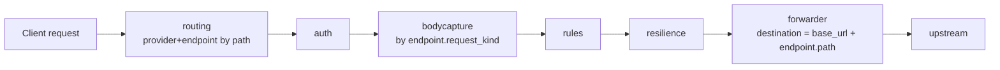
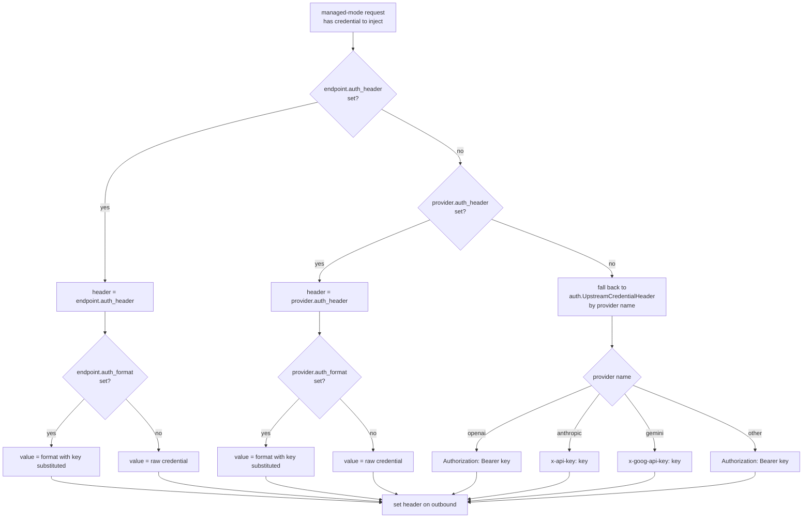
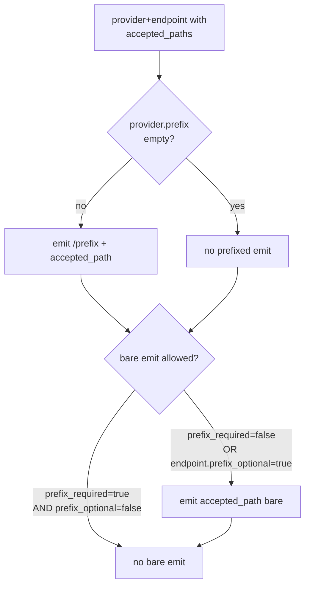

# Providers

A provider in Sluice is an upstream API target — OpenAI, Anthropic, Gemini, an in-cluster ollama, a self-hosted vLLM, anything that speaks one of the typed request shapes the gateway knows. The `providers:` block declares its base URL, the endpoint catalogue the gateway exposes for it, and the per-(provider, endpoint) credential conventions used when forwarding managed-mode requests.

This page is the operator's reference for `providers.yaml`. Every field on `Provider` and every field on `Endpoint` is enumerated, with the auth header resolution table and worked examples drawn from `config-dev/providers.yaml`.

---

## Table of contents

1. [Mental model](#mental-model)
2. [Where it sits in the pipeline](#where-it-sits-in-the-pipeline)
3. [Quick start](#quick-start)
4. [YAML schema](#yaml-schema)
5. [Auth header resolution](#auth-header-resolution)
6. [The OpenAI-compat surface](#the-openai-compat-surface)
7. [Route emission and prefix disambiguation](#route-emission-and-prefix-disambiguation)
8. [Path placeholders](#path-placeholders)
9. [Streaming behaviour](#streaming-behaviour)
10. [Worked examples](#worked-examples)
11. [Validation errors](#validation-errors)
12. [Cross-references](#cross-references)

---

## Mental model

> **A provider is a base URL plus a catalogue of endpoints. An endpoint is an inbound path pattern plus an upstream path plus a typed body shape.**

Sluice does not auto-discover what an upstream API supports. Every accepted path is declared in YAML: the operator picks the inbound pattern (`/v1/chat/completions`), the outbound path on the upstream (also `/v1/chat/completions`, usually), and the typed `request_kind` the body capture middleware should deserialise into.

Provider names are referenced by:

- **Configurations** — `upstream_credentials.<provider>` maps a provider to a credential.
- **Rules** — the `provider` condition and the `changeProvider` action both name a provider.
- **Resilience targets** — `targets[*].provider` names the provider the target dispatches against.

When `changeProvider` re-targets a request mid-pipeline, the destination builder re-resolves the endpoint on the **new** provider (invariant 7 in [`CLAUDE.md`](../CLAUDE.md)). This is what makes the model-keyed redirect pattern work — `claude-*` on `/openai/v1/chat/completions` lands on anthropic's `chat_completions` endpoint with anthropic's credential header.

---

## Where it sits in the pipeline



Routing reads `accepted_paths` from every endpoint to build its index. Bodycapture reads `request_kind` to pick the typed deserialiser. The forwarder reads `base_url` + `endpoint.path` to construct the upstream URL, and the destination builder reads the auth-header override stack to pick the credential header.

The provider declaration is therefore touched by **routing**, **bodycapture**, **rules / resilience** (by name), and **the forwarder**. Get the YAML right and the rest of the pipeline follows.

---

## Quick start

### 30-second provider declaration

```yaml
providers:
  openai:
    base_url: https://api.openai.com
    prefix: openai
    prefix_required: false
    endpoints:
      chat_completions:
        path: /v1/chat/completions
        method: [POST]
        accepted_paths: [/v1/chat/completions, /chat/completions]
        accepts_streaming: true
        request_kind: chat
      models:
        path: /v1/models
        method: [GET]
        accepted_paths: [/v1/models, /models]
        request_kind: passthrough
```

This exposes `/openai/v1/chat/completions`, `/v1/chat/completions`, `/openai/chat/completions`, `/chat/completions`, `/openai/v1/models`, `/v1/models`, `/openai/models`, and `/models` — every `accepted_paths` entry emits both the prefixed and bare form because `prefix_required: false`. See [Route emission](#route-emission-and-prefix-disambiguation) for the rules.

### 30-second OpenAI-compat surface

```yaml
providers:
  anthropic:
    base_url: https://api.anthropic.com
    prefix: anthropic
    prefix_required: true
    required_headers:
      anthropic-version: "2023-06-01"
    endpoints:
      messages:
        path: /v1/messages
        method: [POST]
        accepted_paths: [/v1/messages]
        accepts_streaming: true
        request_kind: messages
        prefix_optional: true
        auth_header: x-api-key
        auth_format: "{key}"
      chat_completions:
        path: /v1/chat/completions
        method: [POST]
        accepted_paths: [/v1/chat/completions]
        accepts_streaming: true
        request_kind: chat
        auth_header: Authorization
        auth_format: "Bearer {key}"
```

Same provider, two endpoints, two different credential conventions. The native `/v1/messages` uses Anthropic's `x-api-key`; the OpenAI-compat `/v1/chat/completions` uses bearer. See [The OpenAI-compat surface](#the-openai-compat-surface).

---

## YAML schema

The full schema is in [`contracts/config/providers.go`](../contracts/config/providers.go). What follows is the operator-facing summary.

### Top-level

```yaml
providers:
  <provider name>:
    base_url: https://api.example.com
    prefix: example
    prefix_required: true
    required_headers:
      x-api-version: "2024-10-01"
    auth_header: Authorization
    auth_format: "Bearer {key}"
    endpoints:
      <endpoint name>:
        path: /v1/chat
        method: [POST]
        accepted_paths: [/v1/chat]
        accepts_streaming: true
        request_kind: chat
        auth_header: x-api-key
        auth_format: "{key}"
        prefix_optional: false
```

### Provider fields

| Field | Required | Notes |
|---|---|---|
| `base_url` | yes | Upstream root URL. The forwarder appends `endpoint.path` (after placeholder substitution) to this when proxying. |
| `prefix` | no | URL path segment that disambiguates this provider when multiple providers share an `accepted_paths` entry. Empty means the provider only matches bare paths (legacy single-provider deploys). |
| `prefix_required` | no | Default `false`. When `false`, every accepted path emits both `/<prefix><accepted_path>` and the bare `<accepted_path>` form. When `true`, only the prefixed form emits — except for endpoints that flip `prefix_optional: true`. With `prefix_required: true` and an empty `prefix`, validation fails with `ErrPrefixRequiredEmpty` — the provider would be unreachable. |
| `required_headers` | no | Headers the gateway injects on every forwarded request to this provider. Use for static API-version pins like `anthropic-version: "2023-06-01"`. Inbound headers of the same name are overwritten. |
| `auth_header` | no | Outgoing HTTP header name into which managed-mode credentials are injected for **every** endpoint of this provider. Empty defers to the per-endpoint override or, if that is also empty, to the per-provider default in [`auth.UpstreamCredentialHeader`](../internal/middleware/auth/resolver.go). |
| `auth_format` | no | Template for the credential value injected into `auth_header`. Contains exactly one `{key}` placeholder, substituted with the resolved credential at request time. Validator rejects: format set without header (silently ignored at runtime), and format with zero or multiple `{key}` placeholders. Only consulted when an override `auth_header` is in effect. |
| `endpoints` | yes | Provider's endpoint catalogue keyed by logical name (e.g., `chat_completions`, `messages`, `models`). The key seeds the route index and shows up in telemetry as the resolved endpoint name. At least one endpoint required for the provider to be useful. |

### Endpoint fields

| Field | Required | Notes |
|---|---|---|
| `path` | yes | Upstream path the gateway forwards to, appended to `provider.base_url`. May contain `{model}` placeholder for path-addressed APIs (Gemini's `generateContent`). |
| `method` | yes | HTTP methods the endpoint accepts as a YAML list. The router rejects a method mismatch with 405. |
| `accepted_paths` | yes | Inbound path patterns the gateway matches against the client request. Routing builds its index from this list. Each pattern emits one or two route entries — see [Route emission](#route-emission-and-prefix-disambiguation). |
| `accepts_streaming` | no | Default `false`. Records whether the endpoint supports SSE streaming responses. The forwarder uses this to decide whether to keep the connection open and stream chunks vs buffer the response. Set `true` for chat/completions, generate_content, and messages on every provider. |
| `request_kind` | yes | Names the typed request shape. One of: `passthrough`, `chat`, `responses`, `messages`, `generate_content`. The bodycapture middleware dispatches on this to deserialise the request body into the right model type with [`DynamicProperties`](../models/dynamic.go) preservation. New providers add a new kind here plus a case in the bodycapture switch — see [`internal/middleware/bodycapture/bodycapture.go`](../internal/middleware/bodycapture/bodycapture.go). |
| `auth_header` | no | Outgoing HTTP header name for managed-mode credentials on this specific endpoint. Empty defers to the provider-level override, then to the per-provider default. Load-bearing for OpenAI-compat surfaces on Anthropic and Gemini — both want `Authorization: Bearer` on the OpenAI-compat endpoint rather than the provider's native `x-api-key` / `x-goog-api-key`. |
| `auth_format` | no | Template for the credential value injected into the endpoint's `auth_header`. Same validation rules as the provider-level field — exactly one `{key}`, only consulted when a header override is in effect at this level. |
| `prefix_optional` | no | Default `false`. When `true`, escapes `provider.prefix_required` for this single endpoint — bare `accepted_paths` emit as routes even when the rest of the provider's endpoints stay prefix-only. The canonical use is Anthropic's `/v1/messages`: bare so vanilla Anthropic SDKs work pointed at the gateway root, while the OpenAI-compat `/anthropic/v1/chat/completions` on the same provider stays prefix-only to avoid colliding with openai. No effect when `provider.prefix_required` is already `false` — the endpoint already emits both forms. |

---

## Auth header resolution

The destination builder ([`cmd/gateway/handler.go::resolveCredentialHeader`](../cmd/gateway/handler.go)) is the **single mint site** for the upstream credential header in managed mode (invariant 6 in `CLAUDE.md`). It resolves the (header name, header value) pair by walking three levels of overrides:



Resolution table:

| Endpoint `auth_header` | Provider `auth_header` | Result |
|---|---|---|
| set | (any) | endpoint header wins; endpoint `auth_format` applied (raw credential if empty). |
| empty | set | provider header wins; provider `auth_format` applied (raw credential if empty). |
| empty | empty | fall back to per-provider default in `auth.UpstreamCredentialHeader` — `Authorization: Bearer {key}` for openai, `x-api-key: {key}` for anthropic, `x-goog-api-key: {key}` for gemini, and `Authorization: Bearer {key}` for any other provider name. |

Per-provider defaults (from [`internal/middleware/auth/resolver.go`](../internal/middleware/auth/resolver.go)):

| Provider name (literal match) | Default header | Default value |
|---|---|---|
| `openai` | `Authorization` | `Bearer <credential>` |
| `anthropic` | `x-api-key` | `<credential>` |
| `gemini` | `x-goog-api-key` | `<credential>` |
| anything else | `Authorization` | `Bearer <credential>` |

The fallback exists so a rule that retargets to an as-yet-unmodelled provider still produces a reasonable outgoing shape. If your custom provider needs a different convention, declare it with `auth_header` + `auth_format` on the provider so the destination builder never falls through to the default.

The auth-header override path is also what `changeApiKey` re-uses when a rule rewrites the credential post-rule — the same `auth.UpstreamCredentialHeader` is called from the rules engine so the format table cannot fragment between mint sites.

---

## The OpenAI-compat surface

Anthropic and Gemini both expose OpenAI-compatible `/chat/completions` endpoints on their native APIs. The clients that hit those endpoints are written against the OpenAI SDK and send `Authorization: Bearer` — not anthropic's `x-api-key` or gemini's `x-goog-api-key`. The endpoint-level auth override is what lets the same provider declare two endpoints with two different credential conventions:

```yaml
providers:
  anthropic:
    prefix: anthropic
    prefix_required: true
    base_url: https://api.anthropic.com
    endpoints:
      messages:
        path: /v1/messages
        accepted_paths: [/v1/messages]
        request_kind: messages
        prefix_optional: true
        auth_header: x-api-key       # native — matches provider default
        auth_format: "{key}"

      chat_completions:
        path: /v1/chat/completions
        accepted_paths: [/v1/chat/completions]
        request_kind: chat
        auth_header: Authorization   # OpenAI-compat — bearer
        auth_format: "Bearer {key}"
```

The `messages` endpoint declares `auth_header: x-api-key` even though that's what the provider default would produce — explicit is better than relying on the default when the file already declares overrides for the sibling endpoint. The reader sees the convention without cross-referencing the default table.

The same pattern applies to Gemini's `/v1beta/openai/chat/completions` — it's the OpenAI-compat endpoint on the gemini provider and uses `Authorization: Bearer` rather than the provider's native `x-goog-api-key`.

This pairs with the model-keyed `changeProvider` rule pattern (v1.0.2). A rule on `/openai/v1/chat/completions` that matches `model: claude-*` and fires `changeProvider: anthropic` triggers the destination builder to:

1. Re-resolve the endpoint on the new provider — `anthropic.chat_completions`.
2. Pull the endpoint-level `auth_header: Authorization` and `auth_format: "Bearer {key}"`.
3. Mint the outbound header from anthropic's credential.

Without the endpoint-level override the destination builder would fall through to anthropic's default `x-api-key` — wrong for the OpenAI-compat surface. The override path is what makes the cross-provider redirect work transparently.

---

## Route emission and prefix disambiguation

The route index is built at config-load time by expanding every `(provider, endpoint, accepted_path)` triple into one or two route entries:



The rules:

- If `provider.prefix` is set, every `accepted_path` emits `/<prefix><accepted_path>`.
- If `provider.prefix_required` is `false` (the default), every `accepted_path` **also** emits the bare form.
- If `provider.prefix_required` is `true`, the bare form is suppressed — except for endpoints that set `prefix_optional: true`, which emit the bare form anyway.

Two providers can claim the same `accepted_path` as long as the resulting fully-resolved routes don't collide. The validator catches collisions and returns `ErrPathCollision`:

> Collisions are only possible when two providers both have `prefix_required: false` and share an accepted_path, or when two providers share both the same prefix and an accepted_path.

In `config-dev/providers.yaml`, OpenAI is the default (`prefix_required: false`), Anthropic and Gemini are prefixed (`prefix_required: true`). The shared `/v1/models` claim doesn't collide because anthropic + gemini only emit the prefixed `/anthropic/v1/models` and `/gemini/v1beta/models` forms; the bare `/v1/models` is claimed by openai alone.

The `prefix_optional` escape is what lets vanilla Anthropic SDKs (which hit `/v1/messages` directly) work against the gateway root. Anthropic's `messages` endpoint sets `prefix_optional: true`, so both `/v1/messages` and `/anthropic/v1/messages` route to anthropic — while the OpenAI-compat `/anthropic/v1/chat/completions` on the same provider stays prefix-only to avoid colliding with openai's bare `/v1/chat/completions`.

---

## Path placeholders

`endpoint.path` supports a `{model}` placeholder for path-addressed APIs. The forwarder substitutes the placeholder from `state.PathParams["model"]` (populated by the bodycapture middleware from the deserialised request body):

```yaml
endpoints:
  generate_content:
    path: /v1beta/models/{model}:generateContent
    accepted_paths: ["/v1beta/models/{model}:generateContent"]
    request_kind: generate_content
```

Gemini's `generateContent` is the canonical example — the model name is in the URL, not the body. The bodycapture's `generate_content` deserialiser extracts the model from the inbound path; the forwarder re-inserts it into the upstream path via the same placeholder.

If no `{model}` is present in the path, no substitution happens. If `state.PathParams["model"]` is empty for a path that wants it, the upstream URL contains a literal `{model}` segment, which the upstream will reject with 404 — surface this as a `passthrough` bug, not a routing issue.

---

## Streaming behaviour

`accepts_streaming: true` on an endpoint is the operator's declaration that the upstream may return Server-Sent Events. It does not by itself wire any streaming machinery — that's the forwarder's job. Three layers cooperate at request time to keep streams flowing end-to-end without buffering.

### `http.Flusher` passthrough

The forwarder uses `httputil.ReverseProxy` under the hood. `ReverseProxy.FlushInterval = -1` (set at construction in [`internal/proxy`](../internal/proxy)) tells the standard library to flush immediately on every write, which is the behaviour SSE requires. Every response writer in the gateway's wrapper stack — the recovery middleware's status recorder, the bodycapture's response tap, the resilience orchestrator's `BufferingResponseWriter` — implements `http.Flusher` and forwards the `Flush()` call through to the wrapped writer. PR #45 (`fix(admin): forward http.Flusher through statusRecorder`) was the last load-bearing fix here; the contract that **every** wrapper preserves `Flusher` is what keeps SSE chunks landing at the client unbatched.

### `BufferingResponseWriter` swap on resilience policies

When a request is bound to a resilience policy (`useResiliencePolicy` action fired), the orchestrator wraps the outbound `http.ResponseWriter` in a [`BufferingResponseWriter`](../internal/proxy/buffering_writer.go) before each attempt. The buffer accumulates the attempt's bytes in memory; only the first non-retryable outcome (commit) flushes the buffer to the real `http.ResponseWriter`. A retryable failure discards the buffer and tries the next target.

This means: **a streaming response under a resilience policy is buffered until the upstream commits to the request as non-retryable.** Once the orchestrator commits, every subsequent chunk passes through the `Flusher` chain unmodified — but the first chunk only reaches the client after the orchestrator has decided "this attempt is the answer." For status-code-driven retries this is invisible (the upstream emits status + headers + first chunk together); for transport-error retries it's why the first byte takes longer when the breaker is having a bad day. Single-shot requests (no policy bound) never go through `BufferingResponseWriter` — they stream from byte one.

### Per-provider response accumulator

While the forwarder is streaming chunks to the client, the admin live-feed's body store retains the raw SSE bytes (per `SLUICE_ADMIN_LIVE_FEED_BODY_BYTES`). At OnComplete the reporter calls [`internal/observability/livefeed/accumulator`](../internal/observability/livefeed/accumulator) — a per-endpoint dispatcher that reassembles the streamed chunks into the JSON shape the provider would have returned non-streaming.

The package keys on endpoint name (not provider), so the OpenAI-compat surfaces on Anthropic and Gemini reuse OpenAI's chunk reassembler under the same `chat_completions` name:

| Endpoint name | Reassembled shape | Source file |
|---|---|---|
| `chat_completions` | `*openaichat.ChatCompletionResponse` | [`openai_chat.go`](../internal/observability/livefeed/accumulator/openai_chat.go) |
| `messages` | `*messages.MessagesResponse` | [`anthropic_messages.go`](../internal/observability/livefeed/accumulator/anthropic_messages.go) |
| `generate_content` | `*content.GenerateContentResponse` | [`gemini_content.go`](../internal/observability/livefeed/accumulator/gemini_content.go) |
| `responses` | `*openairesponses.ResponsesResponse` | [`openai_responses.go`](../internal/observability/livefeed/accumulator/openai_responses.go) |
| anything else | `Result{}` (Recognised=false; admin UI surfaces raw bytes) | dispatch only |

The reassembled JSON lands on the body envelope as `ResponseAssembled` ([`docs/admin-console.md → Body capture`](admin-console.md#body-capture)) so the admin console's body modal can render streaming traffic against the same mental model as non-streaming. If the accumulator hits a malformed chunk or an unknown delta type mid-stream, it sets `AssemblyPartial: true` and returns whatever was parseable up to that point — the UI then knows to caveat the assembled view.

The accumulator runs **after** the response has finished writing to the client. The hot path is unaffected — the cost lands at OnComplete, off the critical path, with no flushing delay introduced by reassembly.

---

## Worked examples

### Declaring a custom in-cluster ollama provider

Goal: expose an in-cluster ollama at `http://ollama.ollama.svc.cluster.local:11434` as a provider named `qwen-ollama`, prefixed so it doesn't collide with the openai default.

```yaml
providers:
  qwen-ollama:
    base_url: http://ollama.ollama.svc.cluster.local:11434
    prefix: qwen-ollama
    prefix_required: true
    endpoints:
      chat_completions:
        path: /v1/chat/completions
        method: [POST]
        accepted_paths: [/v1/chat/completions]
        accepts_streaming: true
        request_kind: chat
      models:
        path: /v1/models
        method: [GET]
        accepted_paths: [/v1/models]
        request_kind: passthrough
```

Routes emitted:

- `/qwen-ollama/v1/chat/completions` → `POST http://ollama.ollama.svc.cluster.local:11434/v1/chat/completions`
- `/qwen-ollama/v1/models` → `GET http://ollama.ollama.svc.cluster.local:11434/v1/models`

No bare emit because `prefix_required: true` and no endpoint sets `prefix_optional`. Ollama's `/v1/chat/completions` is OpenAI-compatible and accepts bearer tokens; the per-provider default for an unknown provider name is `Authorization: Bearer {key}`, which is exactly what ollama wants — no `auth_header` override needed.

To wire a Configuration to this provider, add the credential under `upstream_credentials`:

```yaml
configurations:
  internal-dev:
    upstream_credentials:
      qwen-ollama: ollama-static-token
```

For a credential-less ollama (the typical local-dev setup), omit the entry; the destination builder takes the `credStripNoSet` branch and forwards no credential header at all.

### Declaring an OpenAI-compat endpoint on an existing provider

Goal: add the OpenAI-compat `/chat/completions` surface to a provider that already exposes its native API. Gemini in `config-dev/providers.yaml`:

```yaml
providers:
  gemini:
    base_url: https://generativelanguage.googleapis.com
    prefix: gemini
    prefix_required: true
    endpoints:
      generate_content:
        path: /v1beta/models/{model}:generateContent
        method: [POST]
        accepted_paths: ["/v1beta/models/{model}:generateContent"]
        accepts_streaming: true
        request_kind: generate_content
        prefix_optional: true

      chat_completions:
        path: /v1beta/openai/chat/completions
        method: [POST]
        accepted_paths: [/v1beta/openai/chat/completions]
        accepts_streaming: true
        request_kind: chat
        auth_header: Authorization
        auth_format: "Bearer {key}"
```

The native `generate_content` endpoint uses the provider default (`x-goog-api-key`) and is exposed bare via `prefix_optional` so the official Gemini SDK works pointed at the gateway root. The OpenAI-compat `chat_completions` endpoint stays prefix-only (no `prefix_optional`) and declares `Authorization: Bearer {key}` because that's what OpenAI-SDK clients send.

Both endpoints use the same gemini upstream credential — only the wire format of the outbound header changes.

### Per-endpoint auth override: `x-api-key` vs bearer

Goal: same provider, two endpoints, two different credential conventions on the wire — `x-api-key` for the native API, `Authorization: Bearer` for the OpenAI-compat surface.

```yaml
providers:
  anthropic:
    base_url: https://api.anthropic.com
    prefix: anthropic
    prefix_required: true
    required_headers:
      anthropic-version: "2023-06-01"
    endpoints:
      messages:
        path: /v1/messages
        method: [POST]
        accepted_paths: [/v1/messages]
        accepts_streaming: true
        request_kind: messages
        prefix_optional: true
        auth_header: x-api-key
        auth_format: "{key}"

      chat_completions:
        path: /v1/chat/completions
        method: [POST]
        accepted_paths: [/v1/chat/completions]
        accepts_streaming: true
        request_kind: chat
        auth_header: Authorization
        auth_format: "Bearer {key}"
```

The destination builder consults the endpoint-level override first. For `/v1/messages` it picks `x-api-key: <credential>`; for `/v1/chat/completions` it picks `Authorization: Bearer <credential>`. The credential value is the same — `configurations.<name>.upstream_credentials.anthropic` — but the outbound header differs by endpoint.

This is the v1.0.2 OpenAI-compat surface in production. Operator notes:

- Both endpoint-level overrides are explicit even though the `messages` endpoint matches the provider default — explicit-in-both-places is easier to read and survives someone later flipping the provider-level default.
- `required_headers.anthropic-version` injects on **every** anthropic endpoint, including the OpenAI-compat one. Anthropic's compat surface still wants the version pin.
- The native `messages` endpoint is `prefix_optional` so vanilla Anthropic SDKs work; the compat `chat_completions` stays prefix-only to avoid colliding with openai's bare claim on the same path.

---

## Validation errors

The loader runs `Validate()` after merge; the first violation aborts startup with a wrapped sentinel:

| Error | Cause |
|---|---|
| `ErrPrefixRequiredEmpty` | Provider has `prefix_required: true` but no `prefix` — provider would be unreachable. |
| `ErrPathCollision` | Two endpoints emit the same fully-resolved route. Possible only when two providers share `prefix_required: false` and an `accepted_path`, or when two providers share a prefix and an `accepted_path`. |
| `ErrAuthFormatWithoutHeader` | `auth_format` set without `auth_header` at the same level — the format would be silently ignored, which is almost always a mistake. |
| `ErrInvalidAuthFormat` | `auth_format` does not contain exactly one `{key}` placeholder. Zero placeholders means the credential is dropped on the floor; multiple means substitution is ambiguous. |

Validation runs once at load time. There's no hot reload in v1.0/v1.1, so a malformed `providers.yaml` produces a startup failure with the wrapped sentinel and no live request ever sees the bad config.

---

## Cross-references

- **[`docs/routing.md`](routing.md)** — how an inbound request's path is matched against `accepted_paths` to resolve to a `(provider, endpoint)` pair, and how the prefix disambiguator handles the bare/prefixed forms.
- **[`docs/resilience.md`](resilience.md)** — how a target's `changeProvider` action re-resolves the endpoint on the new provider, picking up that provider's auth-header override stack automatically. The model-keyed redirect pattern depends on this.
- **[`contracts/config/providers.go`](../contracts/config/providers.go)** — the canonical Go types for `ProvidersConfig`, `Provider`, and `Endpoint`.
- **[`internal/middleware/auth/resolver.go`](../internal/middleware/auth/resolver.go)** — `UpstreamCredentialHeader`, the per-provider default fallback in the auth-header resolution table.
- **[`cmd/gateway/handler.go`](../cmd/gateway/handler.go)** — `resolveCredentialHeader` and `buildDestination`, the destination builder that mints the outbound auth header per `(provider, endpoint)`.
- **[`CLAUDE.md`](../CLAUDE.md)** — load-bearing invariants 6 (auth header lives in one place per `(provider, endpoint)`) and 7 (`changeProvider` re-resolves the endpoint on the new provider).
