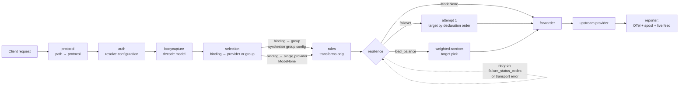
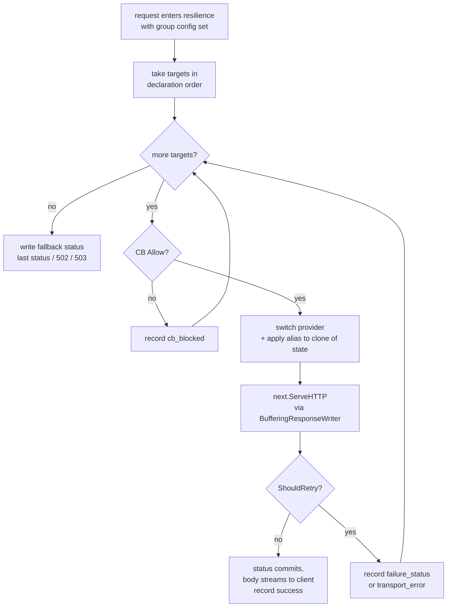
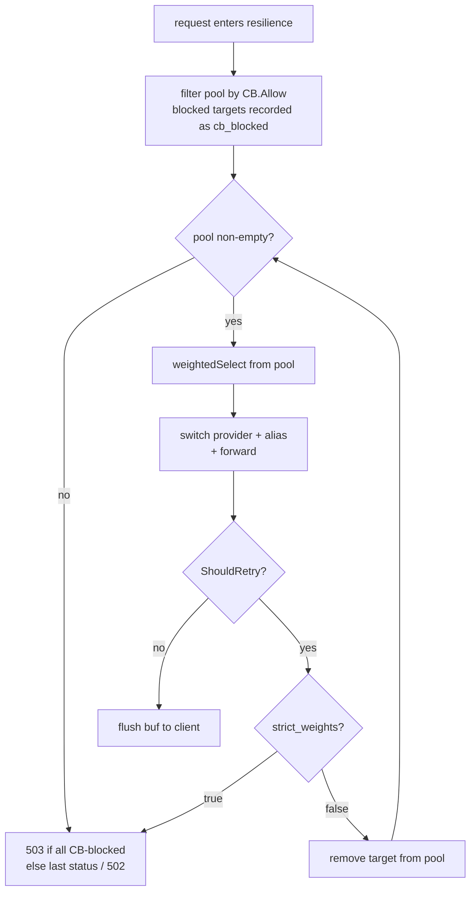
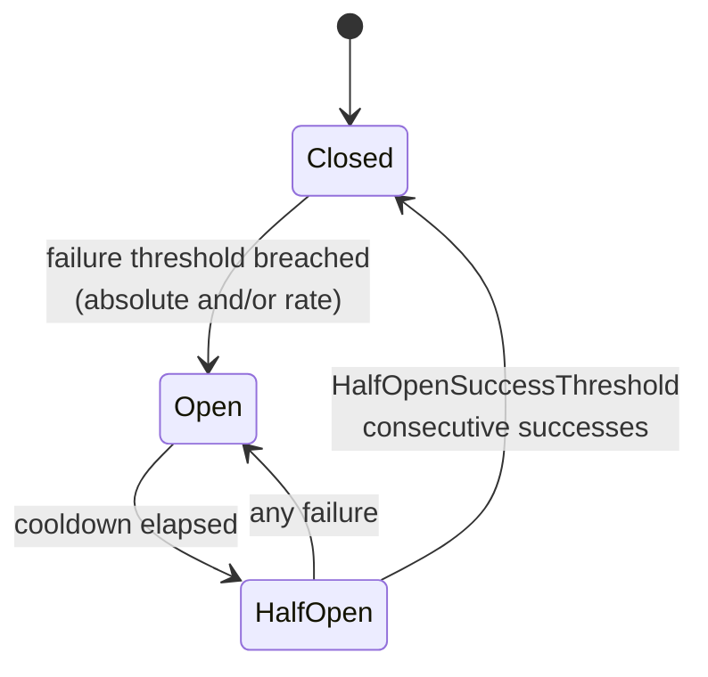

# Resilience Groups

SlipSpace's resilience engine turns a single inbound request into one or more upstream attempts according to a named **group**: failover walk-down, weighted load-balance, optional circuit breaker. Groups live under the top-level `groups:` key in any merged YAML under `SLIPSPACE_CONFIG_DIR`. A request opts into a group when a Configuration's **binding** points its `(protocol, model)` slot at a group instead of a single provider.

This page is the operator's reference. It covers the full v2 YAML schema, every mode, how requests flow through the orchestrator, what observability fires, and worked examples taken straight from production wiring.

> **v2 note.** This document describes the v2 config model (providers + bindings + groups). The legacy top-level `resilience_policies:` key and the `useResiliencePolicy` rule action no longer drive routing — see [Binding a request to a group](#binding-a-request-to-a-group) and [What changed from v1](#what-changed-from-v1).

---

## Table of contents

1. [Mental model](#mental-model)
2. [Where it sits in the pipeline](#where-it-sits-in-the-pipeline)
3. [Quick start](#quick-start)
4. [YAML schema](#yaml-schema)
5. [Binding a request to a group](#binding-a-request-to-a-group)
6. [Modes](#modes)
7. [Per-target overrides](#per-target-overrides)
8. [Failure status codes](#failure-status-codes)
9. [Circuit breaker](#circuit-breaker)
10. [Observability](#observability)
11. [Worked examples](#worked-examples)
12. [What changed from v1](#what-changed-from-v1)
13. [Known limitations](#known-limitations)
14. [Troubleshooting](#troubleshooting)

---

## Mental model

> **Bindings decide WHICH logical destination. A group decides HOW to robustly hit it.**

Under v2, routing is config data. A Configuration's `bindings` list maps each `(protocol, model)` pair to a destination: either a single **provider** or a resilience **group**. Selection runs early in the pipeline, before rules, and resolves the binding once.

- A binding that names a single `provider:` is single-shot — one attempt, no orchestration.
- A binding that names a `group:` is orchestrated — the group's targets are walked according to its `mode` (failover, load-balance), with optional circuit breaking.

A group never re-routes by itself. It only acts on a request a binding has already routed to it. Groups are **protocol-preserving**: every target in a group must serve the binding's protocol, so there is no mid-failover protocol translation — failing over from OpenAI's `chat` to Anthropic's `chat` (OpenAI-compat) is fine; failing over to Anthropic's native `messages` from a `chat` binding is rejected at config-load.

Rules still run, but in v2 they are pure request/response transforms (tags, header sets, body rewrites, short-circuits). They no longer choose providers or bind resilience.

---

## Where it sits in the pipeline

The runtime order is `selection → rules → resilience → forwarder` — **rules run before the orchestrator**, not after it. [`docs/pipeline.md`](pipeline.md#the-http-middleware-chain) is the canonical source of truth for the full middleware chain; this diagram is the resilience-centric view of it.



Selection synthesises the orchestrator's input from the chosen binding and stashes it on the request context; rules then run as pure request/response transforms over that selected state; the resilience middleware reads the synthesised config directly (it does not look a policy up by name). A single-provider binding is synthesised as a degenerate `ModeNone` group of one target, so single-shot and orchestrated requests flow through the same machinery. Because rules run **before** the orchestrator, rule conditions see the binding-selected provider/model — the orchestrator's per-attempt provider switch happens later, downstream of rules.

For each attempt the orchestrator wraps the response writer in a `BufferingResponseWriter`. It intercepts only `WriteHeader` — body bytes are never buffered. The status line is the commit-or-discard decision point: a status in the attempt's retry set (or a transport error with no `WriteHeader` at all) is swallowed and `Committed` stays false, so the next attempt can run; any other status passes straight through to the real `http.ResponseWriter` and commits, after which body writes stream through untouched.

---

## Quick start

A resilience group is two pieces of YAML: the group definition under `groups:`, and a binding on a Configuration that points at it. Providers are defined once under `providers:` (connection + per-protocol auth, no credentials); the Configuration supplies the credential per provider.

### 30-second failover

```yaml
configurations:
  production:
    credentials:
      openai: sk-openai-mock
      anthropic: sk-ant-mock
    bindings:
      - { protocol: chat, models: ["gpt-*"], group: openai-failover }

groups:
  openai-failover:
    mode: failover
    failure_status_codes: [502, 503, 504]
    targets:
      - { provider: openai }
      - { provider: anthropic, alias: claude-3-5-sonnet }
```

The literal credential values shown here are what the YAML loader sees; substitute via your secret manager before mount (see [`configuration-model.md`](configuration-model.md#why-no-var-substitution)).

Every `chat` request for a `gpt-*` model now tries OpenAI first; on a 502/503/504 it falls over to Anthropic's OpenAI-compat `chat` surface, rewriting the body model to `claude-3-5-sonnet` via the target `alias`. The client sees one response — either the OpenAI success or the Anthropic recovery. Failover order is **declaration order**: `openai` is target 1, `anthropic` is target 2.

### 30-second weighted load-balance

```yaml
groups:
  qwen-load-balance:
    mode: load_balance
    failure_status_codes: [502, 503, 504]
    targets:
      - { provider: qwen-ollama, weight: 70 }
      - { provider: qwen-ollama-standalone, weight: 30 }
```

```yaml
# on the configuration:
bindings:
  - { protocol: chat, models: ["qwen2.5-coder:7b"], group: qwen-load-balance }
```

Roughly 70% of requests land on the in-cluster ollama; 30% on the standalone. On a retryable failure the orchestrator re-rolls from the remaining pool (LBWF — load-balance with failover). See [Modes](#modes) for the alternative `strict_weights` semantics used by canary mirroring.

---

## YAML schema

The v2 group schema is defined in [`contracts/config/model.go`](../contracts/config/model.go) (`GroupsConfig` / `Group` / `Target`). What follows is the operator-facing summary.

### Top-level

`groups:` is a map from **group name** to its definition (the name is the map key, not a field):

```yaml
groups:
  <group-name>:
    mode: failover | load_balance | load_balance_with_failover | none
    strict_weights: false                 # default; only meaningful for load_balance modes
    failure_status_codes: [502, 503, 504]  # group-wide; empty falls back to default 5xx set
    response_header_timeout_seconds: 20    # optional; overrides the gateway-wide time-to-first-byte cap for this group
    circuit_breaker:                       # optional; group-wide (one breaker per target-provider)
      enabled: true
      failure_threshold: 5
      failure_rate_threshold: 0.5
      sampling_duration_seconds: 60
      minimum_throughput: 10
      cooldown_seconds: 30
      half_open_success_threshold: 2
    targets:
      - provider: <provider name from providers.yaml>
        alias: <model name to rewrite the body to when this target is selected>  # optional
        weight: 50                          # load_balance share; ignored in failover
        path: /custom/upstream/path         # optional per-target protocol-path override
        query: { api-version: "2024-02-01" } # optional per-target query params (composed over provider query)
```

### Group fields

| Field | Required | Notes |
|---|---|---|
| _map key_ | yes | The group name. Referenced by a binding's `group:`. Unique across the `groups:` block (duplicate top-level keys are a load error). |
| `mode` | yes | See [Modes](#modes). |
| `strict_weights` | no | Default `false`. Only meaningful in `load_balance` modes — see [strict_weights](#canary-mirroring-with-strict_weights). |
| `failure_status_codes` | no | Group-wide list of HTTP status codes that count as retryable. Empty falls back to default `[500, 502, 503, 504]`. There is no per-target override in the v2 group schema. |
| `response_header_timeout_seconds` | no | Per-group override of the gateway-wide time-to-first-byte cap (`SLIPSPACE_UPSTREAM_RESPONSE_HEADER_TIMEOUT_SECONDS`, default 120s). When set (> 0) it replaces the default for every attempt under this group; the orchestrator stamps it on the attempt and the forwarder keys a per-timeout transport off it. Deliberately **not** floored — failover/load-balance groups usually want a *shorter* budget so a slow target is abandoned fast and a healthy one is tried. Zero leaves the default in force. Bounds time-to-first-byte only; committed streaming bodies are not capped. |
| `circuit_breaker` | no | Group-wide breaker config; one breaker instance per `(group, target-provider)`. Omit for no breaker. The v2 group schema has no per-target breaker override. |
| `targets` | yes | At least one target. Validation rejects an empty target list. |

### Target fields

| Field | Required | Notes |
|---|---|---|
| `provider` | yes | Must match a provider declared in `providers.yaml`, and that provider must serve the binding's protocol (protocol-preserving; enforced at config-load). |
| `alias` | no | Model-name rewrite: when this target is selected the request body's model field is rewritten to this value. This is the v2 replacement for the v1 `model_rewrite` scalar. Placing it on the target lets one group send a single logical model under a different upstream id per provider. |
| `weight` | load_balance only | Relative selection share. `0` is treated as `1` (even weighting) by the orchestrator. Ignored in `failover` mode, where **declaration order** drives sequencing. |
| `path` | no | Overrides the protocol's upstream path for this target only (e.g. an Azure deployment-specific path on a shared provider connection). |
| `query` | no | Per-target query-string params, composed over the provider's default query (target wins). |

There is no per-target `name`, `order`, `failure_status_codes`, `circuit_breaker`, or `actions` in the v2 group schema. Failover order is the declaration order of `targets`; the telemetry target label is the **provider name**.

### Circuit-breaker fields

| Field | Default | Notes |
|---|---|---|
| `enabled` | `false` | Off by default — set `true` to arm the breaker for the group. |
| `failure_threshold` | 0 | Absolute count of failures inside the window required to trip. `0` means "rate-only". |
| `failure_rate_threshold` | 0 | Proportional failure rate (0.0–1.0) required to trip. `0` means "absolute-only". |
| `sampling_duration_seconds` | 60 | Sliding window. Older buckets roll off. |
| `minimum_throughput` | 0 | Samples in window below this never trip. Guards against cold-start flapping. |
| `cooldown_seconds` | 0 | How long Open stays Open before probing HalfOpen. `0` means "always Open once tripped" (don't do this). |
| `half_open_success_threshold` | 1 | Consecutive successes in HalfOpen needed to close. Any single failure reopens. |

If both `failure_threshold > 0` and `failure_rate_threshold > 0`, **both** must breach to trip. Combining them is how you avoid false positives at low traffic (`minimum_throughput`) while still tripping promptly on a real outage (`failure_threshold`).

### Validated at load — and what isn't

Group validation at config load is deliberately shallow (`internal/config/config_validate.go:130-145`). The loader checks only three things per group: that it declares at least one target, that every target names a non-empty `provider`, and that each named provider exists in the `providers` block. Protocol-preservation is checked separately, when a binding points at the group (`validateBindings`).

Everything else in the group schema is **not** validated at load: `mode`, target declaration order, `weight` values, `failure_status_codes` ranges, and the whole `circuit_breaker` shape pass through untouched. The `contracts/resilience` `Validate()` helpers exist but the loader never invokes them. Invalid or omitted values are absorbed at runtime by the orchestrator's defaults — `weight: 0` becomes `1`, an empty failure set falls back to `[500, 502, 503, 504]` — so a typo in these fields degrades silently rather than failing the config.

### Parsed but not wired

`retry:` and `timeout_seconds` are v1 `resilience_policies` fields and are **NOT** part of the v2 group schema. `contracts/config.Group` and `contracts/config.Target` have no such fields, and the YAML loader is non-strict, so these keys are silently ignored under `groups:` — they are neither parsed nor validated and have no effect. Inter-attempt backoff is not implemented; failover retries immediately. Retry is expressed as a resilience group with multiple targets; the orchestrator tries targets in order until one commits. Attempt-level time bounding comes only from the group's `response_header_timeout_seconds`, which overrides the gateway-wide upstream response-header timeout at the forwarder level (`internal/proxy/transport.go`). Do not author `retry:` or `timeout_seconds` in v2 group configurations.

---

## Binding a request to a group

The bridge from "request arrived" to "orchestrator runs" is a **binding** on the resolved Configuration. A binding matches a `(protocol, model)` pair and names a destination:

```yaml
configurations:
  production:
    credentials:
      qwen-ollama: ""
      qwen-ollama-standalone: ""
    bindings:
      # single provider — single-shot, no orchestration
      - { protocol: chat, models: ["gpt-*"], provider: openai }
      # group — orchestrated
      - { protocol: chat, models: ["qwen2.5-coder:7b"], group: qwen-load-balance }
```

Bindings are evaluated in order; the first whose protocol matches the inbound path and whose `models` patterns match the request's model wins. An empty `models` list is a catch-all for the protocol (default-permissive). Exactly one of `provider:` or `group:` is set per binding — config validation rejects a binding that sets both or neither.

When the matched binding names a group, selection synthesises the group's orchestrator config and stashes it on the request context; the resilience middleware reads it directly. When the binding names a single provider, selection synthesises a degenerate one-target `ModeNone` config that flows through the same path (the `alias`/`query`/`path` sugar on a single-provider binding becomes that one target's overrides).

> **`useResiliencePolicy` is superseded and inert in v2.** The v1 `useResiliencePolicy` rule action still parses (it remains in the rules action vocabulary), but nothing reads what it sets. It writes `state.PolicyRef`, and the v2 orchestrator prefers the per-request config stashed on the context and only consults `state.PolicyRef` through the legacy `PolicyLookup` seam (`internal/middleware/resilience/middleware.go:144-151`), which `cmd/gateway` wires to `nil` (`cmd/gateway/handler.go:51`) — so in production nothing reads it. Do not author it — bind to a group instead. See [What changed from v1](#what-changed-from-v1).

---

## Modes

### `failover`

Targets are tried in **declaration order** (the order they appear under `targets:`). The orchestrator tries them in turn. The first non-retryable outcome (commit) writes the response to the client. On retryable failure, the orchestrator records the attempt and tries the next target.

A retryable outcome is one of:

1. Upstream HTTP status in the resolved `failure_status_codes` set.
2. Transport-level error (no headers received — connection refused, EOF mid-headers, timeout before status line).

If every target fails:

- If some attempt returned a non-zero status, the client sees the **last attempt's status**.
- If every attempt was a transport error (no status ever received), the client sees **`502 Bad Gateway`**.
- If every target was filtered by the circuit breaker before any attempt ran, the client sees **`503 Service Unavailable`** ("no healthy provider").



### `load_balance` / `load_balance_with_failover`

Both modes pick a target by weighted-random selection: each target contributes its `weight` to a cumulative-sum distribution; `rand(0, total)` picks the slot. A `weight` of 0 is treated as 1 (even weighting). Long-run distribution converges to the weight ratio without any shared counter — every pod balances independently.

The two mode names are aliases at the YAML level. The behaviour split is governed by `strict_weights`:

- **Default (`strict_weights: false`) — LBWF semantics.** On a retryable failure the orchestrator removes the failed target from the pool and re-rolls from what remains. The walk continues until a target commits or the pool is empty (same terminal handling as failover).

- **`strict_weights: true` — canary mirroring.** The first selection wins or fails. No re-roll. The client sees the first attempt's **status code**; the upstream body is not passed through — once the status is discarded the BufferingResponseWriter silently absorbs the attempt's subsequent body writes, and the orchestrator writes the generic `http.StatusText` body for that status. The point is that the under-weighted target's failures surface as failures rather than being masked by a re-roll. Used when you *want* the under-weighted target's failure rate to surface — e.g. a 95/5 canary where suppressing the 5% pool's errors would defeat the purpose.



### `none`

Single-target degenerate. The orchestrator switches to the (single) target's provider, applies its `alias` if any, and forwards once. No retry. This is the mode selection synthesises for a single-provider binding — it is what lets a single binding carry a model alias (e.g. `foundry-model-name` → the upstream deployment name) without a bespoke pre-forward rewrite stage. You do not normally author `mode: none` by hand; use a single-provider binding.

---

## Per-target overrides

A v2 target is a provider reference plus a small set of per-use overrides that compose over the provider's own values (target wins):

| Override | Effect |
|---|---|
| `alias` | Rewrites the request body's model field to this value when the target is selected. The v2 replacement for the v1 `model_rewrite` scalar. |
| `path` | Overrides the protocol's upstream path for this target only. |
| `query` | Adds or overrides query-string params, composed over the provider's default query. |
| `weight` | Relative load-balance share (ignored in failover). |

There is no authorable per-target action block in v2. Internally, the orchestrator still applies the same per-attempt machinery the v1.2 engine used: selection synthesises an internal `changeProvider` (+ `changeModelName` when an `alias` is set) per target, clones the post-selection state once per attempt, and applies those internal actions to the clone — so different attempts cannot stack their mutations. `changeProvider` is no longer the *supported* authoring surface for routing — model-keyed redirect is expressed as a binding (models pattern → provider) on the Configuration, per CLAUDE.md invariant 7. The action type remains registered (contracts/rules/action.go) because resilience targets decode actions through the same factory, so a hand-authored `changeProvider` rule still parses and validates — it is unsupported, not rejected. It has no routing effect, though: selection synthesises a `ResilienceConfig` for every generative request (a single-provider binding gets a degenerate `ModeNone` one via `singleTargetConfig`, `cmd/gateway/destination.go`), and every target it builds carries `providerSwitchActions`, so `buildAttemptState` overwrites `state.Provider` from the binding on every attempt before the final handler reads it. Inside the orchestrator, `changeProvider` / `changeModelName` are used as its internal per-attempt synthesis primitives (`providerSwitchActions`, cmd/gateway/destination.go). A `changeProvider` left in a rule's baseline state is overwritten per attempt by `buildAttemptState`.

**Why this matters for failover:** the destination of attempt N is *not* a fixed URL baked at config-load. Switching `state.Provider` triggers the final handler to re-resolve the endpoint, base URL, credential, and auth-header convention on the *new* provider (invariant 7). This is what lets a single group send the same logical model to providers with different credential conventions — e.g. OpenAI's `Authorization: Bearer` primary and Anthropic's OpenAI-compat `chat` surface as the backup, each authenticating correctly (invariant 6).

---

## Failure status codes

Resolution order for "is this status retryable?":

1. The group's `failure_status_codes` (if set).
2. Default `[500, 502, 503, 504]`.

The v2 group schema has no per-target `failure_status_codes` override — the retry set is group-wide. Empty falls through to the default so an operator cannot accidentally produce a "no status ever retries" configuration without explicitly meaning to.

Status codes outside the configured set always commit. A `4xx` from a provider is not retried by default — client errors don't get better on retry, and the second attempt would burn quota for nothing.

---

## Circuit breaker

The breaker is a per-`(group, target-provider)` state machine that protects a provider from a stampede when it's clearly unhealthy. The breaker store keys state by `group-name | provider-name`, so the same provider tracked under two different groups has two independent breakers. State lives **per-pod**, in-memory; a Redis-backed implementation behind the same `BreakerStore` interface is a later task.



### Sliding-window mechanics

`sampling_duration_seconds` is sliced into 1-second buckets. The breaker counts successes + failures into the current bucket; on tick the cursor advances and the new bucket starts fresh. The window is the sum of all live buckets — there's no global rolling counter to drift.

When the cursor advances by `len(buckets)` seconds or more at once (a quiet gateway suddenly takes a request), every bucket is cleared and the window starts empty, rather than walking the wrap-around — the breaker reads as if no traffic happened during the silence.

### Trip conditions

Both `failure_threshold` and `failure_rate_threshold` can be configured. The breaker trips when:

- `minimum_throughput` samples have accumulated in the window, AND
- every configured threshold is breached:
  - only `failure_threshold > 0` set — trip when `failures >= failure_threshold`
  - only `failure_rate_threshold > 0` set — trip when `(failures/total) > failure_rate_threshold`
  - both set — **both** must breach

If neither threshold is set, the breaker never trips — useful for "metric-only" scenarios where you want the gauge but no behavioural effect.

### HalfOpen probe quota

When cooldown elapses the breaker moves to HalfOpen. The next `half_open_success_threshold` requests are allowed through as probes; a single failure during this window reopens immediately. Each consecutive success counts down; the last one closes the breaker, clears the window, and resumes normal operation.

`half_open_success_threshold` defaults to 1 — a single probe success closes. Bump it for providers that need a couple of green probes before you're confident they've recovered.

### CB and the load-balance pool

In load-balance modes, CB-blocked targets are filtered **out of the pool** before weighted selection runs. They never trigger `strict_weights`' no-re-roll path, and they never appear as an "attempted" entry — they record as `cb_blocked` in the per-attempt history but the weighted-random roll happens over the survivors.

If every target is blocked, the orchestrator returns **503 Service Unavailable** rather than 502 — "no healthy provider" is a more honest signal than "all upstreams transport-erred".

---

## Observability

Every layer of the orchestrator emits signal. Three independent channels. The OTel attribute keys are still `policy` and `target` — under v2, `policy` carries the **group name** — single-provider bindings synthesise a ModeNone config named `binding:<provider>`, but that path emits no `gateway.resilience.*` metrics at all, so the `binding:` form never appears as a metric label — and `target` carries the **provider name**.

### OTel metrics (Prometheus scrape + OTLP push)

| Metric | Type | Labels | Notes |
|---|---|---|---|
| `gateway.resilience.attempts.total` | counter | `policy, target, outcome` | One per `AttemptRecord`. Outcomes: `success`, `failure_status`, `transport_error`, `cb_blocked`. |
| `gateway.resilience.attempt.duration` | histogram | `policy, target` | Per-attempt wall-clock duration in seconds. `cb_blocked` does not record. |
| `gateway.resilience.attempts_per_request` | histogram | `policy` | Recorded once per request at end-of-run. Buckets: `1, 2, 3, 5, 10`. |
| `gateway.resilience.outcome.total` | counter | `policy, outcome` | Per-request orchestrator outcome: `success`, `all_failed`, `all_open`. |
| `gateway.cb.state` | observable gauge | `policy, target, pod, state_name` | Callback-driven from `BreakerStore.Snapshot()` — always reflects current state at scrape time. Values: `0=closed`, `1=open`, `2=half_open`. |
| `gateway.cb.transitions.total` | counter | `policy, target, to_state` | Bumped synchronously from the breaker's `StateListener` on every state change. |

Per-request meters (`slipspace.requests.total`, `gen_ai.client.operation.duration`) fire **once per inbound request**, not once per attempt. Per-attempt meters (`gen_ai.client.operation.time_to_first_chunk`, `gateway.upstream_errors.total`) stay attempt-shaped because those are attempt-shaped phenomena.

### Multi-attempt record shape

Each request emits one [`Record`](../contracts/connector/record.go) per matched connector binding (see [connector-bindings.md](connector-bindings.md)). For requests routed to a group, the record carries `policy_ref` (the group name) and the per-attempt history:

```jsonc
{
  "correlation_id": "...",
  "provider": "openai",
  "protocol": "chat",
  "model": "qwen2.5-coder:7b",
  "upstream_status": 200,
  "policy_ref": "qwen-load-balance",
  "attempts": [
    {
      "target": "qwen-ollama",
      "started_at_ns": 1747921632000000000,
      "duration_ms": 480,
      "outcome": "transport_error",
      "error": "dial tcp 10.0.0.5:11434: connect: connection refused"
    },
    {
      "target": "qwen-ollama-standalone",
      "started_at_ns": 1747921632480000000,
      "duration_ms": 760,
      "status_code": 200,
      "outcome": "success"
    }
  ]
}
```

Per-attempt fields ([`contracts/connector/record.go`](../contracts/connector/record.go) `Attempt`):

- `target` — the target's provider name.
- `started_at_ns` — the attempt's wall-clock start as an **int64 of nanoseconds since the Unix epoch** (same encoding as the record's `ts_ns`), not an RFC3339 string.
- `duration_ms` — orchestrator-measured wall-clock duration in milliseconds; zero for `cb_blocked` entries.
- `status_code` — the upstream-reported HTTP status; omitted (zero) on a transport error or a `cb_blocked` skip.
- `error` — the transport-level error string, set (and emitted) only when the attempt failed before headers; omitted on the success and `failure_status` paths.
- `outcome` — one of `success`, `failure_status`, `transport_error`, `cb_blocked`.

`policy_ref` and `attempts` are omitted for single-shot requests (single-provider bindings / `ModeNone`), so the wire shape for non-orchestrated traffic remains stable.

### Admin console

- **`/policies`**: one card per resilience group, with the per-target weight table and a live circuit-breaker state badge per `(group, provider)`. Groups are editable from here — a "New group" button and a per-group "Edit" link open the group editor (`/groups/new`, `/groups/{name}/edit`), which writes through the CRUD endpoints under `/admin/api/v1/config/groups` and applies live (clone → validate → persist → Store.Replace).
- **Telemetry request inspector**: when an entry carries any attempts (`attempts.length > 0`), the inspector renders a per-attempt breakdown table under the policy chip with four columns — attempt index, target, status code (falling back to the transport error string, then `—`), and outcome — so a single-attempt orchestrated request shows a one-row table, not a hidden one. `duration_ms` is captured in the connector Record's `attempts[]` but is not currently surfaced in this table's rows. The gateway admin console's live-messages modal renders its own attempt table (`AttemptsList`, `web/src/pages/messages.tsx`) whenever the entry carries attempts — five columns (attempt index, target, status code, duration in ms, outcome, with the transport error appended to the outcome cell) under a `policy_ref` chip — so `duration_ms` IS surfaced there even though the telemetry inspector's four-column table omits it.

The admin endpoint behind `/policies` is `GET /admin/api/v1/policies` — same auth shape as the rest of the console.

---

## Worked examples

### Cross-provider failover

Goal: OpenAI primary, Anthropic backup with a model rewrite.

```yaml
configurations:
  production:
    credentials:
      openai: sk-openai-mock
      anthropic: sk-ant-mock
    bindings:
      - { protocol: chat, models: ["gpt-*"], group: openai-failover }

groups:
  openai-failover:
    mode: failover
    failure_status_codes: [502, 503, 504]
    targets:
      - { provider: openai }
      - { provider: anthropic, alias: claude-3-5-sonnet }
```

Why this works: the backup target switches `state.Provider` to `anthropic` post-selection, which triggers the final handler to re-resolve the endpoint, base URL, credential, and auth-header convention on `anthropic`'s OpenAI-compat `chat` surface. The `alias` rewrites the body model to `claude-3-5-sonnet`. See invariants 6 and 7 in `CLAUDE.md`.

### Weighted load-balance — qwen testbed

Goal: split `qwen2.5-coder:7b` traffic across an in-cluster ollama on the spark node and a standalone host.

```yaml
configurations:
  production:
    credentials:
      qwen-ollama: ""
      qwen-ollama-standalone: ""
    bindings:
      - { protocol: chat, models: ["qwen2.5-coder:7b"], group: qwen-load-balance }

groups:
  qwen-load-balance:
    mode: load_balance
    failure_status_codes: [502, 503, 504]
    targets:
      - { provider: qwen-ollama, weight: 50 }
      - { provider: qwen-ollama-standalone, weight: 50 }
```

Each request picks one target at 50/50. On a 502/503/504 the orchestrator removes the failed target and re-rolls from the remaining pool — single-pool failover absorbed in the same group. (An empty-string credential marks a no-credential provider: the gateway strips the credential header and forwards.)

### Canary mirroring with `strict_weights`

Goal: 95% of traffic on the established provider, 5% on a new build whose failure rate must surface to the client.

```yaml
groups:
  model-canary:
    mode: load_balance
    strict_weights: true
    failure_status_codes: [502, 503, 504]
    targets:
      - { provider: openai-stable, weight: 95 }
      - { provider: openai-canary, weight: 5 }
```

`strict_weights: true` disables LBWF re-roll. If the canary is picked and it returns 503, the client sees the 503. That's the point — without it you'd silently absorb canary failures into the stable provider's apparent reliability.

### Tripping the breaker

Goal: if a provider produces 5 failures in 60 seconds with at least 10 samples observed, take it out of rotation for 30 seconds.

```yaml
groups:
  protected-pool:
    mode: load_balance
    failure_status_codes: [502, 503, 504]
    circuit_breaker:
      enabled: true
      failure_threshold: 5
      sampling_duration_seconds: 60
      minimum_throughput: 10
      cooldown_seconds: 30
      half_open_success_threshold: 2
    targets:
      - { provider: provider-a, weight: 50 }
      - { provider: provider-b, weight: 50 }
```

The group-wide breaker applies to each `(group, provider)` independently. If `provider-a` trips, the pool shrinks to just `provider-b` until cooldown elapses; if `provider-b` is also blocked, every request gets a 503 with `outcome=all_open`. After 30s the breaker probes HalfOpen — the next 2 consecutive successes close it; any failure reopens.

---

## What changed from v1

If you are migrating policy YAML authored against the v1 schema, these are the load-bearing differences:

| v1 | v2 |
|---|---|
| Top-level `resilience_policies:` (a list) | Top-level `groups:` (a map keyed by name) |
| Policy `name:` field | Group name is the map key |
| A rule fires `useResiliencePolicy` to bind a policy | A Configuration binding names a `group:` — selection routes; rules no longer bind resilience |
| Targets carry `name`, `order`, per-target `failure_status_codes`, per-target `circuit_breaker`, an `actions:` block, `model_rewrite`, `timeout_seconds` | Targets carry `provider`, `alias`, `weight`, `path`, `query` only. Failover order is declaration order; the target's telemetry label is its provider name |
| Per-target `actions:` (`changeProvider`, `changeModelName`, …) authored in YAML | No authorable target actions. Provider switch + alias rewrite are synthesised internally; `model_rewrite` is replaced by `alias` |
| `timeout_seconds`, `retry:` blocks parsed (inert) on the policy/target | Not part of the v2 group schema — these keys are not recognised under `groups:` and have no effect |

The `useResiliencePolicy`, `changeProvider`, and `changeUrl` actions still exist in the rules action vocabulary for backward-compatible parsing, but routing is config data now: `changeProvider` / `changeModelName` survive only as internal selection primitives, and `useResiliencePolicy` is inert (its `state.PolicyRef` write is never read — see [Binding a request to a group](#binding-a-request-to-a-group)). `changeApiKey` is the exception — it is now functional, overriding the upstream credential at the single mint site, and its `state.UpstreamCredentialOverride` is carried across resilience attempts via the per-attempt state clone. Author bindings for routing, not routing rules.

---

## Known limitations

These are documented intentionally — don't fix them without checking the milestone first.

1. **Body-mutating per-attempt rewrites across multiple attempts may leak state.** The typed body is shared between attempts; if attempt 1's internal `alias` rewrite (`changeModelName`) mutates it, attempt 2 sees the mutation. Restoration via re-parse from `Captured.Raw` is deferred.

2. **`response_header_timeout_seconds` is honoured at the group level only.** When a group sets it, every attempt under that group uses it as the time-to-first-byte cap (the forwarder keys a per-timeout transport off the attempt context). A per-target header-timeout override and a whole-attempt wall-clock cap are not part of the v2 group schema.

3. **"200 then die mid-stream" is invisible to the CB.** The breaker records an attempt as success at status-line commit. A stream that dies after headers will not trip the breaker.

4. **CB state is per-pod and lost on restart.** Multi-pod deployments see independent breakers, and the breaker is keyed by `(group, provider)` rather than globally per provider — the same provider in two groups has two breakers. The gauge labels by `pod` so dashboards can disambiguate.

---

## Troubleshooting

**"My group never runs."**
Check the binding actually selects it. The admin console's live-messages modal shows `policy_ref` per request when a group ran. If `policy_ref` is empty, the matched binding pointed at a single `provider:` (single-shot), not a `group:` — or no binding matched at all (the request 404s). Verify the binding's `protocol` matches the inbound path and its `models` patterns match the request model.

**"My target shows `circuit_state: closed` on the policies page but I've never sent traffic through it."**
That's expected, not a stale read. `GET /admin/api/v1/policies` reports `closed` for a `(group, provider)` pair the breaker has never observed — the in-memory store returns the closed state for a key it has never created — and a group with no `circuit_breaker` block never creates a breaker at all, so it reads `closed` too. `circuit_state: unknown` appears only when the admin mux is constructed without a breaker-state source, which `cmd/gateway` never does. The surface that genuinely omits never-touched pairs is the `gateway.cb.state` gauge, fed from `BreakerStore.Snapshot()` — it enumerates only breakers that have actually been created.

**"All my attempts come back 5xx and the client sees the upstream's body, not my fallback."**
The orchestrator writes its 502/503 fallback **only** when every attempt was either a transport error (no headers) or all targets were CB-blocked. When some attempt got headers + a status that was in your retry set, the **last** attempt's status is what the client sees. If you want a custom fallback shape, add a terminating rule with `returnStatusCode`.

**"My `slipspace.requests.total` counter doubled."**
Check whether you've inadvertently created two events. Multi-attempt requests should emit exactly one `slipspace.request` event (and one `slipspace_requests_total` increment). If you're seeing two, suspect a misconfigured upstream proxy retrying — the gateway's own retry is internal and never produces a second event.

**"My weighted distribution doesn't match the weights over a short window."**
That's expected. Weighted-random selection converges in the long run; over 100 requests at 70/30 you'll see something like 68/32 or 73/27. Trust the `gateway.resilience.attempts.total` counter for the empirical ratio.

**"How do I disable resilience for a specific model?"**
Bind it to a single `provider:` instead of a `group:`. A single-provider binding is single-shot — one attempt, no orchestration.
