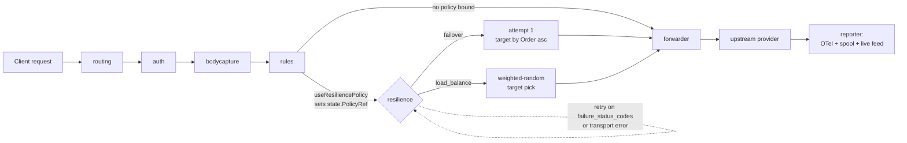
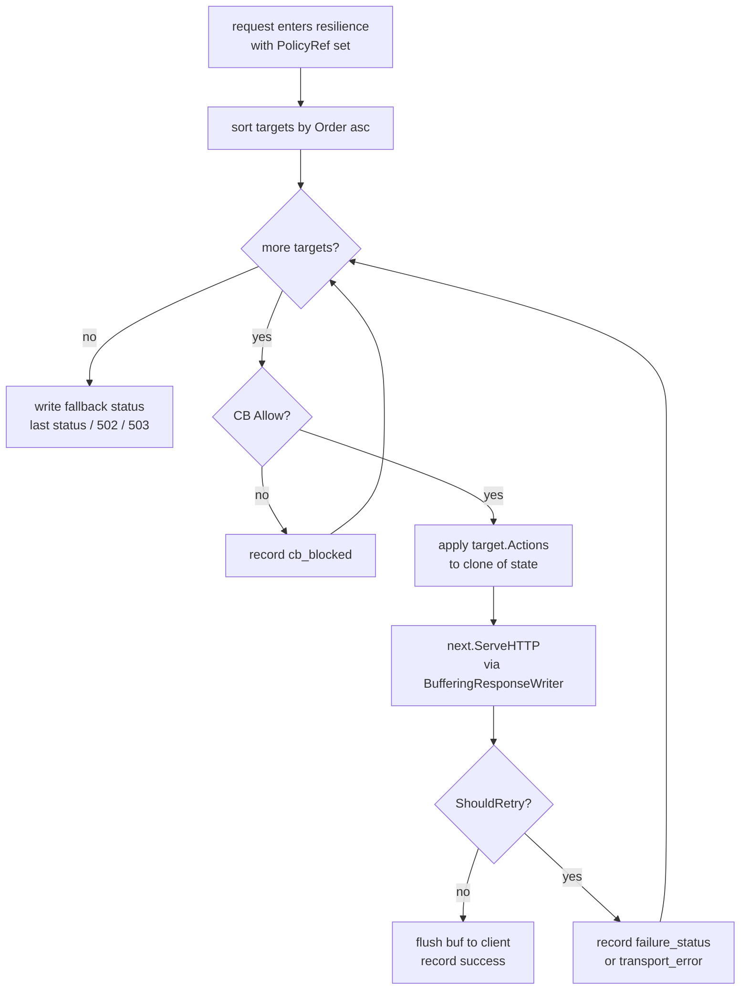
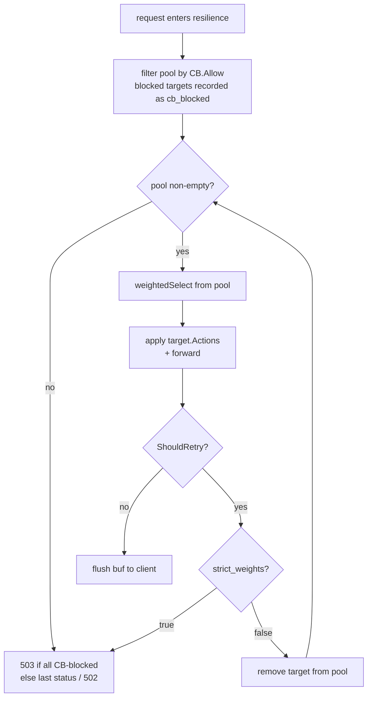
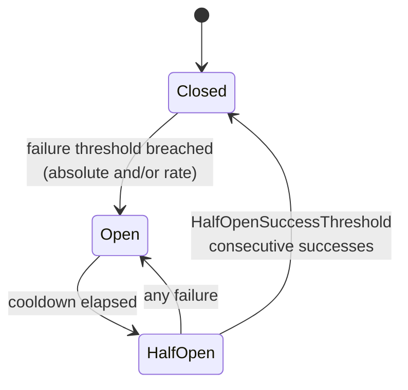

# Resilience Policies

Sluice's resilience engine turns a single inbound request into one or more upstream attempts according to a named policy: failover walk-down, weighted load-balance, optional circuit breaker. Policies live in `gateway.yaml` (or any merged YAML under `SLUICE_CONFIG_DIR`); rules opt requests in via the `useResiliencePolicy` action.

This page is the operator's reference. It covers the full YAML schema, every mode, how requests flow through the orchestrator, what observability fires, and worked examples taken straight from production wiring.

---

## Table of contents

1. [Mental model](#mental-model)
2. [Where it sits in the pipeline](#where-it-sits-in-the-pipeline)
3. [Quick start](#quick-start)
4. [YAML schema](#yaml-schema)
5. [Binding a request to a policy](#binding-a-request-to-a-policy)
6. [Modes](#modes)
7. [Per-target Actions](#per-target-actions)
8. [Failure status codes](#failure-status-codes)
9. [Circuit breaker](#circuit-breaker)
10. [Observability](#observability)
11. [Worked examples](#worked-examples)
12. [Forward-compat / legacy schema fields](#forward-compat--legacy-schema-fields)
13. [Known limitations](#known-limitations)
14. [Troubleshooting](#troubleshooting)

---

## Mental model

> **Rules decide WHICH logical destination. Resilience decides HOW to robustly hit it.**

The rules engine runs first. It can rewrite the request (`changeProvider`, `changeModelName`, `changeUrl`, `setHeader`, ...), short-circuit (`returnStatusCode`, `llmImpersonation`), or — and this is what unlocks resilience — bind the request to a named policy via `useResiliencePolicy`. After rules finish, the resilience middleware reads the binding and dispatches by mode.

A policy never re-routes by itself. It can only act on a request that a rule has already decided "yes, this one should be orchestrated against `qwen-load-balance`."

If no rule fires `useResiliencePolicy`, resilience is a passthrough — the request goes single-shot to whatever the rules resolved. That's the path most v1.1-style traffic still takes.

---

## Where it sits in the pipeline



For each attempt the orchestrator wraps the response writer in a `BufferingResponseWriter` so it can discard a failing attempt's bytes before the next one runs. The buffer flushes to the real `http.ResponseWriter` only on commit — the first non-retryable outcome.

---

## Quick start

### 30-second failover

```yaml
configurations:
  production:
    upstream_credentials:
      openai: sk-openai-mock
      anthropic: sk-ant-mock
    rule_names:
      - openai-with-anthropic-fallback

rules:
  - name: openai-with-anthropic-fallback
    condition:
      type: provider
      operator: Equals
      expectedProvider: openai
    actions:
      - type: useResiliencePolicy
        policyName: openai-failover

resilience_policies:
  - name: openai-failover
    mode: failover
    failure_status_codes: [502, 503, 504]
    targets:
      - name: openai-primary
        provider: openai
        order: 1
      - name: anthropic-backup
        provider: anthropic
        order: 2
        actions:
          - type: changeProvider
            newProvider: anthropic
          - type: changeModelName
            newModelName: claude-3-5-sonnet
```

The literal credential values shown here are what the YAML loader sees; substitute via your secret manager before mount (see [`configuration-model.md`](configuration-model.md#why-no-var-substitution)).

Every OpenAI-bound request now tries OpenAI first; on a 502/503/504 it falls over to Anthropic with a model rewrite. The client sees one response — either the OpenAI success or the Anthropic recovery.

### 30-second weighted load-balance

```yaml
resilience_policies:
  - name: qwen-load-balance
    mode: load_balance
    failure_status_codes: [502, 503, 504]
    targets:
      - name: qwen-spark-incluster
        provider: qwen-ollama
        weight: 70
      - name: qwen-standalone-69
        provider: qwen-ollama-standalone
        weight: 30
```

Roughly 70% of requests land on the in-cluster ollama; 30% on the standalone. On a retryable failure the orchestrator re-rolls from the remaining pool (LBWF — load-balance with failover). See [Modes](#modes) for the alternative `strict_weights` semantics used by canary mirroring.

---

## YAML schema

The full schema is in [`contracts/resilience/types.go`](../contracts/resilience/types.go). What follows is the operator-facing summary.

### Top-level

```yaml
resilience_policies:
  - name: <unique policy name>
    mode: failover | load_balance | load_balance_with_failover | none
    strict_weights: false                # default; only meaningful for load_balance modes
    failure_status_codes: [502, 503, 504] # policy-level default; targets can override
    response_header_timeout_seconds: 20   # optional; overrides the gateway-wide time-to-first-byte cap for this policy
    circuit_breaker:                      # optional; per-target can override
      enabled: true
      failure_threshold: 5
      failure_rate_threshold: 0.5
      sampling_duration_seconds: 60
      minimum_throughput: 10
      cooldown_seconds: 30
      half_open_success_threshold: 2
    targets:
      - name: <target name, unique within policy>
        provider: <provider name from providers.yaml>
        order: 1                          # failover ordering; ignored in load_balance modes
        weight: 50                        # load_balance share; ignored in failover
        failure_status_codes: [503]       # optional target-level override
        circuit_breaker: { ... }          # optional target-level override
        actions:                          # optional; polymorphic, any rules.Action
          - type: changeProvider
            newProvider: anthropic
```

### Policy fields

| Field | Required | Notes |
|---|---|---|
| `name` | yes | Unique across the whole `resilience_policies` library. Referenced by `useResiliencePolicy.policyName`. |
| `mode` | yes | See [Modes](#modes). |
| `strict_weights` | no | Default `false`. Only meaningful in `load_balance` modes — see [strict_weights](#strict_weights-canary-mirroring). |
| `failure_status_codes` | no | List of HTTP status codes that count as retryable for any target in this policy. Empty falls back to default `[500, 502, 503, 504]`. |
| `response_header_timeout_seconds` | no | Per-policy override of the gateway-wide time-to-first-byte cap (`SLUICE_UPSTREAM_RESPONSE_HEADER_TIMEOUT_SECONDS`, default 120s). When set (> 0) it replaces the default for every attempt under this policy; the orchestrator stamps it on the attempt and the forwarder keys a per-timeout transport off it. Deliberately **not** floored — failover/load-balance policies usually want a *shorter* budget so a slow target is abandoned fast and a healthy one is tried. Zero leaves the default in force. Bounds time-to-first-byte only; committed streaming bodies are not capped. |
| `circuit_breaker` | no | Policy-level breaker config; applied to every target unless the target overrides. Omit for no breaker. |
| `targets` | yes | At least one target. |

### Target fields

| Field | Required | Notes |
|---|---|---|
| `name` | yes | Unique within the policy. Surfaces on every metric and in the gateway.request event's `Attempts[].target`. |
| `provider` | yes | Must match a provider declared in `providers.yaml`. The orchestrator looks the endpoint up on this provider post-rule. |
| `order` | failover only | Lower is tried first. Stable on ties. Ignored in `load_balance` modes. |
| `weight` | load_balance only | Positive integer share. Ignored in `failover`. The validator rejects a load_balance policy with no positive weights. |
| `failure_status_codes` | no | Per-target override. Empty falls back to policy-level then default. |
| `circuit_breaker` | no | Per-target override. `nil` falls back to policy-level. |
| `actions` | no | Polymorphic list of `rules.Action`. Applied to a per-attempt clone of the post-rule state before the forwarder runs. See [Per-target Actions](#per-target-actions). |

### Circuit-breaker fields

| Field | Default | Notes |
|---|---|---|
| `enabled` | `false` | Off by default — set `true` to opt the (policy, target) pair in. |
| `failure_threshold` | 0 | Absolute count of failures inside the window required to trip. `0` means "rate-only". |
| `failure_rate_threshold` | 0 | Proportional failure rate (0.0–1.0) required to trip. `0` means "absolute-only". |
| `sampling_duration_seconds` | 60 | Sliding window. Older buckets roll off. |
| `minimum_throughput` | 0 | Samples in window below this never trip. Guards against cold-start flapping. |
| `cooldown_seconds` | 0 | How long Open stays Open before probing HalfOpen. `0` means "always Open once tripped" (don't do this). |
| `half_open_success_threshold` | 1 | Consecutive successes in HalfOpen needed to close. Any single failure reopens. |

If both `failure_threshold > 0` and `failure_rate_threshold > 0`, **both** must breach to trip. Combining them is how you avoid false positives at low traffic (`minimum_throughput`) while still tripping promptly on a real outage (`failure_threshold`).

---

## Binding a request to a policy

The bridge from "request matched a rule" to "orchestrator runs" is the **`useResiliencePolicy`** rule action:

```yaml
rules:
  - name: route-qwen-ollama
    condition:
      type: modelName
      operator: Equals
      expectedModelName: "qwen2.5-coder:7b"
    actions:
      - type: useResiliencePolicy
        policyName: qwen-load-balance
```

When the action fires it sets `state.PolicyRef` on the in-context `MutableState`. The resilience middleware reads `PolicyRef` after rules complete; if empty, resilience is a passthrough.

`useResiliencePolicy` is *non-terminating* — it does not stop rule evaluation. You can fire it alongside other actions in the same rule, but the usual idiom is one rule, one resilience binding.

If you accidentally point `policyName` at a non-existent policy, the orchestrator falls back to passthrough (single-shot) rather than failing the request. The validator catches unresolved references at config-load time; this only fires under a startup-after-rewrite race.

---

## Modes

### `failover`

Targets are sorted by `order` ascending. The orchestrator tries them in turn. The first non-retryable outcome (commit) writes the response to the client. On retryable failure, the orchestrator records the attempt and tries the next target.

A retryable outcome is one of:

1. Upstream HTTP status in the resolved `failure_status_codes` set.
2. Transport-level error (no headers received — connection refused, EOF mid-headers, timeout before status line).

If every target fails:

- If some attempt returned a non-zero status, the client sees the **last attempt's status**.
- If every attempt was a transport error (no status ever received), the client sees **`502 Bad Gateway`**.
- If every target was filtered by the circuit breaker before any attempt ran, the client sees **`503 Service Unavailable`** ("no healthy provider").



### `load_balance` / `load_balance_with_failover`

Both modes pick a target by weighted-random selection: each target contributes its `weight` to a cumulative-sum distribution; `rand(0, total)` picks the slot. Long-run distribution converges to the weight ratio without any shared counter — every pod balances independently.

The two mode names are aliases at the YAML level. The behaviour split is governed by `strict_weights`:

- **Default (`strict_weights: false`) — LBWF semantics.** On a retryable failure the orchestrator removes the failed target from the pool and re-rolls from what remains. The walk continues until a target commits or the pool is empty (same terminal handling as failover).

- **`strict_weights: true` — canary mirroring.** The first selection wins or fails. No re-roll. The client sees the first attempt's outcome verbatim. Used when you *want* the under-weighted target's failure rate to surface — e.g. a 95/5 canary where suppressing the 5% pool's errors would defeat the purpose.



### `none`

Single-target degenerate. The orchestrator applies the first target's `Actions` (if any) to the post-rule state and forwards once. No retry. Useful when you want to attach Actions to a request via a policy reference but don't need the orchestration machinery — for example, header injection that's easier to express as a target than as a standalone rule.

---

## Per-target Actions

A target's `actions` block is polymorphic — it accepts the same shapes the rules engine consumes. The orchestrator clones the post-rule `MutableState` once per attempt and applies the target's actions to the clone, so different attempts cannot stack their mutations.

Supported action types:

| Type | Effect |
|---|---|
| `changeProvider` | Sets `state.Provider`. Triggers post-rule endpoint re-resolution on the new provider (see invariant 7). |
| `changeModelName` | Rewrites the body's model field via the typed-body re-marshal path. |
| `changeUrl` | Overrides the upstream URL for this attempt. |
| `changeApiKey` | Substitutes the upstream credential. |
| `setHeader` | Adds, sets, or removes an outbound header. |
| `appendQueryString` | Appends a key-value pair to the upstream URL's query string. |
| `addTag` | Attaches a tag to the request (surfaces in `gateway.request.Tags` and `gateway.tags.applied.total`). |

Terminating actions (`returnStatusCode`, `llmImpersonation`) inside a target's `actions` block are not meaningful — they would short-circuit before the forwarder runs. The validator does not currently reject them, but the orchestrator's behaviour is undefined; don't put them there.

**Why this matters for failover:** the destination of attempt N is *not* fixed at policy-load time. The post-rule state is the baseline; each target's actions rewrite from that baseline. This is what lets the model-keyed redirect pattern work — `claude-*` on `/openai/v1/chat/completions` lands on anthropic's `chat_completions` endpoint with anthropic's credential and auth header, all because `changeProvider` triggered the destination builder to re-resolve the endpoint on the new provider.

---

## Failure status codes

Resolution order for "is this status retryable?":

1. Target's `failure_status_codes` (if set).
2. Policy's `failure_status_codes` (if set).
3. Default `[500, 502, 503, 504]`.

Empty at every level falls through to the default so an operator cannot accidentally produce a "no status ever retries" configuration without explicitly meaning to. If you really want that, set an empty-but-non-default sentinel via a comment in your YAML — `failure_status_codes: []` won't get you there because it's indistinguishable from "unset" at the loader.

Status codes outside the configured set always commit. A `4xx` from a provider is not retried by default — client errors don't get better on retry, and the second attempt would burn quota for nothing.

---

## Circuit breaker

The breaker is a per-(policy, target) state machine that protects a provider from a stampede when it's clearly unhealthy. State lives **per-pod**, in-memory; v1.3+ adds a Redis-backed implementation behind the same `BreakerStore` interface.



### Sliding-window mechanics

`sampling_duration_seconds` is sliced into 1-second buckets. The breaker counts successes + failures into the current bucket; on tick the cursor advances and the new bucket starts fresh. The window is the sum of all live buckets — there's no global rolling counter to drift.

When the cursor advances by more than `len(buckets)` seconds at once (a quiet gateway suddenly takes a request), every bucket is reset rather than walking the wrap-around — the breaker reads as if no traffic happened during the silence.

### Trip conditions

Both `failure_threshold` and `failure_rate_threshold` can be configured. The breaker trips when:

- `minimum_throughput` samples have accumulated in the window, AND
- `failure_threshold > 0 && failures >= failure_threshold`, OR
- `failure_rate_threshold > 0 && (failures/total) > failure_rate_threshold`,
- (or both, when both are set)

If neither threshold is set, the breaker never trips — useful for "metric-only" scenarios where you want the gauge but no behavioural effect.

### HalfOpen probe quota

When cooldown elapses the breaker moves to HalfOpen. The next `half_open_success_threshold` requests are allowed through as probes; a single failure during this window reopens immediately. Each consecutive success counts down; the last one closes the breaker, clears the window, and resumes normal operation.

`half_open_success_threshold` defaults to 1 — a single probe success closes. Bump it for providers that need a couple of green probes before you're confident they've recovered.

### CB and the load-balance pool

In load-balance modes, CB-blocked targets are filtered **out of the pool** before weighted selection runs. They never trigger `strict_weights`' no-re-roll path, and they never appear as an "attempted" entry — they record as `cb_blocked` in the per-attempt history but the weighted-random roll happens over the survivors.

If every target is blocked, the orchestrator returns **503 Service Unavailable** rather than 502 — "no healthy provider" is a more honest signal than "all upstreams transport-erred".

---

## Observability

Every layer of the orchestrator emits signal. Three independent channels:

### OTel metrics (Prometheus scrape + OTLP push)

| Metric | Type | Labels | Notes |
|---|---|---|---|
| `gateway.resilience.attempts.total` | counter | `policy, target, outcome` | One per `AttemptRecord`. Outcomes: `success`, `failure_status`, `transport_error`, `cb_blocked`. |
| `gateway.resilience.attempt.duration` | histogram | `policy, target` | Per-attempt wall-clock duration in seconds. `cb_blocked` does not record. |
| `gateway.resilience.attempts_per_request` | histogram | `policy` | Recorded once per request at end-of-run. Buckets: `1, 2, 3, 5, 10`. |
| `gateway.resilience.outcome.total` | counter | `policy, outcome` | Per-request orchestrator outcome: `success`, `all_failed`, `all_open`. |
| `gateway.cb.state` | observable gauge | `policy, target, pod, state_name` | Callback-driven from `BreakerStore.Snapshot()` — always reflects current state at scrape time. Values: `0=closed`, `1=open`, `2=half_open`. |
| `gateway.cb.transitions.total` | counter | `policy, target, to_state` | Bumped synchronously from the breaker's `StateListener` on every state change. |

Per-request meters (`gateway.requests.total`, `gateway.request.duration`) fire **once per inbound request**, not once per attempt. Per-attempt meters (`gateway.request.time_to_first_byte`, `gateway.upstream_errors.total`) stay attempt-shaped because those are attempt-shaped phenomena.

### Multi-attempt record shape

Each request emits one [`Record`](../contracts/connector/record.go) per matched connector binding (see [connector-bindings.md](connector-bindings.md)). For requests bound to a resilience policy, the record carries:

```jsonc
{
  "correlation_id": "...",
  "provider": "openai",
  "endpoint": "chat_completions",
  "model": "qwen2.5-coder:7b",
  "upstream_status": 200,
  "policy_ref": "qwen-load-balance",
  "attempts": [
    {
      "target": "qwen-spark-incluster",
      "started_at_ns": 1747921632000000000,
      "duration_ms": 480,
      "status_code": 503,
      "outcome": "failure_status"
    },
    {
      "target": "qwen-standalone-69",
      "started_at_ns": 1747921632480000000,
      "duration_ms": 760,
      "status_code": 200,
      "outcome": "success"
    }
  ]
}
```

`PolicyRef` and `Attempts` are omitted for single-shot requests, so the wire shape for non-resilience traffic remains stable.

### Admin console

- **`/policies`** (read-only): one card per resilience policy, with the per-target weight/order table and a live circuit-breaker state badge per (policy, target).
- **Live messages modal**: when an entry's `Attempts.length > 1`, a per-attempt breakdown table renders below the rule-match section. One row per attempt: target name, status code, duration, outcome chip.
- **Dashboard** (planned): CB transitions tile, surfacing `gateway.cb.transitions.total` over the selected window.

The admin endpoint behind `/policies` is `GET /admin/api/v1/policies` — same auth shape as the rest of the console. The wire DTO lives in [`contracts/admin/policies.go`](../contracts/admin/policies.go).

---

## Worked examples

### Cross-provider failover

Goal: OpenAI primary, Anthropic backup with a model rewrite.

```yaml
configurations:
  production:
    upstream_credentials:
      openai: sk-openai-mock
      anthropic: sk-ant-mock
    rule_names:
      - openai-with-anthropic-fallback

rules:
  - name: openai-with-anthropic-fallback
    condition:
      type: provider
      operator: Equals
      expectedProvider: openai
    actions:
      - type: useResiliencePolicy
        policyName: openai-failover

resilience_policies:
  - name: openai-failover
    mode: failover
    failure_status_codes: [502, 503, 504]
    targets:
      - name: openai-primary
        provider: openai
        order: 1
      - name: anthropic-backup
        provider: anthropic
        order: 2
        actions:
          - type: changeProvider
            newProvider: anthropic
          - type: changeModelName
            newModelName: claude-3-5-sonnet
```

Why this works: the backup target's `changeProvider` flips `state.Provider` post-target, which triggers the destination builder to look up the endpoint map on `anthropic`. The credential and auth-header convention follow automatically — see invariant 6 in `CLAUDE.md`.

### Weighted load-balance — qwen testbed

Goal: split qwen2.5-coder:7b traffic across an in-cluster ollama on the spark node and a standalone host at `192.168.69.21`.

```yaml
rules:
  - name: route-qwen-ollama
    condition:
      type: modelName
      operator: Equals
      expectedModelName: "qwen2.5-coder:7b"
    actions:
      - type: useResiliencePolicy
        policyName: qwen-load-balance

resilience_policies:
  - name: qwen-load-balance
    mode: load_balance
    failure_status_codes: [502, 503, 504]
    targets:
      - name: qwen-spark-incluster
        provider: qwen-ollama
        weight: 50
      - name: qwen-standalone-69
        provider: qwen-ollama-standalone
        weight: 50
```

Each request picks one target at 50/50. On a 502/503/504 the orchestrator removes the failed target and re-rolls from the remaining pool — single-pool failover absorbed in the same policy.

### Canary mirroring with `strict_weights`

Goal: 95% of traffic on the established provider, 5% on a new build whose failure rate must surface to the client.

```yaml
resilience_policies:
  - name: model-canary
    mode: load_balance
    strict_weights: true
    failure_status_codes: [502, 503, 504]
    targets:
      - name: stable
        provider: openai-stable
        weight: 95
      - name: canary
        provider: openai-canary
        weight: 5
```

`strict_weights: true` disables LBWF re-roll. If the canary is picked and it returns 503, the client sees the 503. That's the point — without it you'd silently absorb canary failures into the stable provider's apparent reliability.

### Tripping the breaker

Goal: if a provider produces 5 failures in 60 seconds with at least 10 samples observed, take it out of rotation for 30 seconds.

```yaml
resilience_policies:
  - name: protected-pool
    mode: load_balance
    failure_status_codes: [502, 503, 504]
    circuit_breaker:
      enabled: true
      failure_threshold: 5
      sampling_duration_seconds: 60
      minimum_throughput: 10
      cooldown_seconds: 30
      half_open_success_threshold: 2
    targets:
      - name: a
        provider: provider-a
        weight: 50
      - name: b
        provider: provider-b
        weight: 50
```

The per-(policy, target) CB applies to both targets independently. If `provider-a` trips, the pool shrinks to just `b` until cooldown elapses; if `b` is also blocked, every request gets a 503 with `outcome=all_open`. After 30s the breaker probes HalfOpen — the next 2 consecutive successes close it; any failure reopens.

---

## Forward-compat / legacy schema fields

`contracts/resilience/types.go` carries a handful of fields the YAML loader will happily accept but the v1.2 orchestrator does not yet act on. They are parsed for forward compatibility — so YAML authored against a future control-plane build round-trips through this gateway without rejection — and to preserve the v1.0 schema shape that landed before per-target `Actions` did. Treat them as inert today; do not assume they take effect until a release note says otherwise.

### `ResilienceConfig.TimeoutSeconds`

Top-level policy-wide timeout, parsed from `timeout_seconds`. Intended as a per-attempt **whole-attempt wall-clock** cap (distinct from `response_header_timeout_seconds`, which caps time-to-first-byte and *is* now honoured — see [Policy fields](#policy-fields)). The orchestrator does not currently honour `timeout_seconds`; the field is preserved on the wire so a future context-deadline path can read it without a schema migration.

### `ResilienceTarget.TimeoutSeconds`

Per-target override of the policy-wide `TimeoutSeconds`, parsed from `timeout_seconds` on the target. Same forward-compat story — parsed and validated, not enforced.

### `ResilienceTarget.ModelRewrite`

Legacy scalar form of "rewrite the body's model field when this target is selected", parsed from `model_rewrite`. Predates the polymorphic `Actions` block — operators authoring new policies should use `actions: [- type: changeModelName, newModelName: ...]` instead. The scalar remains on the contract so v1.0-era YAML keeps loading; when both `ModelRewrite` and a `changeModelName` action are present on the same target, `Actions` wins for the model field.

### `RetryConfig` (`retry:` block)

Parsed but inert in v1.2. Lives on `ResilienceConfig.Retry` and configures retry-with-backoff inside a single target rather than failover across targets. The v1.2 orchestrator's retry path is the failover walk — one attempt per target, no in-target retry. `RetryConfig` will activate once the resilience engine grows per-target retry budgets (post-v1.3).

| Field | YAML | Default | Notes |
|---|---|---|---|
| `Enabled` | `enabled` | `false` | Master switch. The orchestrator currently treats this as always-false regardless of the YAML value. |
| `MaxAttempts` | `max_attempts` | 0 | Total attempt budget including the initial call. Must be `> 0` when `Enabled` is true; validator enforces this even though the engine doesn't yet consume it. |
| `BackoffType` | `backoff_type` | _(empty)_ | Inter-attempt delay curve. One of `constant`, `linear`, `exponential` (the `BackoffX` constants in `contracts/resilience/types.go`). |
| `DelayMilliseconds` | `delay_ms` | 0 | Base delay between attempts. `BackoffType` scales subsequent delays. |
| `MaxDelayMs` | `max_delay_ms` | 0 | Caps the per-attempt delay so exponential backoff cannot stretch beyond a bound. Zero means uncapped. |
| `UseJitter` | `use_jitter` | `false` | Adds random jitter to each delay so synchronised clients don't retry in lockstep ("thundering herd"). |

If you've authored YAML with any of the above set today, the gateway will load it, the validator will pass it, and the runtime will quietly ignore it. Don't rely on the behaviour they describe until the corresponding milestone ships.

---

## Known limitations

These are documented intentionally — don't fix them without checking the milestone first.

1. **Body-mutating per-target actions across multiple attempts may leak state.** The typed body is shared between attempts; if attempt 1's `changeModelName` mutates it, attempt 2 sees the mutation. Restoration via re-parse from `Captured.Raw` is deferred.

2. **`response_header_timeout_seconds` is honoured at the policy level only.** When a policy sets it, every attempt under that policy uses it as the time-to-first-byte cap (the forwarder keys a per-timeout transport off the attempt context). What's still deferred: a **per-target** header-timeout override, and the whole-attempt wall-clock `timeout_seconds` (a context-deadline path) — both scheduled for v1.3+.

3. **"200 then die mid-stream" is invisible to the CB.** The breaker records an attempt as success at status-line commit. A stream that dies after headers will not trip the breaker.

4. **CB state is per-pod and lost on restart.** Multi-pod deployments see independent breakers. The Redis-backed `BreakerStore` swap behind the existing interface is a v1.3+ task; the gauge already labels by `pod` so dashboards can disambiguate.

5. **Terminating actions inside `targets[*].actions` have undefined behaviour.** The validator does not reject `returnStatusCode` or `llmImpersonation` in a target's action list. Don't put them there.

---

## Troubleshooting

**"My policy never fires."**
Check the rules engine actually bound it. The admin console's live-messages modal shows `policy_ref` per request when set. If `policy_ref` is empty, your rule's `useResiliencePolicy` never ran — verify the rule's condition matches the traffic.

**"My target shows `circuit_state: unknown` on the policies page."**
The breaker has not observed any traffic on that (policy, target) pair yet. The gauge omits never-touched pairs. Send a request through the policy and refresh.

**"All my attempts come back 5xx and the client sees the upstream's body, not my fallback."**
The orchestrator writes its 502/503 fallback **only** when every attempt was either a transport error (no headers) or all targets were CB-blocked. When some attempt got headers + a status that was in your retry set, the **last** attempt's status is what the client sees. If you want a custom fallback shape, add a terminating rule with `returnStatusCode` outside the policy.

**"My `gateway.requests.total` counter doubled."**
Check whether you've inadvertently created two events. Multi-attempt requests should emit exactly one `gateway.request` event (and one `gateway_requests_total` increment). If you're seeing two, suspect a misconfigured upstream proxy retrying — the gateway's own retry is internal and never produces a second event.

**"My weighted distribution doesn't match the weights over a short window."**
That's expected. Weighted-random selection converges in the long run; over 100 requests at 70/30 you'll see something like 68/32 or 73/27. Trust the `gateway.resilience.attempts.total` counter for the empirical ratio.

**"How do I disable resilience for a specific request?"**
Don't bind it. The presence of `useResiliencePolicy` is the trigger; requests that don't fire that action go single-shot.
