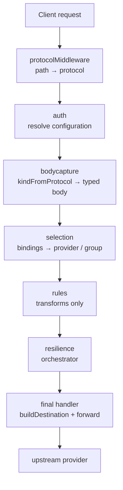
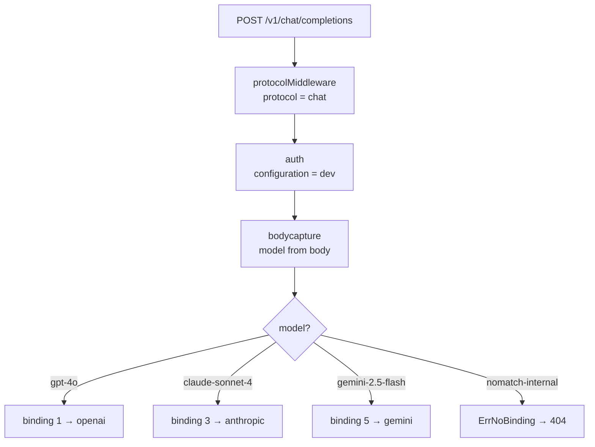
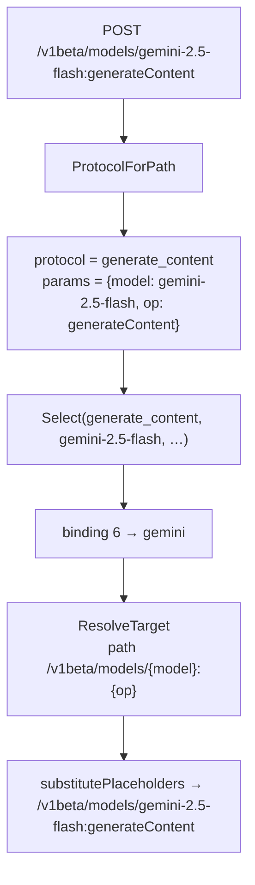
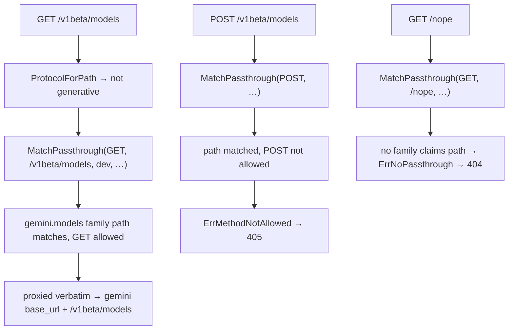

# Routing

Under the v2 config model, Sluice does not have a path-to-endpoint route table. Routing is **config data**: the inbound path maps to a *protocol* (the wire shape), and the resolved configuration's *bindings* map `(protocol, model)` to a provider or a resilience group. There is no `RouteIndex`, no `accepted_paths`, no `prefix_required`/`prefix_optional`, and no `emitRoutes` — all of that was retired when routing moved into the configuration.

Two surfaces do the work:

- **Generative protocols** (`chat`, `responses`, `messages`, `generate_content`, `embeddings`) — model-keyed. The path fixes the protocol; the model comes from the request body (or, for Gemini, from the path). `selection.Select` walks the configuration's bindings and returns a resolved destination.
- **Passthrough families** (opaque/stateful surfaces like model catalogues and message batches) — path-pattern matched, not model-keyed. `selection.MatchPassthrough` claims the path and proxies the request verbatim.

This page is the operator's reference: how a request is mapped to a protocol, how bindings select a destination, how passthrough families are matched, and the real error set. The engine lives in [`internal/selection`](../internal/selection); the middleware wiring lives in [`cmd/gateway/pipeline.go`](../cmd/gateway/pipeline.go) and [`cmd/gateway/handler.go`](../cmd/gateway/handler.go).

---

## Table of contents

1. [What routing does in v2](#what-routing-does-in-v2)
2. [Where it sits in the pipeline](#where-it-sits-in-the-pipeline)
3. [Path → protocol (`ProtocolForPath`)](#path--protocol-protocolforpath)
4. [Generative selection (`Select` / `ResolveTarget`)](#generative-selection-select--resolvetarget)
5. [Binding model matching](#binding-model-matching)
6. [Passthrough selection (`MatchPassthrough`)](#passthrough-selection-matchpassthrough)
7. [`kindFromProtocol` — protocol drives body capture](#kindfromprotocol--protocol-drives-body-capture)
8. [X-Sluice headers](#x-sluice-headers)
9. [Worked examples](#worked-examples)
10. [The error set](#the-error-set)

---

## What routing does in v2

Routing answers two questions, in two stages:

1. **What wire shape is this?** [`selection.ProtocolForPath`](../internal/selection/protocol.go) maps the inbound URL path to one of the five generative protocol names, or reports "not a generative path" — in which case the request is a candidate for per-configuration passthrough matching. This mapping is **hardcoded**: there is exactly one canonical base path per wire shape (plus a no-version-segment alias for the OpenAI-style ones). No YAML configures it.

2. **Where does it go?** Once auth has resolved the owning configuration and bodycapture has decoded the model, [`selectionMiddleware`](../cmd/gateway/pipeline.go) resolves the destination. For generative requests, [`selection.Select`](../internal/selection/selection.go) walks the configuration's `bindings` and returns the first binding whose `(protocol, model)` matches — a single provider target or a resilience group. For non-generative paths, [`selection.MatchPassthrough`](../internal/selection/selection.go) walks the configuration's `passthrough_bindings` and matches the path against each exposed family's patterns.

The provider is therefore chosen **after** auth and bodycapture, not from the path. The same path (`/v1/chat/completions`) routes to OpenAI, Anthropic, or Gemini depending purely on the requested model and the bindings of the resolved configuration. The engine is a pure function of the v2 config; it does no I/O.

---

## Where it sits in the pipeline

The data-plane chain is composed in [`cmd/gateway/handler.go::buildDataPlaneHandler`](../cmd/gateway/handler.go) (read top-to-bottom in execution order; the function wraps in reverse):



The real order is **`protocol → auth → bodycapture → selection → rules → resilience → final`**. A few facts that the v1 doc got wrong and are load-bearing here:

- **`protocolMiddleware` is first, and it always succeeds.** It only maps the path to a protocol and stashes a `protocolInfo` on the context; an unrecognised path is marked non-generative (`generative: false`) and falls through to passthrough matching downstream. There is no 404/405 at this stage — the protocol choice is never a routing failure.
- **Bodycapture's typed kind comes from the protocol, not from routing.** [`kindFromProtocol`](../cmd/gateway/pipeline.go) maps the stashed protocol to a `bodycapture.RequestKind`. There is no `request_kind` field in the v2 YAML.
- **`selection` is where 404/405 can fire**, and it runs *after* auth (which resolves the configuration) and bodycapture (which decodes the model). It is the only stage that picks a provider.
- **The final handler builds the upstream URL** from the resolved `Target.Path` (provider protocol path ∪ per-target override), not from any endpoint declaration or matched path. See [`buildDestination`](../cmd/gateway/destination.go).

`correlationMiddleware` ([`cmd/gateway/correlation.go`](../cmd/gateway/correlation.go)) wraps the whole chain ahead of `protocolMiddleware`, so every stage shares one correlation ID — see [X-Sluice headers](#x-sluice-headers).

---

## Path → protocol (`ProtocolForPath`)

[`selection.ProtocolForPath`](../internal/selection/protocol.go) is the entire path-mapping surface. It is a `switch` over known literal paths plus one parser for Gemini's path-encoded operation:

| Inbound path | Protocol | Path-derived params |
|---|---|---|
| `/v1/chat/completions`, `/chat/completions` | `chat` | none |
| `/v1/responses`, `/responses` | `responses` | none |
| `/v1/messages`, `/messages` | `messages` | none |
| `/v1/embeddings`, `/embeddings` | `embeddings` | none |
| `/v1beta/models/{model}:{op}` | `generate_content` | `{"model": <model>, "op": <op>}` |
| anything else | — (`ok == false`, non-generative) | — |

The function returns `(protocol, params, ok)`. When `ok` is false the path is not a recognised generative endpoint and the request becomes a passthrough candidate (the v2 fall-through, not a 404).

**Gemini is the only protocol whose model is path-derived.** `generate_content` paths are parsed by `parseGenerateContent`: the prefix is the literal `/v1beta/models/`, the segment after it is `{model}:{op}`, the model must be a single non-slash path segment, and the operation must be one of the recognised ops:

| `op` | Meaning |
|---|---|
| `generateContent` | Non-streaming generation |
| `streamGenerateContent` | Streaming generation |

So `/v1beta/models/gemini-2.5-flash:generateContent` yields `protocol = generate_content`, `params = {"model": "gemini-2.5-flash", "op": "generateContent"}`. Anything else under `/v1beta/models/...` (an unknown op, a slash inside the model segment, an empty model) returns `ok == false` and falls through to passthrough — which is exactly how the Gemini `models` catalogue (`GET /v1beta/models`) is served as a passthrough family rather than a generative protocol.

For every protocol except `generate_content`, the model that drives binding selection comes from the **request body**, read by bodycapture via [`bodycapture.Model`](../internal/middleware/bodycapture). Gemini's path-derived model wins when present (`pi.params["model"]`), otherwise selection reads the body — see [`selectionMiddleware`](../cmd/gateway/pipeline.go).

---

## Generative selection (`Select` / `ResolveTarget`)

For a generative request, [`selectionMiddleware`](../cmd/gateway/pipeline.go) calls:

```go
dest, err := selection.Select(protocol, model, cfg, providers, groups)
```

[`selection.Select`](../internal/selection/selection.go) walks `cfg.Bindings` **in declaration order** and returns the first binding where:

1. `binding.Protocol == protocol`, **and**
2. the model matches the binding's `Models` patterns (see [Binding model matching](#binding-model-matching)).

The matched binding resolves to a `Destination` carrying exactly one of:

- **`Single *Target`** — when the binding names a `provider`. The single provider plus the binding's `alias`/`query`/`path` sugar is composed into a fully resolved `Target`.
- **`Group *Group`** — when the binding names a `group`. The group's resilience config (mode, failure-status set, circuit breaker, weights, header timeout) plus every target resolved against its provider. The resilience orchestrator expands the group across its targets downstream.

A binding sets **exactly one** of `provider` or `group`; config validation rejects bindings that set both or neither. The matched binding's `Tags` are applied to the request for telemetry. **No binding match → `ErrNoBinding` → HTTP 404** (code `no_binding`). There is no fall-through to a default provider — a model not served on a protocol by this configuration is simply not served.

### `resolveTarget` — composing provider + override

Each target is composed by `resolveTarget` (the unexported worker behind both `Select` and the exported [`ResolveTarget`](../internal/selection/selection.go)):

| `Target` field | Source |
|---|---|
| `BaseURL` | `provider.base_url` |
| `Path` | the protocol's `path`, overridden by the target's `path` if set |
| `Auth` | the protocol's `auth` (nil = provider-native default, resolved at the single mint site) |
| `RequiredHeaders` | `provider.required_headers` |
| `Query` | `provider.query` ∪ target `query` (target wins) |
| `Credential` | `cfg.credentials[provider]` — the configuration holds the key, not the provider |
| `Alias` | the binding's / target's model-rewrite alias (empty = no rewrite) |
| `Weight` | the target's load-balance weight |

`resolveTarget` errors (unknown provider, provider does not serve the protocol, configuration holds no credential entry for the provider) are validation-class faults — config validation rejects them before runtime, and they surface as HTTP 500 if they ever reach the request path.

**`ResolveTarget` is re-called per attempt during group orchestration.** The orchestrator picks a provider; the final handler re-resolves that provider's transport for the request's protocol via `selection.ResolveTarget(state.Protocol, provider, "", cfg, providers)` — see [`buildFinalHandler`](../cmd/gateway/handler.go). `state.Protocol` equals the inbound protocol unless a `translate` rule retargeted the dialect, in which case resolution lands on the target protocol's endpoint. This is the v2 equivalent of "re-resolve the endpoint on the new provider": the transport (path, auth, headers, credential) is always re-derived from the chosen provider, never carried over from the binding's first target.

---

## Binding model matching

A binding's `Models` is a list of patterns. The matcher is [`matchesModelPatterns`](../internal/selection/selection.go), which mirrors `cmd/gateway/binding.go`:

- **Empty `Models` → matches every model** for that protocol — the protocol catch-all. This is default-permissive and opt-in (invariant #1): an empty model set is *not* a default-deny.
- **Trailing `*` → prefix match.** `gpt-*` matches `gpt-4o`, `gpt-4.1-mini`, `gpt-oss-120b`.
- **No `*` → exact equality.** `qwen2.5-coder:7b` matches only that string.

A binding matches if **any** pattern matches. Because bindings are evaluated in order and first-match-wins, place more specific bindings before catch-alls. Example from `config-dev/policy.yaml`'s `dev` configuration:

```yaml
configurations:
  dev:
    credentials:
      openai: sk-dev-mock
      anthropic: sk-ant-dev-mock
      gemini: dev-mock
    bindings:
      - { protocol: chat,             models: ["gpt-*", "o1*", "o3*"], provider: openai }
      - { protocol: responses,        models: ["gpt-*"],               provider: openai }
      - { protocol: chat,             models: ["claude-*"],            provider: anthropic }
      - { protocol: messages,         models: ["claude-*"],            provider: anthropic }
      - { protocol: chat,             models: ["gemini-*"],            provider: gemini }
      - { protocol: generate_content, models: ["gemini-*"],           provider: gemini }
```

Here `POST /v1/chat/completions` with `"model": "claude-sonnet-4"` matches the third binding and routes to `anthropic`; the same path with `"model": "gemini-2.5-flash"` matches the fifth and routes to `gemini`. The path is identical — the model and the binding order decide the destination.

---

## Passthrough selection (`MatchPassthrough`)

Opaque/stateful surfaces — model catalogues, Anthropic message batches, file APIs — are not model-keyed and have no typed wire model. They are exposed as **passthrough families** on the provider and bound on the configuration via `passthrough_bindings`. The request is proxied verbatim (path forwarded as-is under the provider base URL, inbound query preserved with provider defaults overlaid); no typed parsing, no GenAI telemetry, no payload capture.

When `ProtocolForPath` returns `ok == false`, [`selectionMiddleware`](../cmd/gateway/pipeline.go) calls:

```go
pm, err := selection.MatchPassthrough(method, path, cfg, providers)
```

[`MatchPassthrough`](../internal/selection/selection.go) walks `cfg.PassthroughBindings`, resolves each to its provider's named `PassthroughFamily`, and for each family path:

1. Matches the inbound path against the pattern (`matchPath`).
2. If the path matches, checks the method against that path's `methods` set (`hasMethod`, case-insensitive).

Outcomes:

| Condition | Result | HTTP |
|---|---|---|
| A family path matches, and the method is allowed | `PassthroughMatch` (provider, family, auth, captured params, tags) | proxied |
| A family path matches, but **no** matching path allows the method | `ErrMethodNotAllowed` | 405 (`method_not_allowed`) |
| No family path matches the inbound path | `ErrNoPassthrough` | 404 (`no_route`) |

The 405-vs-404 distinction is **family-conditional**: a method check only happens for passthrough paths that matched. Generative requests never get a 405 — a model not served on its protocol is a 404 (`ErrNoBinding`), regardless of method.

### Path patterns and captured params

Passthrough path patterns may contain `{name}` placeholders. [`matchPath`](../internal/selection/selection.go) compiles a pattern with placeholders to an anchored regex on demand (each placeholder captures a single non-slash segment, `[^/]+`); a pattern with no `{` is an exact string compare. The captured params are returned on the `PassthroughMatch` and substituted into the upstream path. This regex machinery exists **only** for passthrough families — generative routing never compiles a regex.

Example — Anthropic's message-batches family from `config-dev/providers.yaml`:

```yaml
providers:
  anthropic:
    base_url: http://mockllm:5555
    required_headers:
      anthropic-version: "2023-06-01"
    passthrough:
      messages_batches:
        auth:
          header: x-api-key
          format: "{key}"
        paths:
          - match: /v1/messages/batches
            methods: [POST, GET]
          - match: "/v1/messages/batches/{id}"
            methods: [GET, DELETE]
          - match: "/v1/messages/batches/{id}/results"
            methods: [GET]
```

Bound on a configuration:

```yaml
configurations:
  dev:
    passthrough_bindings:
      - { family: messages_batches, provider: anthropic }
      - { family: models, provider: openai }
      - { family: models, provider: gemini }
```

`GET /v1/messages/batches/batch_abc/results` matches the third path with `params = {"id": "batch_abc"}`; `POST` to the same path matches no path that allows `POST` on `/v1/messages/batches/{id}/results`, so it returns 405.

---

## `kindFromProtocol` — protocol drives body capture

Bodycapture needs to know which typed model to deserialise the body into. In v2 that decision is **derived from the protocol**, not from a config field. [`kindFromProtocol`](../cmd/gateway/pipeline.go) reads the stashed protocol and returns a `bodycapture.RequestKind`:

| Protocol | `bodycapture.RequestKind` | Concrete body type |
|---|---|---|
| `chat` | `KindChat` | OpenAI chat-completions request |
| `responses` | `KindResponses` | OpenAI Responses request |
| `messages` | `KindMessages` | Anthropic Messages request |
| `generate_content` | `KindGenerateContent` | Gemini generateContent request |
| `embeddings` | `KindPassthrough` | none — buffered raw (no typed model in the providers package) |
| non-generative (passthrough candidate) | `KindPassthrough` | none — buffered raw |

`KindPassthrough` still buffers the raw body (so the forwarder has bytes to resend) but skips the typed deserialise. `embeddings` routes only via catch-all bindings because it has no typed request model. The kind constants live in [`internal/middleware/bodycapture/bodycapture.go`](../internal/middleware/bodycapture/bodycapture.go); the protocol→kind switch is the only place they are selected at request time.

---

## X-Sluice headers

Sluice owns a small set of `X-Sluice-*` HTTP headers. Two are observability hooks set by `correlationMiddleware`; one selects the passthrough-mode configuration in auth.

### `X-Sluice-Correlation-Id`

Per-request correlation token, joined across captured records, logs, and the admin console. Handled in [`cmd/gateway/correlation.go`](../cmd/gateway/correlation.go) (`headerCorrelationID = "X-Sluice-Correlation-Id"`), which runs ahead of every data-plane stage so they all share one value.

| Direction | Behaviour |
|---|---|
| Inbound present | Adopted verbatim as the request's correlation ID. |
| Inbound absent | A fresh ID is minted via [`observability.NewCorrelationID`](../internal/observability/correlation.go). |
| Outbound | **Always set** on the response, regardless of inbound state. |

### `X-Sluice-Session-Id`

Optional session/bundle marker. [`observability.SluiceSessionHeader`](../internal/observability/session.go) (`"X-Sluice-Session-Id"`) is the authoritative session header; a [`SessionResolver`](../internal/observability/session.go) also honours configured client-specific aliases. The resolved session ID is promoted to context (onto records, spans, and the live feed) but **never** becomes an OTel metric label — it has unbounded cardinality.

| Direction | Behaviour |
|---|---|
| Inbound | Resolved from the Sluice header (or a configured alias) and recorded on the request. |
| Outbound | When a session ID was resolved, echoed back under `X-Sluice-Session-Id`. Absent inbound means absent outbound. |

### `X-Sluice-Identity` / `X-Sluice-Configuration`

Passthrough-mode configuration selector: the client brings its own upstream credential and names the Sluice configuration to apply on top of it. [`auth.HeaderIdentity`](../internal/middleware/auth/resolver.go) (`"X-Sluice-Identity"`) is the current header; [`auth.HeaderConfiguration`](../internal/middleware/auth/resolver.go) (`"X-Sluice-Configuration"`) is the **deprecated** legacy spelling, still accepted. When both are present, `X-Sluice-Identity` wins and the legacy header is flagged.

| Direction | Behaviour |
|---|---|
| Inbound | When set, the resolver enters passthrough mode unconditionally — passthrough wins even if a managed-mode bearer is also present. The value names a configuration; an unknown name fails the request. |
| Forwarded upstream | **Stripped.** Auth adds the identity/configuration header to the destination builder's `DropHeaders` set so the upstream provider never sees the Sluice-internal selector. |

The full resolution algorithm (managed vs passthrough, credential discovery order, drop-header set) is in [docs/auth.md](auth.md).

---

## Worked examples

### One path, three providers — model-keyed selection

The `dev` configuration above binds `chat` for `gpt-*`, `claude-*`, and `gemini-*` to three different providers. Every request hits the *same* inbound path:



The protocol is fixed by the path; the provider is decided entirely by the model and the configuration's binding order. A model that no binding matches (`nomatch-internal`) is a 404 `no_binding`, not a fall-through to a default.

### Gemini — model rides in the path



Here the model comes from the path (`pi.params['model']`), not the body. The provider's protocol `path` is the template `"/v1beta/models/{model}:{op}"`; [`substitutePlaceholders`](../cmd/gateway/handler.go) fills `{model}` and `{op}` from the captured params when [`buildDestination`](../cmd/gateway/destination.go) mints the upstream URL.

### Passthrough — the model catalogue

`GET /v1beta/models` is **not** a generative path (`ProtocolForPath` returns `ok == false`), so it falls through to passthrough matching. The `dev` configuration binds the `models` family on both `openai` and `gemini`; the Gemini family claims `/v1beta/models` for `GET`:



### OpenAI-compat surface — same protocol, different upstream path & auth

Anthropic and Gemini both expose an OpenAI-compatible `chat` surface alongside their native protocols. They are distinct entries in the provider's `protocols` map, each with its own `path` and `auth`:

```yaml
providers:
  anthropic:
    protocols:
      messages:                       # native
        path: /v1/messages
        auth: { header: x-api-key, format: "{key}" }
      chat:                           # OpenAI-compat surface
        path: /v1/chat/completions
        auth: { header: Authorization, format: "Bearer {key}" }
  gemini:
    protocols:
      generate_content:               # native
        path: "/v1beta/models/{model}:{op}"
        auth: { header: x-goog-api-key, format: "{key}" }
      chat:                           # OpenAI-compat surface
        path: /v1beta/openai/chat/completions
        auth: { header: Authorization, format: "Bearer {key}" }
```

A `chat` request for `claude-*` resolves the `anthropic` provider's `chat` protocol: upstream path `/v1/chat/completions`, credential header `Authorization: Bearer <key>` — *not* the native `x-api-key`. The per-protocol `auth` override is the single mint point ([invariant #6](../CLAUDE.md)); [`credentialHeaderFor`](../cmd/gateway/destination.go) reads `Target.Auth` and falls back to the provider-native default ([`auth.UpstreamCredentialHeader`](../internal/middleware/auth/resolver.go)) only when no override is set. See [docs/providers.md](providers.md) for the full credential table.

---

## The error set

Selection surfaces three sentinel errors, mapped to HTTP status + a typed JSON body via [`internal/httperr`](../internal/httperr). They are logged as client errors, not gateway faults.

| Error | Fires when | HTTP / code | Operator fix |
|---|---|---|---|
| [`selection.ErrNoBinding`](../internal/selection/selection.go) | No generative binding matches `(protocol, model)` in the resolved configuration | 404 `no_binding` | Add a binding for the protocol + model, or check the model patterns. The model is simply not served on that protocol — there is no default fall-through. |
| [`selection.ErrNoPassthrough`](../internal/selection/selection.go) | The path is non-generative and no exposed passthrough family claims it | 404 `no_route` | Expose the family via a `passthrough_binding`, or add the path pattern to the provider's family. |
| [`selection.ErrMethodNotAllowed`](../internal/selection/selection.go) | A passthrough family claims the path but not the method | 405 `method_not_allowed` | Add the method to the family path's `methods` list, or fix the client verb. |

Resolution-class errors from `resolveTarget`/`MatchPassthrough` (unknown provider, provider does not serve the protocol, missing credential entry, unknown group/family reference) are programming/validation faults that config validation rejects before runtime; if one reaches the request path it surfaces as HTTP 500. These are not part of the normal client-facing error set.

> **Note on config-load errors.** `internal/config/errors.go` still defines some v1-era names (`ErrPathCollision`, `ErrPrefixRequiredEmpty`). These belong to the legacy v1 model and are **not** part of v2 routing — v2 has no path-based route table to collide and no provider prefixes. v2 config validation instead checks binding/provider/group references, protocol coverage, and credential presence. See [docs/configuration-model.md](configuration-model.md) for the validation surface.

See [docs/pipeline.md](pipeline.md) for the full middleware chain, [docs/providers.md](providers.md) for per-provider protocol/auth shapes, and [docs/configuration-model.md](configuration-model.md) for the complete v2 YAML schema.
