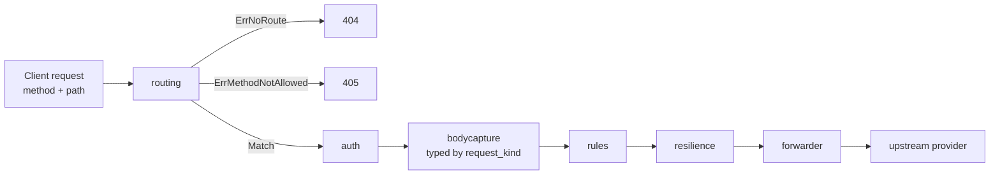
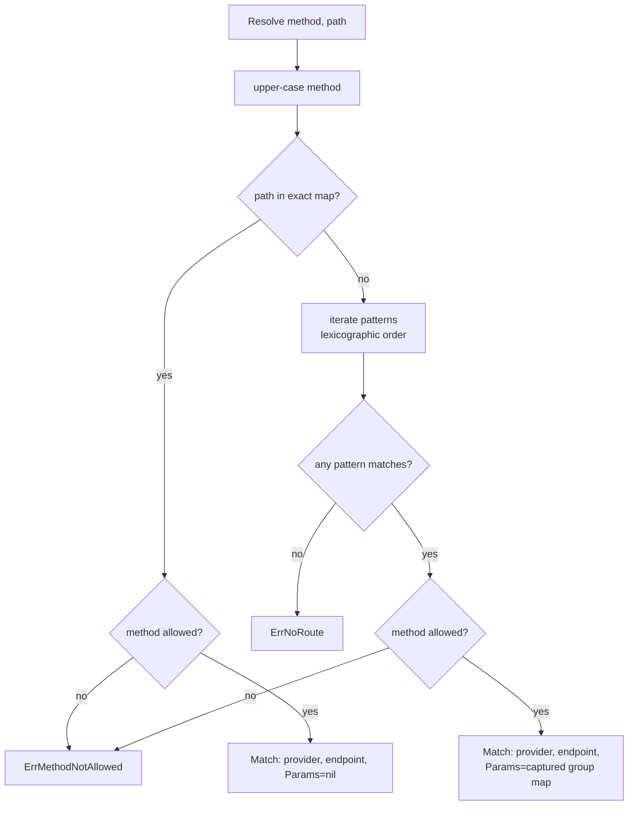

# Routing

Sluice's router maps an inbound `(method, path)` pair to the `(provider, endpoint)` it belongs to. The match drives every downstream stage — auth uses it to pick the credential, bodycapture uses it to pick the typed request model, the forwarder uses it to build the upstream URL. Routes are declared in `providers.yaml` (or any merged YAML under `SLUICE_CONFIG_DIR`) as the `accepted_paths` list on each endpoint; the loader expands those into a flat route index that the router compiles into an exact-match map plus a sorted list of patterned routes.

This page is the operator's reference. It covers the resolution algorithm, every routing knob on `Endpoint` / `Provider`, the collision rules enforced at config-load time, and the worked examples that motivated the design.

---

## Table of contents

1. [What the router does](#what-the-router-does)
2. [Where it sits in the pipeline](#where-it-sits-in-the-pipeline)
3. [The resolution algorithm](#the-resolution-algorithm)
4. [`accepted_paths`](#accepted_paths)
5. [`prefix_required` vs `prefix_optional`](#prefix_required-vs-prefix_optional)
6. [Path collisions and `ErrPathCollision`](#path-collisions-and-errpathcollision)
7. [Method dispatch](#method-dispatch)
8. [Path placeholders and captured params](#path-placeholders-and-captured-params)
9. [The `request_kind` discriminator](#the-request_kind-discriminator)
10. [X-Sluice headers](#x-sluice-headers)
11. [Worked examples](#worked-examples)
12. [Diagnostic errors](#diagnostic-errors)

---

## What the router does

The router is the gateway's entry-point dispatcher. It owns one question: *given the inbound HTTP method and URL path, which provider's endpoint catalogue owns this request?* It does not authenticate, body-parse, rule-evaluate, or forward — those are downstream concerns. It does answer **path → (provider, endpoint, params)** in a single map lookup for exact paths or a single linear scan of compiled regexes for patterned ones, and returns one of three outcomes: a `Match`, `ErrNoRoute`, or `ErrMethodNotAllowed`.

The route table is built once at startup from `resolved.RouteIndex`, which the config loader assembles by walking every `(provider, endpoint, accepted_path)` triple. Routes are partitioned at construction time: paths without `{name}` placeholders go into an exact-match map for O(1) lookup; placeholder-bearing paths go into a slice of compiled regexes, sorted lexicographically so two overlapping patterns resolve deterministically across restarts.

---

## Where it sits in the pipeline



Routing is the **first** middleware in the chain. Every other stage reads its result from context — `auth` picks credentials by `(provider, endpoint)`; `bodycapture` picks the typed model by the endpoint's `request_kind`; the forwarder builds the upstream URL from the provider's `base_url` plus the endpoint's `path`. If routing misses, the chain short-circuits with a 404 or 405; nothing downstream runs.

---

## The resolution algorithm



Three invariants in this flow:

1. **Exact wins.** A literal path that also happens to match a pattern resolves to the exact entry. No probabilistic precedence — the partition is hard.
2. **Method check is path-conditional.** A 405 fires only when the path matched. An unknown path with the wrong method still returns 404, not 405 — the gateway is not in the business of revealing routes that don't exist for the client's verb.
3. **Pattern order is stable.** Patterns are sorted by their source `accepted_paths` string at `routing.New` time so two overlapping placeholder routes resolve identically across restarts. This is tested explicitly by `TestNew_DeterministicPatternOrder`.

Method comparison normalises to upper-case (`strings.ToUpper`), so `post`, `Post`, and `POST` all resolve identically — useful when curl-ing in lowercase by habit.

---

## `accepted_paths`

Every endpoint declares one or more `accepted_paths` — the literal inbound path patterns the gateway claims for that endpoint. Each entry seeds one or more routes via [`emitRoutes`](#prefix_required-vs-prefix_optional) below.

A single endpoint can declare multiple `accepted_paths` for the same logical operation. The canonical example is OpenAI's chat completions, which the gateway accepts at both `/v1/chat/completions` (the SDK's default base path) and `/chat/completions` (the same path without the version segment — convenient for clients that strip versions in their configured base URL):

```yaml
providers:
  openai:
    prefix: openai
    prefix_required: false
    endpoints:
      chat_completions:
        path: /v1/chat/completions
        method: [POST]
        accepted_paths:
          - /v1/chat/completions
          - /chat/completions
        request_kind: chat
```

Both entries resolve to the same `(openai, chat_completions)` pair. The forwarder uses `Endpoint.Path` (not the matched `accepted_path`) when building the upstream URL, so all variants converge on the same upstream request — the gateway accepts permissively and forwards canonically.

Patterned `accepted_paths` (entries with `{name}` placeholders) work the same way; they're just expanded into compiled regexes instead of map keys. See [Path placeholders and captured params](#path-placeholders-and-captured-params).

---

## `prefix_required` vs `prefix_optional`

Multiple providers will, sooner or later, claim the same `accepted_path` — three of them want `/v1/models`, two of them want `/v1/chat/completions`. The provider-level `prefix` plus a pair of opt-in/opt-out switches resolves the ambiguity at config-load time.

The full emit table:

| `provider.prefix_required` | `endpoint.prefix_optional` | Routes emitted per `accepted_path` `<ap>` |
|---|---|---|
| `false` (default) | `false` (default) | `/<prefix><ap>` AND `<ap>` |
| `false` (default) | `true` | `/<prefix><ap>` AND `<ap>` (no effect — provider already bare) |
| `true` | `false` (default) | `/<prefix><ap>` only |
| `true` | `true` | `/<prefix><ap>` AND `<ap>` |

A few things to read out of this:

- `prefix_required: false` is "default provider, also reachable under its prefix". OpenAI in `config-dev` is the default for `/v1/chat/completions` and `/v1/models`; clients pointed at the bare gateway URL with no extra config get OpenAI, and clients that explicitly opt in via `/openai/...` still land on it.
- `prefix_required: true` is "prefix-only — never reachable bare". Anthropic, Gemini, and every alternative LLM in `config-dev` use this so they don't collide with OpenAI's bare claims.
- `prefix_optional: true` on a single endpoint *escapes* the provider-level `prefix_required` for that endpoint only. Anthropic's `messages` endpoint uses this so the native Anthropic SDK pointed at the gateway root works against `/v1/messages` directly, while Anthropic's OpenAI-compat surface at `/v1/chat/completions` stays prefix-only (where it would otherwise collide with OpenAI's bare claim on the same path).

`prefix_required: true` with an empty `prefix` is a config-load error — the provider would be unreachable. The loader returns `ErrPrefixRequiredEmpty`.

The router itself is agnostic to all of this; the routing table comes pre-expanded from the loader. The split lives in `internal/config/loader.go::emitRoutes`. From the router's perspective, every route in `RouteIndex` is just a literal path or a placeholder-bearing pattern.

---

## Path collisions and `ErrPathCollision`

A collision is when two different `(provider, endpoint)` pairs would emit the same fully-resolved route path. The loader detects this at startup and fails the boot with `ErrPathCollision`. The gateway never silently picks a winner — both claims are visible to the operator in the error message:

```
config: route "/v1/chat/completions" claimed by openai.chat and acme.chat: config: route path claimed by multiple endpoints
```

With prefix disambiguation in place, collisions are only possible in three shapes:

| Shape | Example | Resolution |
|---|---|---|
| Two providers share an `accepted_path` AND both are `prefix_required: false` (or have no prefix) | Two providers both claim bare `/v1/models` as the default | Make one of them `prefix_required: true`. Only one provider may "own" a given bare path. |
| Two providers share both the same `prefix` AND the same `accepted_path` | Two providers both set `prefix: openai` and both expose `/v1/chat/completions` | Different prefixes. The prefix is the disambiguator; collapsing it collapses the namespace. |
| One endpoint declares two identical `accepted_paths` in the same list | `accepted_paths: [/v1/models, /v1/models]` | Drop the duplicate; the loader treats a self-collision identically. |

The collision check runs in deterministic provider-name order (sorted alphabetically) so the error message names the same "first claimant" across runs — debuggable, scriptable.

A non-collision worth calling out: two providers can both claim `/v1/models` if one is `prefix_required: false` (owning the bare form) and the other is `prefix_required: true` (only emitting `/<prefix>/v1/models`). The bare path belongs to the default, the prefixed form belongs to the second provider, and no entry in the route index has two claims on the same key. This is the `TestLoad_PrefixResolvesCollision` shape, and it's the standard pattern for "OpenAI is the default, everyone else is opt-in".

---

## Method dispatch

Every endpoint declares a `method` list — the set of HTTP verbs it accepts. The router pre-normalises the list to upper-case at construction time so `Resolve` only does a single map probe on the verb.

When a path matches but the method does not, the router returns `ErrMethodNotAllowed` (HTTP 405), **not** `ErrNoRoute`. This is deliberate: a GET on `/v1/chat/completions` is a wrong-verb-for-a-known-route case, and the operator wants a 405 to surface that distinction in logs and dashboards. The `routing_middleware.go` adapter logs the miss as `routing method not allowed` and writes a typed JSON error with code `method_not_allowed`.

| Endpoint declaration | Inbound | Outcome |
|---|---|---|
| `method: [POST]` | `POST /v1/chat/completions` | 200 — forwarded |
| `method: [POST]` | `GET /v1/chat/completions` | 405 ErrMethodNotAllowed |
| `method: [GET]` | `GET /v1/models` | 200 — forwarded |
| `method: [GET]` | `POST /v1/models` | 405 ErrMethodNotAllowed |
| (no route for path) | `GET /nope` | 404 ErrNoRoute |

A path may map to only one `(provider, endpoint)` pair, so multi-method endpoints are rare in practice — `chat_completions` is `[POST]`, `models` is `[GET]`. Declaring an empty `method` list is a config-load error (`routing: new: <provider>.<endpoint> has no methods declared`).

---

## Path placeholders and captured params

An `accepted_paths` entry can contain `{name}` segments. The loader keeps the literal string in `RouteIndex`; the router compiles it to an anchored regex (`^.../([^/]+)...$`) and records the placeholder identifiers in left-to-right order.

```yaml
endpoints:
  generate_content:
    path: /v1beta/models/{model}:generateContent
    accepted_paths:
      - /v1beta/models/{model}:generateContent
    method: [POST]
    request_kind: generate_content
```

A request to `/gemini/v1beta/models/gemini-1.5-flash-latest:generateContent` resolves to `(gemini, generate_content)` with `Params{"model": "gemini-1.5-flash-latest"}`. Two constraints on placeholders worth knowing:

- Placeholder names are restricted to identifier characters (`[A-Za-z_][A-Za-z0-9_]*`) — the regex translator is deterministic and won't accept arbitrary content inside the braces.
- Each placeholder captures a single non-slash segment (`[^/]+`). A path like `/v1beta/models/foo/bar:generateContent` won't match — the `/` inside terminates the capture before the `:generateContent` suffix.

The captured `Params` map is propagated through context to the forwarder's URL builder, which substitutes them into `Endpoint.Path` when constructing the upstream request. Gemini's model name lives in the path, not the body, so this is the dispatch surface for "which model is being requested" on that provider — see `cmd/gateway/handler.go::outboundModel` for how telemetry reads it back.

---

## The `request_kind` discriminator

`request_kind` is the bridge from "router matched this endpoint" to "bodycapture knows which typed model to deserialise into". It's a string on `Endpoint` whose accepted values are the constants defined in `internal/middleware/bodycapture`:

| `request_kind` | Concrete body type | Used by |
|---|---|---|
| `chat` | `*openaichat.ChatCompletionRequest` | OpenAI chat completions + every OpenAI-compat surface (Anthropic, Gemini, gpt-oss, ...) |
| `responses` | `*openairesponses.ResponsesRequest` | OpenAI Responses API |
| `messages` | `*messages.MessagesRequest` | Anthropic native messages |
| `generate_content` | `*content.GenerateContentRequest` | Gemini native `:generateContent` |
| `passthrough` | `nil` — body is `Raw`-only | GETs and any endpoint where the gateway does not type-model the body (e.g. `/v1/models`) |
| (empty / unset) | `nil` — falls back to `passthrough` | Defensive default; the handler's `makeKindFromContext` treats empty as passthrough so a misconfigured YAML still forwards |

The flow is: router stashes the `Match` on context → `makeKindFromContext` reads the matched endpoint's `RequestKind` → bodycapture's `Capture` allocates the matching concrete struct and `json.Unmarshal`s into it, preserving unknown fields via `DynamicProperties`. The typed value lands on context as `Captured.Body` for downstream consumers (rules, telemetry, the forwarder's optional re-marshal path).

Two operational notes:

- **`passthrough` does not skip body reading.** The middleware still buffers `Raw` up to `MaxBodyBytes` (10 MiB) so the forwarder has bytes to resend; it just doesn't pay the deserialise cost. Use `passthrough` for endpoints where the body shape is not load-bearing for the gateway's decisions.
- **Adding a new typed kind requires three edits.** New constant in `bodycapture.RequestKind`, new case in `bodycapture.allocate`, and (if the body carries a model field) a new case in `bodycapture.Model`. Forgetting the third means the rules engine and telemetry can't read the model out of the new request shape.

---

## X-Sluice headers

Sluice owns three `X-Sluice-*` HTTP headers on the request/response surface. Two are observability hooks, one is the passthrough-mode auth selector.

### `X-Sluice-Correlation-Id`

Per-request correlation token. Used to join NATS audit events, structured logs, and admin-console message rows for the same request. Lives on [`cmd/gateway/correlation.go`](../cmd/gateway/correlation.go) — the `correlationMiddleware` runs ahead of routing so every other middleware sees the same value.

| Direction | Behaviour |
|---|---|
| Inbound (client → gateway) | Optional. When present, the gateway adopts the value verbatim and uses it as the correlation ID for the request. |
| Inbound missing | The gateway mints a fresh UUIDv4 via [`observability.NewCorrelationID`](../internal/observability/correlation.go). |
| Outbound (gateway → client) | **Always set** on the response, regardless of inbound state. Echoed value matches the in-process correlation ID exactly. |

The "always echo" rule is what lets a client SDK retrieve the ID it needs to file a support ticket — even if it didn't send one on the way in, the response carries one it can log.

### `X-Sluice-Session-Id`

Optional pass-through session marker. Sluice does not interpret the value — it just relays it. Both directions are simple:

| Direction | Behaviour |
|---|---|
| Inbound | If present, the value is recorded on the per-request observer state and forwarded upstream verbatim. Absent inbound means no session id; the gateway does not synthesise one. |
| Outbound (gateway → client) | When an inbound `X-Sluice-Session-Id` was present, the value is echoed back on the response. Absent inbound means absent outbound. |

The intent is that an SDK or a UI tier above the gateway can stamp a session id and join its own logs against the same key Sluice surfaces in NATS audit events and the admin console.

### `X-Sluice-Configuration`

Passthrough-mode policy selector. The client tells the gateway "I'm bringing my own upstream credential — apply *this* named configuration on top of it." Lives on [`internal/middleware/auth/resolver.go::HeaderConfiguration`](../internal/middleware/auth/resolver.go).

| Direction | Behaviour |
|---|---|
| Inbound | When set, the resolver enters passthrough mode unconditionally — even if a managed-mode bearer is also present, passthrough wins. The value names a configuration from `policy.yaml`; an unknown name fails the request with `ErrUnknownConfiguration`. |
| Forwarded upstream | **Stripped.** Auth always adds `HeaderConfiguration` to the destination builder's `DropHeaders` set before forwarding, so the upstream provider never sees the Sluice-internal routing token. |

The strip is non-negotiable: leaking `X-Sluice-Configuration` to the upstream would expose policy-routing metadata to the provider, which has no use for it and might log it. The destination builder also drops whichever inbound header carried the Sluice secret in managed mode (Authorization, x-api-key, or x-goog-api-key); the principle is the same — gateway-internal tokens stay gateway-internal.

---

## Worked examples

### Routing an OpenAI request through `/openai/v1/chat/completions`

`config-dev/providers.yaml` declares OpenAI with `prefix: openai`, `prefix_required: false`, and `accepted_paths: [/v1/chat/completions, /chat/completions]` on the `chat_completions` endpoint. The loader's `emitRoutes` expands this into four route-index entries:

| Inbound path | Resolves to |
|---|---|
| `/v1/chat/completions` | `(openai, chat_completions)` — bare default |
| `/chat/completions` | `(openai, chat_completions)` — bare default, version-stripped variant |
| `/openai/v1/chat/completions` | `(openai, chat_completions)` — explicit prefix |
| `/openai/chat/completions` | `(openai, chat_completions)` — explicit prefix, version-stripped |

`POST /openai/v1/chat/completions` hits the exact-match map, picks up the `Methods: {POST}` allowlist, and returns `Match{Provider: "openai", Endpoint: "chat_completions"}` with no `Params`. The forwarder appends `/v1/chat/completions` (the endpoint's canonical `path`) to OpenAI's `base_url`. Bodycapture deserialises into `*openaichat.ChatCompletionRequest`.

### Same logical path on different providers via prefix disambiguation

Both OpenAI and Anthropic want to expose chat completions at `/v1/chat/completions`. The collision is resolved by giving them different prefixes and pinning Anthropic to prefix-only:

```yaml
providers:
  openai:
    prefix: openai
    prefix_required: false        # bare /v1/chat/completions belongs here
    endpoints:
      chat_completions:
        accepted_paths: [/v1/chat/completions]
        method: [POST]
        request_kind: chat
  anthropic:
    prefix: anthropic
    prefix_required: true         # only /anthropic/v1/chat/completions
    endpoints:
      chat_completions:
        accepted_paths: [/v1/chat/completions]
        method: [POST]
        request_kind: chat
```

After loader expansion:

| Inbound path | Resolves to |
|---|---|
| `/v1/chat/completions` | `(openai, chat_completions)` |
| `/openai/v1/chat/completions` | `(openai, chat_completions)` |
| `/anthropic/v1/chat/completions` | `(anthropic, chat_completions)` |

No collision — the bare path belongs to the default provider, and the prefix is the disambiguator for everyone else. Flipping OpenAI to `prefix_required: true` (or adding a third provider that also goes default) would trip `ErrPathCollision` at boot.

### Anthropic's OpenAI-compat surface

Anthropic exposes both its native `/v1/messages` API and an OpenAI-shaped `/v1/chat/completions` surface that accepts an OpenAI ChatCompletionRequest body. The native endpoint also wants to be reachable bare (so the vanilla Anthropic SDK pointed at the gateway root works), but the OpenAI-compat surface must stay prefix-only to avoid colliding with OpenAI's bare `/v1/chat/completions` claim:

```yaml
anthropic:
  prefix: anthropic
  prefix_required: true
  endpoints:
    messages:
      path: /v1/messages
      method: [POST]
      accepted_paths: [/v1/messages, /messages]
      request_kind: messages
      prefix_optional: true              # bare /v1/messages emits alongside /anthropic/v1/messages
      auth_header: x-api-key
      auth_format: "{key}"
    chat_completions:
      path: /v1/chat/completions
      method: [POST]
      accepted_paths: [/v1/chat/completions]
      request_kind: chat                 # OpenAI body shape
      auth_header: Authorization         # Anthropic's OpenAI-compat wants Bearer
      auth_format: "Bearer {key}"
```

After expansion:

| Inbound path | Resolves to | Body type (via `request_kind`) |
|---|---|---|
| `/v1/messages` | `(anthropic, messages)` | `*messages.MessagesRequest` |
| `/messages` | `(anthropic, messages)` | `*messages.MessagesRequest` |
| `/anthropic/v1/messages` | `(anthropic, messages)` | `*messages.MessagesRequest` |
| `/anthropic/messages` | `(anthropic, messages)` | `*messages.MessagesRequest` |
| `/anthropic/v1/chat/completions` | `(anthropic, chat_completions)` | `*openaichat.ChatCompletionRequest` |
| `/v1/chat/completions` | `(openai, chat_completions)` | `*openaichat.ChatCompletionRequest` — OpenAI claims the bare form |

`prefix_optional: true` is what lets `messages` emit bare while `chat_completions` on the same provider stays prefix-only. The per-endpoint `auth_header`/`auth_format` overrides are how the OpenAI-compat surface gets `Authorization: Bearer ...` instead of Anthropic's native `x-api-key`. See `docs/providers.md`'s OpenAI-compat section for the full credential resolution table.

### Declaring a custom prefix-optional endpoint

Gemini's `generate_content` endpoint uses the same pattern as Anthropic's `messages` — bare-reachable for SDK compatibility, sibling endpoints stay prefixed:

```yaml
gemini:
  prefix: gemini
  prefix_required: true
  endpoints:
    generate_content:
      path: /v1beta/models/{model}:generateContent
      method: [POST]
      accepted_paths: ["/v1beta/models/{model}:generateContent"]
      request_kind: generate_content
      prefix_optional: true        # bare /v1beta/... also emits
    models:
      path: /v1beta/models
      method: [GET]
      accepted_paths: [/v1beta/models]
      request_kind: passthrough    # /v1beta/models stays prefix-only
```

`prefix_optional: true` flips the bare emit on for `generate_content` only. The `models` endpoint stays prefix-only because nothing else on the gateway claims `/v1beta/models`, so there's no SDK-compatibility win in exposing it bare — and keeping it prefixed forces explicit intent if a second provider ever shows up wanting the same path. The bare `generate_content` route is a placeholder pattern, so the regex iteration path of `Resolve` handles it; the bare `models` route doesn't exist, so a `GET /v1beta/models` without the prefix returns 404.

---

## Diagnostic errors

| Error | When it fires | Where to fix |
|---|---|---|
| `routing.ErrNoRoute` | No `accepted_paths` entry matches the inbound path | Add the path to an endpoint's `accepted_paths`, or check the prefix (a `prefix_required: true` provider is only reachable via `/<prefix>...`). |
| `routing.ErrMethodNotAllowed` | Path matched but the verb is not in the endpoint's `method` list | Add the method to the endpoint's `method:` list, or fix the client. |
| `config.ErrPathCollision` | Two `(provider, endpoint)` pairs emit the same fully-resolved route path | Disambiguate via prefix — see [Path collisions](#path-collisions-and-errpathcollision). |
| `config.ErrPrefixRequiredEmpty` | A provider has `prefix_required: true` but no `prefix` value | Set a non-empty `prefix`, or drop `prefix_required`. |
| `routing: new: route references unknown provider/endpoint` | The route index references a provider or endpoint not in the resolved providers map | Programming error — the loader normally prevents this. Means the loader wrote a `RouteIndex` entry without registering the underlying provider/endpoint; investigate the loader, not the YAML. |
| `routing: new: <provider>.<endpoint> has no methods declared` | An endpoint's `method:` list is empty or missing | Add at least one HTTP verb. |

Routing errors surface as HTTP status + a typed JSON body via `internal/httperr` (`{"code":"no_route", ...}` / `{"code":"method_not_allowed", ...}`). Both are logged at info — they're client errors, not gateway faults — and counted on `gateway.requests.total` with the appropriate status label. See `docs/configuration-model.md` for the full YAML schema and `docs/providers.md` for per-provider auth/header behaviour.
