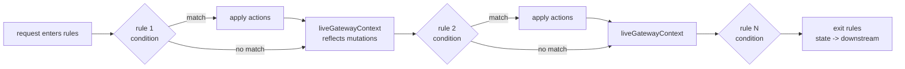

# Rules

Sluice's rules engine is the request-shaping layer. It inspects a small read-only view of each in-flight request — provider, endpoint, model, headers, tags — and runs an ordered chain of operator-authored rules. Each matched rule fires one or more actions that mutate the destination, set a header, attach a tag, bind a resilience policy, or short-circuit the request with a synthetic response. Rules are defined in `policy.yaml` (or any merged file under `SLUICE_CONFIG_DIR`); configurations opt in by listing them in `rule_names`.

**Two authoring paths, same schema.** Rules can be hand-edited in YAML (the source of truth on disk) **or** created and modified live via the admin write API (`POST/PUT/DELETE /admin/api/v1/config/rules[/{name}]` — see [`docs/admin-console.md → Config write API`](admin-console.md#config-write-api)). The admin console's visual editor drives that API; every mutation persists to `policy.yaml` atomically and applies to the next request through `config.Store.Replace` — no pod restart. Both paths produce the same on-disk wire format, so YAML hand-edits and API-driven edits compose cleanly: an operator can mass-author rules in YAML, then tweak individual rules through the SPA.

This page is the operator's reference for **conditions** — every type, every operator, and the evaluator's behaviour around them. Actions get their own page: see [`docs/actions.md`](actions.md).

---

## Table of contents

1. [Mental model](#mental-model)
2. [Where rules sit in the pipeline](#where-rules-sit-in-the-pipeline)
3. [Rule schema](#rule-schema)
4. [Behavior: `continue` vs `exit`](#behavior-continue-vs-exit)
5. [Evaluation order](#evaluation-order)
6. [Condition types](#condition-types)
   - [`provider`](#provider)
   - [`endpoint`](#endpoint)
   - [`modelName`](#modelname)
   - [`header`](#header)
   - [`tag`](#tag)
   - [`bodyField`](#bodyfield)
   - [`group`](#group)
   - [Unknown conditions](#unknown-conditions)
7. [The `not` flag](#the-not-flag)
8. [`SLUICE_RULES_MAX_GROUP_DEPTH`](#sluice_rules_max_group_depth)
9. [Worked examples](#worked-examples)
10. [Cross-references](#cross-references)

---

## Mental model

> **Rules transform the request before the forwarder runs.**

The rule engine sits between auth/body-capture and the forwarder. Its only job is to look at what came in, decide what (if anything) should change, and let the downstream pipeline take it from there. A rule never speaks to the upstream provider; it edits the request's intended destination, headers, model, body, tags, or resilience binding, and steps aside.

Three flavours of mutation, in increasing reach:

- **Steer.** `changeProvider`, `changeModelName`, `changeUrl`, `changeApiKey` rewrite where the request is going.
- **Annotate.** `setHeader`, `appendQueryString`, `addTag` decorate the outbound request or the in-process state.
- **Short-circuit.** `returnStatusCode`, `llmImpersonation` end the pipeline with a synthetic response — the forwarder never runs.

The engine itself is unaware of which is which. It walks a chain, asks each rule's condition "do you match the live state?", and on a yes fires that rule's actions in order. Cascading matches see the state every prior rule left behind — there's no fixed snapshot from request entry.

---

## Where rules sit in the pipeline

Rules run after auth and bodycapture but before resilience and the forwarder. See the pipeline diagram in [`docs/resilience.md`](resilience.md#where-it-sits-in-the-pipeline) for the full sequence; the rules box is the one feeding `useResiliencePolicy` into the orchestrator.

In short: by the time a rule sees a request, the provider + endpoint are resolved from routing, the body has been typed-decoded (when applicable), and the inbound headers are available read-only. After rules finish, the post-rule `MutableState` (and any synthetic outcome) drives the rest of the pipeline.

---

## Rule schema

A rule is one entry in the top-level `rules:` library:

```yaml
rules:
  - name: route-claude-codex
    condition:
      type: modelName
      operator: StartsWith
      expectedModelName: claude-
    actions:
      - type: changeProvider
        newProvider: anthropic
    behavior: continue
```

| Field | Required | Notes |
|---|---|---|
| `id` | no | Optional UUID; populated by the control plane when minted via the management API. Omitted in operator-authored static config — the gateway uses `name` as the telemetry handle. Malformed UUIDs are rejected at load with `ErrInvalidRuleID`. |
| `name` | yes | Human anchor used by logs, the `gateway.rule.matches.total` counter, and `Configuration.rule_names` references. Unique within the rules library; the loader rejects duplicates. |
| `condition` | yes | The predicate that must match for `actions` to fire. Polymorphic on a `type` discriminator — see [Condition types](#condition-types). |
| `actions` | yes | Ordered list of polymorphic action objects. A terminating action (`returnStatusCode`, `llmImpersonation`) short-circuits the per-rule action loop — see [`docs/actions.md`](actions.md). |
| `behavior` | no | `continue` (default) or `exit`. Controls whether the engine keeps walking the chain after this rule's actions complete. See [below](#behavior-continue-vs-exit). |

YAML keys are camelCase by convention (`expectedModelName`, `keyOperator`); the equivalent JSON wire format is snake_case (`expected_model_name`, `key_operator`). The polymorphic decoders accept both shapes — the wire format you see in the admin console's JSON tab will differ from your YAML, by design.

---

## Behavior: `continue` vs `exit`

`behavior` decides what happens **after** a rule's actions have run successfully without a terminating action.

| Value | Effect | When to use it |
|---|---|---|
| `continue` (default) | The engine continues to the next rule. Subsequent rules see the cumulative `MutableState` left by this rule. | The common case. Composable rules, each making one small decision. The "route claude-* to anthropic" rule should `continue` so a downstream "tag claude requests" rule still gets to fire. |
| `exit` | The engine stops iterating. No further rules in the chain are evaluated. The request continues to the forwarder with whatever state was set. | When a rule is meant to be the final word for a class of traffic — a custom auth-mode header injector you don't want any later rule to overwrite, or a load-shedding gate that should be the only thing fired for matched requests. |

`exit` does **not** synthesise a response. The request still flows through the forwarder; the engine simply commits to whatever destination + headers + body the rule chain produced up to that point. To short-circuit with a synthetic response, use a terminating action — see [`docs/actions.md`](actions.md).

> The distinction is load-bearing for telemetry: an `exit` rule emits one `gateway.rule.matches.total` increment with `terminated=false`. A terminating action emits `terminated=true` and stops the pipeline before the forwarder runs. Operators reading the rules-fired tile should know which they're looking at.

---

## Evaluation order

Each configuration's `rule_names` list is the evaluation order — the YAML list position **is** the priority. There is no separate priority field.

```yaml
configurations:
  production:
    rule_names:
      - normalise-model         # runs first
      - route-claude-codex      # runs second, sees state from rule 1
      - tag-internal-requests   # runs third, sees state from rules 1 and 2
```

The loader resolves each name once at config-load time and the engine walks a priority-sorted slice per-request — there's no per-request name lookup. Unknown rule names fail at load with `ErrUnknownRuleName`; you do not get a runtime miss.

### What happens when a condition doesn't match

A non-match is a no-op. The engine:

1. Does not fire the rule's actions.
2. Does not record a `RuleMatched` event for the rule.
3. Does not increment `gateway.rule.matches.total`.
4. Moves on to the next rule in `rule_names`.

The non-matching rule is invisible to telemetry. Only matched rules surface in the admin console's per-message rule-match list.

### Cascading state

Each rule's condition sees the **live** `GatewayContext` — provider, endpoint, model, headers, tags as left behind by every earlier rule's actions. A rule that normalises a model name to `gpt-4o` makes that normalised name visible to every subsequent rule's `modelName` condition. This is what lets you compose small rules that each do one thing.

A rule matches **at most once per request**: the single-pass loop bounds the cascade. There is no risk of oscillation between two rules whose actions undo each other.



---

## Condition types

Every condition carries a `type` discriminator. The polymorphic decoder dispatches on that field; an unrecognised discriminator falls back to `UnknownCondition` and evaluates to **false** so newer rule kinds authored against a future control plane are inert on an older gateway rather than crashing it.

### `provider`

Matches when the resolved provider equals `expectedProvider`. Read from `state.Provider`, which the cascade keeps current — a rule preceded by `changeProvider` sees the new value.

| Field | Type | Notes |
|---|---|---|
| `type` | string | Always `"provider"`. |
| `operator` | enum | Only `Equals` is meaningful. Other values evaluate to false. |
| `expectedProvider` | string | The provider name to compare against — must match a key in `providers.yaml`. |
| `not` | bool | Inverts the match result. Optional; defaults to false. |

```yaml
condition:
  type: provider
  operator: Equals
  expectedProvider: openai
```

### `endpoint`

Matches when the resolved endpoint equals `expectedEndpoint`. In the v2 model the endpoint is the **protocol** the inbound path selected (`chat`, `responses`, `messages`, `generate_content`, `embeddings`) or a **passthrough family** name (e.g. `messages_batches`), not the full path.

| Field | Type | Notes |
|---|---|---|
| `type` | string | Always `"endpoint"`. |
| `operator` | enum | Only `Equals` is meaningful. |
| `expectedEndpoint` | string | The endpoint identifier — a protocol name on the provider's `protocols` map (`chat` / `responses` / `messages` / `generate_content` / `embeddings`, the `Protocol*` constants in `contracts/config/model.go`) or a `passthrough` family name. |
| `not` | bool | Inverts the match result. |

```yaml
condition:
  type: endpoint
  operator: Equals
  expectedEndpoint: chat
```

### `modelName`

Matches the resolved model name with a string operator. The model name is read from the typed body's `model` field (OpenAI chat, OpenAI responses, Anthropic messages) or `state.PathParams["model"]` (Gemini, where the model lives on the URL). The cascade keeps the resolved name current — a rule preceded by `changeModelName` sees the new value.

| Field | Type | Notes |
|---|---|---|
| `type` | string | Always `"modelName"`. |
| `operator` | enum | `Equals`, `StartsWith`, `EndsWith`, `Contains`, `Regex`. |
| `expectedModelName` | string | The literal, prefix, suffix, substring, or regex pattern — `operator` decides which. |
| `caseInsensitive` | bool | When true, both pattern and subject are lower-cased before comparison. Optional; defaults to false. |
| `not` | bool | Inverts the match result. |

```yaml
condition:
  type: modelName
  operator: StartsWith
  expectedModelName: claude-
  caseInsensitive: true
```

`Regex` compiles the pattern with `regexp.Compile`; an invalid pattern returns false (the rule is inert rather than crashing the request). Anchor the pattern (`^claude-`) if you mean "starts with"; otherwise the regex matches anywhere in the subject.

### `header`

Matches inbound HTTP headers. The key match always applies; the value match is optional. Multi-value headers join with `", "` per RFC 7230 §3.2.2 before comparison — same convention as `http.Header.Get` when rendered for the wire.

| Field | Type | Notes |
|---|---|---|
| `type` | string | Always `"header"`. |
| `keyOperator` | enum | String operator applied to the header name. |
| `keyPattern` | string | Pattern for the header name — interpretation depends on `keyOperator`. |
| `valueOperator` | enum or null | Optional. When set, the joined value must also satisfy this operator against `valuePattern`. When null, any value matches. |
| `valuePattern` | string | Pattern for the header value — ignored when `valueOperator` is null. |
| `caseInsensitive` | bool | Folds case on both key and value comparisons. |
| `not` | bool | Inverts the overall match result. |

```yaml
condition:
  type: header
  keyOperator: Equals
  keyPattern: X-Tenant
  valueOperator: Regex
  valuePattern: "^acme-"
```

The match iterates `gc.Headers` and returns true on the first header whose key satisfies the key operator AND (if a value operator is set) whose joined value satisfies the value operator. If no header satisfies both, the condition is false.

`HeaderCondition` reads from the **inbound** header set on `GatewayContext.Headers`, plus any `setHeader` writes earlier rules in the chain have made (those land on `MutableState.OutgoingHeaders` and merge into the live context). The destination builder's auth-header layering happens after rules run; a `header` condition does not see provider-required or auth-resolved headers.

### `tag`

Matches when an earlier rule's `addTag` action has attached `expectedTag` to the request. Tags are set-valued — first-attach order is preserved for the admin console's chip render, but membership is the only thing the condition checks.

| Field | Type | Notes |
|---|---|---|
| `type` | string | Always `"tag"`. |
| `operator` | enum | Only `Equals` is meaningful (set-membership). Other values evaluate to false. |
| `expectedTag` | string | The tag string the condition checks for. Empty strings never match. |
| `not` | bool | Inverts the match result. |

```yaml
condition:
  type: tag
  operator: Equals
  expectedTag: internal-traffic
```

Rule order matters: a `tag` condition only sees tags attached by rules that ran **earlier** in the configuration's `rule_names` list. A tag attached by a later rule is invisible to this one. For "any of {a, b, c}", compose three `tag` conditions under a `group` with `Or`; for "all of", use `And`.

### `bodyField`

Matches against a value read from the **inbound request body** by [`gjson`](https://github.com/tidwall/gjson). Reads the verbatim captured bytes, so unknown fields and exact shapes are visible. A missing body or an unresolvable target evaluates to false — the rule is inert, never request-breaking.

| Field | Type | Notes |
|---|---|---|
| `type` | string | Always `"bodyField"`. |
| `target` | string | `request.body.*` path. gjson query syntax allowed (e.g. `request.body.tools.#(name=="bash")`) — reads are unconstrained. |
| `operator` | enum | `Equals`, `Contains`, `Matches`, `Exists`, `Is`. |
| `value` | string | Comparison operand; ignored for `Exists`. |
| `not` | bool | Inverts the match result. |

| Operator | Behaviour |
|---|---|
| `Equals` | gjson string form of the read value equals `value`. Quote scalars uniformly (`value: "true"`, `value: "1024"`). |
| `Contains` | read string value contains `value` as a substring. |
| `Matches` | read string value matches the `value` regular expression (RE2 — linear time, no catastrophic backtracking). |
| `Exists` | the target resolves to a present value. `value` ignored. |
| `Is` | the read value is of the JSON type named by `value`: `string`, `number`, `bool`, `array`, `object`, or `null`. |

```yaml
# Gate a rewrite on whether the request is actually streaming.
condition:
  type: bodyField
  target: request.body.stream
  operator: Equals
  value: "true"
```

```yaml
# Fingerprint a caller by its system-prompt signature, then tag it.
# NOTE: body-derived identity is heuristic and spoofable — use it for
# attribution/telemetry/routing, never as an auth boundary.
condition:
  type: bodyField
  target: request.body.system
  operator: Contains
  value: "You are Claude Code"
```

```yaml
# Detect a tool definition via a gjson predicate read.
condition:
  type: bodyField
  target: request.body.tools.#(name=="bash")
  operator: Exists
```

`bodyField` reflects the **inbound** body; rule-driven typed mutations (`changeModelName`) are not re-serialized into what it reads. That is intentional — model matching has its own `modelName` condition, and the only typed body mutation is the model field. Body **writes** (`rewriteField` etc.) are constrained to bare paths; only `bodyField` **reads** may use query syntax. See [actions.md](actions.md#rewritefield--removefield--appendfield).

### `group`

Composes child conditions with a logical operator. Children may be any condition type, including nested groups, allowing arbitrarily-deep logic trees up to the depth cap.

| Field | Type | Notes |
|---|---|---|
| `type` | string | Always `"group"`. |
| `logicalOperator` | enum | `And` (every child must match) or `Or` (any child matches). |
| `children` | list | Polymorphic list of conditions — same schema as the top-level `condition` field. |
| `not` | bool | Inverts the group's result **after** the logical combination — i.e. `Not(And(c1, c2))`. |

```yaml
condition:
  type: group
  logicalOperator: And
  children:
    - type: provider
      operator: Equals
      expectedProvider: openai
    - type: group
      logicalOperator: Or
      children:
        - type: modelName
          operator: Contains
          expectedModelName: gpt-4
        - type: modelName
          operator: Contains
          expectedModelName: o1
```

Short-circuit semantics match what you'd expect:

- `And` stops on the first false child and returns false.
- `Or` stops on the first true child and returns true.
- An **empty** `children` list evaluates to **false**. A vacuously-true `And` could fire every rule and is more likely an authoring mistake than an intent — the engine refuses to commit to it.

Recursive descent is capped at `SLUICE_RULES_MAX_GROUP_DEPTH` — see [below](#sluice_rules_max_group_depth).

### Unknown conditions

Any `type` value the registry does not recognise falls back to `UnknownCondition`. The full payload (including unknown fields) is preserved via `DynamicProperties` so the rule round-trips intact through marshal cycles. **The condition evaluates to false** — the rule never fires.

This is the forward-compatibility hatch: a control plane that mints a new condition kind can write it to YAML today; older gateways will load + serve the rule without crashing, and the condition simply never matches until the gateway is upgraded.

---

## The `not` flag

Every condition type carries a top-level `not: true` flag that inverts the final match result. This is independent of operator semantics — `not: true` on a `modelName` condition with operator `StartsWith` is "model name does NOT start with X", not "model name starts with NOT-X".

For groups, `not` applies **after** the logical combination, so `not: true` on an `And` group means "at least one child failed", not "every child failed".

The flag is optional and defaults to false.

---

## `SLUICE_RULES_MAX_GROUP_DEPTH`

Caps recursive descent through nested `group` children during evaluation. Operator-authored policies rarely need more than 3-4 levels; the cap is a guardrail against pathological YAML triggering stack overflow in the evaluator.

| | |
|---|---|
| Env var | `SLUICE_RULES_MAX_GROUP_DEPTH` |
| Default | `8` |
| Valid range | `[1, 64]` (`MaxRulesMaxGroupDepth`) |
| On overflow | The offending group evaluates to **false** and `gateway.rule.errors.total{error_kind="group_depth"}` is incremented. The rest of the rule chain continues. |

Exceeding the cap is a silent-but-metered failure mode — the request continues, the dashboard surfaces the error counter. If you see `group_depth` errors fire, your YAML has either a genuine deep tree (rare, refactor it flatter) or a circular reference (the YAML loader catches structural cycles, but you can still hand-write a deeply-nested literal that hits the cap).

See [`docs/environment-variables.md`](environment-variables.md) for the full list of `SLUICE_*` vars and their defaults.

---

## Worked examples

### Route by model name to a specific provider

Goal: any request whose model starts with `claude-` should be routed to the `anthropic` provider, regardless of which endpoint it landed on.

```yaml
configurations:
  production:
    upstream_credentials:
      openai: sk-openai-mock
      anthropic: sk-ant-mock
    rule_names:
      - route-claude-to-anthropic

rules:
  - name: route-claude-to-anthropic
    condition:
      type: modelName
      operator: StartsWith
      expectedModelName: claude-
    actions:
      - type: changeProvider
        newProvider: anthropic
```

Why this works: the rule's condition reads the live `Model` from the request body (OpenAI chat) or `state.PathParams["model"]` (Gemini path-style). `changeProvider` flips `state.Provider`. The destination builder reads `state.Provider` post-rule and re-resolves the endpoint on `anthropic` — see invariant 7 in `CLAUDE.md`. The credential header convention follows automatically (invariant 6); you do not need to also change the API key.

### Short-circuit on a header using `behavior: exit`

Goal: requests carrying `X-Sluice-Shed: true` should be rejected with a 503, and **no other rules should run** for that request.

```yaml
rules:
  - name: load-shed
    condition:
      type: header
      keyOperator: Equals
      keyPattern: X-Sluice-Shed
      valueOperator: Equals
      valuePattern: "true"
    actions:
      - type: returnStatusCode
        statusCode: 503
        bodyType: json
        body: '{"error":"shedding load"}'
    behavior: exit
```

`returnStatusCode` is a terminating action — it short-circuits the per-rule action loop and emits a synthetic response. The `behavior: exit` is belt-and-braces: the terminator alone stops the pipeline, but the explicit `exit` makes the operator intent visible in the YAML.

The synthetic response is recorded on the request's `events.RuleMatched` with `Terminated: true`, the `gateway.rule.matches.total` counter increments with `terminated=true`, and the request never reaches the forwarder.

### A `group` condition combining provider + header

Goal: only requests on the `openai` provider that **also** carry an `X-Tenant: acme-*` header should be tagged for downstream auditing.

```yaml
rules:
  - name: tag-acme-openai
    condition:
      type: group
      logicalOperator: And
      children:
        - type: provider
          operator: Equals
          expectedProvider: openai
        - type: header
          keyOperator: Equals
          keyPattern: X-Tenant
          valueOperator: Regex
          valuePattern: "^acme-"
    actions:
      - type: addTag
        tag: tenant-acme
```

The `And` short-circuits: if the request isn't on `openai`, the header lookup is never run. Once the rule fires, every subsequent rule's `tag` condition can match `tenant-acme` to compose tenant-specific behaviour without re-deriving the predicate.

---

## Cross-references

- [`docs/actions.md`](actions.md) — every action type (`changeProvider`, `changeModelName`, `changeUrl`, `changeApiKey`, `setHeader`, `appendQueryString`, `addTag`, `useResiliencePolicy`, `returnStatusCode`, `llmImpersonation`) with semantics and worked examples.
- [`docs/resilience.md`](resilience.md) — the `useResiliencePolicy` action's destination, including the pipeline diagram showing where rules sit relative to the orchestrator.
- [`docs/observability.md`](observability.md) — the rule-engine meters (`gateway.rule.matches.total`, `gateway.rule.errors.total`, `gateway.rule.evaluation.duration`) and the per-request `RulesFired` shape captured on connector `Record`s and the admin console live-feed.
- [`docs/environment-variables.md`](environment-variables.md) — `SLUICE_RULES_MAX_GROUP_DEPTH` and all other server-tunable env vars.
