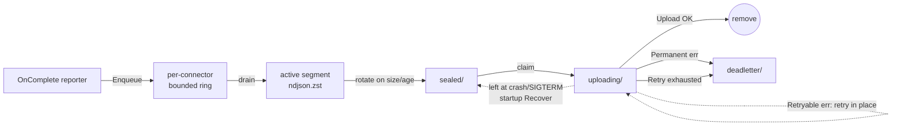

# Spool

The spool is the on-disk buffer that sits between the data plane's request path and the upload workers shipping records to durable connector destinations. Every completed request that survives a configuration's binding evaluation for an `s3` or `azure_blob` connector becomes one record on a per-connector ndjson.zst segment; segments seal on size or age and the upload workers ship them out of band. `webhook` connectors bypass the spool and use the real-time pusher described in [connectors.md](connectors.md#webhook-connector).

This page is the operator's reference for the disk layout, the segment lifecycle, the rotation/retry/breaker policy, and the loss semantics for spool-backed connectors. For the destinations the spool ships to, see [connectors.md](connectors.md). For the per-configuration binding knobs that decide *what* lands on which destination, see [connector-bindings.md](connector-bindings.md).

The source of truth lives in [`internal/spool/`](../internal/spool/). If a value in this doc disagrees with that package, the code wins — open a PR.

---

## Table of contents

1. [Mental model](#mental-model)
2. [Disk layout](#disk-layout)
3. [Segment file format](#segment-file-format)
   - [Segment stats sidecar](#segment-stats-sidecar)
4. [Lifecycle](#lifecycle)
   - [Live track registration and removal](#live-track-registration-and-removal)
5. [Rotation policy](#rotation-policy)
6. [Upload, retry, and deadletter](#upload-retry-and-deadletter)
7. [Per-destination circuit breaker](#per-destination-circuit-breaker)
8. [Loss policy](#loss-policy)
9. [Observability](#observability)
10. [Recovery on startup](#recovery-on-startup)
11. [Sizing the spool](#sizing-the-spool)
12. [Environment variables](#environment-variables)
13. [Payload backref contract](#payload-backref-contract)
14. [Cross-references](#cross-references)

---

## Mental model

> **Best-effort, disk-buffered, restart-tolerant. Never blocks the request path.**

When the reporter at end-of-request decides a configuration's bindings produce records for one or more spool-backed connectors, it calls `Spool.Enqueue` once per binding. The call is non-blocking: each connector has a bounded per-track ring; if the ring is full the record is dropped on the floor and the per-track drop counter bumps. The request path returns to the client as if nothing happened.

A background goroutine per connector drains the ring, appends each record to the connector's active segment (an ndjson.zst file under the spool root), and rotates that segment on size or age. A sibling uploader goroutine watches the sealed directory and ships each segment to the destination via `Connector.Upload`. Successful uploads delete the segment; permanent failures move it to deadletter; transient failures retry with backoff until the per-segment attempt cap is hit, at which point the segment also lands in deadletter.

There is **no database**. State transitions are filesystem renames within one filesystem, which gives atomic semantics for free — no torn state, no manifest file to fall out of sync.



---

## Disk layout

Every connector gets its own subtree under `SLIPSPACE_SPOOL_ROOT` (default `/var/lib/slipspace/spool/`). The directory structure is:

```
<SLIPSPACE_SPOOL_ROOT>/
  records/
    <connector-name>/
      active/          currently-appended segments
      sealed/          rotated, awaiting upload  (+ <segment>.meta.json stats sidecar)
      uploading/       claimed by an upload worker
      deadletter/      upload exhausted; operator decision
      quarantine/      corrupt active segment from a torn crash
```

The connector name comes from the `name:` field on the top-level `connectors:` entry. The five state subdirectories are created with mode `0o750` on first construction; existing contents are left in place so a restart picks up exactly where the previous process exited. The root is normalised to an absolute path at construction (`filepath.Abs`), so a relative `SLIPSPACE_SPOOL_ROOT` such as `./tmp/spool` in a dev shell behaves identically to an absolute one. Each sealed segment is accompanied by a `.meta.json` sidecar that moves with it between state directories — see [Segment stats sidecar](#segment-stats-sidecar).

State transitions between subdirectories are `os.Rename` calls within the same filesystem — atomic on Linux. No DB, no manifest file, no torn state. An operator can `ls -la` any subdirectory and reason about lifecycle from filenames alone. See [`internal/spool/manager.go`](../internal/spool/manager.go) for the transition validator that pins each rename to its expected source and destination state.

> **The spool root must be on persistent storage.** In Kubernetes, mount a PVC at `SLIPSPACE_SPOOL_ROOT`. Ephemeral storage (emptyDir) means segments waiting to upload at SIGTERM are gone after the pod restarts.

---

## Segment file format

Each segment is an ndjson.zst file: one [`contracts/connector.Record`](../contracts/connector/record.go) per line, compressed with zstandard. Filenames lead with `<unix_ns>-<seq>.ndjson.zst` so lexical sort equals chronological order across rotations.

The Record shape is the wire format every connector sees. Key fields:

- `v` — **envelope** schema version, always `1` today. This is the outer container version; it is distinct from `schema_version` (below). Both are emitted on every record.
- `schema_version` — the **per-record wire** version, always `6` today (`1` → `2` added the additive `session_id` / `session_id_source` fields; `2` → `3` added the additive `agent_id` / `agent_id_source` fields; `3` → `4` added the additive `user_id` / `user_id_source` fields; `4` → `5` added the additive charge-accounting fields: the `tokens` sub-buckets `cache_creation_5m` / `cache_creation_1h` / `input_audio` / `output_audio` / `reasoning`, plus `server_tool_use`, `service_tier`, and `inference_geo` on the record; `5` → `6` added the additive `cost` block — the gateway-computed USD estimate). Bumps are additive-only: an older consumer reading a newer record simply ignores the new keys and needs no migration. The two fields version independent concerns — `v` the envelope framing, `schema_version` the field set — so keep them apart when writing a consumer's compatibility check.
- `id` — a UUID minted per-request when the record is built (`cmd/gateway/reporter.go` `buildRecord`, `uuid.NewString()`); the consumer dedupe key on retried deliveries.
- `ts_ns`, `instance_id`, `seq` — sort key tuple. `ts_ns` is the request start in nanoseconds; `instance_id` is the pod's hostname (`os.Hostname()`); `seq` is the per-instance monotonic counter.
- `correlation_id` — joins together a request and its retries/tool follow-ups under one logical request.
- `session_id`, `session_id_source` — the resolved session/bundle id (one level above `correlation_id`, grouping every request of one agent conversation) and the header name it was resolved from (e.g. `X-Slipspace-Session-Id`, `Thread_id`). Both are omitted when no session header was present. Consumers bundle on the `(configuration, session_id)` tuple, never the bare id — client-controlled ids can collide across configurations. See [observability.md → Session bundling](observability.md#session-bundling) for the resolution chain.
- `conversation_id`, `conversation_id_source` — the resolved conversation/thread id (the subagent thread when active, else the session) and the header it was resolved from (e.g. `X-Slipspace-Thread-Id`, `Thread-Id`, `X-Claude-Code-Agent-Id`); `parent_conversation_id` — the parent conversation of a subagent thread (`X-Slipspace-Parent-Conversation-Id`, `X-Codex-Parent-Thread-Id`). All three are omitted when no matching header was present. The trio landed additively without a `schema_version` bump (see [`contracts/connector/record.go`](../contracts/connector/record.go)).
- `agent_id`, `agent_id_source` — the resolved agent id (the agent or sub-agent that issued the request, one axis below `session_id`) and the header it was resolved from (e.g. `X-Slipspace-Agent-Id`, `X-Claude-Code-Agent-Id`). Both are omitted when no agent header was present. See [observability.md → Agent id](observability.md#agent-id) for the resolution chain.
- `user_id`, `user_id_source` — the resolved end-user id (orthogonal to `session_id` / `agent_id`) and the header it was resolved from (e.g. `X-Slipspace-User-Id`). Both are omitted when no user header was present. See [observability.md → User id](observability.md#user-id) for the resolution chain.
- `configuration`, `api_key_name`, `provider`, `protocol`, `model`, `tags` — the post-rule resolved labels.
- `request` — the captured request half: `method`, `headers` (flat single-value-per-key snapshot of the **inbound client** headers, with credential-bearing values masked to `[REDACTED]` by `internal/headers.Redactor` — the key is kept, the value is replaced; the gateway-minted upstream credential never appears because the record captures the inbound client request headers (`internal/middleware/bodycapture` → `cmd/gateway/reporter.go` `buildRecord`), not the rewritten outbound request headers sent to the provider. The outbound *response* headers are captured separately under `response.headers`, redacted by the same `internal/headers.Redactor` at capture time (`internal/observability/livefeed/responsebuf.go`)), `body_sha256`, `body_bytes` (uncompressed length), and either inline `body` or `body_omitted: true` (set when oversize behaviour stripped the body — see [connector-bindings.md](connector-bindings.md#oversize-behaviour)). `request.path` is reserved and not populated today. The reporter sets only `method`, and because the field has no `omitempty` it is always serialized as `"path": ""`. `request.body_ref` (the out-of-line blob URL) is likewise reserved and not yet emitted; the spool ships bodies inline.
- `response` — the captured response half: `status`, `headers`, `body_sha256`, `body_bytes`, and inline `body` / `body_omitted` on the same terms as the request, plus the timing and streaming fields:
  - `first_byte_ns` — wall-clock (ns since the Unix epoch) the first response byte was written to the client; for a non-streaming response, the time the full body flushed.
  - `last_byte_ns` — wall-clock (ns) the response completed. Derived as the request start plus the measured duration.
  - `stream_chunks` — count of SSE chunks observed; zero for a non-streaming response. A stream that produced no observed flush still reads as `1`.
  - `assembled` — the de-chunked SSE rollup: the JSON reconstruction of a streamed response (its shape matches the provider's non-streaming response type, and it is the same rollup the admin live feed renders). Empty for non-streaming responses and for streams no accumulator recognised.
  - `assembly_partial` — true when the accumulator hit a malformed chunk or unknown delta mid-stream and `assembled` holds only what parsed up to that point.
  - `response.body_ref` is reserved / not-emitted, same as the request half.
- `tokens` — provider-reported usage, when the upstream returned one (nil otherwise). Sub-fields: `input`, `output`, `cached` (discounted cache-**read** input tokens — Anthropic's `cache_read_input_tokens`, OpenAI's `prompt_tokens_details.cached_tokens`), `cache_creation` (chargeable cache-**write** input tokens — Anthropic's `cache_creation_input_tokens`), `cache_creation_5m` / `cache_creation_1h` (the per-TTL split of `cache_creation`, from Anthropic's nested `cache_creation` breakdown — the tiers bill at different write premiums; when present they sum to the flat total), `input_audio` / `output_audio` (audio-modality shares of input/output, billed at audio rates — OpenAI `*_tokens_details.audio_tokens`, Gemini per-modality `*TokensDetails`), and `reasoning` (the reasoning/thinking share of `output` — informational, billed inside output). Every sub-field except `input`/`output` is omitted when zero.
- `server_tool_use` — server-executed tool invocation counts keyed by the provider's own wire vocabulary (Anthropic `web_search_requests`, OpenAI Responses `web_search_call` counted per `*_call` output item, Gemini `web_search_queries` from grounding metadata). These bill per call/query outside the token buckets. Omitted when the request invoked no server tools.
- `service_tier` — the provider-reported processing tier the request was billed under (OpenAI/Anthropic `service_tier`; a whole-request pricing multiplier). Omitted when the provider reported none.
- `inference_geo` — Anthropic's `usage.inference_geo` region (its own pricing multiplier). Omitted for other providers.
- `cost` — the gateway-computed USD estimate for the request, when the `pricing:` block is enabled and the model matched a rate-card entry: `total_usd`, `by_category` (input / output / cache_read / cache_write / tool_calls, zero categories omitted), and `table_version` (which rate card priced it). Omitted when costing is off or the model was unmatched — an estimate at observation time; the `tokens` / `server_tool_use` quantities stay the re-priceable ground truth.
- `rules_fired` — ordered list of rules that matched, each carrying `name`, `actions_applied` (the action types that fired), `terminated` (true when the rule's action chain stopped further rule evaluation), and `error_message` (the per-rule apply-time failure detail; empty on the success path). `took_us` (the per-rule condition-evaluation cost) is **reserved but not emitted** — the reporter does not populate it today.
- `upstream_status` — the HTTP status the provider returned. The field exists to diverge from `response.status` (the status the client saw) when a rule rewrites the client-visible status, but today the reporter sets both from the same value, so they are **currently always identical**. Omitted when zero.
- `upstream_error` — a transport-layer failure talking to the upstream (DNS, TLS, timeout). Empty when the request reached the provider, regardless of any provider-side error status.
- `policy_ref`, `attempts` — set when a resilience policy orchestrated the request; one entry per attempt with `outcome` in {`success`, `failure_status`, `transport_error`, `cb_blocked`}.

The zstd encoding uses no external/preset dictionary — it is standard streaming zstd (the single streaming encoder builds an internal dictionary across the records in a segment as it writes, which is where most of the compression ratio comes from), so consumers can decompress with any standard zstd library. The format is intentionally **not** msgpack — ndjson lets an operator pipe a sealed segment through `zstd -dc | jq` for ad-hoc inspection without writing code.

### Segment stats sidecar

Next to every sealed segment sits a small JSON sidecar, `<unix_ns>-<seq>.ndjson.zst.meta.json`, holding the counters the drain goroutine accumulated while the segment was open ([`internal/spool/meta.go`](../internal/spool/meta.go)):

```json
{"records": 412, "bytes_uncompressed": 1873402, "ts_min_ns": 1758868800123456789, "ts_max_ns": 1758868859987654321}
```

It exists because `Connector.Upload` receives a [`SealedSegment`](../contracts/connector/sealed.go) whose `Records` / `BytesUncompressed` / `TsMinNs` / `TsMaxNs` fields describe the segment — the S3 and Azure connectors partition object keys on `TsMinNs` — but the uploader works from a filename on disk, possibly in a later process, long after the in-memory `Segment` that counted those values is gone. The sidecar is how the stats survive that gap:

- **Written** by `track.sealCurrent` into `active/` immediately before the `Seal` rename, so the two files change state together. The write is best-effort — if it fails the segment still seals (logged at warn) and ships with zero stats.
- **Carried** by every `Manager` transition (`Seal`, `Claim`, `Deadletter`, and `Recover`'s `uploading/ → sealed/`): the segment rename is the atomic step and the sidecar follows it. `ListSealed` / `ListUploading` / `ListActive` ignore it (the name does not end in `.ndjson.zst`).
- **Read** by `uploadOne` from `uploading/` to populate the `SealedSegment`; `Bytes` (compressed size) comes from `os.Stat` rather than the sidecar.
- **Removed** by `Manager.Complete` alongside the segment.

A segment without a sidecar — one sealed by a pre-sidecar binary still sitting in `sealed/`, or an `active/` leftover that startup recovery sealed (no process ever accumulated its stats) — ships exactly as before: the stats fields arrive zero and the connectors fall back to their upload clock for the `date=`/`hour=` partition ([connectors.md → Object key layout](connectors.md#object-key-layout)). A sidecar that is present but undecodable is logged and treated the same way; it never blocks the upload.

---

## Lifecycle

A record goes through these states from acceptance to delivery:

| State | Where it lives | What's happening |
|---|---|---|
| In-flight | Ring buffer (`chan cc.Record`) | Sitting in the per-track ring, waiting for the drain goroutine. |
| Appended | `active/<filename>.ndjson.zst` | One line in the currently-open segment. The drain goroutine appends in order. |
| Sealed | `sealed/<filename>.ndjson.zst` | The segment was rotated (size, age, or graceful shutdown). Ready for the uploader. |
| Uploading | `uploading/<filename>.ndjson.zst` | One uploader worker has atomically claimed the segment via `Manager.Claim` (an `os.Rename` from sealed/ to uploading/). |
| Delivered | (removed) | `Connector.Upload` returned nil; `Manager.Complete` removed the file. |
| Deadletter | `deadletter/<filename>.ndjson.zst` | Either the connector returned `*Permanent` from Upload, or the per-segment retry budget was exhausted. Awaiting operator decision. |

Two states exist outside the normal flow:

| State | Cause | What an operator does |
|---|---|---|
| Quarantine | A torn zstd frame on the active segment was found at startup recovery — likely a crash mid-write. | Inspect the file, then delete or move out of the spool tree. The segment is unreadable. |
| Orphan in uploading/ | The process was killed while one worker was mid-upload. | Startup recovery fishes these back to sealed/ so the next uploader cycle re-attempts. |

The atomic-rename design means **every state transition is crash-safe**: the rename either completed or it didn't. There's no "half-renamed" segment.

### Live track registration and removal

Tracks are not fixed at boot. The gateway starts its spool even when no spool-backed connector is configured (zero tracks, no goroutines, no disk touched), and `Spool.RegisterTrack` / `Spool.UnregisterTrack` may be called while it runs. This is how a connector created, edited or deleted through the admin write API takes effect without a restart — the sink reconciler in `cmd/gateway/sinks.go` subscribes to `config.Store`, diffs the connector list on every swap, and drives these two calls:

- **Register (create).** `RegisterTrack` after `Start` runs the same directory [recovery](#recovery-on-startup) `Start` would have, then launches the track's drain + uploader goroutines before returning. A record enqueued once the admin write has returned is routed. Recovery and construction happen outside the spool lock so a large `sealed/` backlog never stalls a concurrent `Enqueue`.
- **Unregister (delete).** `UnregisterTrack(name, timeout)` removes the track from routing immediately, then the drain goroutine flushes the ring into the active segment, seals it, and both goroutines exit. If the graceful stop misses `timeout` (an `Upload` wedged past its deadline), the track's context is cancelled — the in-flight attempt aborts and the segment stays in `uploading/` — and the join is retried once more. **Nothing on disk is deleted.** Sealed segments and any aborted `uploading/` segment stay under `records/<name>/` and are recovered the next time a track of that name registers, live or at the next process start. A deleted connector's backlog therefore survives until an operator removes the directory, and a re-created connector of the same name inherits it.
- **Edit (same name, different settings)** is realised as unregister-then-register. The old track stops, the new one recovers the directory — including whatever the old one had sealed or was mid-upload on — and ships it with the new settings. Records enqueued for the name during the swap window (microseconds, under the reconciler's lock) are counted as `no_track` drops, never silently lost.

A name that receives records with no registered track — a live-added connector whose build failed (bad credentials, unreachable secret_ref), or a binding that outlived its connector — is counted per name in `Stats.Unrouted` and exported as `gateway.spool.dropped.total{reason="no_track"}`; see [Observability](#observability).

---

## Rotation policy

A connector's active segment seals (rotates) when **either** trigger fires:

| Trigger | Default | Override |
|---|---|---|
| Size | 64 MiB uncompressed | Per-connector via `rotation.max_bytes` in the connector YAML (see [connectors.md](connectors.md#rotation-knobs)). |
| Age | 60 s since the segment opened | Per-connector via `rotation.max_age_seconds`. |

Either trigger alone is enough; whichever fires first rotates. The drain goroutine checks the size predicate on every Write and arms a `time.Timer` for the age predicate.

After rotation, an empty segment (zero records) is **discarded** rather than moved to sealed/ — there's nothing to ship. The drain goroutine then lazily opens a new active segment on the next inbound record.

> **Tuning trade-off.** Small segments mean low end-to-end delivery latency but more `Connector.Upload` calls (more requests against your destination). Large segments amortise upload overhead but delay delivery. S3 / Azure usually want large + infrequent segments, so the 64 MiB / 60 s default is a reasonable starting point.

---

## Upload, retry, and deadletter

The uploader goroutine wakes on two signals:

1. **Seal kick** — the drain goroutine fires a non-blocking notification on `uploadKick` after every successful seal, so a newly-sealed segment is picked up immediately.
2. **Poll timer** — a `time.Ticker` (default 5 s) wakes the uploader even when no seal happened, so a missed kick (full chan, race) does not strand sealed segments forever.

On each wake, the worker lists `sealed/` (chronological order by filename), and for each segment:

1. `Manager.Claim` atomically renames `sealed/<file>` to `uploading/<file>`. Concurrent workers serialise here — only one rename succeeds; the rest see `ENOENT` and skip.
2. Call `Connector.Upload(ctx, SealedSegment{...})`. The struct ([`contracts/connector/sealed.go`](../contracts/connector/sealed.go)) is fully populated ([`internal/spool/track.go`](../internal/spool/track.go), `describeSealed`): `Path`, `DeliveryID`, `Connector`, `Bytes` (compressed size via `os.Stat`), and `Records` / `BytesUncompressed` / `TsMinNs` / `TsMaxNs` from the [stats sidecar](#segment-stats-sidecar). A sidecar-less segment leaves the last four zero, and the connectors fall back to their upload clock for the `date=` / `hour=` partition. Each attempt runs under its own deadline — the connector's `upload_timeout_seconds` (default 60 s, [connectors.md → Common fields](connectors.md#common-fields)) wired through `RegisterTrackOptions.UploadAttemptTimeout` — so a destination that keeps the socket open surfaces as a retryable failure rather than parking the uploader.
3. On success → `Manager.Complete` removes the file (and its sidecar) from `uploading/`.
4. On `*cc.Permanent` error → `Manager.Deadletter` moves the file to `deadletter/`.
5. On any error that is **not** `*cc.Permanent` → sleep with backoff, retry, up to the per-segment cap. On the final failure, move to `deadletter/`. The uploader only calls `cc.IsPermanent` ([`internal/spool/track.go`](../internal/spool/track.go), `uploadOne`) — it never calls `cc.IsRetryable` — so an untyped error from a connector is treated as retryable, matching the `connector.Connector` interface contract ([`internal/connector/connector.go`](../internal/connector/connector.go)).

A deadletter transition is a **handled terminal outcome**, not a transport failure: `uploadOne` returns the `errDeadlettered` sentinel (wrapping the upload error) and `attemptUploads` moves on to the next sealed segment in the same pass rather than aborting the scan, so one poisoned segment never delays the unrelated segments queued behind it. A shutdown that interrupts the backoff sleep returns `errShutdown` — the segment stays in `uploading/` for the next boot's `Recover`, and the breaker is left exactly as the failed attempts left it (an undelivered segment is never reported as a delivery).

Retry backoff defaults (the `RetryOpts` tunables in [`internal/spool/options.go`](../internal/spool/options.go); the `fullJitter` / `nextBackoff` algorithm lives in [`internal/spool/backoff.go`](../internal/spool/backoff.go)):

| Parameter | Default | Effect |
|---|---|---|
| `BaseBackoff` | 1 s | First-attempt sleep ceiling. Full jitter applied — actual sleep is a uniform random duration in [0, backoff) (`fullJitter`, `rand.Int64N`). |
| `MaxBackoff` | 60 s | Per-attempt sleep ceiling after exponential growth. |
| `Multiplier` | 2.0 | Doubles the ceiling between attempts. The default is substituted whenever the configured value is `<= 1.0`, not merely when it is zero — a sub-unity multiplier would make the backoff shrink with each attempt, so it is treated as unset. |
| `MaxAttempts` | 8 | Total `Upload` calls including the first. After 8 retryable failures, the segment lands in deadletter. |

The other `RetryOpts` fields — like those on `RotationOpts` and `BreakerOpts` — fall back to their defaults on `<= 0` (`withDefaults`, [`internal/spool/options.go`](../internal/spool/options.go)).

Eight attempts means seven sleeps whose ceilings grow 1 s → 2 → 4 → 8 → 16 → 32 → 60 s; with full jitter each actual sleep is uniform in [0, ceiling), so the worst-case wall-clock before a segment deadletters is about 2 minutes (~1 minute typical) — long enough to ride out a brief destination outage, short enough that disk pressure doesn't accumulate during a sustained one.

**Deadletter is the operator decision point.** Segments in `deadletter/` are still on disk and readable; the gateway will not retry them on its own. Inspect, decide whether to replay (move back to sealed/), discard, or escalate.

---

## Per-destination circuit breaker

Sitting above per-segment retry is a per-destination circuit breaker that stops the uploader entirely when a destination is consistently failing.

| State | Behaviour |
|---|---|
| Closed | Normal — every claimed segment runs through Upload. Accounting is **per `Connector.Upload` attempt**, because that is the unit that actually reaches the destination: each failed attempt (including the `*cc.Permanent` one that sends a segment straight to deadletter) increments the consecutive-failure counter, each delivery resets it. A local `Claim` failure also counts. The deadletter *transition* itself, a lost claim race (ENOENT), and a shutdown or context cancellation mid-attempt count as neither success nor failure. Once the counter reaches `FailuresToOpen` the breaker opens; the segment whose attempt tripped it still runs its own retry budget to completion (so exhaustion-to-deadletter stays reachable), but no further sealed segment is claimed. |
| Open | The uploader stops claiming segments. Sealed segments accumulate on disk until the breaker probes. |
| Half-Open | After `HalfOpenAfter`, `Allow` admits exactly one caller as the probe and refuses every other caller until that probe resolves — the reservation is taken under the breaker mutex, so the guarantee holds even with several uploader goroutines sharing one breaker ([`internal/spool/breaker.go`](../internal/spool/breaker.go)). The probe's first `Upload` attempt decides: success → Closed, failure → Open (cooldown restarts). A probe that never reaches `Upload` (lost claim race, empty `sealed/`, early shutdown) hands its slot back via `Release`. |

Defaults (see [`internal/spool/options.go`](../internal/spool/options.go) `BreakerOpts`):

| Parameter | Default |
|---|---|
| `FailuresToOpen` | 5 consecutive failures |
| `HalfOpenAfter` | 30 s |

The breaker is independent of the spool record's `policy_ref` / `attempts` (those are *resilience policies on the upstream request path*, not on connector delivery). Two different abstractions, both called "circuit breaker" — one watches upstream providers per-request, the other watches connector destinations per-segment.

The breaker state is tracked per track on `Spool.Stats().Tracks[name].BreakerState` (an exported `spool.BreakerState`: `BreakerClosed` = 0, `BreakerHalfOpen` = 1, `BreakerOpen` = 2, with a `String()` of `closed` / `half_open` / `open`) and exported as the `gateway.spool.breaker.state` gauge — see [Observability](#observability). It is a different breaker from `gateway.cb.state`, which watches upstream providers on the request path.

---

## Loss policy

The spool is **best-effort by design**. Records are dropped — counted, never blocking — rather than stalling the request path or filling unbounded memory. Every drop increments a per-track counter that is exported as a `gateway.spool.*` metric ([Observability](#observability)), so loss is distinguishable from a healthy spool. Three places drop:

### Hot path: ring full

When `Enqueue` finds the per-connector ring (default 10 000 entries) full, the record is dropped on the floor and `DroppedRing` increments for that track (`gateway.spool.dropped.total{reason="ring_full"}`). The drop is non-blocking — `Enqueue` returns immediately. The next record might land if the drain goroutine catches up.

A non-zero `ring_full` rate on a track means **drain is slower than ingest**. Causes, in rough order of likelihood:

1. The destination's circuit breaker is Open — sealed segments are accumulating but the uploader is sleeping. Fix: investigate the destination.
2. Upload latency is high — `Connector.Upload` takes longer than rotation lets sealed/ drain. Fix: tune rotation to smaller segments or raise the destination's throughput.
3. Disk write latency is high — the drain goroutine spends more time in `Segment.Write` than reading the channel. Fix: faster disk, more CPU for zstd encoding.

### Disk path: spool full

The spool itself does not currently enforce a disk-usage cap; operator-provisioned PVC size and filesystem behaviour set the ceiling. When the filesystem refuses writes (ENOSPC), `Segment.Write` returns an error, `WriteErrors` increments (`gateway.spool.write_errors.total`), and the record is lost. The drain goroutine continues and the next write will most likely also fail; the breaker on the destination will stay Closed because the failure is local (disk), not transport.

### No track for the bound connector

When `Enqueue` is handed a connector name with no registered track, the record is dropped and `Stats.Unrouted[name]` increments (`gateway.spool.dropped.total{reason="no_track"}`). This is the live-connector failure mode: a connector created through the admin API whose connector could not be built (the reconciler logs the cause at error level), or the microsecond window of a live edit. Before the sink reconciler existed this drop was silent and unconditional for every runtime-added connector (#567).

> **Sizing guidance.** Pick a PVC large enough to hold one full `MaxBackoff` window's worth of failed uploads plus comfortable headroom. With 64 MiB segments rotating every 60 s and an 8-attempt retry over ~5 minutes, a sustained destination outage can park ~5 segments × 64 MiB = ~320 MiB per connector before the breaker opens and the segments stop being claimed. Multiply by `len(connectors)`, double for headroom, add per-pod safety. 10 GiB per pod is conservatively generous.

---

## Observability

Every per-track counter the spool keeps is exported through OTel, alongside the other `gateway.*` meters, so the drop / DLQ / breaker signals reach `/metrics` and the OTLP push. The instruments are **observable**: one callback per collection calls `Spool.Stats()` and emits a point per track, so the spool's hot path (`Enqueue`, drain, upload) touches no meter — invariant #2 holds for observability too. Registration lives in `internal/observability/spool_metrics.go` (`RegisterSpoolInstruments`), adapted from `spool.Stats` by `cmd/gateway/spool_metrics.go`.

| Metric | Type | Labels | What it reports |
|---|---|---|---|
| `gateway.spool.enqueued.total` | observable counter | `connector` | Records accepted onto the track's ring. |
| `gateway.spool.dropped.total` | observable counter | `connector, reason` | Records lost before disk. `reason` is `ring_full` (ring at capacity) or `no_track` (no registered track for the name — see [Loss policy](#loss-policy)). Any non-zero rate is audit-record loss. |
| `gateway.spool.written.total` | observable counter | `connector` | Records the drain wrote into a segment. |
| `gateway.spool.write_errors.total` | observable counter | `connector` | Records lost to a failed segment write (disk full, unwritable root). |
| `gateway.spool.segments_sealed.total` | observable counter | `connector` | Non-empty segments moved to `sealed/`. |
| `gateway.spool.uploads.total` | observable counter | `connector, outcome` | Upload outcomes: `ok` (delivered), `retried` (retryable attempt failure — degradation, not yet loss), `dlq` (segment deadlettered — loss until replayed). |
| `gateway.spool.breaker.state` | observable gauge | `connector, pod, state_name` | Per-destination breaker: `0` = closed, `1` = half_open, `2` = open. |
| `gateway.spool.pending_segments` | observable gauge | `connector, pod` | Sealed segments awaiting upload — the on-disk backlog. Climbing steadily is the early warning before `write_errors`. |

On the Prometheus scrape the names read `gateway_spool_enqueued_total`, `gateway_spool_dropped_total`, …, `gateway_spool_breaker_state`, `gateway_spool_pending_segments`. A `no_track` series appears only for names that actually received unrouted records; every other series appears for every registered track from the moment it registers. The same counters are readable in-process as `spool.TrackStats` (exported) via `Spool.Stats()`.

---

## Recovery on startup

`spool.Recover(m *Manager)` runs per track on process start (called by `Spool.Start` before the drain or uploader goroutines launch) and again for a track registered live (`RegisterTrack` after `Start`, see [Live track registration](#live-track-registration-and-removal)). It walks each track's directories and:

1. **`active/`** — for each file, attempts to read the zstd frames end-to-end. Files that decode cleanly are **sealed** (moved to `sealed/`, counted as `SealedFromActive`) so the uploader ships them — the drain goroutine opens a fresh segment on its first write and never resumes a pre-crash `active/` file, so an unsealed leftover would be stranded forever. Files that hit a torn frame (crash mid-write) move to `quarantine/`.
2. **`uploading/`** — any file here is an orphan from a worker killed mid-upload. Move back to `sealed/` so the uploader re-attempts; its [stats sidecar](#segment-stats-sidecar) moves with it, so the re-delivery lands in the same record-time partition as the interrupted attempt would have.
3. **`sealed/`** and **`deadletter/`** — left alone. The uploader will see sealed/ on its first wake.

Recovery is **synchronous before Start** — startup blocks until every track's directories are reconciled. Failing recovery refuses to start the spool; operators see the error in logs at boot rather than silent record loss later.

---

## Sizing the spool

A back-of-envelope for picking values:

| Variable | What it depends on |
|---|---|
| Ring depth (per track, default 10 000) | Burst tolerance during a brief drain stall. 10 000 records ≈ 10–20 seconds of high-rate traffic on a single pod. Raise if you see hot-path drops during normal operation. |
| Rotation size (default 64 MiB uncompressed) | Trade off delivery latency vs upload overhead. 64 MiB takes 5–15 s to fill at moderate rates. |
| Rotation age (default 60 s) | Floor on delivery latency. 60 s is acceptable for billing/audit; ≤5 s for live monitoring downstream. |
| `MaxAttempts` × `MaxBackoff` (compile-time constants, not operator knobs) | Outage tolerance. Sum of the seven jittered sleeps (ceilings 1→60 s) ≈ 2 min worst case before deadletter. |
| Spool root PVC size | (segment size) × (segments parked under sustained outage) × (connectors) × 2 for headroom. See "Disk path: spool full" above. |
| `FailuresToOpen` | Latency before the breaker stops claiming. Five consecutive failures opens; lower for more sensitive destinations. |

For most deployments, the defaults are fine. Adjust the PVC size generously before changing retry or breaker behaviour.

**Shutdown drain.** The spool's graceful drain on SIGTERM/SIGINT is bounded by a fixed 30 s timeout — `spoolStopTimeout` in [`cmd/gateway/main.go`](../cmd/gateway/main.go), passed to `Spool.Stop`. `SLIPSPACE_SHUTDOWN_DRAIN_SECONDS` (default 300, must be positive — [`internal/config/env.go`](../internal/config/env.go)) bounds the **HTTP server** drain only, not the spool. `Spool.Stop` divides its one 30 s deadline across tracks sequentially ([`internal/spool/spool.go`](../internal/spool/spool.go)), each track getting the remaining time floored at 1 ms; tracks that do not join in time leave their sealed segments on disk for the next boot's `Recover` to pick up. Note that compression is **not** a separate worker pool — each track's single drain goroutine zstd-encodes inline as it appends, and each track runs exactly one uploader goroutine ([`internal/spool/track.go`](../internal/spool/track.go)), so per-destination upload concurrency is 1.

---

## Environment variables

One env var configures the spool. It is read by the gateway's env loader (`internal/config/env.go`) and passed to `spool.New` as `Options.Root` — the `internal/spool` package itself never touches the environment:

| Variable | Default | Effect |
|---|---|---|
| `SLIPSPACE_SPOOL_ROOT` | `/var/lib/slipspace/spool` | On-disk root. The `Manager` constructs `records/<connector>/{active,sealed,uploading,deadletter,quarantine}/` beneath this. Must be writable by the gateway process (UID 65532 in the published container). |

`Validate` rejects an empty `SLIPSPACE_SPOOL_ROOT` at startup. Pointing it at a tmpfs is supported for ephemeral-by-design deployments but accepts the loss-on-restart semantics that come with it.

Per-track tuning (ring depth, rotation, retry, breaker) is **not** env-driven. Two knobs are operator-tunable on the connector YAML entry: **rotation** (`rotation.max_bytes` / `rotation.max_age_seconds`) and the **per-attempt upload timeout** (`upload_timeout_seconds`, default 60 s — always wired, never unbounded). Ring depth (`QueueSize`), retry (`RetryOpts`), the circuit breaker (`BreakerOpts`) and the upload poll interval have no YAML surface — [`cmd/gateway/main.go`](../cmd/gateway/main.go) `spoolTrackOptions` propagates only `Rotation` and `UploadAttemptTimeout` into `RegisterTrackOptions`, so every deployed track uses the hardcoded constants in [`internal/spool/options.go`](../internal/spool/options.go) for the rest (retry 1 s / 2× / 60 s / 8 attempts, breaker 5 failures / 30 s, poll 5 s). The loader does not decode strictly, so an unrecognised `retry:` or `breaker:` block on a connector is silently ignored rather than rejected — changing those values requires a code change.

---

## Payload backref contract

How an operator gets from a slim trace to the full request/response body. Telemetry is bounded by design — the GenAI span/event carries only capped, redacted content — while the complete bodies live in the records this spool ships. The handle that bridges the two is `correlation_id`.

The contract is deliberately a **soft promise**:

> `correlation_id` is on the trace (`slipspace.correlation_id`) and on every record. A backing payload **may** be fetchable by it — check for it — but its absence is a normal answer, never an error.

"Absent" is expected whenever a record never reached a durable destination: excluded by a binding's `sampling` / `filter`, truncated past `max_body_bytes`, or dropped under the [Loss policy](#loss-policy) (ring full / disk full). A consumer correlating a trace to its payload must treat "no payload" as a first-class outcome and never assume the fetch succeeds.

This is the only contract that survives the spool's best-effort nature. A *hard* pointer — a guaranteed storage path emitted onto the request span at request time — would dangle exactly under load (the record may be dropped after the span is emitted), and would weld the trace channel to a specific record store, breaking the reporting/telemetry separation. The soft promise turns the loss policy into a documented feature rather than a broken guarantee.

**Status: contract agreed, emission not yet implemented.** What holds today: `correlation_id` is the shared key, present on both the span and the record. What is proposed: the upload worker emits a `correlation_id → object_key` backref **after a successful upload** (out of band, not on the live request span), so the promise stays one-directional — *present ⇒ valid, absent ⇒ expected* — with no dangling pointers and the request path untouched. Whether to additionally key objects per-request (e.g. `payloads/<correlation_id>`) for a direct fetch versus listing the time partition is an independent ergonomics decision.

Resilience does not complicate this. The captured payload mirrors the **client-visible outcome**: a committed response (any status) is stored; if nothing committed (all attempts transport-errored / cb-blocked) only the request is. Failover decides on the buffered status *before* commit, so a streamed response that breaks mid-flight was already committed and is never a failover case. Losing attempts keep metadata only in `Record.Attempts[]` (target / status / outcome) — the failover story without the failed bodies. Per-attempt full-body capture is a possible future per-binding opt-in, off by default.

---

## Cross-references

- [connectors.md](connectors.md) — the destination types, including the spool-backed `s3` / `azure_blob` split from real-time `webhook`.
- [connector-bindings.md](connector-bindings.md) — the per-configuration sampling / filter / size-cap knobs that decide which records reach each connector.
- [observability.md](observability.md) — the full meter catalogue, including the `gateway.spool.*` instruments summarised in [Observability](#observability) above.
- [environment-variables.md](environment-variables.md) — the full SLIPSPACE_* reference.
- [deployment.md](deployment.md) — PVC mount for the spool root, K8s topology with destinations.
- [`internal/spool/`](../internal/spool/) — implementation. `spool.go` is the entry point; `track.go` is the per-connector runtime; `manager.go` is the directory abstraction.
- [`contracts/connector/`](../contracts/connector/) — the public Record + SealedSegment + error types every connector implementation depends on.
