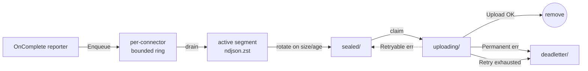

# Spool

The spool is the on-disk buffer that sits between the data plane's request path and the upload workers shipping records to connector destinations. Every completed request that survives a configuration's binding evaluation becomes one record on a per-connector ndjson.zst segment; segments seal on size or age and the upload workers ship them out of band.

This page is the operator's reference for the disk layout, the segment lifecycle, the rotation/retry/breaker policy, and the loss semantics. For the destinations the spool ships to, see [connectors.md](connectors.md). For the per-configuration binding knobs that decide *what* lands on which destination, see [connector-bindings.md](connector-bindings.md).

The source of truth lives in [`internal/spool/`](../internal/spool/). If a value in this doc disagrees with that package, the code wins — open a PR.

---

## Table of contents

1. [Mental model](#mental-model)
2. [Disk layout](#disk-layout)
3. [Segment file format](#segment-file-format)
4. [Lifecycle](#lifecycle)
5. [Rotation policy](#rotation-policy)
6. [Upload, retry, and deadletter](#upload-retry-and-deadletter)
7. [Per-destination circuit breaker](#per-destination-circuit-breaker)
8. [Loss policy](#loss-policy)
9. [Recovery on startup](#recovery-on-startup)
10. [Sizing the spool](#sizing-the-spool)
11. [Environment variables](#environment-variables)
12. [Payload backref contract](#payload-backref-contract)
13. [Cross-references](#cross-references)

---

## Mental model

> **Best-effort, disk-buffered, restart-tolerant. Never blocks the request path.**

When the reporter at end-of-request decides a configuration's bindings produce records for one or more connectors, it calls `Spool.Enqueue` once per binding. The call is non-blocking: each connector has a bounded per-track ring; if the ring is full the record is dropped on the floor and the per-track drop counter bumps. The request path returns to the client as if nothing happened.

A background goroutine per connector drains the ring, appends each record to the connector's active segment (an ndjson.zst file under the spool root), and rotates that segment on size or age. A sibling uploader goroutine watches the sealed directory and ships each segment to the destination via `Connector.Upload`. Successful uploads delete the segment; permanent failures move it to deadletter; transient failures retry with backoff until the per-segment attempt cap is hit, at which point the segment also lands in deadletter.

There is **no database**. State transitions are filesystem renames within one filesystem, which gives atomic semantics for free — no torn state, no manifest file to fall out of sync.



---

## Disk layout

Every connector gets its own subtree under `SLUICE_SPOOL_ROOT` (default `/var/lib/sluice/spool/`). The directory structure is:

```
<SLUICE_SPOOL_ROOT>/
  records/
    <connector-name>/
      active/          currently-appended segments
      sealed/          rotated, awaiting upload
      uploading/       claimed by an upload worker
      deadletter/      upload exhausted; operator decision
      quarantine/      corrupt active segment from a torn crash
```

The connector name comes from the `name:` field on the top-level `connectors:` entry. The five state subdirectories are created with mode `0o750` on first construction; existing contents are left in place so a restart picks up exactly where the previous process exited.

State transitions between subdirectories are `os.Rename` calls within the same filesystem — atomic on Linux. No DB, no manifest file, no torn state. An operator can `ls -la` any subdirectory and reason about lifecycle from filenames alone. See [`internal/spool/manager.go`](../internal/spool/manager.go) for the transition validator that pins each rename to its expected source and destination state.

> **The spool root must be on persistent storage.** In Kubernetes, mount a PVC at `SLUICE_SPOOL_ROOT`. Ephemeral storage (emptyDir) means segments waiting to upload at SIGTERM are gone after the pod restarts.

---

## Segment file format

Each segment is an ndjson.zst file: one [`contracts/connector.Record`](../contracts/connector/record.go) per line, compressed with zstandard. Filenames lead with `<unix_ns>-<seq>.ndjson.zst` so lexical sort equals chronological order across rotations.

The Record shape is the wire format every connector sees. Key fields:

- `v` — **envelope** schema version, always `1` today. This is the outer container version; it is distinct from `schema_version` (below). Both are emitted on every record.
- `schema_version` — the **per-record wire** version, always `3` today (`1` → `2` added the additive `session_id` / `session_id_source` fields; `2` → `3` added the additive `agent_id` / `agent_id_source` fields). Bumps are additive-only: an older consumer reading a newer record simply ignores the new keys and needs no migration. The two fields version independent concerns — `v` the envelope framing, `schema_version` the field set — so keep them apart when writing a consumer's compatibility check.
- `id` — ULID minted at seal; the consumer dedupe key on retried deliveries.
- `ts_ns`, `instance_id`, `seq` — sort key tuple. `ts_ns` is the request start in nanoseconds; `instance_id` is the pod's hostname (`os.Hostname()`); `seq` is the per-instance monotonic counter.
- `correlation_id` — joins together a request and its retries/tool follow-ups under one logical request.
- `session_id`, `session_id_source` — the resolved session/bundle id (one level above `correlation_id`, grouping every request of one agent conversation) and the header name it was resolved from (e.g. `X-Sluice-Session-Id`, `Thread_id`). Both are omitted when no session header was present. Consumers bundle on the `(configuration, session_id)` tuple, never the bare id — client-controlled ids can collide across configurations. See [observability.md → Session bundling](observability.md#session-bundling) for the resolution chain.
- `agent_id`, `agent_id_source` — the resolved agent id (the agent or sub-agent that issued the request, one axis below `session_id`) and the header it was resolved from (e.g. `X-Sluice-Agent-Id`, `X-Claude-Code-Agent-Id`). Both are omitted when no agent header was present. See [observability.md → Agent id](observability.md#agent-id) for the resolution chain.
- `configuration`, `api_key_name`, `provider`, `protocol`, `model`, `tags` — the post-rule resolved labels.
- `request`, `response` — the captured request/response halves with method, path, headers, sha256, body length, and either inline `body` or `body_omitted: true` (set when oversize behaviour stripped the body — see [connector-bindings.md](connector-bindings.md#oversize-behaviour)).
- `tokens` — provider-reported usage, when the upstream returned one.
- `rules_fired` — ordered list of rules that matched, including action types and termination flag.
- `upstream_status` — the HTTP status the provider returned. May differ from `response.status` (the status the client saw) when a rule rewrote it. Omitted when zero.
- `upstream_error` — a transport-layer failure talking to the upstream (DNS, TLS, timeout). Empty when the request reached the provider, regardless of any provider-side error status.
- `policy_ref`, `attempts` — set when a resilience policy orchestrated the request; one entry per attempt with `outcome` in {`success`, `failure_status`, `transport_error`, `cb_blocked`}.

The zstd encoding is plain (no dictionary) and consumers can decompress with any standard zstd library. The format is intentionally **not** msgpack — ndjson lets an operator pipe a sealed segment through `zstd -dc | jq` for ad-hoc inspection without writing code.

---

## Lifecycle

A record goes through these states from acceptance to delivery:

| State | Where it lives | What's happening |
|---|---|---|
| In-flight | Ring buffer (`chan cc.Record`) | Sitting in the per-track ring, waiting for the drain goroutine. |
| Appended | `active/<filename>.ndjson.zst` | One line in the currently-open segment. The drain goroutine appends in order. |
| Sealed | `sealed/<filename>.ndjson.zst` | The segment was rotated (size, age, or graceful shutdown). Ready for the uploader. |
| Uploading | `uploading/<filename>.ndjson.zst` | One uploader worker has atomically claimed the segment via `Manager.Claim` (an `os.Rename` from sealed/ to uploading/). |
| Delivered | (removed) | `Connector.Upload` returned nil; `Manager.Complete` removed the file. |
| Deadletter | `deadletter/<filename>.ndjson.zst` | Either the connector returned `*Permanent` from Upload, or the per-segment retry budget was exhausted. Awaiting operator decision. |

Two states exist outside the normal flow:

| State | Cause | What an operator does |
|---|---|---|
| Quarantine | A torn zstd frame on the active segment was found at startup recovery — likely a crash mid-write. | Inspect the file, then delete or move out of the spool tree. The segment is unreadable. |
| Orphan in uploading/ | The process was killed while one worker was mid-upload. | Startup recovery fishes these back to sealed/ so the next uploader cycle re-attempts. |

The atomic-rename design means **every state transition is crash-safe**: the rename either completed or it didn't. There's no "half-renamed" segment.

---

## Rotation policy

A connector's active segment seals (rotates) when **either** trigger fires:

| Trigger | Default | Override |
|---|---|---|
| Size | 64 MiB uncompressed | Per-connector via `rotation.max_bytes` in the connector YAML (see [connectors.md](connectors.md#rotation-knobs)). |
| Age | 60 s since the segment opened | Per-connector via `rotation.max_age_seconds`. Webhook bindings can tune this lower (e.g. 5s) for near-real-time delivery. |

Either trigger alone is enough; whichever fires first rotates. The drain goroutine checks the size predicate on every Write and arms a `time.Timer` for the age predicate.

After rotation, an empty segment (zero records) is **discarded** rather than moved to sealed/ — there's nothing to ship. The drain goroutine then lazily opens a new active segment on the next inbound record.

> **Tuning trade-off.** Small segments mean low end-to-end delivery latency but more `Connector.Upload` calls (more requests against your destination). Large segments amortise upload overhead but delay delivery. Webhook destinations want small + frequent (4 MiB / 5 s is a reasonable starting point); S3 / Azure want large + infrequent (the 64 MiB / 60 s default).

---

## Upload, retry, and deadletter

The uploader goroutine wakes on two signals:

1. **Seal kick** — the drain goroutine fires a non-blocking notification on `uploadKick` after every successful seal, so a newly-sealed segment is picked up immediately.
2. **Poll timer** — a `time.Ticker` (default 5 s) wakes the uploader even when no seal happened, so a missed kick (full chan, race) does not strand sealed segments forever.

On each wake, the worker lists `sealed/` (chronological order by filename), and for each segment:

1. `Manager.Claim` atomically renames `sealed/<file>` to `uploading/<file>`. Concurrent workers serialise here — only one rename succeeds; the rest see `ENOENT` and skip.
2. Call `Connector.Upload(ctx, SealedSegment{...})`.
3. On success → `Manager.Complete` removes the file from `uploading/`.
4. On `*cc.Permanent` error → `Manager.Deadletter` moves the file to `deadletter/`.
5. On `*cc.Retryable` error → sleep with backoff, retry, up to the per-segment cap. On the final failure, move to `deadletter/`.

Retry backoff defaults (the `RetryOpts` tunables in [`internal/spool/options.go`](../internal/spool/options.go); the `fullJitter` / `nextBackoff` algorithm lives in [`internal/spool/backoff.go`](../internal/spool/backoff.go)):

| Parameter | Default | Effect |
|---|---|---|
| `BaseBackoff` | 1 s | First-attempt sleep ceiling. Full jitter applied — actual sleep is `rand.Float64() * backoff`. |
| `MaxBackoff` | 60 s | Per-attempt sleep ceiling after exponential growth. |
| `Multiplier` | 2.0 | Doubles the ceiling between attempts. |
| `MaxAttempts` | 8 | Total `Upload` calls including the first. After 8 retryable failures, the segment lands in deadletter. |

Eight attempts with doubling starting at 1s capped at 60s give a worst-case wall-clock of roughly 5 minutes before a segment deadletters — long enough to ride out a brief destination outage, short enough that disk pressure doesn't accumulate during a sustained one.

**Deadletter is the operator decision point.** Segments in `deadletter/` are still on disk and readable; the gateway will not retry them on its own. Inspect, decide whether to replay (move back to sealed/), discard, or escalate.

---

## Per-destination circuit breaker

Sitting above per-segment retry is a per-destination circuit breaker that stops the uploader entirely when a destination is consistently failing.

| State | Behaviour |
|---|---|
| Closed | Normal — every claimed segment runs through Upload. Each success keeps the breaker Closed; each retryable failure increments the consecutive-failure counter. |
| Open | The uploader stops claiming segments. Sealed segments accumulate on disk until the breaker probes. |
| Half-Open | After `HalfOpenAfter`, the breaker allows exactly one probe attempt; success → Closed, failure → Open. |

Defaults (see [`internal/spool/options.go`](../internal/spool/options.go) `BreakerOpts`):

| Parameter | Default |
|---|---|
| `FailuresToOpen` | 5 consecutive failures |
| `HalfOpenAfter` | 30 s |

The breaker is independent of the spool record's `policy_ref` / `attempts` (those are *resilience policies on the upstream request path*, not on connector delivery). Two different abstractions, both called "circuit breaker" — one watches upstream providers per-request, the other watches connector destinations per-segment.

The breaker state shows up on `Spool.Stats()` per track. There is no admin UI surface for it yet — operators read it via Prometheus when the gateway exposes those counters in a future release.

---

## Loss policy

The spool is **best-effort by design**. Records are dropped silently rather than blocking the request path or filling unbounded memory. Two places drop:

### Hot path: ring full

When `Enqueue` finds the per-connector ring (default 10 000 entries) full, the record is dropped on the floor and `droppedRing` increments for that track. The drop is non-blocking — `Enqueue` returns immediately. The next record might land if the drain goroutine catches up.

A non-zero `droppedRing` rate on a track means **drain is slower than ingest**. Causes, in rough order of likelihood:

1. The destination's circuit breaker is Open — sealed segments are accumulating but the uploader is sleeping. Fix: investigate the destination.
2. Upload latency is high — `Connector.Upload` takes longer than rotation lets sealed/ drain. Fix: tune rotation to smaller segments or raise the destination's throughput.
3. Disk write latency is high — the drain goroutine spends more time in `Segment.Write` than reading the channel. Fix: faster disk, more CPU for zstd encoding.

### Disk path: spool full

The spool itself does not currently enforce a disk-usage cap; operator-provisioned PVC size and filesystem behaviour set the ceiling. When the filesystem refuses writes (ENOSPC), `Segment.Write` returns an error, `writeErrors` increments, and the record is lost. The drain goroutine continues and the next write will most likely also fail; the breaker on the destination will stay Closed because the failure is local (disk), not transport.

> **Sizing guidance.** Pick a PVC large enough to hold one full `MaxBackoff` window's worth of failed uploads plus comfortable headroom. With 64 MiB segments rotating every 60 s and an 8-attempt retry over ~5 minutes, a sustained destination outage can park ~5 segments × 64 MiB = ~320 MiB per connector before the breaker opens and the segments stop being claimed. Multiply by `len(connectors)`, double for headroom, add per-pod safety. 10 GiB per pod is conservatively generous.

---

## Recovery on startup

`spool.RecoverAll(ctx, ...)` runs on process start before the drain or uploader goroutines launch. It walks each track's directories and:

1. **`active/`** — for each file, attempts to read the zstd frames end-to-end. Files that decode cleanly are sealed (rotated to `sealed/`) so the next upload cycle picks them up. Files that hit a torn frame (crash mid-write) move to `quarantine/`.
2. **`uploading/`** — any file here is an orphan from a worker killed mid-upload. Move back to `sealed/` so the uploader re-attempts.
3. **`sealed/`** and **`deadletter/`** — left alone. The uploader will see sealed/ on its first wake.

Recovery is **synchronous before Start** — startup blocks until every track's directories are reconciled. Failing recovery refuses to start the spool; operators see the error in logs at boot rather than silent record loss later.

---

## Sizing the spool

A back-of-envelope for picking values:

| Variable | What it depends on |
|---|---|
| Ring depth (per track, default 10 000) | Burst tolerance during a brief drain stall. 10 000 records ≈ 10–20 seconds of high-rate traffic on a single pod. Raise if you see hot-path drops during normal operation. |
| Rotation size (default 64 MiB uncompressed) | Trade off delivery latency vs upload overhead. 64 MiB takes 5–15 s to fill at moderate rates; webhook destinations may want 4 MiB. |
| Rotation age (default 60 s) | Floor on delivery latency. 60 s is acceptable for billing/audit; ≤5 s for live monitoring downstream. |
| `MaxAttempts` × `MaxBackoff` | Outage tolerance. 8 × 60 s ≈ 5 min before deadletter. |
| Spool root PVC size | (segment size) × (segments parked under sustained outage) × (connectors) × 2 for headroom. See "Disk path: spool full" above. |
| `FailuresToOpen` | Latency before the breaker stops claiming. Five consecutive failures opens; lower for more sensitive destinations. |

For most deployments, the defaults are fine. Adjust webhook tracks (smaller, faster rotation) and the PVC size (provisioned generously) before anything else.

---

## Environment variables

The spool reads one env var directly:

| Variable | Default | Effect |
|---|---|---|
| `SLUICE_SPOOL_ROOT` | `/var/lib/sluice/spool` | On-disk root. The `Manager` constructs `records/<connector>/{active,sealed,uploading,deadletter,quarantine}/` beneath this. Must be writable by the gateway process (UID 65532 in the published container). |

`Validate` rejects an empty `SLUICE_SPOOL_ROOT` at startup. Pointing it at a tmpfs is supported for ephemeral-by-design deployments but accepts the loss-on-restart semantics that come with it.

Per-track tuning (ring depth, rotation, retry, breaker) is **not** env-driven. Connector-level overrides land on the YAML entry in `connectors:`; everything else uses the constants from [`internal/spool/options.go`](../internal/spool/options.go). The decision is intentional — these are knobs an operator tunes per destination, not globally per process.

---

## Payload backref contract

How an operator gets from a slim trace to the full request/response body. Telemetry is bounded by design — the GenAI span/event carries only capped, redacted content — while the complete bodies live in the records this spool ships. The handle that bridges the two is `correlation_id`.

The contract is deliberately a **soft promise**:

> `correlation_id` is on the trace (`sluice.correlation_id`) and on every record. A backing payload **may** be fetchable by it — check for it — but its absence is a normal answer, never an error.

"Absent" is expected whenever a record never reached a durable destination: excluded by a binding's `sampling` / `filter`, truncated past `max_body_bytes`, or dropped under the [Loss policy](#loss-policy) (ring full / disk full). A consumer correlating a trace to its payload must treat "no payload" as a first-class outcome and never assume the fetch succeeds.

This is the only contract that survives the spool's best-effort nature. A *hard* pointer — a guaranteed storage path emitted onto the request span at request time — would dangle exactly under load (the record may be dropped after the span is emitted), and would weld the trace channel to a specific record store, breaking the reporting/telemetry separation. The soft promise turns the loss policy into a documented feature rather than a broken guarantee.

**Status: contract agreed, emission not yet implemented.** What holds today: `correlation_id` is the shared key, present on both the span and the record. What is proposed: the upload worker emits a `correlation_id → object_key` backref **after a successful upload** (out of band, not on the live request span), so the promise stays one-directional — *present ⇒ valid, absent ⇒ expected* — with no dangling pointers and the request path untouched. Whether to additionally key objects per-request (e.g. `payloads/<correlation_id>`) for a direct fetch versus listing the time partition is an independent ergonomics decision.

Resilience does not complicate this. The captured payload mirrors the **client-visible outcome**: a committed response (any status) is stored; if nothing committed (all attempts transport-errored / cb-blocked) only the request is. Failover decides on the buffered status *before* commit, so a streamed response that breaks mid-flight was already committed and is never a failover case. Losing attempts keep metadata only in `Record.Attempts[]` (target / status / outcome) — the failover story without the failed bodies. Per-attempt full-body capture is a possible future per-binding opt-in, off by default.

---

## Cross-references

- [connectors.md](connectors.md) — the destination types the spool ships to (s3, azure_blob, webhook).
- [connector-bindings.md](connector-bindings.md) — the per-configuration sampling / filter / size-cap knobs that decide which records reach each connector.
- [observability.md](observability.md) — `/metrics` exposes Go runtime and process collectors; per-track spool counters are surfaced via `Spool.Stats()`.
- [environment-variables.md](environment-variables.md) — the full SLUICE_* reference.
- [deployment.md](deployment.md) — PVC mount for the spool root, K8s topology with destinations.
- [`internal/spool/`](../internal/spool/) — implementation. `spool.go` is the entry point; `track.go` is the per-connector runtime; `manager.go` is the directory abstraction.
- [`contracts/connector/`](../contracts/connector/) — the public Record + SealedSegment + error types every connector implementation depends on.
