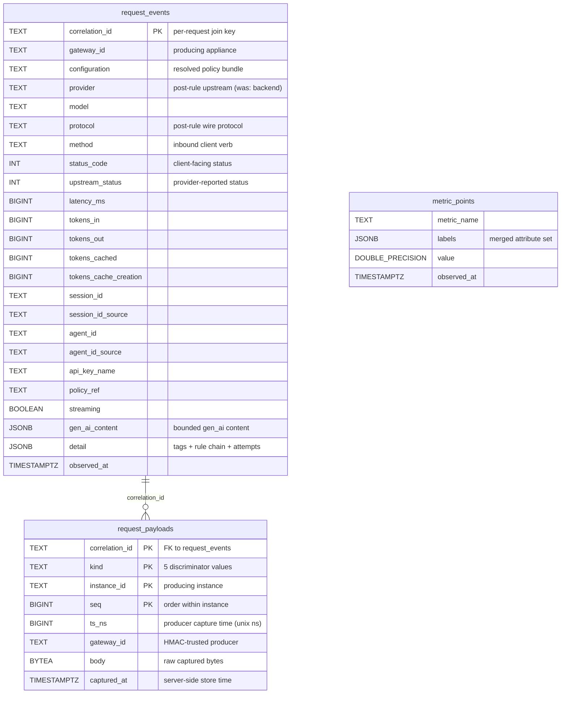
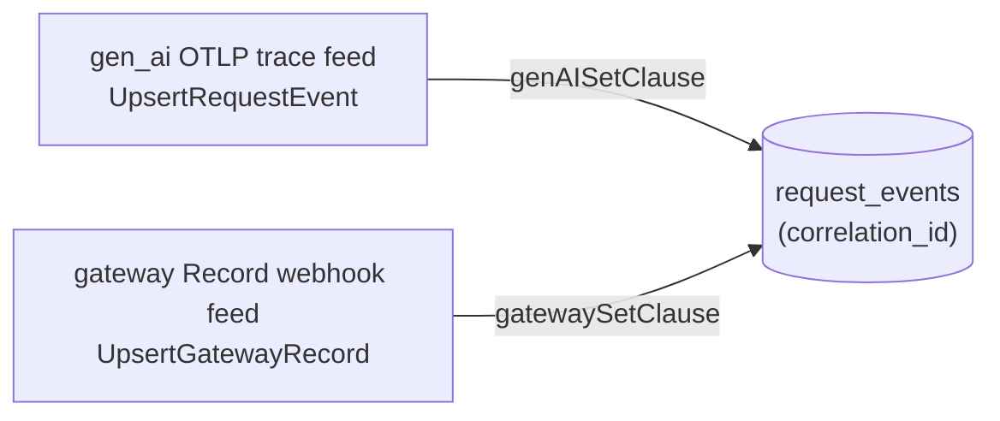

# Telemetry Database Schema

The telemetry service stores everything it ingests in a single Postgres database: a lean, queryable per-request row, the heavy captured payloads, and the raw OTLP metric timeseries. This page is the operator's and developer's reference for that schema — the three tables, their columns and indexes, the composite keys and join semantics, the two-feed merge that converges the OTLP and Record channels onto one row, and the migration history.

The source of truth lives in [`internal/telemetry/store/`](../internal/telemetry/store/). If a value here disagrees with that package, the code wins — open a PR. For the service that owns this database (deployment topology, ports, config YAML, ingest contracts, query API, console), see [telemetry-service.md](telemetry-service.md).

---

## Table of contents

1. [Mental model](#mental-model)
2. [Entity-relationship diagram](#entity-relationship-diagram)
3. [`request_events`](#request_events)
4. [`request_payloads`](#request_payloads)
5. [`metric_points`](#metric_points)
6. [The two-feed COALESCE merge](#the-two-feed-coalesce-merge)
7. [Payload kinds](#payload-kinds)
8. [Migration history](#migration-history)
9. [Schema bookkeeping](#schema-bookkeeping)
10. [Cross-references](#cross-references)

---

## Mental model

> **Three feeds, one join key.** `correlation_id` ties a request's lean event row, its heavy captured payloads, and (indirectly, by label) its metric samples together.

The telemetry service receives a request's observability from two independent channels — the **gen_ai OTLP trace feed** and the **gateway Record webhook feed** — that arrive in either order and converge onto one `request_events` row keyed by `correlation_id`. The bulky captured bodies and headers ride the Record webhook into `request_payloads`, one row per item. Numeric OTLP samples (counters, histograms, gauges) land in `metric_points` as a raw timeseries the dashboard aggregates.

There is no ORM and no schema-generation magic: the schema is forward-only SQL strings in [`internal/telemetry/store/migrations.go`](../internal/telemetry/store/migrations.go), applied by a hand-rolled runner ([`store.go::Migrate`](../internal/telemetry/store/store.go)) that records each step in `schema_migrations`.

---

## Entity-relationship diagram



> `request_payloads` is joined to `request_events` by `correlation_id`, but there is **no database-level foreign key** — a payload can be webhook-pushed before (or without) its event row, so the relationship is a logical join, not a referential constraint. `metric_points` has no join column at all; it correlates to events only by shared label values (e.g. `sluice.configuration`), and the dashboard reads it as an independent timeseries (invariant #4: dashboards read meters, never record scans).

---

## `request_events`

The lean, queryable per-request row — post-rule labels, outcome, token counts, and (optionally) bounded gen_ai content. It is the recent-history and drill-down surface. Both ingest feeds upsert into it keyed by `correlation_id`; the row is grouped into sessions by `session_id` and joined to the heavy payloads by `correlation_id`. Defined in [`events.go::RequestEvent`](../internal/telemetry/store/events.go) and created by migration 1.

| Column | Type | Default | Owner feed | Notes |
|---|---|---|---|---|
| `correlation_id` | `TEXT` | — | both | **Primary key**; the per-request join key. |
| `gateway_id` | `TEXT` | `''` | Record | The appliance that produced the event. |
| `configuration` | `TEXT` | `''` | Record | Resolved policy-bundle name. |
| `provider` | `TEXT` | `''` | both | Post-rule upstream provider. Renamed from `backend` in migration 2. |
| `model` | `TEXT` | `''` | both | Requested model. |
| `protocol` | `TEXT` | `''` | Record | Post-rule wire protocol / endpoint. |
| `method` | `TEXT` | `''` | Record | Inbound client HTTP verb (a model-list `GET` vs a completion `POST`). |
| `status_code` | `INT` | `0` | Record | Client-facing HTTP status (may be rule-overridden). |
| `upstream_status` | `INT` | `0` | Record | Provider-reported status, kept distinct from a synthetic/overridden client status. |
| `latency_ms` | `BIGINT` | `0` | gen_ai | Request wall time. |
| `tokens_in` | `BIGINT` | `0` | gen_ai | Prompt token count. |
| `tokens_out` | `BIGINT` | `0` | gen_ai | Completion token count. |
| `tokens_cached` | `BIGINT` | `0` | gen_ai | Prompt-cache read tokens the provider billed. |
| `tokens_cache_creation` | `BIGINT` | `0` | gen_ai | Prompt-cache write tokens the provider billed. |
| `session_id` | `TEXT` | `''` | both | Resolved session/conversation bundle id. |
| `session_id_source` | `TEXT` | `''` | Record | Header the session id was bundled from. |
| `agent_id` | `TEXT` | `''` | both | Resolved agent id (the agent/sub-agent that issued the request). Added by migration 4. |
| `agent_id_source` | `TEXT` | `''` | Record | Header the agent id was resolved from. Added by migration 4. |
| `api_key_name` | `TEXT` | `''` | Record | Resolved Sluice API-key name (managed mode); empty in passthrough. |
| `policy_ref` | `TEXT` | `''` | Record | Resilience policy the rules engine bound; empty for single-shot requests. |
| `streaming` | `BOOLEAN` | `FALSE` | gen_ai | True iff the upstream response was an SSE stream. |
| `gen_ai_content` | `JSONB` | `NULL` | gen_ai | Bounded `gen_ai.*` content; queryable, need not be byte-exact. |
| `detail` | `JSONB` | `NULL` | Record | Structured fleet detail (`{tags, rules_fired, rule_chain, attempts, …}`). |
| `observed_at` | `TIMESTAMPTZ` | `now()` | both | When the event was observed; a zero value defaults to server `now()` so every replica shares one clock. |

The `detail` JSONB column carries the [`EventDetail`](../internal/telemetry/store/events.go) envelope — the per-request inspector's source: post-rule `tags`, the flat `rules_fired` list, the ordered `rule_chain` ([`RuleChainEntry`](../internal/telemetry/store/events.go): name, actions applied, terminated, error), the resilience `attempts` ([`AttemptDetail`](../internal/telemetry/store/events.go): target, timing, status, outcome), and an `assembly_partial` flag for partially reconstructed streams. Concretely:

```json
{
  "tags": ["team-a", "prod"],
  "rules_fired": ["pin-haiku", "tag-team"],
  "rule_chain": [
    { "name": "pin-haiku", "actions": ["changeModel"], "terminated": false, "error": "" }
  ],
  "attempts": [
    { "target": "anthropic-primary", "status": 200, "outcome": "success", "duration_ms": 412 }
  ],
  "assembly_partial": false
}
```

Empty/absent on a row means the Record feed hasn't landed yet (the gen_ai OTLP half can arrive first). Query it with the JSONB operators — e.g. `WHERE detail->'tags' @> '["prod"]'` (GIN-indexed) or `jsonb_array_elements_text(detail->'rules_fired')` to unnest fired rules.

### Indexes

Created by migration 1 unless noted. The dashboard time-range scans and the message browser drive every choice.

| Index | Definition | Serves |
|---|---|---|
| `request_events_observed_at` | `(observed_at DESC)` | Recent-history ordering. |
| `request_events_observed_corr` | `(observed_at DESC, correlation_id DESC)` | Keyset pagination + the dashboard stats range scan in one index — no separate sort. |
| `request_events_filter` | `(observed_at DESC, configuration, provider, model, gateway_id, protocol)` | Dashboard filters paired with a time range; `observed_at` leads so the range bound stays index-driven and the equality filters narrow within it. (Migration 2 rewrites the `backend` term to `provider` automatically.) |
| `request_events_session` | `(session_id)` | Session grouping / lookup. |
| `request_events_agent` | `(agent_id)` | Agent lookup / drill-down. Added by migration 4. |
| `request_events_tags` | `GIN ((detail->'tags'))` | Tag containment filter (`detail->'tags' @> …`) and the distinct-tag dropdown scan. Added by migration 3. |

---

## `request_payloads`

The heavy large-payload feed — captured request/response bodies, header maps, and the assembled-SSE rollup — webhook-pushed and HMAC-trusted, stored **one row per item**. Joined to an event by `correlation_id`; the `kind` discriminator separates the items that share it. Defined in [`payloads.go::Payload`](../internal/telemetry/store/payloads.go) and created by migration 1.

| Column | Type | Default | Notes |
|---|---|---|---|
| `correlation_id` | `TEXT` | — | Joins the payload to its `request_events` row. |
| `kind` | `TEXT` | — | One of the five [payload kinds](#payload-kinds). |
| `instance_id` | `TEXT` | `''` | Producing gateway instance. |
| `seq` | `BIGINT` | `0` | Orders items within an instance. Stored as a signed `BIGINT`; the Go field [`Payload.Seq`](../internal/telemetry/store/payloads.go) is `uint64` and is round-tripped through `int64`. |
| `ts_ns` | `BIGINT` | `0` | Producer-stamped capture time in unix nanoseconds. |
| `gateway_id` | `TEXT` | `''` | The registered gateway whose HMAC trusted this item. |
| `body` | `BYTEA` | — (NOT NULL) | Raw captured bytes. |
| `captured_at` | `TIMESTAMPTZ` | `now()` | Server-side store time. |

### Composite primary key and ordering

```sql
PRIMARY KEY (correlation_id, kind, instance_id, seq)
```

The composite key makes `UpsertPayload` idempotent: a re-pushed item (same `correlation_id`/`kind`/`instance_id`/`seq`) converges via `ON CONFLICT … DO UPDATE` rather than duplicating. `ListPayloads` returns a correlation's items ordered by **`(ts_ns, instance_id, seq)`** — the stable composite sort key of **invariant #8**, never receive order. Across instances there is no global ordering guarantee, so the producer-stamped `ts_ns` leads, then the instance, then the per-instance sequence.

A secondary index `request_payloads_correlation (correlation_id)` backs the per-request fetch.

---

## `metric_points`

The raw OTLP numeric timeseries — counters, histograms, and gauges a gateway pushed over OTLP — that the dashboard aggregates into rate / token / latency panels. Defined in [`metrics.go::MetricPoint`](../internal/telemetry/store/metrics.go) and created by migration 1.

| Column | Type | Default | Notes |
|---|---|---|---|
| `metric_name` | `TEXT` | — | The OTLP metric name (e.g. `sluice.rule.fired`). |
| `labels` | `JSONB` | `'{}'::jsonb` | Merged attribute set; an empty batch entry lands as `{}` rather than `NULL`. |
| `value` | `DOUBLE PRECISION` | — | The sample value. |
| `observed_at` | `TIMESTAMPTZ` | — | The sample's timestamp (no `now()` default — the producer's clock owns it). |

`metric_points` has **no primary key**: it is append-only, written in batches inside one transaction by `InsertMetricPoints`, and queried newest-first. A single index `metric_points_name_time (metric_name, observed_at DESC)` serves the dashboard's per-metric range scans. This is the feed invariant #4 points dashboards at — rules-fired and tags-fired panels read the `sluice.rule.fired` / `gateway.tags.applied.total` meter rollups here, never a scan of `request_events.detail`.

---

## The two-feed COALESCE merge

A `request_events` row is assembled from two independent ingest channels that can arrive in **either order** and must converge without clobbering each other. Both call into the same `INSERT … ON CONFLICT (correlation_id) DO UPDATE` ([`events.go::insertEventSQL`](../internal/telemetry/store/events.go)); they differ only in the `SET` clause, which names the columns that feed **owns**.



**Column ownership:**

| Feed | Entry point | `SET` clause | Owns |
|---|---|---|---|
| gen_ai OTLP trace | [`UpsertRequestEvent`](../internal/telemetry/store/events.go) | `genAISetClause` | `provider`, `model`, `latency_ms`, the four `tokens_*`, `session_id`, `agent_id`, `streaming`, `gen_ai_content` |
| gateway Record webhook | [`UpsertGatewayRecord`](../internal/telemetry/store/events.go) | `gatewaySetClause` | `gateway_id`, `configuration`, `provider`, `model`, `protocol`, `method`, `status_code`, `upstream_status`, `session_id`, `session_id_source`, `agent_id`, `agent_id_source`, `api_key_name`, `policy_ref`, `detail` |

A column absent from a feed's `SET` is left **untouched** on conflict, so the gen_ai feed never wipes the gateway columns and vice-versa. Within each clause, string and content columns merge with `COALESCE(NULLIF(EXCLUDED.col, ''), request_events.col)` — an empty or absent value in one delivery never clobbers a value the other feed (or an earlier delivery) already set. The shared dims `provider`, `model`, `session_id`, and `agent_id` appear in **both** clauses precisely so whichever feed arrives first seeds them and the second only fills gaps (the OTLP span carries `agent_id` from `gen_ai.agent.id`; the Record additionally owns `agent_id_source`). Numeric usage and latency take the latest `EXCLUDED` value (a gen_ai span always carries them meaningfully); `status_code` / `upstream_status` likewise take the Record's value.

The `NULL`-landing mechanism is the two helpers in [`scan.go`](../internal/telemetry/store/scan.go): `nullTime` turns the zero time into SQL `NULL` (so the `COALESCE($22, now())` default applies to `observed_at`) and `nullJSON` turns empty bytes into `NULL` (so `gen_ai_content` / `detail` stay absent rather than empty, letting the conflict's `COALESCE` prefer the existing value).

### Worked example: OTLP first, then Record

1. **OTLP span arrives first.** `UpsertRequestEvent` inserts a fresh row: `provider=anthropic`, `model=claude-sonnet-4-5`, `tokens_in=1200`, `tokens_out=340`, `streaming=true`, `gen_ai_content={…}`. The gateway columns take their table defaults (`configuration=''`, `protocol=''`, `status_code=0`, `detail=NULL`).
2. **Record arrives second.** `UpsertGatewayRecord` hits the conflict and runs `gatewaySetClause`: it fills `configuration=prod-bundle`, `protocol=anthropic_messages`, `method=POST`, `status_code=200`, `api_key_name=team-a`, `detail={tags,rule_chain,…}`. It also carries `provider=anthropic` / `model=claude-sonnet-4-5`, which `COALESCE(NULLIF(…))` leaves unchanged (already non-empty). It does **not** name `tokens_*`, `latency_ms`, `streaming`, or `gen_ai_content`, so the OTLP values survive intact.
3. **Final merged row:** every column populated from whichever feed owns it — gen_ai usage/content from step 1, gateway labels/detail from step 2.

The reverse order (Record first, then OTLP) converges to the identical row: the Record seeds the gateway columns, then the OTLP span fills the gen_ai columns and only gap-fills the shared `provider`/`model`/`session_id`.

---

## Payload kinds

The `kind` discriminator on `request_payloads` separates the items that share a `correlation_id` so the inspector can render the right tab for each. The five constants are defined in [`payloads.go`](../internal/telemetry/store/payloads.go); all five arrive on the Record webhook feed.

| `kind` value | Constant | Contents |
|---|---|---|
| `request_body` | `KindRequestBody` | Captured client→gateway request envelope. |
| `response_body` | `KindResponseBody` | Captured gateway→client response envelope. |
| `sse_rollup` | `KindSSERollup` | The assembled (de-chunked) SSE stream. `EventDetail.assembly_partial` flags a stream the accumulator could only partially reconstruct. |
| `request_headers` | `KindRequestHeaders` | Captured request header map (JSON object), alongside the request body. |
| `response_headers` | `KindResponseHeaders` | Captured response header map (JSON object), alongside the response body. |

---

## Migration history

Migrations are a forward-only, append-only ordered set in [`migrations.go`](../internal/telemetry/store/migrations.go). The runner ([`store.go::Migrate`](../internal/telemetry/store/store.go)) applies every entry whose `version` is newer than the highest recorded in `schema_migrations`, each in its own transaction, and is idempotent on a fully-migrated database. **Never edit or renumber a shipped entry.**

| Version | Name | What it does | Rationale |
|---|---|---|---|
| 1 | `telemetry_core` | Creates `request_events`, `request_payloads`, `metric_points` and their indexes. | Lays down the three feeds in one step. |
| 2 | `rename_backend_to_provider` | `ALTER TABLE request_events RENAME COLUMN backend TO provider;` | Vocabulary unification — the configured upstream is "provider" everywhere else (config schema, admin API, gen_ai OTel label), so the telemetry dimension follows. A hard cut with no dual-read window: post-migration the gateway emits `sluice.provider` and ingest reads `provider`. Postgres rewrites the `request_events_filter` index definition to the new column name automatically, so only the rename is needed. |
| 3 | `tags_gin_index` | `CREATE INDEX … request_events_tags … USING gin ((detail->'tags'));` | The message browser filters by post-rule tags (`detail->'tags' @> …`) and enumerates the distinct tag set for its dropdown; the GIN index makes both the containment filter and the `jsonb_array_elements_text` scan index-backed instead of a full table scan as the event table grows. |
| 4 | `add_agent_id` | `ALTER TABLE request_events ADD COLUMN agent_id … ; ADD COLUMN agent_id_source … ; CREATE INDEX request_events_agent …` | Adds the additive `agent_id` / `agent_id_source` columns and a single-column lookup index so the message browser can drill down by agent, mirroring `request_events_session`. Populated from `gen_ai.agent.id` (OTLP feed) and `agent_id` (Record feed). |

> The `backend → provider` rename (migration 2) is why older field/label references to `backend` should be read as `provider` throughout the telemetry surface. There is no compatibility shim; a gateway emitting the legacy `backend` label after this migration would land its provider dimension in the row's default empty `provider` column.

---

## Schema bookkeeping

The migration runner tracks state in a `schema_migrations` table bootstrapped outside the numbered set (so the runner can query the current version on a brand-new database), defined in [`migrations.go::createSchemaMigrations`](../internal/telemetry/store/migrations.go):

| Column | Type | Notes |
|---|---|---|
| `version` | `INTEGER` | Primary key; the applied migration's version. |
| `name` | `TEXT` | Human-facing bookkeeping name (e.g. `telemetry_core`). |
| `applied_at` | `TIMESTAMPTZ` | Defaults to `now()` at apply time. |

`SchemaVersion` returns `COALESCE(MAX(version), 0)` — `0` on an empty database. Each migration's SQL and its `schema_migrations` row commit together in one transaction ([`store.go::applyMigration`](../internal/telemetry/store/store.go)), so the table never claims a half-applied step.

---

## Cross-references

- [telemetry-service.md](telemetry-service.md) — the service that owns this database: deployment topology, ports, config YAML, ingest contracts, query API, console.
- [observability.md](observability.md) — gateway-side OTel pipeline that produces the OTLP metric and trace feeds this schema ingests.
- Code: [`internal/telemetry/store/`](../internal/telemetry/store/) — `migrations.go`, `store.go`, `events.go`, `payloads.go`, `metrics.go`, `scan.go`.
