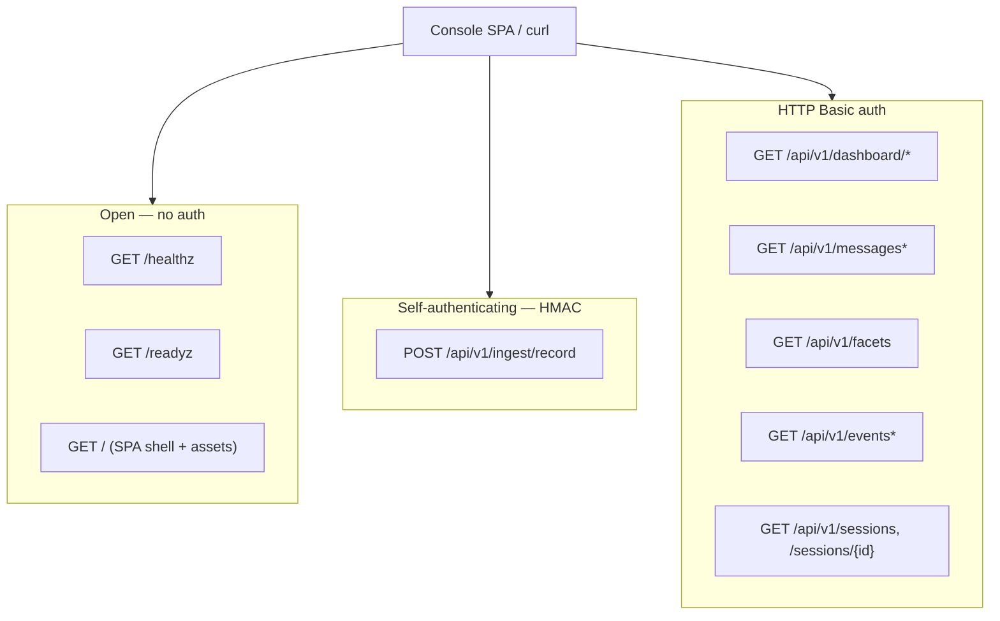

# Telemetry Service — Console Query API

The telemetry service exposes a read-only HTTP API that backs the operator
console (dashboard + message browser + per-request inspector). This page is the
route-by-route reference: paths, methods, query parameters, pagination, caching,
response shapes, and the auth model.

For the service as a whole — deployment topology, the two ingest listeners,
config YAML, and HMAC trust — see [telemetry-service.md](telemetry-service.md).
For the Record webhook that *feeds* this API see
[telemetry-webhook.md](telemetry-webhook.md); for the table shapes the queries
read see [telemetry-database-schema.md](telemetry-database-schema.md).

All routes are served from one `http.ServeMux` built in
`internal/telemetry/server/server.go::Server.Handler` and listen on the console
HTTP bind (default `0.0.0.0:8686`, config key `http_bind`). The OTLP ingest
listener (`:8687` gRPC) is a separate server and carries no HTTP API.

## Surface map

The mux splits into three trust zones:



- **Open probes + SPA** — liveness/readiness and the static SPA bundle are
  unauthenticated (`server.go::handleHealthz`, `handleReadyz`, `spaHandler`).
  The SPA is public because the API it calls is itself gated.
- **`POST /api/v1/ingest/record`** — mounted only when a webhook handler is
  wired in (`server.go::Handler`, the `s.webhook != nil` branch). It
  authenticates itself with an HMAC signature header rather than Basic auth, so
  it sits in the open zone. Full spec in
  [telemetry-webhook.md](telemetry-webhook.md).
- **Console query API** — everything under `/api/v1/` except `ingest/record` is
  registered by `server.go::registerQueryRoutes` (in `query.go`) and wrapped in
  `Server.basicAuth`. These routes only mount when the server was built with a
  non-nil `Queries` (`New(...)` in `server.go`); without a store-backed query
  layer they are absent.

## Authentication

Every `/api/v1/dashboard/*`, `/messages*`, `/facets`, `/events*`, and
`/sessions/*` route is wrapped by `Server.basicAuth`
(`server.go::basicAuth`, lines 109-127). The credentials are the single console
user from config (`console.username` + `console.password_hash`, a bcrypt hash;
see [telemetry-service.md](telemetry-service.md#configuration)). There is no env
override and no second account.

```
Authorization: Basic base64(username:password)
```

- Username is compared with `subtle.ConstantTimeCompare`; the password with
  `bcrypt.CompareHashAndPassword`. Both branches are evaluated regardless of the
  username result so a wrong user and a wrong password cost the same
  (`credentialsValid`, lines 121-127).
- A rejected request returns a **bare `401` with `text/plain` body
  `unauthorized\n` and deliberately NO `WWW-Authenticate` header** (lines
  100-108). This mirrors `internal/admin.BasicAuth`: the SPA drives the login
  form itself and sends `Authorization` on every fetch, so suppressing the
  challenge header stops browsers from popping their native auth dialog over the
  SPA on each poll. `curl --basic -u user:pass` still works.

## Common query parameters

The console query routes share two parameter families.

### Filters

`filterFromQuery` (`query.go`, lines 53-66) reads the same equality + status
filters on every route that takes them (dashboard summary/timeseries, messages,
messages/recent, events). Each maps to a column predicate in
`store.EventFilter` / `appendFilter` (`eventquery.go`, lines 20-76):

| Param | Column | Semantics |
|---|---|---|
| `configuration` | `configuration` | exact match |
| `gateway` | `gateway_id` | exact match |
| `model` | `model` | exact match |
| `provider` | `provider` | exact match (post-rule provider) |
| `protocol` | `protocol` | exact match (the wire protocol/endpoint; the UI labels this column **"endpoint"**) |
| `status_class` | `status_code` | one of `2xx` / `4xx` / `5xx`; maps to a range predicate (`5xx` is open-ended `>= 500`) — `statusClassBounds`, lines 81-92 |
| `session_id` | `session_id` | exact match |
| `correlation_id` | `correlation_id` | exact match |
| `tags` | `detail->'tags'` | **repeatable**; `?tags=a&tags=b` requires the event's post-rule tag set to contain **ALL** listed tags (JSONB `@>` containment, lines 60-64). Blank values are dropped (`nonEmpty`). |

An absent or empty param adds no predicate on that dimension. All present
predicates are AND-combined.

> **Naming note.** The `protocol` filter and the `endpoints` facet are the same
> `request_events.protocol` column; the SPA surfaces it as "endpoint". This is
> intentional, not a bug — `store.Facets.Endpoints` documents the alias
> (`facets.go`, lines 18-20).

### Time window

Two distinct window conventions:

- **Dashboard routes** use a coarse `?window` token — one of `15m`, `1h`, `6h`,
  `24h`, `7d`; an unknown or absent token defaults to `24h`
  (`observability.go::parseWindow`, lines 23-38). The upper bound is padded by a
  one-minute `clockSkewMargin` so an event stamped by a slightly-ahead Postgres
  `now()` still falls inside the window (lines 40-50).
- **Browser routes** (`/messages`, `/events`) use precise `?from` / `?to`
  bounds, each an **RFC3339** timestamp (`parseWindowBounds`, lines 83-100). An
  unparseable value returns `400 {"error":"invalid from"}` (or `invalid to`). An
  absent bound adds no predicate, so the browser pages across all history unless
  explicitly bounded.

## Pagination (keyset cursor)

`/messages` and `/events` page with a stable keyset cursor, not an offset.
Ordering is `(observed_at DESC, correlation_id DESC)`
(`ListEventsFiltered`, `eventquery.go` lines 141-211).

- **Page size** comes from `?limit`. The store default is **100** and the cap is
  **500** (`eventListPageDefault` / `eventListPageMax`, lines 136-139); a
  `limit <= 0` or out-of-range value is clamped. The HTTP layer passes `limit=0`
  by default for these two routes (`intParam(r, "limit", 0)`), so they inherit
  the store's 100/500.
- The store fetches `limit+1` rows to learn whether a further page exists. When
  it does, `next_cursor` encodes the last *returned* row's position; otherwise
  `next_cursor` is `""` (the final page).
- The **cursor is opaque**: base64url (`RawURLEncoding`, no padding) of the JSON
  `{"o": "<observed_at RFC3339Nano>", "c": "<correlation_id>"}`
  (`eventCursor` + `encodeCursor`, lines 113-122). Do not construct it by hand.
- A malformed/tampered cursor returns `400 {"error":"invalid cursor"}`
  (`store.ErrInvalidCursor`, surfaced in `handleObsMessages` / `handleEvents`).

Paging example (each request reuses the prior `next_cursor`):

```bash
# page 1
curl -u admin:… 'http://localhost:8686/api/v1/messages?limit=50'
#   → {"entries":[…50…],"next_cursor":"eyJvIjoi…"}

# page 2
curl -u admin:… 'http://localhost:8686/api/v1/messages?limit=50&cursor=eyJvIjoi…'
#   → {"entries":[…50…],"next_cursor":"eyJvIjoi…2"}

# page 3 (final)
curl -u admin:… 'http://localhost:8686/api/v1/messages?limit=50&cursor=eyJvIjoi…2'
#   → {"entries":[…12…],"next_cursor":""}
```

Hold every filter/window param constant across the sequence — the cursor only
encodes position, not the predicate set.

## Routes

All routes are `GET` and return `application/json` on success. Errors are a JSON
`{"error":"…"}` body (`server.go::writeError`). Common codes: `400` (bad
param/cursor), `401` (auth), `404` (not found), `500` (query failure — the
detail is logged, not returned).

### Dashboard

#### `GET /api/v1/dashboard/summary`

Handler `handleObsSummary` (`observability.go`, lines 52-65). Accepts `?window`
plus the full filter set. Returns `contracts/admin.DashboardSummary`
(`contracts/admin/dashboard.go`), mapped from `store.DashboardSummary`
(`store/dashboard.go::QueryDashboardSummary`). Top-level fields:

| Field | Meaning |
|---|---|
| `window` | the resolved window token |
| `generated_at`, `gateway_started_at` | server time (UTC) |
| `totals` | `requests`, `requests_success`, `requests_errored`, `tokens_in/out/cached/cache_creation` |
| `rates` | `requests_per_second`, `error_rate` |
| `latency_ms` | `p50`, `p95`, `p99` (Postgres `percentile_cont`) |
| `by_provider`, `by_protocol`, `by_configuration`, `by_model` | per-dimension breakdown rows (requests, p95, error_rate; model rows carry token sums) |
| `rules_fired`, `tags_fired` | per-rule / per-tag fire counts + the configurations that produced them |
| `provider_health` | a short trailing-window (`now-5m`) per-provider health snapshot |

> **Invariant #4.** The `rules_fired` / `tags_fired` panels are aggregated from
> the `metric_points` meter rollups (`sluice.rule.fired`,
> `gateway.tags.applied.total`), **not** from a scan of captured records —
> `store/dashboard.go::queryDashFired`, lines 314-360. Dashboards read meters;
> the record `detail` envelope is the inspector's source only.

#### `GET /api/v1/dashboard/timeseries`

Handler `handleObsTimeseries` (lines 67-83). Accepts `?window`, the filter set,
and `?series` — one of `requests` (default), `rps`, `error_rate`, `p50`, `p95`,
`p99`, `tokens_in`, `tokens_out` (`seriesValue`, lines 283-305). The bucket
width auto-scales to ~60 points across the window (`bucketFor`). Returns
`contracts/admin.DashboardTimeseries`: one named `series` with `points` of
`{timestamp, value}`, zero-filled across empty buckets so the axis stays
continuous (`store/dashboard.go::QueryDashboardSeries`).

### Messages (gateway-parity surface)

These three emit the exact `contracts/admin` shapes the gateway admin console
uses, so the shared SPA observability components decode them without
translation.

#### `GET /api/v1/messages/recent`

Handler `handleObsMessagesRecent` (lines 85-97). The dashboard live feed:
filter set + `?limit` (default **200**), no window, no cursor. Returns
`contracts/admin.MessagesRecentResponse` `{capacity, entries}` — entries
**oldest-first** to match the gateway's live feed (`mapMessages` reverses the
newest-first store order).

#### `GET /api/v1/messages`

Handler `handleObsMessages` (lines 132-165). The full message browser: filter
set + `?from`/`?to` (RFC3339) + `?cursor` + `?limit`. Returns
`{"entries":[…], "next_cursor":"…"}` where each entry is a
`contracts/admin.MessageEntry` — **newest-first** (browser order, unlike the
live feed). Entry fields include the post-rule labels, status/latency, token
counts, plus the inspector extras decoded from the event `detail` envelope:
`tags`, `rules_matched` (`RuleHit{rule_name, actions_applied, terminated,
error_message}`), and `attempts` (`AttemptHit{target, started_at, duration_ms,
status_code, error, outcome}`) — see `mapEntry`, lines 340-395.

#### `GET /api/v1/messages/{id}/body`

Handler `handleObsMessageBody` (lines 99-130). `{id}` is the correlation id.
Returns `contracts/admin.MessageBodyDetail` assembled from the captured
payloads (`mapBody`, lines 397-421): `request` / `response` bodies (+
`*_total_bytes`), the assembled SSE `response_assembled`, decoded
`request_headers` / `response_headers`, the bounded `gen_ai_content` lifted off
the `request_events` row, and an `assembly_partial` flag when the streamed
response could only be partially reconstructed. `404 {"error":"no body"}` when
the correlation id has no stored payloads (`store.ErrPayloadNotFound`).

### Facets

#### `GET /api/v1/facets`

Handler `handleFacets` (lines 167-183). No params. Returns the distinct dropdown
values for the message browser:

```json
{
  "providers": ["anthropic", "openai"],
  "models": ["claude-opus-4-1", "gpt-4o"],
  "configurations": ["team-a"],
  "endpoints": ["chat_completions", "messages"],
  "tags": ["billing", "internal"]
}
```

Each list is sorted, excludes the empty string, and renders as `[]` rather than
`null` when empty (`nonNil`). `endpoints` is the `protocol` column (see the
naming note above). `tags` is flattened out of every event's
`detail->'tags'` (`store/facets.go::Facets`).

**Caching.** Facets are memoized behind a mutex with a **30-second TTL**
(`facetsTTL`, `observability.go` lines 194-223). The lock is held *across* the
refresh query, so a burst of concurrent dropdown opens collapses into a single
table scan rather than a thundering herd; subsequent opens within the TTL are
served from memory. A newly-seen provider/model/tag therefore appears in the
dropdowns within at most 30 seconds.

### Events + sessions (telemetry-native)

These extend beyond the gateway parity surface and emit `internal/telemetry`
shapes (`store` / `stitch`) rather than `contracts/admin`.

#### `GET /api/v1/events`

Handler `handleEvents` (`query.go`, lines 102-127). Same filter + `?from`/`?to`
+ `?cursor` + `?limit` as `/messages`, but returns the raw
`store.RequestEvent` rows: `{"events":[…], "next_cursor":"…"}`. Newest-first,
keyset-paged. Like `/messages` it omits the default window unless `from`/`to`
are given.

#### `GET /api/v1/events/{id}`

Handler `handleEventInspector` (lines 129-146). `{id}` is the correlation id.
Returns a `stitch.RequestView` — the lean event joined to its latest captured
payload per kind:

```json
{
  "event": { "...": "store.RequestEvent fields" },
  "payloads": {
    "request_body": { },
    "response_body": { },
    "sse_rollup": { },
    "request_headers": { },
    "response_headers": { }
  }
}
```

`payloads` keys are the `store.Kind*` discriminators; the value is the latest
payload of that kind in the stable `(ts_ns, instance_id, seq)` order (invariant
#8 — `stitch.LatestPayloadsByKind`). `404 {"error":"event not found"}` when no
event matches (`store.ErrRequestEventNotFound`); a missing-payloads error is
tolerated (the view just omits them).

#### `GET /api/v1/events/{id}/body`

Handler `handleEventBody` (lines 148-159). Returns just the latest-per-kind
payload map (the `payloads` object above), keyed by `store.Kind*`. `404
{"error":"no payloads"}` when there are none.

#### `GET /api/v1/sessions`

Handler `handleSessions`. The session-discovery list — a keyset page of session
summaries for the **Sessions** console page. Query params:

| Param | Meaning |
|---|---|
| `from` / `to` | RFC3339 window bounds (either omittable). A session is included when its **span overlaps** `[from, to)` — i.e. it was active during the window, even if it began before or continues after it. |
| `configuration` | Exact-match configuration filter (`store.EventFilter`). |
| `tags` (repeatable) | AND containment over the post-rule tag set. |
| `cursor` | Opaque keyset cursor from a prior `next_cursor`. |
| `limit` | Page size (default 100, capped 500). |

The `configuration` / `tags` predicates are applied to the rows **before**
aggregation, so a session appears when it has matching requests overlapping the
window and the rollup (`messages` / `total_tokens` / `models` / `started_at` /
`last_activity`) reflects only the matching subset. `started_at` / `last_activity`
are the session's real bounds and may fall outside the window. Results are ordered
by `last_activity DESC, session_id DESC`.

```json
{
  "sessions": [
    {
      "session_id": "sess-123",
      "messages": 4,
      "total_tokens": 6000,
      "models": ["claude-opus-4-8", "claude-haiku-4-5"],
      "started_at": "2026-06-07T10:00:00Z",
      "last_activity": "2026-06-07T10:42:00Z"
    }
  ],
  "next_cursor": ""
}
```

`next_cursor` is empty on the last page; `400 {"error":"invalid cursor"}` for a
malformed cursor, `400 {"error":"invalid from"}` / `invalid to` for an
unparseable bound. Like the dashboard facets, the underlying query is a
whole-table grouped scan, so the console defaults it to a recent window.

#### `GET /api/v1/sessions/{id}`

Handler `handleSession` (lines 161-173). `{id}` is the session id. Returns a
`stitch.SessionView`: every event sharing the session, **oldest-first**, plus
aggregate `totals`:

```json
{
  "session_id": "sess-123",
  "requests": [ { "...": "store.RequestEvent" } ],
  "totals": { "requests": 4, "errors": 1, "tokens_in": 5120, "tokens_out": 880 }
}
```

A request with `status_code >= 400` counts as an error
(`stitch.BuildSessionView`). `404 {"error":"session not found"}` when no event
carries that session id.

> **Invariant #4 compliance.** `sessions/{id}` and `events/{id}` assemble their
> views from the `request_events` + `request_payloads` tables the ingest
> listeners populate — never from the connector spool or S3. The console is a
> read view over the telemetry store, not a record-scan reader.

## Error reference

| Code | Body | When |
|---|---|---|
| `400` | `{"error":"invalid from"}` / `invalid to` | unparseable RFC3339 window bound |
| `400` | `{"error":"invalid cursor"}` | malformed/tampered keyset cursor |
| `401` | `unauthorized\n` (text/plain) | missing/wrong Basic credentials — note: no `WWW-Authenticate` |
| `404` | `{"error":"event not found"}` etc. | unknown correlation/session id, or no payloads |
| `500` | `{"error":"<op>"}` | query failed; detail logged server-side only (`queryError`) |

## See also

- [telemetry-service.md](telemetry-service.md) — service overview, two-listener
  topology, config YAML, deployment, HMAC trust.
- [telemetry-webhook.md](telemetry-webhook.md) — the `POST /api/v1/ingest/record`
  HMAC webhook that feeds the store this API reads.
- [telemetry-database-schema.md](telemetry-database-schema.md) —
  `request_events`, `request_payloads`, `metric_points` table shapes.
